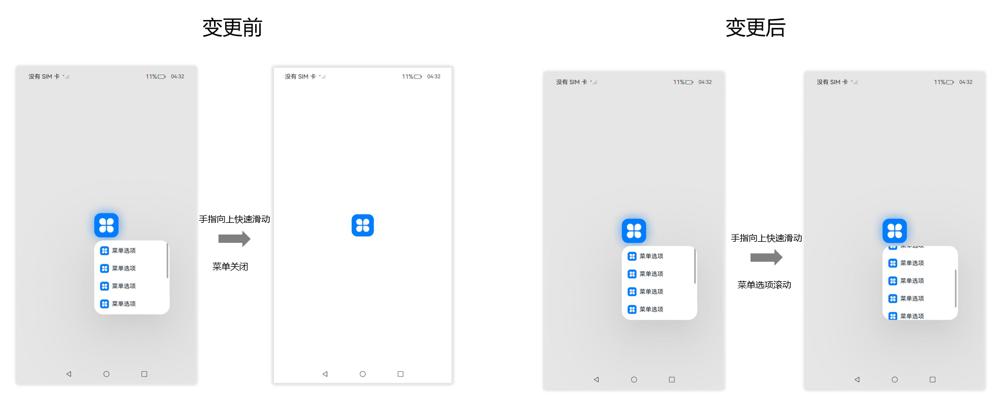

# ArkUI子系统Changelog

## cl.arkui.1 Navigation分割线触摸直接响应

**访问级别**

公开接口

**变更原因**

基于UX人因规格，区隔拖拽和滑动体验，针对分割线的拖拽行为进行时延显示调整。

**变更影响**

该变更为不兼容变更。

变更前：手指需长按500ms，Navigation的分割线才可响应滑动。

变更后：手指触摸Navigation的分割线可立即响应滑动。

**起始API Level**

9

**变更发生版本**

从OpenHarmony SDK 5.0.0.33开始。

**适配指导**

默认行为变更，无需适配。

## cl.arkui.2 RichEditor的lineHeight、letterSpacing、lineSpacing属性返回值单位变更

**访问级别**

公开接口

**变更原因**

文本字体相关属性的返回值单位应默认使用fp类型。

**变更影响**

该变更为不兼容变更。

API version 11及以前：lineHeight、letterSpacing、 lineSpacing属性的返回值单位是vp。

API version 12及以后：lineHeight、letterSpacing、 lineSpacing属性的返回值单位从vp变更为fp，若开发者原来将返回值按vp单位处理，变更后该处理逻辑会导致数据错误。

**起始 API Level**

10

**变更发生版本**

从OpenHarmony SDK 5.0.0.33 版本开始。

**变更的接口/组件**

RichEditor组件，lineHeight、letterSpacing、lineSpacing属性。

**适配指导**

默认效果变更，开发者需通过[像素单位转换接口](../../../application-dev/reference/apis-arkui/arkui-ts/ts-pixel-units.md#像素单位转换)，对返回值进行正确处理。

## cl.arkui.3 RichEditor的fontSize属性的返回值单位变更

**访问级别**

公开接口

**变更原因**

文本字体相关属性的返回值单位应默认使用fp类型。

**变更影响**

该变更为不兼容变更。 

API version 11及以前：fontSize属性的返回值单位是vp。

API version 12及以后：fontSize属性的返回值单位从vp变更为fp，若开发者原来将返回值按vp单位处理，变更后该处理逻辑会导致数据错误。

**起始 API Level**

10

**变更发生版本**

从OpenHarmony SDK 5.0.0.33 版本开始。

**变更的接口/组件**

RichEditor组件，fontSize属性。

**适配指导**

默认效果变更，开发者需通过[像素单位转换接口](../../../application-dev/reference/apis-arkui/arkui-ts/ts-pixel-units.md#像素单位转换)，对返回值进行正确处理。

## cl.arkui.4 BindContextMenu上下文菜单内容可滚动时快滑不再关闭菜单

**访问级别**

公开接口

**变更原因**

BindContextMenu上下文菜单选项过多会出现滚动条，此时手指快速滑动菜单选项，该行为不会上下滚动菜单选项，而是自动关闭菜单，影响用户体验。

**变更影响**

该变更为不兼容变更。

变更前：上下文菜单无论是否有滚动条时，手指快速滑动菜单选项均会自动关闭菜单。

变更后：上下文菜单选项没有滚动条时，手指快速滑动菜单选项会自动关闭菜单；上下文菜单选项过多出现滚动条时，手指快速滑动菜单选项只会上下滚动菜单选项，不再主动关闭菜单。

 

**起始API Level**

8

**变更发生版本**

从OpenHarmony SDK 5.0.0.33开始。

**变更的接口/组件**

Menu组件的BindContextMenu接口

**适配指导**

默认行为变更，无需适配。

## cl.arkui.5 Repeat接口RepeatItem参数index可选改为必选

**访问级别**

公开接口

**变更原因**

为了提升Repeat使用的易用性，在该组件的实现上，进行了优化处理。对其接口RepeatItem所需要的index参数从非必填优化为了必填，这样开发者在使用index参数的时候，无需对index参数进行判空处理。

**变更影响**

该变更为兼容性变更。兼容应用已写代码，无需应用修改代码。

**起始API Level**

12

**变更发生版本**

从OpenHarmony SDK 5.0.0.33开始。

**变更的接口/组件**

Repeat组件，RepeatItem接口的index参数。

**适配指导**

- 正常使用时，适配已开发的代码，新开发的代码无需对index做判空处理。

变更前：

```ts
@Entry
@ComponentV2
struct RepeatTest {
  @Local arr: Array<number> = [0, 1, 2, 3]

  build() {
    List({ space: 3 }) {
      Repeat(this.arr)
        .virtualScroll()
        .key((item) => item.toString())
        .each((repeatItem) => {
          ListItem() {
            Text(`${repeatItem.index! + 1}. Item ${repeatItem.item}`) // repeatItem.index需做判空处理
              .height(50).backgroundColor(Color.Blue)
          }.backgroundColor(Color.Green)
        })

    }.height(200).backgroundColor(Color.Red)
  }
}
```

变更后：

```ts
@Entry
@ComponentV2
struct RepeatTest {
  @Local arr: Array<number> = [0, 1, 2, 3]

  build() {
    List({ space: 3 }) {
      Repeat(this.arr)
        .virtualScroll()
        .key((item) => item.toString())
        .each((repeatItem) => {
          ListItem() {
            Text(`${repeatItem.index + 1}. Item ${repeatItem.item}`) // repeatItem.index可不做判空处理
              .height(50).backgroundColor(Color.Blue)
          }.backgroundColor(Color.Green)
        })

    }.height(200).backgroundColor(Color.Red)
  }
}
```
- 非正常使用时

变更前:

```ts
class RepeatClass implements RepeatItem<string> {
    item: string = "hello" //不写index属性不会报错
}
```

变更后：

```ts
class RepeatClass implements RepeatItem<string> {
    item: string = "hello"; 
    index: number = 0 //不写index属性会报错
}
```

## cl.arkui.6 Search/TextInput/TextArea onchange回调新增可选参数预上屏文本

**访问级别**

公开接口

**变更原因**

在输入过程中，新增预上屏行为，需要将当前已提交上屏的文本和预上屏信息实时返回给开发者。

**变更影响**

该变更为不兼容变更。

变更前：

  1.onChange回调在用户全部输入完成，提交正式上屏时触发。

  2.onChange唯一参数是已正式提交上屏的文本。

变更后：

  1.onChange回调在用户输入过程中，随预上屏内容变更触发。

  2.onChange首个参数仍是已正式提交上屏的文本。新增可选参数PreviewText，PreviewText包含预上屏内容的起始位置和文本。

**起始API Level**

7

**变更发生版本**

从OpenHarmony SDK 5.0.0.33开始。

**变更的接口/组件**

Search/TextInput/TextArea组件的onChange回调事件参数。

**适配指导**

适配前：

默认开启预上屏功能。回调唯一参数为已正式上屏文本；回调时机为输入过程中，每一次预上屏内容变更时触发。

```ts
@Entry
@Component
struct SearchExample {
  @State text: string = 'Search支持文本预上屏前...'

  build() {
    Column() {
      Search({
        value: this.text,
        placeholder: 'input your word...',
      })
        .placeholderFont({ size: 16, weight: 400 })
        .width(336)
        .height(56)
        // onChange回调唯一参数为已正式上屏文本；回调时机为输入过程中，每一次预上屏内容变更时触发
        .onChange((value: string) => {
          this.text = value
          console.log("===get onchange ===")
          console.log("body text value = " + value)
        })
    }
    .width("90%")
    .margin("5%")
  }
}
```

适配后：

默认开启预上屏功能，需要适配在输入过程中，回调返回的首个参数为空字符串或者多次回调的首个参数为重复内容的场景；需要适配文本框内所有文本长度变更为含预上屏内容的总长度。

示例代码列举了预上屏状态下，用来适配各问题场景所需要的信息。

```ts
@Entry
@Component
struct SearchExample {
  @State text: string = 'Search回调预上屏信息...'

  build() {
    Column() {
      Search({
        value: this.text,
        placeholder: 'input your word...',
      })
        .placeholderFont({ size: 16, weight: 400 })
        .width(336)
        .height(56)
        // onChange回调首个参数为已经存在的正式上屏文本
        // 第二个参数为可选参数，返回的是预上屏内容的信息
        .onChange((value: string, previewText: PreviewText) => {
          this.text = value
          console.log("===get onchange and get previewText info===")
          let bodyTextValue = value
          console.log("body text value = " + bodyTextValue)          
          let previewTextValue = previewText.value
          console.log("previewText value = " + previewTextValue)
          let previewTextStart = previewText.offset
          let previewTextEnd = previewText.offset + previewTextValue.length
          console.log("previewText index range in [ " + previewTextStart + ", " + previewTextEnd + " ]")
          let isPreviewTextWorking = previewTextValue != "";
          console.log("now is inputing at previewText working= " + isPreviewTextWorking)
          let wholeTextValue = value + previewTextValue
          console.log("whole text value = " + wholeTextValue)
        })
    }
    .width("90%")
    .margin("5%")
  }
}
```

在不需要预上屏功能场景时，可使用enablePreviewText属性关闭预上屏功能。

```ts
@Entry
@Component
struct SearchExample {
  @State text: string = 'Search支持关闭文本预上屏...'

  build() {
    Column() {
      Search({
        value: this.text,
        placeholder: 'input your word...',
      })
        .placeholderFont({ size: 16, weight: 400 })
        .width(336)
        .height(56)
        .enablePreviewText(false) // 使用该属性，可以关闭预上屏功能，使回调内容与回调时机与变更前保持一致
        .onChange((value: string) => {
          this.text = value
          console.log("===get onchange ===")
          console.log("body text value = " + value)
        })
    }
    .width("90%")
    .margin("5%")
  }
}
```

## cl.arkui.7 命令式渲染节点RenderNode属性clipToFrame行为变更

**访问级别**

公开接口

**变更原因**

原先命令式渲染节点RenderNode的clipToFrame设为false不生效，现设置为false，超出节点大小范围的子节点内容不会被剪裁。

**变更影响**

该变更为不兼容变更。

变更前：RenderNode的clipToFrame设为false不生效，超出节点大小范围的子节点内容会被剪裁。开发者在未显式设置clipToFrame属性的情况下，clipToFrame默认值为false。

变更后：RenderNode的clipToFrame设为false时，超出节点大小范围的子节点内容不会被剪裁。为保证变更前后clipToFrame的默认行为一致，开发者在未显式设置clipToFrame属性的情况下，clipToFrame默认值变更为true。


**起始 API Level**

11

**变更发生版本**

从OpenHarmony SDK 5.0.0.33开始。

**变更的接口/组件**

命令式渲染节点RenderNode的clipToFrame接口

**适配指导**

若开发者在设置clipToFrame为false的情况下，仍想保持之前的“超出节点大小范围的内容会被剪裁”的行为，可通过设置clipToFrame为true来实现。

```ts
import {  RenderNode, FrameNode, NodeController } from '@kit.ArkUI';

const renderNode = new RenderNode();
renderNode.frame = { x: 50, y: 50, width: 200, height: 200 };
renderNode.backgroundColor = 0xffd5d5d5;
renderNode.clipToFrame = true;  // 设置clipToFrame为true，对超出节点大小的内容进行剪裁。

const childNode = new RenderNode();
childNode.frame = { x: 10, y: 10, width: 250, height: 100 };
childNode.backgroundColor = 0xff004aaf;
renderNode.appendChild(childNode);

class MyNodeController extends NodeController {
  private rootNode: FrameNode | null = null;

  makeNode(uiContext: UIContext): FrameNode | null {
    this.rootNode = new FrameNode(uiContext);

    const rootRenderNode = this.rootNode.getRenderNode();
    if (rootRenderNode !== null) {
      rootRenderNode.appendChild(renderNode);
    }

    return this.rootNode;
  }
}

@Entry
@Component
struct Index {
  private myNodeController: MyNodeController = new MyNodeController();

  build() {
    Row() {
      NodeContainer(this.myNodeController)
    }
  }
}
```
