## cl.arkui.1 Menu组件箭头离宿主节点默认安全边距变更

**访问级别**

公开接口

**变更原因**

带箭头菜单离宿主节点过远，变更后效果更佳。

**变更影响**

| 变更前箭头离宿主节点16vp | 变更后箭头离宿主节点8vp |
|---------|---------|
|  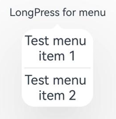       |         |

**起始API Level**

API10

**变更发生版本**

从OpenHarmony SDK 5.0.0.35 版本开始。

**变更的接口/组件**

Menu组件。

**适配指导**

带箭头菜单离宿主节点的默认安全距离变小，若需要更大的间距，可设置菜单的offset进行调整。

## cl.arkui.2 MenuItemGroup嵌套MenuItem且MenuItem设置margin top或者bottom时，布局效果变更

**访问级别**

公开接口

**变更原因**

MenuItemGroup高度没有加上MenuItem的margin高度，布局错乱，变更后布局正常。

**变更影响**


示例代码：
```ts
@Entry
@Component
struct Index {
  build() {
    Row() {
      Button("菜单1").bindMenu(this.TestMarginTop())
    }
  }

  @Builder
  TestMarginTop() {
    Menu() {
      MenuItemGroup() {
        MenuItem({content:"第一个"}).margin({top:20, bottom:20}).borderWidth(2).borderColor(Color.Black)
        MenuItem({content:"第二个"}).margin({top:20}).borderWidth(2).borderColor(Color.Black)
        MenuItem({content:"第三个"}).margin({bottom:20}).borderWidth(2).borderColor(Color.Black)
        MenuItem({content:"第四个"}).borderWidth(2).borderColor(Color.Black)
      }
    }
  }
}
```


| 变更前布局错乱 | 变更后布局正常 |
|---------|---------|
|  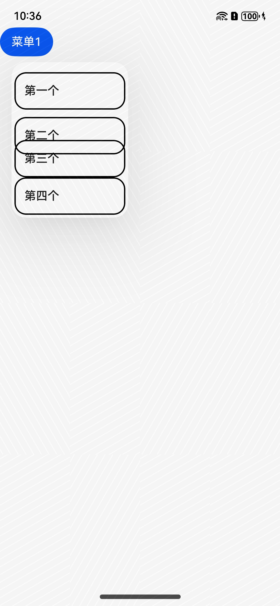       |  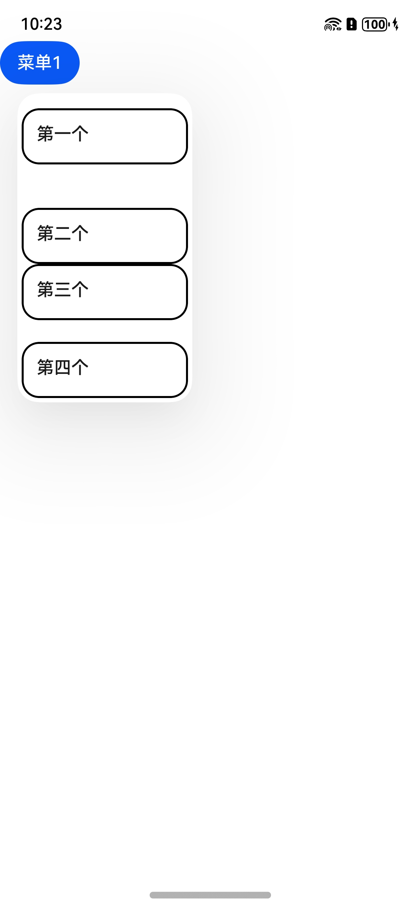       |

**起始API Level**

API7

**变更发生版本**

从OpenHarmony SDK 5.0.0.35 版本开始。

**变更的接口/组件**

Menu组件。

**适配指导**

菜单布局效果变更，应用无需适配。

## cl.arkui.3 Menu中MenuItem全部设置margin后，左右边距布局效果变更

**访问级别**

公开接口

**变更原因**

Menu中MenuItem全部设置margin后，左右边距不对称，变更后左右对称。

**变更影响**

示例代码：
```ts
@Entry
@Component
struct Index {
  build() {
    Column() {
      Text('click for Menu')
        .fontSize(20)
        .margin({ top: 20 })
        .bindMenu(this.TestMenuItemMarginLeftAndRight)
    }
    .height('100%')
    .width('100%')
  }

  @Builder
  TestMenuItemMarginLeftAndRight() {
    Menu() {
      MenuItem({content:"这是menuitem1"}).margin(10).borderWidth(1)
    }
    .borderWidth(2)
    .borderColor(Color.Red)
    .width(200)
  }
}
```


| 变更前边距不对称 | 变更后左右对称 |
|---------|---------|
|  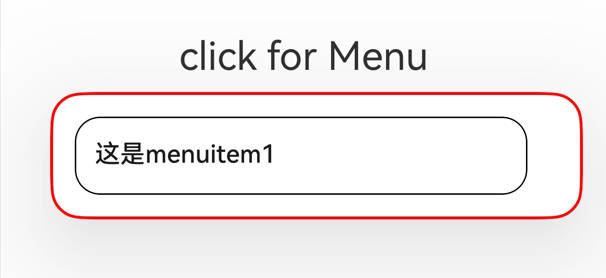       |  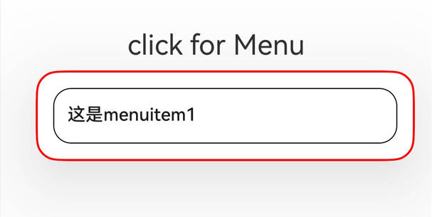       |

**起始API Level**

API7

**变更发生版本**

从OpenHarmony SDK 5.0.0.35 版本开始。

**变更的接口/组件**

Menu组件。

**适配指导**

菜单布局效果变更，应用无需适配。

## cl.arkui.4 菜单避让手机挖孔变更

**访问级别**

公开接口

**变更原因**

开发者在应用侧的module.json5中配置开启避让手机挖孔时，菜单未避让挖孔。

``` json
{
    "module": {
        "metadata": [
            {
                "name" : "avoid_cutout",
                "value": "true",
            }
        ]
    }
}
```

**变更影响**

该变更为不兼容性变更。

变更前：竖屏时菜单默认避让挖孔；横屏时，应用配置开启避让手机挖孔，菜单不会避让挖孔。

变更后：竖屏时菜单默认避让挖孔；横屏时，应用配置开启避让手机挖孔，菜单会避让挖孔。

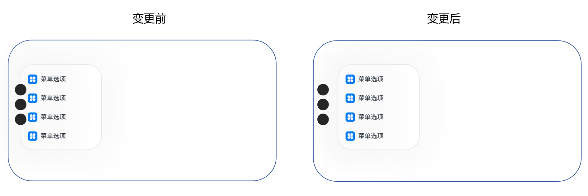 

**起始API Level**

Menu组件的BindMenu接口 API 7

Menu组件的BindContextMenu接口 API 8

**变更发生版本**

从OpenHarmony SDK 5.0.0.35开始。

**变更的接口/组件**

Menu组件的BindMenu接口

Menu组件的BindContextMenu接口

**适配指导**

默认行为变更，无需适配。

## cl.arkui.5 Repeat设置totalCount属性行为变更

**访问级别**

公开接口

**变更原因**

totoalCount表示UI显示的数据个数。当0 < totalCount < arr.length时，界面中只渲染“totalCount”个数据。

**变更影响**

该变更为不兼容性变更。

变更前：Repeat设置totalCount属性时，如果totalCount小于数据长度，显示的数据个数为数据的长度。

将arr.length设置为10，totalCount设置为5。显示效果如图所示：

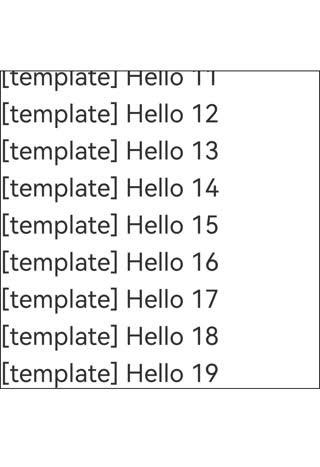

变更后：Repeat设置totalCount属性时，如果totalCount小于数据长度，显示的数据个数为totalCount值。

将arr.length设置为10，totalCount设置为5。显示效果如图所示：

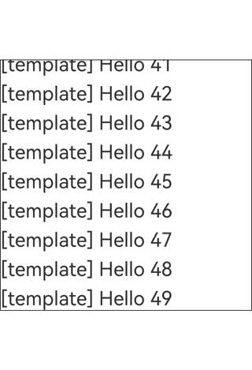

**起始API Level**

12

**变更发生版本**

从OpenHarmony SDK 5.0.0.35开始。

**变更的接口/组件**

Repeat组件。

**适配指导**

如果开发者想要显示的数据个数为数据长度时，需要将totalCount值设置为数组长度。示例代码如下：

```ts
@Entry
@ComponentV2
struct TestPage {
  @Local simpleList: Array<string> = [];
  private totalCount: number = 50;

  aboutToAppear(): void {
    for (let i = 0; i < 50; i++) {
      this.simpleList.push('Hello ' + i);
    }
  }

  build() {
    Column({ space: 10 }) {
      List() {
        Repeat<string>(this.simpleList)
          .each((obj: RepeatItem<string>) => {
            ListItem() {
              Text('[each] ' + obj.item)
                .fontSize(30)
                .margin({ top: 10 })
            }
          })
          .key((item: string, index: number) => item)
          .virtualScroll({ totalCount: this.totalCount })
          .templateId((item: string, index: number) => "default")
          .template('default', (ri) => {
            Text('[template] ' + ri.item)
              .fontSize(30)
              .margin({ top: 10 })
          }, { cachedCount: 3 })
      }
      .cachedCount(1)
      .border({ width: 1 })
      .height('50%')
    }
    .height('100%')
    .justifyContent(FlexAlign.Center)
  }
}
```

## cl.arkui.6 TimePickerDialog标题高度变更

**访问级别**

公开接口

**变更原因**

修正视觉效果以获得更好的用户体验。

**变更影响**

该变更为不兼容变更。

变更前：标题高度为46vp。

变更后：标题高度为56vp。

| 变更前 | 变更后 |
|---------|---------|
| 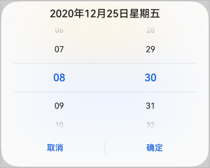 | 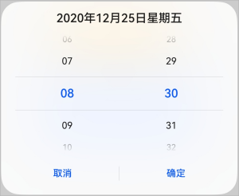 |

**起始API Level**

8

**变更发生版本**

从OpenHarmony SDK 5.0.0.35开始。

**变更的接口/组件**

TimePickerDialog组件。

**适配指导**

默认行为变更，无需适配。

## cl.arkui.7 SubMenu避让底部导航条距离变更

**访问级别**

公开接口

**变更原因**

Menu避让能贴近底部导航条，而SubMenu避让位置无法贴近底部导航条，视觉效果不好

**变更影响**

该变更为不兼容性变更。

| 变更前：SubMenu避让底部导航条之后避让了一个固定高度的padding | 变更后：SubMenu仅避让底部导航条，不额外添加固定高度的padding |
|---------|---------|
|  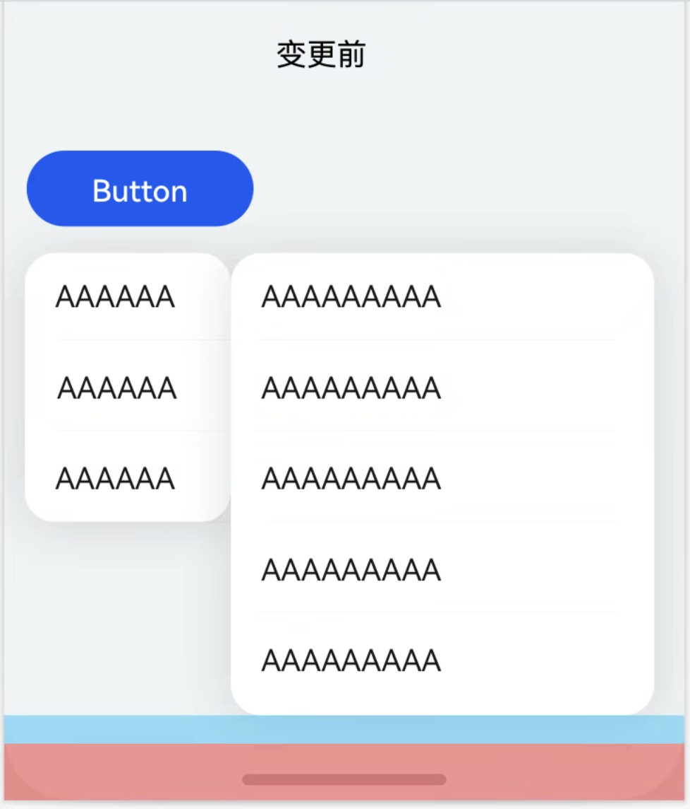       |  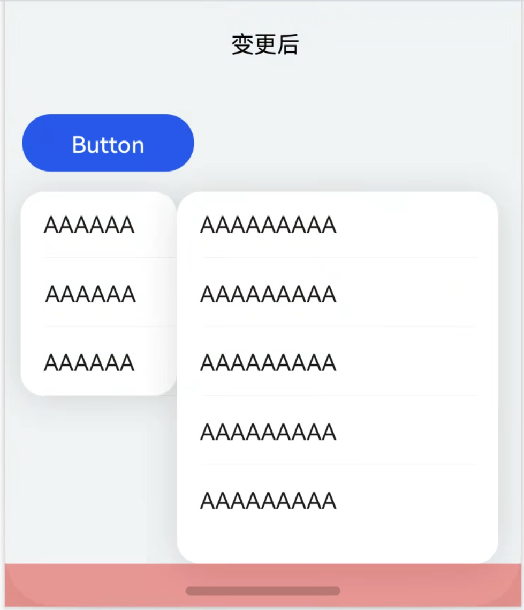    

**起始API Level**

7

**变更发生版本**

从OpenHarmony SDK 5.0.0.35开始。

**变更的接口/组件**

Menu组件。

**适配指导**

默认行为变更，无需适配。

## cl.arkui.8 menu、toast修改阴影参数
**访问级别**

公开接口

**变更原因**

当前menu、toast组件阴影不明显，背景颜色和组件颜色接近时，区分度不高。

**变更影响**

该变更为不兼容变更。

| 变更前阴影 | 变更后阴影|
|---------|---------|
|  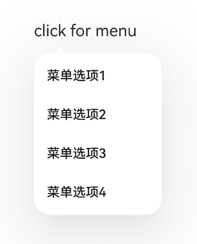       |  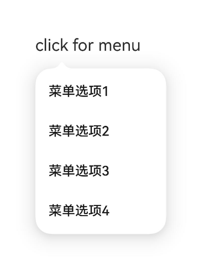       |
|  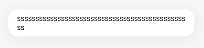       |  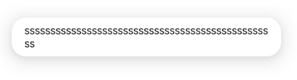       |

**起始API Level**

Menu组件的BindMenu接口 API 7

Menu组件的BindContextMenu接口 API 8

Toast组件的ShowToast接口 API 9

**变更发生版本**

从OpenHarmony SDK 5.0.0.35开始。

**变更的接口/组件**

Menu组件的BindMenu接口

Menu组件的BindContextMenu接口

Toast组件ShowToast接口

**适配指导**

默认效果变更，无需适配。

## cl.arkui.9 RichEditor设置预设样式的接口传入默认值时，文本样式效果变更

**访问级别**

公开接口

**变更原因**

RichEditor设置用户预设样式的接口setTypingStyle，传入默认值undefined/null后，开发者自定义预置样式依然存在，未恢复成不设置时效果。

不设置时，当用户输入文本，输入后的文本样式跟随前一个文本的文本样式。

**变更影响**

该变更为不兼容变更

变更前：

当setTypingStyle设置为默认值时，调用接口setTypingStyle不生效。

其效果为在任何文本后面持续输入的文本会一直保持之前开发者设置的预置样式，不会跟随前一个文本样式。

变更后：

当setTypingStyle设置为默认值时，会恢复为不设置时效果。

其效果为在任何文本后面持续输入的文本时，会根据前一个文本样式去更新当前输入文本样式。

**起始API Level**

11

**变更发生版本**

从OpenHarmony SDK 5.0.0.35 版本开始。

**变更的接口/组件**

setTypingStyle

**适配指导**

开发者需要清除TypingStyle使用组件默认样式时，请参照如下代码。
```ts
@Entry
@Component
struct Index {
  controller: RichEditorController = new RichEditorController()
  options: RichEditorOptions = { controller: this.controller }
  build() {
      Column() {
        RichEditor(this.options)
          .borderWidth(1)
          .borderColor(Color.Green)
          .width("100%")
          .height("50%")
        Button('ResetTypingStyle')
          .fontSize(10)
          .onClick(() => {
            // 清除TypingStyle
            this.controller.setTypingStyle(undefined)
            // this.controller.setTypingStyle(null)
          })
        Button('SetTypingStyle')
          .fontSize(10)
          .onClick(() => {
            // 设置TypingStyle
            this.controller.setTypingStyle({fontColor:"#ff0000"})
          })
    }
  }
}
```

## cl.arkui.10 RichEditor占位文本接口中文本样式属性传入异常值/默认值时，占位文本样式的效果变更

**访问级别**

公开接口

**变更原因**

1.RichEditor设置占位文本的接口placeholder，其占位文本样式属性PlaceHolderStyle为异常值"{}"时，组件未将占位文本样式属性设置为默认效果。

2.当占位文本样式属性中各个属性为默认值undefined时，对应默认效果未生效。

占位文本样式属性：

- 文本尺寸（默认值 16vp）

- 文本粗细（默认值 400）

- 文本字体（默认值 当前系统字体/注册自定义字体）

- 文本样式（默认值 FontStyle.Normal）

- 文本颜色（默认值：跟随系统主题，一般为黑色）

**变更影响**

该变更为不兼容变更

变更前：占位文本样式属性为异常值或其内部其他属性设为默认值时，调用接口placeholder未生效。

变更后：占位文本样式属性为异常值或其内部其他属性设为默认值时，按组件默认占位文本样式/对应属性默认样式生效。

**起始API Level**

12

**变更发生版本**

从OpenHarmony SDK 5.0.0.35 版本开始。

**变更的接口/组件**

PlaceHolderStyle

**适配指导**

开发者需要排查调用设置占位文本placeholder中PlaceHolderStyle为异常值或其各个属性为异常值时，是否按照默认效果生效。

以style为"{}"和fontcolor为默认值为例，见如下代码，请开发者自行排查。
```ts
@Entry
@Component
struct Index {
  controller: RichEditorController = new RichEditorController()
  options: RichEditorOptions = { controller: this.controller }
  @State style: PlaceholderStyle = { fontColor: "#ff0000" };

  build() {
    Column() {
      RichEditor(this.options)
        .borderWidth(1)
        .borderColor(Color.Green)
        .width("100%")
        .height("50%")
        .placeholder("hello world", this.style)
      Button('change style to {}')
        .fontSize(10)
        .onClick(() => {
          this.style = {};
        })
      Button('change style.fontColor to undefined')
        .fontSize(10)
        .onClick(() => {
          this.style = { fontColor: undefined };
        })
      Button('change style.fontColor to normal value')
        .fontSize(10)
        .onClick(() => {
          this.style = { fontColor: "#ff0000" };
        })
    }
  }
}
```

## cl.arkui.11 MenuItem组件禁用状态下字体颜色变更

**访问级别**

公开接口

**变更原因**

MenuItem设置enable为false时, 组件将处于禁用状态，此时字体颜色为默认的灰色，开发者设置的字体颜色将不会生效。

**变更影响**

该变更为不兼容变更

变更前：MenuItem设置enable为false时，无论开发者是否设置字体颜色，组件禁用状态下的字体颜色均为默认字体颜色 * 不透明度40%。

变更后：MenuItem设置enable为false时，若开发者未设置字体颜色，则组件禁用状态下的字体颜色为默认字体颜色 * 不透明度40%；若开发者设置了字体颜色，则组件禁用状态下的字体颜色为自定义字体颜色 * 不透明度40%；

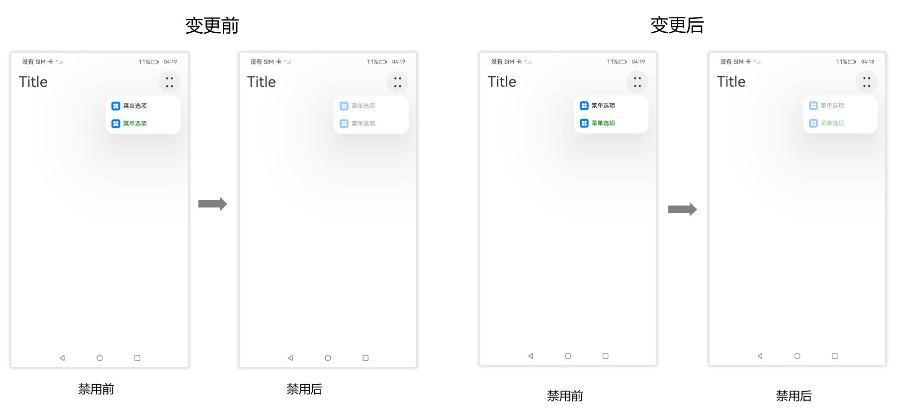 

**起始API Level**

9

**变更发生版本**

从OpenHarmony SDK 5.0.0.35开始。

**变更的接口/组件**

MenuItem组件。

**适配指导**

默认行为变更，无需适配。

## cl.arkui.12 RichEditor收起键盘后，选中区状态变更

**访问级别**

公开接口

**变更原因**

UX规格变更

**变更影响**

该变更为不兼容性变更。

变更前：RichEditor非用户手动点击收起键盘按钮收起键盘时，触发组件失焦，关闭菜单，复位选中区。


变更后：RichEditor非用户手动点击收起键盘按钮收起键盘时，仅小窗模式下触发组件失焦，其他场景不触发组件失焦，不关闭菜单，不复位选中区。


**起始API Level**

10

**变更发生版本**

从OpenHarmony SDK 5.0.0.35开始。

**变更的接口/组件**

RichEditor组件。

**适配指导**

非用户手动点击收起键盘按钮收起键盘时收起键盘时焦点状态变更，应用无需适配。

## cl.arkui.13 dragInteraction接口增加系统接口校验

**访问级别**

系统接口。

**变更原因**

拖拽的监听等接口没有权限管控，恶意三方应用可以监听用户拖拽行为进行画像，因此将dragInteraction.on('drag')和dragInteraction.off('drag')接口函数添加接口权限校验。

**变更影响**

该变更为不兼容性变更，非系统应用不能调用dragInteraction.on('drag')和dragInteraction.off('drag')接口。

**起始API Level**

12

**变更发生的版本**

从OpenHarmony SDK 5.0.0.33开始。

**变更的接口**

on(type: 'drag', callback: Callback\<DragState>): void；
off(type: 'drag', callback?: Callback\<DragState>): void；

**适配指导**

默认行为变更，无需适配。

## cl.arkui.14 Scroll、List、Grid、WaterFlow组件scrollBarColor接口变更

**访问级别**

公开接口

**变更原因**

统一Scroll、List、Grid、WaterFlow组件scrollBarColor接口在设置负数时的行为。

**变更影响**

该变更为不兼容变更。

变更前，Scroll组件scrollBarColor接口设置负数时按默认值0x66182431处理，List、Grid、WaterFlow组件scrollBarColor接口设置负数时按黑色0xFF000000处理。

变更后，Scroll、List、Grid、WaterFlow组件scrollBarColor接口设置负数时按无符号整数对应的ARGB颜色处理。

**起始API Level**

7

**变更发生版本**

从OpenHarmony SDK 5.0.0.35开始。

**变更的接口/组件**

Scroll、List、Grid、WaterFlow组件scrollBarColor接口

**适配指导**

默认行为变更，无需适配。

## cl.arkui.15 自定义MenuItem的onChange触发逻辑变更

**访问级别**

公开接口

**变更原因**

基于CustomBuilder创建的MenuItem，无法触发onChange事件。变更后事件触发符合预期。

**变更影响**

该变更为不兼容性变更。

变更前：基于CustomBuilder创建的MenuItem，无法触发onChange事件。

变更后：基于CustomBuilder创建的MenuItem，正常触发onChange事件。

**起始API Level**

9

**变更发生版本**

从OpenHarmony SDK 5.0.0.35开始。

**变更的接口/组件**

MenuItem组件。

**适配指导**

默认行为变更，无需适配。注意，由于此前基于CustomBuilder创建的MenuItem，设置onChange不生效，变更后请按应用场景正确使用onChange。

## cl.arkui.16 手机横屏及其他设备，上下文菜单placement变更

**访问级别**

公开接口

**变更原因**

手机横屏及其他设备场景，布局计算未按照用户设置的placement进行，导致显示异常。变更后布局效果符合预期。

**变更影响**

该变更为不兼容性变更。

变更前：手机横屏及其他设备，布局计算基于默认的Placement.BOTTOM_RIGHT进行，导致上下文菜单大小、位置异常。

变更后：手机横屏及其他设备，布局计算基于用户设置的placement进行，当用户未设置placement时，使用默认的Placement.BOTTOM_RIGHT进行，最终布局效果符合预期。

| 变更前 | 变更后 |
|---------|---------|
| 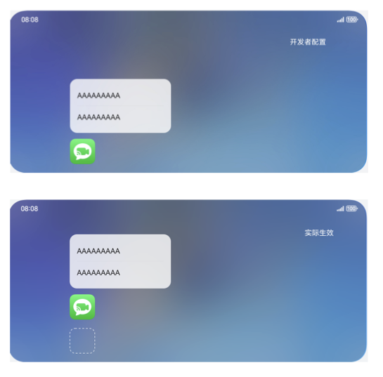       |   |

**起始API Level**

8

**变更发生版本**

从OpenHarmony SDK 5.0.0.35开始。

**变更的接口/组件**

.bindContextMenu的placement属性。

**适配指导**

默认行为变更，无需适配。

## cl.arkui.17 Toggle/Switch按压反馈样式变更

**访问级别**

公开接口

**变更原因**

UX规范变更

**变更影响**

该变更为兼容性变更。

变更前：Toggle/Switch有按压反馈，点击时会有按压效果。

变更后：去除Toggle/Switch按压反馈，点击时无按压效果。

| 变更前 | 变更后 |
|---------|---------|
| | |

**起始API Level**

8

**变更发生版本**

从OpenHarmony SDK 5.0.0.35开始。

**适配指导**

按压显示效果变化，无需适配。

## cl.arkui.18 Contextmenu组件hoverScale接口过渡动效默认行为变更
**访问级别**

公开接口

**变更原因**

UX规格变更。

**变更影响**

该变更为不兼容变更。

变更前：
1. 需长按800ms后，组件截图做600ms缩放动效，然后切换自定义预览图, 切换时使用弹簧动效。
2. hoverScale与scale接口组合使用时，整个动效流程生效的缩放动效的参数为 hoverScale From -> scaleFrom -> scaleTo。
3. hoverScale动效过程中不支持打断动效。
4. hoverScale动效过程中，组件截图与预览图切换时，组件截图和预览图做相反的透明度动效。

变更后：
1. 需长按250ms后，组件截图做200ms缩放动效，然后切换自定义预览图, 切换时弹簧动效速度较之前版本变快。
2. hoverScale与scale接口组合使用时，整个动效流程生效的缩放动效的参数为 hoverScaleFrom -> hoverScaleTo -> scaleTo。
3. hoverScale动效过程中，在组件截图缩放动效的200ms可以点击空白处取消动效，并以弹簧动效返回原始状态。
4. hoverScale动效过程中，组件截图切换预览图时，组件截图不做透明度变化动效，仅预览图做透明度动效。

| 变更前 | 变更后 |
|---------|---------|
|   |    |

**起始API Level**

12

**变更发生版本**

从OpenHarmony SDK 5.0.0.35开始。

**变更的接口/组件**

contextmenu的hoverScale接口

**适配指导**

默认行为变更，无需适配，但应注意变更后的行为是否对整体应用逻辑产生影响。

## cl.arkui.19 删除systemapi的atomicService标签

**访问级别**

系统接口

**变更原因**

systemapi不支持在元服务中使用。

**变更影响**

该变更为不兼容变更。

变更前：支持在元服务应用中使用，使用该接口IDE正确编译。

变更后：不支持在元服务应用中使用，使用该接口会导致IDE编译报错。

**起始API Level**

API 12

**变更发生版本**

从OpenHarmony SDK 5.0.0.35开始。

**变更的接口/组件**

clearResourceCache、TransitionHierarchyStrategy、TransitionHierarchyStrategy枚举的NONE类型、
TransitionHierarchyStrategy枚举的ADAPTIVE类型、GeometryTransitionOptions接口的hierarchyStrategy属性

**适配指导**

默认行为变更，无需适配。
