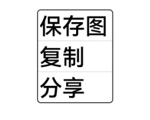
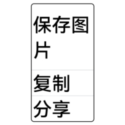

# 程序访问控制子系统变更说明

## cl.access_token.1 安全控件宽度设定默认行为变更

**访问级别**

公开接口

**变更原因**

若安全控件设定的宽度小于当前属性组合下允许的最小宽度（安全控件完整显示的最小宽度）时，此时安全控件的背托宽度会自适应增大，实际布局宽度会大于所设定宽度，以保证安全控件显示的完整性。Menu等组件集成安全控件后，若安全控件的实际宽度大于父组件的设定宽度，安全控件的按钮信息会被截断，导致安全控件不可用。

**变更影响**

该变更为不兼容变更。

变更前：

若安全控件设定的宽度小于当前属性组合下允许的最小宽度时，此时安全控件背托宽度会自适应增大，实际布局宽度会大于所设定宽度，以保证安全控件显示的完整性。

例如：

在适老化场景，Menu集成保存控件“保存图片”，由于字体的尺寸增大，保存控件的实际布局宽度会大于所设定宽度，可能会出现截断情况。

变更后：

若安全控件设定的宽度小于当前属性组合下允许的最小宽度时，此时安全控件受限于所设定的宽度信息，包括父组件的宽度约束，实际布局宽度即所设定的宽度，按钮文本信息会自动换行，以保证安全控件显示的完整性。安全控件按钮文本信息换行后，相关布局的高度会增大，如果布局的变化不能满足当前需要，需要对安全控件的高度或宽度值做相应调整。

例如：

变更后，在相同的参数条件下，安全控件完整显示的最小宽度超过所设定的宽度，按钮文本信息会自动换行，控件高度会自适应增大，以保证安全控件显示的完整性。换行后，组件的高度增大，如果布局不满足实际要求，需要根据实际需要对安全控件的宽度和高度做调整。

**起始 API Level**

12

**变更发生版本**

从OpenHarmony SDK 5.0.0.36 版本开始。

**变更的接口/组件**

@internal/component/ets/location_button.d.ts中 LocationButton接口。

@internal/component/ets/save_button.d.ts中 SaveButton接口。

@internal/component/ets/paste_button.d.ts中 PasteButton接口。

**适配指导**

接口使用的示例代码可参考：

[LocationButton接口指导](../../../application-dev/reference/apis-arkui/arkui-ts/ts-security-components-locationbutton.md#接口)

[SaveButton接口指导](../../../application-dev/reference/apis-arkui/arkui-ts/ts-security-components-savebutton.md#接口)

[PasteButton接口指导](../../../application-dev/reference/apis-arkui/arkui-ts/ts-security-components-pastebutton.md#接口)
