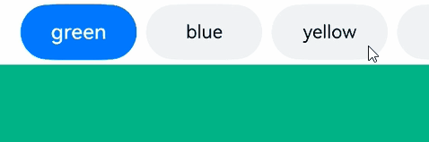
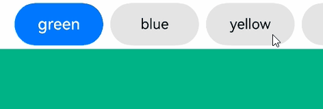
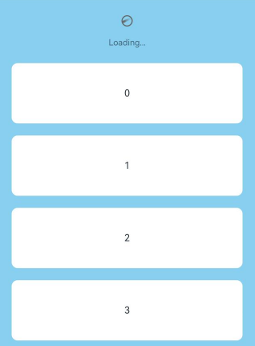
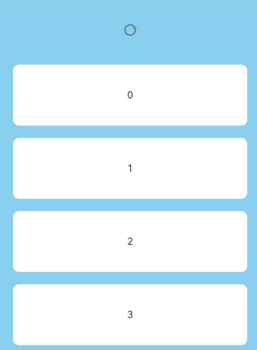
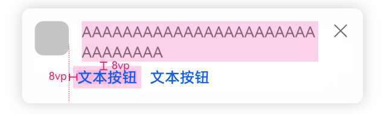
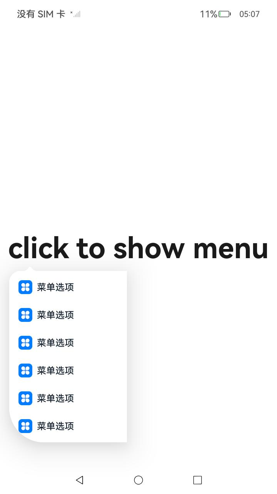
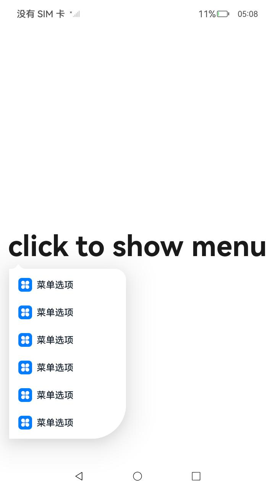

# ArkUI子系统Changelog

## cl.arkui.1 Tabs组件的页签可滚动且为非子页签样式时增加页签默认切换动效

**访问级别**

公开接口

**变更原因**

快速连续切换页签时，页签产生跳变现象，视觉效果不佳。

**变更影响**

该变更为兼容性变更。

变更前：Tabs组件的barMode为BarMode.Scrollable，TabContent组件的tabBar为子页签样式时有默认切换动效，即切换页签后，选中页签执行动画平移至tabBar中间位置。但非子页签样式时无默认切换动效，即切换页签后，选中页签立即跳变至tabBar中间位置。

变更后：Tabs组件的barMode为BarMode.Scrollable，TabContent组件的tabBar为任意页签样式时均有默认切换动效，切换动效的时长为Tabs组件的animationDuration属性值。

| 变更前 | 变更后 |
|---------|---------|
|  |  |

**起始API Level**

7

**变更发生版本**

从OpenHarmony SDK 5.0.0.36开始。

**变更的接口/组件**

Tabs组件

**适配指导**

若希望关闭页签的默认切换动效，可设置Tabs组件的animationDuration属性值为0，但同时TabContent页面的默认切换动效也会被关闭。示例代码如下：
```ts
@Entry
@Component
struct TabsSample {
  @State currentIndex: number = 0;

  @Builder TabBuilder(index: number, name: string) {
    Text(name)
      .fontColor(this.currentIndex === index ? Color.White : Color.Black)
      .fontSize(this.currentIndex === index ? 18 : 16)
      .fontWeight(this.currentIndex === index ? 500 : 400)
      .textAlign(TextAlign.Center)
      .width(100)
      .height(48)
      .margin({ left: 4, right: 4 })
      .backgroundColor(this.currentIndex === index ? '#007DFF' : '#F1F3F5')
      .borderRadius(24)
  }

  build() {
    Column() {
      Tabs({ index: this.currentIndex }) {
        TabContent() {
          Column().width('100%').height('100%').backgroundColor('#00CB87')
        }.tabBar(this.TabBuilder(0, 'green'))

        TabContent() {
          Column().width('100%').height('100%').backgroundColor('#007DFF')
        }.tabBar(this.TabBuilder(1, 'blue'))

        TabContent() {
          Column().width('100%').height('100%').backgroundColor('#FFBF00')
        }.tabBar(this.TabBuilder(2, 'yellow'))

        TabContent() {
          Column().width('100%').height('100%').backgroundColor('#E67C92')
        }.tabBar(this.TabBuilder(3, 'pink'))
      }
      .height(300)
      .barMode(BarMode.Scrollable, { margin: 16 })
      .fadingEdge(false)
      .animationDuration(0)
      .onChange((index: number) => {
        this.currentIndex = index
      })
    }.width('100%')
  }
}
```

## cl.arkui.2 Refresh组件promptText参数设置为undefined时清空文本内容

**访问级别**

公开接口

**变更原因**

Refresh组件通过promptText参数可传入文本字符串显示在刷新区域，该参数设置为undefined时未清空文本内容，不符合ArkUI通用规范，变更后开发者可设置该参数为undefined清空文本内容。

**变更影响**

该变更为不兼容变更。

变更前，promptText参数设置为undefined时会保持当前值不变，刷新区域显示对应文本内容。

变更后，promptText参数设置为undefined时会清空当前文本内容，刷新区域不显示文本内容。

| 变更前 | 变更后 |
|---------|---------|
|||

**起始API Level**

12

**变更发生版本**

从OpenHarmony SDK 5.0.0.36开始。

**变更的接口/组件**

Refresh组件promptText参数

**适配指导**

开发者需要判断变更后promptText参数设置undefined时清空文本内容后的效果是否符合预期，如不符合可通过对[Refresh组件](../../../application-dev/reference/apis-arkui/arkui-ts/ts-container-refresh.md)promptText参数设置期望值以达到预期。

```ts
@Entry
@Component
struct RefreshExample {
  @State isRefreshing: boolean = false
  @State arr: String[] = ['0', '1', '2', '3', '4','5','6','7','8','9','10']
  @State promptText: string|undefined = "Loading..."

  build() {
    Column() {
      Refresh({ refreshing: $$this.isRefreshing ,
        promptText: this.promptText  // 设置刷新区域显示文本内容，设置为undefined时清空文本内容
      }) {
        List() {
          ForEach(this.arr, (item: string) => {
            ListItem() {
              Text('' + item)
                .width('80%').height(100).fontSize(16).margin(10)
                .textAlign(TextAlign.Center).borderRadius(10).backgroundColor(0xFFFFFF)
            }
          }, (item: string) => item)
        }
        .width('100%')
        .height('100%')
        .alignListItem(ListItemAlign.Center)
        .scrollBar(BarState.Off)
      }
      .backgroundColor(0x89CFF0)
      .refreshOffset(96)
    }
  }
}
```

## cl.arkui.3 Popup（气泡组件）UX样式变更

**访问级别**

公开接口

**变更原因**

Popup（气泡组件）UX样式不符合规范

**变更影响**

该变更为不兼容变更。

变更前：
1、按钮与文本左侧没有对齐
2、按钮上方与文本下方间距不足8vp

 

变更后：
1、按钮与文本左侧对齐
2、按钮上方与文本下方间距8vp

 

**起始API Level**

API 11

**变更发生版本**

从OpenHarmony SDK 5.0.0.36开始。

**变更的接口/组件**

Popup（气泡组件）

**适配指导**

默认效果变更，无需适配，但应注意变更后的默认效果是否符合开发者预期，如不符合则应自定义修改效果控制变量以达到预期。

## cl.arkui.4 Menu(菜单组件)组件内borderRadius方法支持设置LocalizedBorderRadiuses类型参数

**访问级别**

公开接口

**变更原因**

bindMenu和bindContextMenu组件内borderRadius方法不支持设置LocalizedBorderRadiuses类型参数

**变更影响**

该变更为不兼容变更。

变更前：
在menu内使用borderRadius方法设置菜单圆角时，不支持LocalizedBorderRadiuses类型的参数。

 

变更后：
在menu内使用borderRadius方法设置菜单圆角时，支持LocalizedBorderRadiuses类型的参数，并支持镜像。

 

**起始API Level**

API 12

**变更发生版本**

从OpenHarmony SDK 5.0.0.36开始。

**变更的接口/组件**

Menu（菜单组件）

**适配指导**

开发者可以在menu内通过borderRadius接口设置菜单圆角，且当参数类型为LocalizedBorderRadiuses类型时，支持镜像能力。

```ts
import { LengthMetrics } from '@ohos.arkui.node';

@Entry
@Component
struct Index {

  @Builder
  MyMenu(){
    Menu() {
      MenuItem({ startIcon: $r("app.media.icon"), content: "菜单选项" })
      MenuItem({ startIcon: $r("app.media.icon"), content: "菜单选项" })
      MenuItem({ startIcon: $r("app.media.icon"), content: "菜单选项" })
      MenuItem({ startIcon: $r("app.media.icon"), content: "菜单选项" })
      MenuItem({ startIcon: $r("app.media.icon"), content: "菜单选项" })
      MenuItem({ startIcon: $r("app.media.icon"), content: "菜单选项" })
        .enabled(true)
    }
  }

  build() {
    Row() {
      Column() {
        Text('click to show menu')
          .fontSize(50)
          .fontWeight(FontWeight.Bold)
      }
      .bindMenu(this.MyMenu, {
        enableArrow: true,
        // 设置圆角
        borderRadius: { topStart: LengthMetrics.vp(20), bottomStart: LengthMetrics.vp(60) }
      })
      .width('100%')
    }
    .height('100%')
  }
}
```

## cl.arkui.5 setWindowSystemBarEnable 接口废弃变更

**访问级别**

公开接口

**变更原因**

该接口有Promise和callback两种调用方式，使用callback方式的接口错误码不满足ArkTS API异常处理规范，标废弃，使用同名的Promise接口代替。

**变更影响**

该变更为兼容性变更。

从API version 12开始，setWindowSystemBarEnable的callback方式调用将不推荐使用，推荐使用Promise方式的同名接口。

**起始 API Level**

API 9

**变更发生版本**

从OpenHarmony SDK 5.0.0.36版本开始。

**变更的接口/组件**

Window#setWindowSystemBarEnable(names: Array<'status' | 'navigation'>, callback: AsyncCallback&lt;void&gt;): void。

**适配指导**

不涉及

## cl.arkui.6 setWindowLayoutFullScreen 接口废弃变更

**访问级别**

公开接口

**变更原因**

该接口有Promise和callback两种调用方式，使用callback方式的接口错误码不满足ArkTS API异常处理规范，标废弃，使用同名的Promise接口代替。

**变更影响**

该变更为兼容性变更。

从API version 12 setWindowLayoutFullScreen的callback方式调用将不推荐使用，推荐使用Promise方式的同名接口。

**起始 API Level**

API 9

**变更发生版本**

从OpenHarmony SDK 5.0.0.36版本开始。

**变更的接口/组件**

Window#setWindowLayoutFullScreen(isLayoutFullScreen: boolean, callback: AsyncCallback&lt;void&gt;): void。

**适配指导**

不涉及

## cl.arkui.7 setWindowSystemBarProperties 接口废弃变更

**访问级别**

公开接口

**变更原因**

该接口有Promise和callback两种调用方式，使用callback方式的接口错误码不满足ArkTS API异常处理规范，标废弃，使用同名的Promise接口代替。

**变更影响**

该变更为兼容性变更。

从API version 12开始，setWindowSystemBarProperties的callback方式调用将不推荐使用，推荐使用Promise方式的同名接口。

**起始 API Level**

API 9

**变更发生版本**

从OpenHarmony SDK 5.0.0.36版本开始。

**变更的接口/组件**

Window#setWindowSystemBarProperties(systemBarProperties: SystemBarProperties, callback: AsyncCallback&lt;void&gt;): void。

**适配指导**

不涉及

## cl.arkui.8  Toast弹窗UX样式变更

**访问级别**

公开接口

**变更原因**

UX规格变更

**变更影响**

该变更为不兼容变更。

- API version 11及之前，Toast弹窗背景色为深黑色、字色为白色，最大高度没有限制，界面语超长没有截断。<br/>

- API version 12及之后，Toast弹窗在常规亮色显示风格下toast透明模糊背景、字色黑色，暗色显示风格下透明模糊背景、字色白色。<br/>
Toast的最大高度 =（屏幕高度-信号栏-导航条）*0.65，最大宽度：基于屏幕宽度-2侧margin，根据容器自适应，最大到400vp不再变化。<br/>
界面语超长逐级缩小字号至12fp，超出截断。

- API version 11及之前对比API version 12及之后属性变更如下

 | 属性名 | 变更前 | 变更后 |
|---------|---------|---------|
| 背景色 | bg_color | COMPONENT_ULTRA_THICK |
| 圆角 | toast_border_radius | corner_radius_level9 |
| padding-left | toast_padding_horizontal | padding_level8 |
| padding-top | toast_padding_vertical | padding_level4 |
| padding-right | toast_padding_horizontal | padding_level8 |
| padding-bottom | toast_padding_vertical | padding_level4 |
| 字体大小 | text_font_size | Body_M |
| 字体颜色 | text_color | font_primary |
| 字重 | toast_text_font_weight | font_weight_regular |

示例如下：
如下图所示为变更前后效果对比：

 | 变更前 | 变更后 |
|---------|---------|
|   |    |

**API Level**

12

**变更发生版本**

从OpenHarmony SDK 5.0.0.36 版本开始。

**变更的接口/组件**

promptAction.showToast

**适配指导**

UX默认行为变更，无需适配。可以通过[promptAction](../../../application-dev/reference/apis-arkui/js-apis-promptAction.md)中ShowToastOptions接口自定义Toast背景色、字色等。


## cl.arkui.9 QRCode深浅色适配修改

**访问级别**

公开接口

**变更原因**

QRCode在深色模式下使用默认颜色生成的二维码无法被正常识别。

**变更影响**

该变更为不兼容变更。

变更前:在深色模式下，QRCode生成的二维码背景颜色为黑色，图案颜色为白色。

变更后:在深色模式下，QRCode生成的二维码背景颜色为白色，图案颜色为黑色，与浅色模式相同。

**起始API Level**

12

**变更发生版本**

从OpenHarmony SDK 5.0.0.36开始。

**变更的接口/组件**

QRcode组件

**适配指导**

默认效果变更，无需适配。