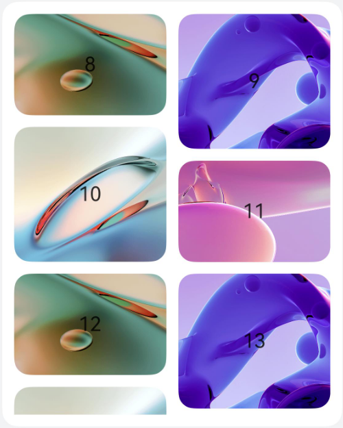

# ArkUI子系统Changelog

## cl.arkui.1 移动窗口布局模式瀑布流行为变更

**访问级别**

公开接口

**变更原因**

优化[移动窗口布局模式](../../../application-dev/reference/apis-arkui/arkui-ts/ts-container-waterflow.md#waterflowlayoutmode12)瀑布流使用LazyForEach增删节点时布局方式。

**变更影响**

该变更为不兼容变更。

变更前：在显示范围上方增加节点，显示范围节点会下移；在显示范围上方删除节点，显示范围节点会上移

变更后：在显示范围上方增删节点，显示范围不变

下表显示在显示范围上方增加一个节点时变更前后的效果对比：
| 增加节点前|变更前：图7显示到原图8的位置 | 变更后：图8位置不变 |
| --- |--- | --- |
| | |  |


**起始API Level**

API 12

**变更发生版本**

从OpenHarmony 5.0.0.37 版本开始。

**变更的接口/组件**

WaterFlow组件布局模式WaterFlowLayoutMode.SLIDING_WINDOW。

**适配指导**

默认行为变更，无需适配，但应注意变更后的行为是否对整体应用逻辑产生影响。


## cl.arkui.2 滚动类组件默认最大抛划限速变更

**访问级别**

公开接口

**变更原因**

滚动类组件（List、Scroll、Grid、WaterFlow）快速抛划时，划动距离太近，需要优为化快速划动，提升体验。

**变更影响**

该变更为不兼容变更。

变更前：滚动类组件最大抛划限速默认为4200vp/s

变更后：滚动类组件最大抛划限速默认为12000vp/s

下表变更前后快速抛划效果对比：
|变更前 | 变更后 |
| --- |--- | 
| |  |


**起始API Level**

API 11

**变更发生版本**

从OpenHarmony 5.0.0.37 版本开始。

**变更的接口/组件**

滚动类组件[flingSpeedLimit](../../../application-dev/reference/apis-arkui/arkui-ts/ts-container-scrollable-common.md#flingspeedlimit11)属性。

**适配指导**

无需适配，如果滚动速度过快导致性能问题，可以使用[flingSpeedLimit](../../../application-dev/reference/apis-arkui/arkui-ts/ts-container-scrollable-common.md#flingspeedlimit11)接口设置最大抛划限速。

```ts
@Entry
@Component
struct ListItemExample {
  private arr: number[] = []

  aboutToAppear(): void {
    for (let i = 0; i < 50; i++) {
      this.arr.push(i)
    }
  }

  build() {
    Column() {
      List({ space: 20, initialIndex: 0 }) {
        ForEach(this.arr, (item: number) => {
          ListItem() {
            Text('' + item)
              .width('100%')
              .height(100)
              .fontSize(16)
              .textAlign(TextAlign.Center)
              .borderRadius(10)
              .backgroundColor(0xFFFFFF)
          }
        }, (item: string) => item)
      }.width('90%')
      .flingSpeedLimit(4200) // 设置抛划限速
    }.width('100%').height('100%').backgroundColor(0xDCDCDC).padding({ top: 5 })
  }
}
```