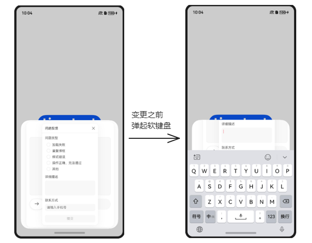
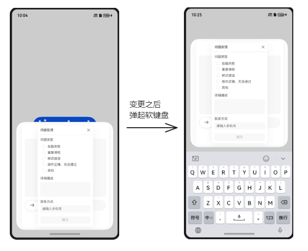

# Web子系统ChangeLog

## cl.web.1 CustomDialog内嵌Web组件软键盘避让方式由改变Web高度避让软键盘变更为抬升CustomDialog避让软键盘

**访问级别**

公开接口。

**变更原因**

CustomDialog内嵌Web组件软键盘避让方式不符合CustomDialog软键盘避让的规范，与其他ArkUI组件避让方式不一致。

**变更影响**

该变更为不兼容变更。

变更前：CustomDialog内嵌Web组件，在Web组件内点击输入框弹出软键盘时，会默认通过改变Web的高度来避让软键盘。

变更后：CustomDialog内嵌Web组件，在Web组件内点击输入框弹出软键盘时，会默认通过抬升CustomDialog来避让软键盘。

下表为变更前后CustomDialog嵌套Web场景软键盘避让效果对比：
|变更前 | 变更后 |
| --- |--- | 
| |  |

**起始API Level**

API 12

**变更发生版本**

从OpenHarmony 5.0.0.37 版本开始。

**变更的接口/组件**

CustomDialog内嵌Web组件软键盘避让场景。

**适配指导**

[CustomDialog](../../../application-dev/reference/apis-arkui/arkui-ts/ts-methods-custom-dialog-box.md)弹窗避让软键盘时，会将弹窗整个抬升，并且与软键盘之间存在一定的安全间距。如果应用不期望弹窗被抬升或存在安全间距，应当合理配置[CustomDialog](../../../application-dev/reference/apis-arkui/arkui-ts/ts-methods-custom-dialog-box.md)的属性或改用其他组件替代。
