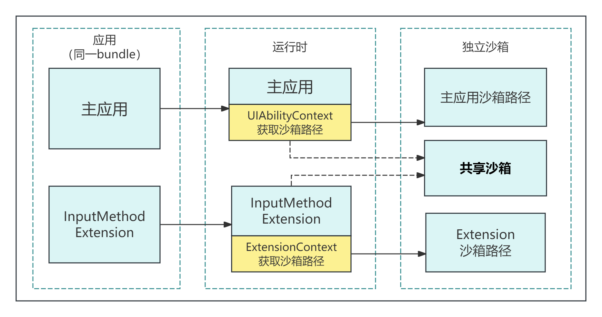

# 输入法子系统Changelog

## cl.inputmethod.1 系统增加对基础访问模式输入法的管控

**访问级别**

其他

**变更原因**

为保护用户个人数据安全，系统增加对基础模式输入法的安全管控，用于提升输入法的安全性。

**变更影响**

该变更为不兼容变更。

新增的系统管控可能会导致输入法应用原先在基础模式下使用的部分功能出现不可用的情况。

当输入法以安全模式[SecurityMode](../../../application-dev/reference/apis-ime-kit/js-apis-inputmethodengine.md#securitymode11)为基础访问模式（即BASIC）运行，系统增加了对其功能的管控。主要体现为：系统禁止基础模式下的输入法调用，涉及访问或泄漏用户隐私数据的系统能力。

变更前：

1. 输入法Extension进程与应用的主入口的进程共用同一个应用沙箱，两个进程对该沙箱均可读可写。
2. 输入法Extension进程可以拉起其他Extension应用或其他应用的UIAbility。
3. 输入法Extension进程可以使用涉及访问或泄漏用户个人数据的接口，可以将数据传出进程。

变更后：

1. 输入法Extension进程使用独立沙箱，与应用的主入口进程不可互相访问对方独立沙箱。

2. 新增输入法Extension与应用的主入口的共享沙箱，基础访问模式下输入法Extension对共享沙箱只读，完整访问模式下可读可写；应用的主入口对共享沙箱保持可读可写。

   

3. 基础访问模式下，输入法应用Extension进程无法拉起其他Extension应用进程以及其他UIAbility。

4. 基础访问模式下，输入法Extension进程会受到系统管控，不能使用涉及访问或泄漏用户个人数据的各种接口，同时无法将数据传递出进程。管控功能包括但不限于：网络、短信、电话、麦克风、定位、相机、蓝牙、壁纸、支付、日历、游戏、扬声器、Wi-Fi、剪切板、多媒体、联系人、公共事件、系统账号、健康数据、地图服务、推送服务、融合搜索、共享内存、分布式特性、广告设备标识等。

5. 基础访问模式下，输入法Extension可以使用基础输入功能相关的必要系统能力，例如，IME Kit、ArkUI、窗口、图形、屏幕管理等。

**起始API Level**

12

**变更发生版本**

从OpenHarmony 5.0.0.38 版本开始。

**变更的接口/组件**

不涉及

**适配指导**

为确保输入法应用在运行期间功能正常，建议输入法应用在应用初始化流程：[onCreate](../../../application-dev/reference/apis-ime-kit/js-apis-inputmethod-extension-ability.md#inputmethodextensionabilityoncreate)回调中，通过调用接口[getSecurityMode](../../../application-dev/reference/apis-ime-kit/js-apis-inputmethodengine.md#getsecuritymode11)查询当前模式：

1. 若当前处于基础模式，开发者可以调整内部功能呈现情况，防止出现功能不可用。
2. 若当前处于完整模式，开发者可以使用涉及访问用户数据的接口，但是，对于这些接口的访问仅限于提升输入法体验。

为保证输入法功能稳定，请开发者确保在基础模式下仅使用与基础输入功能相关的能力，不能试图通过绕过系统机制将数据传递到输入法Extension进程和沙箱外。
