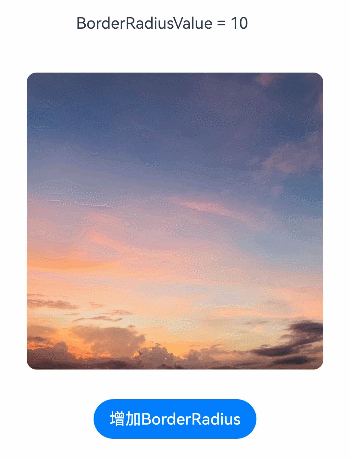

# ArkUI 子系统变更说明


## cl.arkui.1 keyboardShortcut快捷键功能增强

**访问级别**

公开接口

**变更原因**

应用快捷键功能增强。

**变更影响**

该变更为兼容性变更。

API version 13及以后，不再禁止注册以下列表中的快捷键。

- `Ctrl` + `C`
- `Ctrl` + `A`
- `Ctrl` + `V`
- `Ctrl` + `X`
- `Ctrl` + `Shift` + `Z`
- `Ctrl` + `Z`
- `Ctrl` + `Y`

变更前：应用不可以使用keyboardShortcut注册上述列表中的快捷键。

变更后：应用可以使用keyboardShortcut注册上述列表中的快捷键。

**起始API Level**

10

**变更发生版本**

从OpenHarmony SDK 5.0.0.41 版本开始。

**变更的接口/组件**

通用接口。

**适配指导**

不涉及适配，API使用参考[keyboardShortcut](../../../application-dev/reference/apis-arkui/arkui-ts/ts-universal-events-keyboardshortcut.md)。

## cl.arkui.2 hideNonSecureWindows接口使用权限变更

**访问级别**

系统接口

**变更原因**

模态UIExtension默认隐藏不安全窗口且不允许取消隐藏，造成部分场景UX体验不佳。

**变更影响**

该变更为兼容性变更。

变更前：模态UIExtension默认隐藏不安全窗口且不允许取消隐藏。

变更后：模态UIExtension默认隐藏不安全窗口，申请ohos.permission.ALLOW_SHOW_NON_SECURE_WINDOWS权限后可取消隐藏。

**起始API Level**

API 12

**变更发生版本**

从OpenHarmony SDK 5.0.0.41开始。

**变更的接口/组件**

CreateModalUIExtension和hideNonSecureWindows接口。

**适配指导**

为避免不安全窗口先隐藏再显示导致闪烁，模态UIExtension在申请ohos.permission.ALLOW_SHOW_NON_SECURE_WINDOWS权限后，可以在``onSessionCreate``函数中调用``hideNonSecureWindows(false)``接口取消对不安全窗口的隐藏。此时应用需自行确保自身内容不会被遮挡，建议使用``createSubWindowWithOptions``接口创建模态置顶子窗，并将内容都加载在子窗中。

## cl.arkui.3 MenuItem组件在非2in1设备上超长文本布局由缩略显示变更为换行显示

**访问级别**

公开接口

**变更原因**

对于使用超长文本的MenuItem组件场景，默认布局效果优化，UX体验更佳。

**变更影响**

此变更不涉及应用适配。

变更前：MenuItem组件含有超长文本时，文本缩略显示。

变更后：API13开始，MenuItem组件含有超长文本时，在2in1设备上不换行，其余设备无限换行。

| 变更前长文本缩略 | 变更后非2in1设备长文本换行 |
|---------|---------|
|         |         |

**起始API Level**

API 11

**变更发生版本**

从OpenHarmony SDK 5.0.0.41开始。

**变更的接口/组件**

MenuItem组件。

**适配指导**

MenuItem UX默认布局效果变更，应用无需适配。

## cl.arkui.2 Image组件的borderRadius接口支持动态修改

**访问级别**

公开接口

**变更原因**

为了增强功能的灵活性，Image组件的borderRadius接口支持动态修改。动态修改可以实时更新borderRadius的值，灵活地调整图片的圆角效果。例如，可根据用户交互或状态变化即时改变圆角半径。

**变更影响**

该变更为不兼容变更。

变更前：Image组件的borderRadius接口动态修改不生效。

变更后：Image组件的borderRadius接口动态修改生效。

| 变更前                                   | 变更后                                   |
| ---------------------------------------- | ---------------------------------------- |
|  |  |

```ts
// xxx.ets
@Entry
@Component
struct Index {
  @State borderRadiusValue: number = 10;
  build() {
    Column() {
      Text("BorderRadiusValue = " + this.borderRadiusValue)
        .height(100)
        .width(200)
        .fontSize(FontWeight.Bold)
      Image($r("app.media.sky"))
        .height(300)
        .width(300)
        .borderRadius(this.borderRadiusValue)
      Button("增加BorderRadius")
        .onClick(()=>{
          this.borderRadiusValue += 10
        })
    }
    .height('100%')
    .width('100%')
  }
}
```

**起始API Level**

7

**变更发生版本**

从OpenHarmony SDK 5.0.0.41 版本开始。

**变更的接口/组件**

Image组件的borderRadius接口。

**适配指导**

如果应用需要动态修改borderRadius接口，可以在运行时灵活调整圆角效果以响应用户交互或其他状态变化。
如果应用不需要动态修改borderRadius接口，例如，避免在运行时改变圆角效果。borderRadius接口的参数建议设置为固定值，例如：borderRadius('5px')。

## cl.arkui.3 borderImage的outset属性按照实际的延伸距离来绘制边框向外扩展的效果

**访问级别**

公开接口

**变更原因**

borderImage中的边框外延距离（outset属性）在无需绘制的区域不会被绘制，这与预期行为不符。

**变更影响**

该变更为不兼容变更。

变更前：borderImage中的边框外延距离（outset属性）在无需绘制的区域不会被绘制。

变更后：borderImage中的边框外延距离（outset属性）按照实际延伸距离进行绘制。

**起始API Level**

9

**变更发生版本**

从OpenHarmony SDK 5.0.0.41 版本开始。

**变更的接口/组件**

通用接口。

**适配指导**

默认效果变更，无需适配，但应注意变更后的默认效果是否符合开发者预期，如不符合则应自定义修改效果控制变量以达到预期。

## cl.arkui.4 画布组件在绘制文本时设置globalCompositeOperation、fillStyle和globalAlpha属性的效果变更

**访问级别**

公开接口

**变更原因**

使用画布组件（CanvasRenderingContext2D和OffscreenCanvasRenderingContext2D）进行文本绘制时，设置globalCompositeOperation属性和pattern样式的fillStyle属性无效；设置带透明度颜色的fillStyle属性，同时设置globalAlpha属性，文本的透明度仅由globalAlpha决定，不考虑fillStyle属性的颜色透明度。导致绘制效果与W3C标准存在差异，因此需要变更绘制行为。


**变更影响**

该变更为不兼容变更。

变更前：CanvasRenderingContext2D和OffscreenCanvasRenderingContext2D的globalCompositeOperation属性与fillStyle属性设置的pattern样式在绘制文本时不生效；fillStyle属性设置带透明度颜色并设置globalAlpha属性时，fillText绘制文本的透明度为globalAlpha属性值。

变更后：CanvasRenderingContext2D和OffscreenCanvasRenderingContext2D的globalCompositeOperation属性与fillStyle属性设置的pattern样式在绘制文本时生效；fillStyle属性设置带透明度颜色并设置globalAlpha属性时，fillText绘制文本的透明度为颜色透明度×globalAlpha。

| 使用场景                                   | 变更前                                   | 变更后                                   |
| ---------------------------------------- | ---------------------------------------- | ---------------------------------------- |
| globalCompositeOperation与fillText组合使用 |  |  |
| fillStyle设置pattern样式与fillText组合使用 |  |  |
| globalAlpha设置透明度，fillStyle设置带透明度颜色，与fillText组合使用 |  |  |

**起始API Level**

8

**变更发生版本**

从OpenHarmony 5.0.0.41开始。

**变更的接口/组件**

CanvasRenderingContext2D和OffscreenCanvasRenderingContext2D的fillText和strokeText接口。

**适配指导**

若希望在绘制文本时globalCompositeOperation属性保持默认值，需在fillText/strokeText方法前声明context.globalCompositeOperation = 'source-over'；若希望pattern样式在绘制文本时不生效，需在fillText方法前指定所需的fillStyle；若希望文本透明度不受fillStyle颜色透明度的影响，需将fillStyle设置为不透明颜色。

示例：

```
// xxx.ets
@Entry
@Component
struct FillText {
  private settings: RenderingContextSettings = new RenderingContextSettings(true)
  private context: CanvasRenderingContext2D = new CanvasRenderingContext2D(this.settings)
  private img:ImageBitmap = new ImageBitmap("common/images/icon.jpg")

  build() {
    Flex({ direction: FlexDirection.Column, alignItems: ItemAlign.Center, justifyContent: FlexAlign.Center }) {
      Canvas(this.context)
        .width('100%')
        .height('100%')
        .onReady(() =>{
          this.context.font = '30vp sans-serif'

          this.context.fillStyle = 'rgb(227, 248, 249)'
          this.context.fillRect(0, 0, 150, 150)
          this.context.fillStyle = 'rgb(39, 135, 217)'
          this.context.globalCompositeOperation = 'xor' // 设置globalCompositeOperation为'xor'模式
          this.context.fillText('Hello World', 50, 50) // 生效'xor'模式
          this.context.globalCompositeOperation = 'source-over' // 设置globalCompositeOperation为默认值
          this.context.fillText('Hello World', 50, 150) // 生效'source-over'模式

          let pattern = this.context.createPattern(this.img, 'repeat')
          if (pattern) {
            this.context.fillStyle = pattern // 设置fillStyle为pattern样式
          }
          this.context.fillText('Hello World', 50, 250) // 生效pattern样式

          this.context.fillStyle = '#88FF0000' // 设置fillStyle为带透明度颜色
          this.context.globalAlpha = 0.5 // 设置画布透明度
          this.context.fillText('Hello World', 50, 350) // 透明度为颜色透明度×globalAlpha
        })
    }
    .width('100%')
    .height('100%')
  }
}
```
