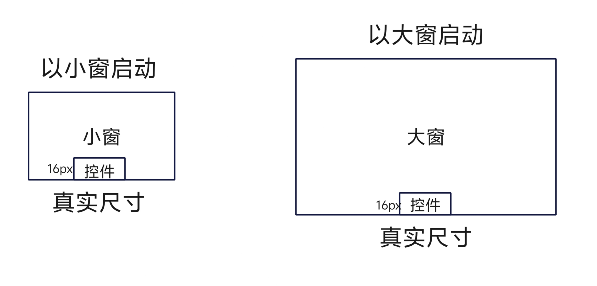
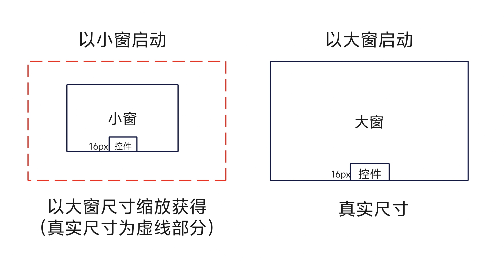

# 窗口子系统Changelog

## cl.pipwindow.1 画中画窗口默认尺寸固定为大窗真实尺寸行为变更

**访问级别**

公开接口

**变更原因**


画中画窗口以启动窗口时实际大小为基准，小窗和大窗基准不同，双击缩放时未修改窗口真实尺寸而是通过修改窗口缩放级别。

例如应用基于小窗渲染自定义UI控件后，用户双击缩放至大窗后，该自定义UI控件的视觉大小和以大窗开启画中画时，自定义UI控件的视觉大小不一致。因此将画中画窗口大小固定为大窗时的真实尺寸，小窗显示大小由大窗真实尺寸缩放获得。

**变更影响**

该变更为不兼容变更。

变更前：
画中画窗口在以小窗启动时或以大窗启动时均为真实尺寸。应用基于小窗或大窗渲染自定义UI控件后，用户双击缩放至另一档位后，该自定义UI控件的视觉大小和以另一档位直接开启画中画时自定义UI控件的视觉大小不一致。

变更后：
画中画窗口尺寸统一保持为大窗的默认尺寸，小窗则由大窗依据系统规则缩放得到，自定义UI控件依据大窗尺寸进行适配后，小窗显示时自定义UI控件将与画中画窗口一同缩放。

| 变更前 | 变更后 |
|---------|---------|
|  |  |

**起始API Level**

API 12

**变更发生版本**

从OpenHarmony 5.0.0.42 版本开始。

**变更的接口/组件**

使用PiPConfiguration中customUIController在画中画内容之上添加自定义控件场景。

**适配指导**

若应用此前依据小窗适配了自定义UI控件的大小，则可能出现小窗下控件比实际设置的尺寸偏小的问题。
自定义控件需基于画中画窗口最大档位（真实尺寸）进行适配，其余档位中控件会跟随画中画窗口一同缩放。

```ts
@Builder
function buildText(params: Params) {
  Column() {
    // 变更前 若应用基于小窗为基准适配字体大小为20
    // Text(params.text)
    //  .fontSize(20)
    //  .fontColor(Color.Red)

    // 变更后 字体大小应基于大窗真实尺寸适配，字体大小应相应调整为合适值
     Text(params.text)
      .fontSize(38)
      .fontColor(Color.Red)
  }
  .width('100%')
  .height('100%')
}
// 自定义UI控件所使用的customUIController
class TextNodeController extends NodeController {
  private message: string;
  private textNode: BuilderNode<[Params]> | null = null;
  constructor(message: string) {
    super();
    this.message = message;
  }
  makeNode(context: UIContext): FrameNode | null {
    this.textNode = new BuilderNode(context);
    this.textNode.build(wrapBuilder<[Params]>(buildText), new Params(this.message));
    return this.textNode.getFrameNode();
  }
}
```