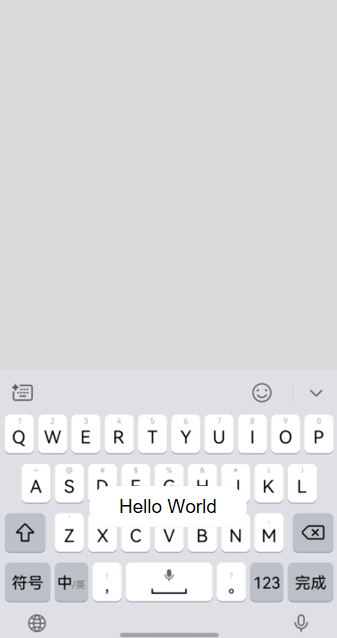
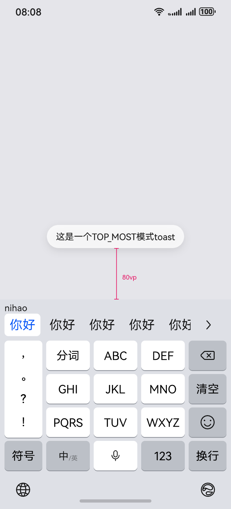
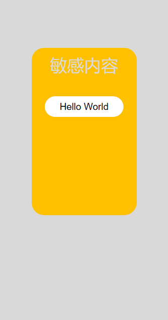
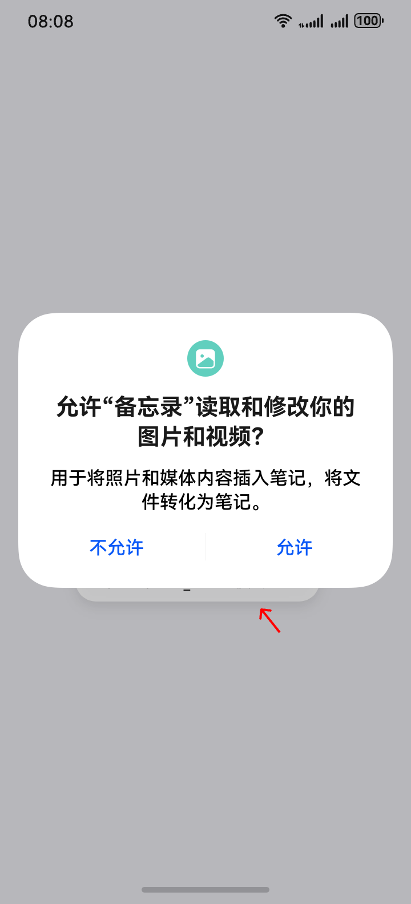
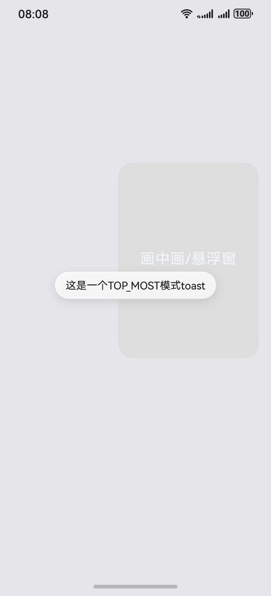
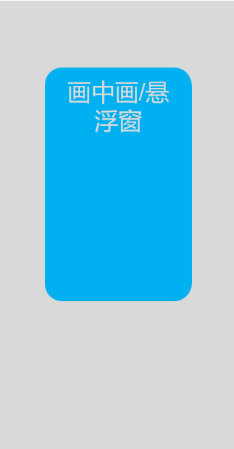

# ArkUI子系统Changelog

## cl.arkui.1 component3d获取资源的路径格式由Resource类型不兼容变更到ResourceStr类型

**访问级别**

公开接口

**变更原因**

扩展component3D组件获取系统路径资源能力，目前只支持从应用沙箱路径获取资源。

**变更影响**

该变更为不兼容变更。

变更前：component3D资源获取通过Resource方式，只支持从rawfile路径读取。

变更后：component3D资源获取修改为通过ResourceStr方式，既支持从rawfile路径读取也支持从磁盘路径读取。

不兼容场景：
当用户存在指定数据类型赋值场景时，会出现不兼容情况; 例如：
```ts
const params1: SceneResourceParameters = { name: "name1", uri: $rawfile("default_path") }
const test_uri: Resource | undefined = params1.uri;
```

**起始API Level**

API 12

**变更发生版本**

从OpenHarmony SDK 5.0.0.43开始

**变更的接口/组件**

1、 Component3D初始化资源接口SceneOptions中sence变量数据类型由Resource变更为ResourceStr；

2、 Scene中uri变量数据类型由Resource变更为ResourceStr；

3、 SceneResources中uri变量数据类型由Resource变更为ResourceStr；

4、 component3d中environment、customRender、shader和shaderImageTexture接口的入参由Resource类型变更为ResourceStr类型；

5、 Scene中load接口的入参由Resource类型变更为ResourceStr类型；

**适配指导**

```ts
import { Scene, Image, SceneResourceParameters, SceneResourceFactory } from '@kit.ArkGraphics3D'

const params1: SceneResourceParameters = { name: "name1", uri: $rawfile("default_path") }
// 变更前
// const test_uri: Resource | undefined = params1.uri;
// 变更后适配为
const test_uri: ResourceStr | undefined = params1.uri;

@Entry
@Component
struct node_geometry {
    scene: Scene | null = null;
    @State sceneOpt: SceneOptions | null = null; 
    envImg: Image | null = null;

    onPageShow(): void {
        this.Init();
    }

    onPageHide(): void {
        if (this.scene) {
            this.scene.destroy();
        }
    }

    Init(): void {
        if (this.scene == null) {
            Scene.load($rawfile("default_path"))
            .then(async (result: Scene) => {
                this.scene = result;
                this.sceneOpt = { scene: this.scene, modelType: ModelType.SURFACE } as SceneOptions;
                let rf: SceneResourceFactory = this.scene.getResourceFactory();

                this.envImg = await rf.createImage({ name: "image1", uri: test_uri });
            });
        }
    }

    build() {
        Column() {
            Component3D(this.sceneOpt)
                .renderWidth('100%')
                .renderHeight('100%')
                .width('100%')
                .height('100%')
        }
    }
}
```

## cl.arkui.2  backgroundEffect在modifier中radius参数单位修改

**访问级别**

公开接口

**变更原因**

 直接使用backgroundEffect时对应的模糊参数radius单位为vp。通过modifier或者CAPI使用时，单位为px。现将单位同一为vp。

**变更影响**

该变更为不兼容变更。

变更前：backgroundEffect通过modifier使用时单位为px。<br/>


变更后：backgroundEffect通过modifier使用时单位为vp。<br/>


**起始API Level**

API 12

**变更发生版本**

从OpenHarmony 5.0.0.43 版本开始。

**变更的接口/组件**

backgroundEffect

**适配指导**

在modifier中使用px2vp方法把radius参数转换为vp。

```ts

import { CommonModifier } from '@kit.ArkUI';

class ColumnModifier extends CommonModifier {
  public radius: number = 0;
  applyNormalAttribute(instance: CommonAttribute): void {
    instance.backgroundEffect({ radius: this.radius })
  }
}

@Entry
@Component
struct Index {
  @State testSize: number = 200;
  @State modifier:ColumnModifier = new ColumnModifier();
  onPageShow(): void {
    // 变更前
    // this.modifier.radius = 10;
    // 变更后适配
    this.modifier.radius = px2vp(10);
  }
  build() {
    Column() {
      Stack() {
        Image($r('app.media.test')).width(this.testSize).height(this.testSize)
        Column().width(this.testSize).height(this.testSize).attributeModifier(this.modifier)
      }.width('100%')
    }
  }
}
```

## cl.arkui.3 showToast接口TOP_MOST模式行为变更

**访问级别**

公开接口

**变更原因**

toast层级过高，会挡住权限弹窗等敏感内容，存在安全隐患。

**变更影响**

该变更为不兼容变更。

API version 12及以后，TOP_MOST模式弹出的Toast的层级发生改变，即：

变更前：Toast层级较高，可以悬浮显示在输入法、系统授权弹窗之上。输入法弹出后不避让，保持在原来的位置。

变更后：

1. Toast不能悬浮显示在输入法之上，如果Toast与输入法有重叠，则将Toast避让到输入法上方固定80vp处。
2. Toast在系统敏感内容显示时不显示或被覆盖。
3. 在画中画窗口和悬浮窗中不支持创建TOP_MOST模式的Toast。

| 变更前                                   | 变更后                                   |
| ---------------------------------------- | ---------------------------------------- |
|  |  |


| 变更前                                   | 变更后                                   |
| ---------------------------------------- | ---------------------------------------- |
|  |  |


| 变更前                                   | 变更后                                   |
| ---------------------------------------- | ---------------------------------------- |
|  |  |

**起始API Level**

11

**变更发生版本**

从OpenHarmony SDK 5.0.0.43 版本开始。

**变更的接口/组件**

showToast接口

**适配指导**

1. 对于输入法的场景，开发者可以设置高度将Toast放到合适的位置，主动避开输入法。
2. 对于敏感内容的场景，开发者无法适配。
3. 对于画中画和悬浮窗的场景，开发者可以改为使用DEFAULT模式。