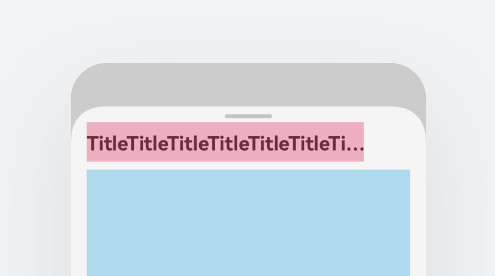

# ArkUI子系统Changelog

## cl.arkui.1 Counter组件的focusType类型变更，使Counter的子组件获焦、失焦时，可触发其他组件的获焦、失焦。

**访问级别**

公开接口

**变更原因**

Counter组件的focusType类型为NODE，当Counter的子组件获焦、失焦时，未正确触发其他组件的获焦、失焦。

**变更影响**

该变更为不兼容变更。

变更前：Counter组件的focusType类型为NODE，子组件获焦时，页面上的其他组件没有失焦。Counter组件设置focusable属性为true，即可触发onFocus和onBlur事件。

变更后：Counter组件的focusType类型为SCOPE容器，子组件获焦时，页面上的其他组件失焦。Counter组件设置focusable属性为true，且拥有可获焦的子组件时，才能触发onFocus和onBlur事件。

**起始API Level**

API 9

**变更发生版本**

从OpenHarmony SDK 5.0.0.45开始

**变更的接口/组件**

Counter组件

**适配指导**

默认行为变更，无需适配，但应注意变更后的行为是否对整体应用逻辑产生影响。

## cl.arkui.2 bindSheet半模态面板视觉样式增加

**访问级别**

公开接口

**变更原因**

增强视觉效果。

**变更影响**

该变更为不兼容变更，设备宽度在600-840vp间时，SheetOptions中的preferType设置为SheetType.POPUP，原先显示居中弹窗样式，现在显示跟手弹窗样式。

API version 14及以后，设备宽度在600-840vp间时，默认显示居中弹窗样式，增加跟手弹窗样式。

变更前：设备宽度在600-840vp间时，SheetOptions中的preferType设置为SheetType.POPUP，实际显示居中弹窗样式。

变更后：设备宽度在600-840vp间时，SheetOptions中的preferType设置为SheetType.POPUP，实际显示气泡弹窗样式。

**起始API Level**

11

**变更发生版本**

从OpenHarmony SDK 5.0.0.45 版本开始。

**变更的接口/组件**

bindSheet半模态面板。

**适配指导**

设备宽度在600-840vp间时，如需显示跟手弹窗样式，则SheetOptions中的preferType设置为SheetType.POPUP；如需显示底部弹窗样式，则preferType设置为SheetType.BOTTOM；如需显示居中弹窗样式，则preferType设置为SheetType.CENTER或者不设置。

## cl.arkui.3 bindSheet半模态面板标题与关闭按钮布局变更

**访问级别**

公开接口

**变更原因**

增强视觉效果。

**变更影响**

该变更为不兼容变更。

API version 14及以后，关闭按钮不显示时，关闭按钮区域放开限制给标题栏区域布局。

变更前：关闭按钮不显示时，关闭按钮区域未放开限制给标题栏区域布局。

变更后：关闭按钮不显示时，关闭按钮区域放开限制给标题栏区域布局。

| 变更前                                   | 变更后                                   |
| ---------------------------------------- | ---------------------------------------- |
|  |  |

**起始API Level**

11

**变更发生版本**

从OpenHarmony SDK 5.0.0.45 版本开始。

**变更的接口/组件**

bindSheet半模态面板。

**适配指导**

关闭按钮不显示时，关闭按钮区域放开限制给标题栏区域布局，标题栏宽度增加48vp。

