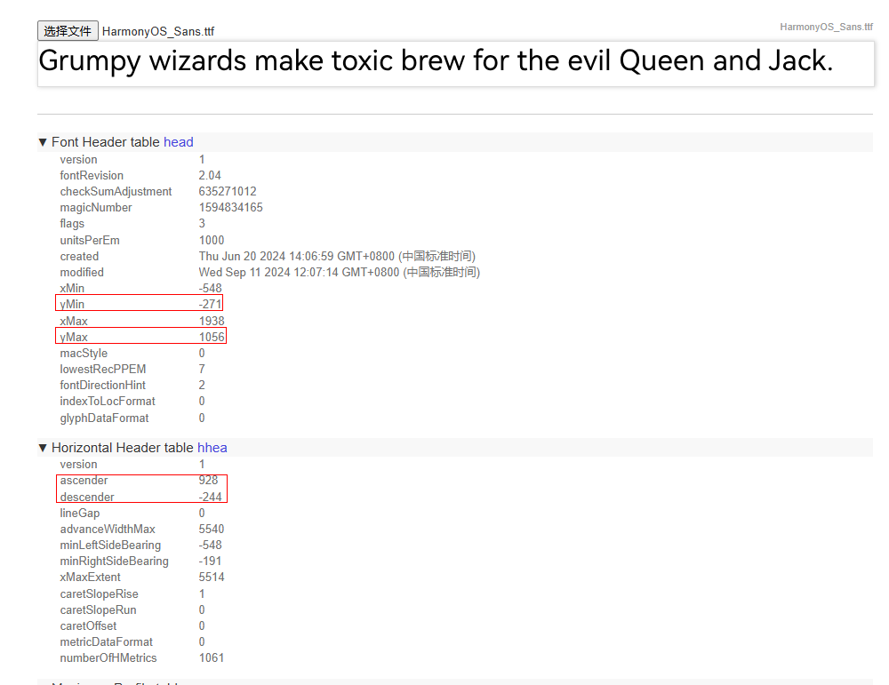

# ArkGraphics2D变更说明

## cl.arkgraphics2d.1 主模块metadata标签新增ohos.graphics2d.text.adapter_text_height支持全局使能新的行高计算规则

**访问级别**

公开接口

**变更原因**

为了进一步提升文字显示效果，新增支持应用全局使用新的行高计算规则。

**变更影响**

该变更为兼容性变更。
在主模块的[module.json5配置文件metadata标签](../../../application-dev/quick-start/module-configuration-file.md#metadata标签)中新增ohos.graphics2d.text.adapter_text_height以支持应用使能新的行高计算规则。

```json
{
    "module": {
        "name": "test",
        "type": "entry",
        "metadata": [
            {
                "name": "ohos.graphics2d.text.adapter_text_height",
            }
        ]
    }
}
```
应用未配置ohos.graphics2d.text.adapter_text_height的情况（即默认情况）下仍使用默认的行高计算规则。
默认行高规则如下：

当字号为fontSize（单位为px）时，默认的行高计算规则为`(|descender|+|ascender|)/unitsPerEm*fontSize`。

在主模块配置ohos.graphics2d.text.adapter_text_height后，整个应用使能新的行高规则。
新的行高计算规则如下：

1. 自定义字体：当字号为fontSize（单位为px）时，对应的行高计算规则为`(|yMin|+|yMax|)/unitsPerEm*fontSize`。
2. 系统字体：当字号为fontSize（单位为px）时，对应的行高计算规则为`(|yMin|+|yMax|)/unitsPerEm*fontSize`。系统字体行高以HarmonyOS_Sans.ttf文件中的行高计算结果为准。

可以使用[字体文件查看工具](https://opentype.js.org/font-inspector.html)，查看对应字体文件的各项参数，了解将要使用的字体行高和效果等。

下面以查看HarmonyOS_Sans.ttf文件为例，介绍系统字体行高的默认计算规则和新增支持的行高计算规则。

| HarmonyOS_Sans.ttf字体文件参数                        |
| ----------------------------------------------------- |
|  |

上图表示HarmonyOS_Sans字体，在1000px字号下，yMin值为-271，yMax值为1056，ascender值为928，descender值为-244。
1. 默认的行高计算规则下，50px的HaromonyOS_Sans字体的行高为(|-244|+|928|)/1000*50=58.6px。
2. 新的行高计算规则下，50px的HaromonyOS_Sans字体的行高为(|-271|+|1056|)/1000*50=66.35px。

**起始API Level**

13

**变更发生版本**

从OpenHarmony SDK 5.0.0.46版本开始。

**变更的接口/组件**

不涉及

**适配指导**

此次支持新的行高计算规则，后续版本可能直接作为默认规则，基于后续兼容性及UI效果展示等各项原因，建议各项应用在开发过程中都使用新的字体行高规则。

主模块配置ohos.graphics2d.text.adapter_text_height使用新的字体行高规则后，应用界面可能会出现截断、遮挡、内容相对位置发生变化等不符合预期的显示异常，需要开发者根据新的行高数值修改对应的页面布局。