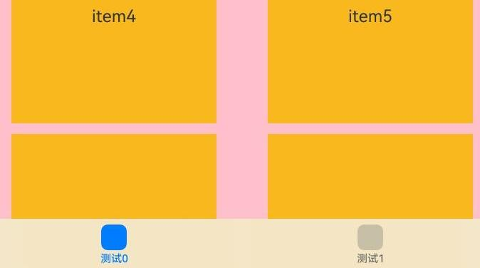

# ArkUI子系统Changelog

## cl.arkui.1 在字节码HAR中通过router.getState()获取的path内容变更

**访问级别**

公开接口

**变更原因**

当开发者使用中间码HAR升级到字节码HAR时，通过router.getState()方法获取的path信息不正确。

**变更影响**

该变更为不兼容变更。

此不兼容变更的前提是：源码HAR或者中间码HAR升级为字节码HAR时产生的不兼容。

不兼容场景示例1：

变更前：

当开发者使用的是源码HAR时使用router.getState()方法获取的是**相对路径**。


通过router.getState()方法获取的path信息为"../../../../library/src/main/ets/components/"。

当开发者把源码HAR升级为字节码HAR时，通过router.getState()方法获取的path信息为"/\_\_harDefaultPagePath\_\_"，不能获取正确的name和path值。


变更后：

当开发者把源码HAR升级为字节码HAR时使用router.getState()方法获取的是**绝对路径**。


通过router.getState()方法获取的path信息为"library/src/main/ets/components/"。

不兼容场景示例2：

变更前：

当开发者使用的是中间码HAR时使用router.getState()方法获取的是**相对路径**。


通过router.getState()方法获取的path信息为"../../../../ + 哈希值 + library/src/main/ets/components/"。

当开发者把中间码HAR升级为字节码HAR时，通过router.getState()方法获取的path信息为"/\_\_harDefaultPagePath\_\_"，不能获取正确的name和path值。


变更后：

当开发者把中间码HAR升级为字节码HAR时使用router.getState()方法获取的是**绝对路径**。


通过router.getState()方法获取的path信息为"library/src/main/ets/components/"。

**起始API Level**

API 10

**变更发生版本**

从OpenHarmony SDK 5.0.0.49开始

**变更的接口/组件**

router.getState()

**适配指导**

当开发者在代码中有通过router.getState()使用path值时，需要根据获取到的内容进行整改。

## cl.arkui.2 禁止在转场动画过程中，更新消失节点的属性。

**访问级别**

公开接口

**变更原因**

在转场动画过程中改变正在消失节点的属性，可能造成数据访问异常，产生crash。例如，动画过程中将data置为undefined，Text组件增加默认转场不会立即被删除，在更新状态时，数据访问异常产生crash。因此，需要变更为在转场动画过程中，禁止更新消失节点的属性。

```
class MyData {
  str: string;
  constructor(str: string) {
    this.str = str;
  }
}
@State data: MyData|undefined = new MyData("branch");
if (this.data) {
  // 对于删除时增加的默认转场，会延长组件生命周期。Text没有立即被删除，而是等转场动画结束后才被删除
  Text(this.data.str)
}
Button("play with animation")
  .onClick(()=>{
    animateTo({},()=>{
      if (this.data) {
        // 在动画过程中，会给if下的第一层组件增加默认转场
        this.data = undefined;
      }
    }) 
  })

```

**变更影响**

该变更为不兼容变更。

变更前：转场动画过程中，正在消失的节点可以更新属性。

变更后：转场动画过程中，禁止消失的节点更新属性。

**起始API Level**

API 10

**变更发生版本**

从OpenHarmony 5.0.0.49 版本开始。

**变更的接口/组件**

transition属性

**适配指导**

如果要对转场动画过程中，消失的节点进行属性更新，应当在节点下树之前产生，而不是在消失过程中。

示例：

```
@Entry
@Component
struct Index {
  @State flag: Boolean = true;
  @State color: Color = Color.Red;
  build() {
    Column(){
      if (this.flag) {
        Text('abc')
          .transition(TransitionEffect.OPACITY)
          .backgroundColor(this.color)
      }

      Button("play with animation")
        .onClick(()=>{
          // 变更前，消失过程中的节点可以更新属性，Text组件的颜色在消失过程中变为蓝色
          // animateTo({},()=>{
          //   this.flag ? this.color = Color.Blue : this.color = Color.Red;
          //   this.flag = !this.flag;
          // })

          // 变更后，消失过程中的节点无法更新属性，Text组件的颜色在消失过程中一直为红色
          // 如果需要更新属性，使Text组件的颜色在消失过程中变为蓝色，应当在节点下树之前更新
          animateTo({},()=>{
            this.flag ? this.color = Color.Blue : this.color = Color.Red;
          }) // 节点下树前改变颜色属性
          animateTo({},()=>{
            this.flag = !this.flag;
          })
        })
        .width("100%")
        .padding(10)
    }
  }
}
```

## cl.arkui.3 Tabs组件barOverlap接口默认效果变更

**访问级别**

公开接口

**变更原因**

优化Tabs组件barOverlap属性设置为true时，TabBar的模糊效果和渲染性能。

**变更影响**

该变更为不兼容变更。

变更前：设置barOverlap属性为true时，TabBar默认背景色修改为'#F2F1F3F5'并添加模糊效果。

变更后：设置barOverlap属性为true时，TabBar默认模糊材质的BlurStyle值修改为'BlurStyle.COMPONENT_THICK'。

| 变更前 | 变更后 |
|------ |--------|
|||

**起始API Level**

API 10

**变更发生版本**

从OpenHarmony 5.0.0.49 版本开始。

**变更的接口/组件**

barOverlap接口

**适配指导**

当barOverlap设置为true时，开发者若期望无模糊效果，设置barBackgroundBlurStyle为BlurStyle.NONE。示例如下：

```ts
@Entry
@Component
struct barHeightTest {
  @State arr: number[] = [0, 1, 2, 3, 4, 5, 6, 7, 8, 9]
  build() {
    Column() {
      Tabs({ barPosition: BarPosition.End }) {
        TabContent() {
          Column() {
            List({ space: 10 }) {
              ForEach(this.arr, (item: number) => {
                ListItem() {
                  Text("item" + item).width('80%').height(200).fontSize(16).textAlign(TextAlign.Center).backgroundColor('#fff8b81e')
                }
              }, (item: string) => item)
            }.width('100%').height('100%')
            .lanes(2).alignListItem(ListItemAlign.Center)
          }.width('100%').height('100%')
          .backgroundColor(Color.Pink)
        }
        .tabBar(new BottomTabBarStyle($r('sys.media.ohos_icon_mask_svg'), "测试0"))

        TabContent() {
          Column() {
            List({ space: 10 }) {
              ForEach(this.arr, (item: number) => {
                ListItem() {
                  Text("item" + item).width('80%').height(200).fontSize(16).textAlign(TextAlign.Center).backgroundColor('#fff8b81e')
                }
              }, (item: string) => item)
            }.width('100%').height('100%')
            .lanes(2).alignListItem(ListItemAlign.Center)
          }.width('100%').height('100%')
          .backgroundColor(Color.Blue)
        }
        .tabBar(new BottomTabBarStyle($r('sys.media.ohos_icon_mask_svg'), "测试1"))
      }
      .barOverlap(true)
      .barBackgroundBlurStyle(BlurStyle.NONE) // 关闭TabBar模糊效果
    }
  }
}
```
