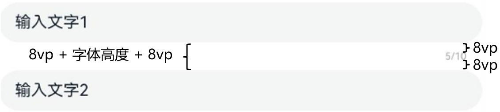

# ArkUI子系统Changelog

## cl.arkui.1 TextInput组件在非标准字体场景下showCounter接口布局变更

**访问级别**

公开接口

**变更原因**

在大字体时，showCounter所属的TextInput组件的下侧Margin空间不足。

**变更影响**

该变更为不兼容变更。

变更前：在设置showCounter后，TextInput组件的下侧Margin大小为固定的22vp，showCounter的垂直偏移量为字体高度。

变更后：在设置showCounter后，标准字体下，TextInput组件的下侧Margin以及垂直偏移量和变更前保持一致。非标准字体设置下，TextInput组件的下侧Margin大小为16vp加上showCounter的字体高度，垂直偏移量为8vp。

设置非标准字体时，变更前后对比效果如下图所示：
| 变更前 | 变更后 |
|---------|---------|
|||

示例：

```ts
@Entry
@Component
struct Index {
  @State message: string = 'Hello World';

  build() {
    Column() {
      TextInput({text: "输入文字1"})
        .showCounter(true)
        .maxLength(10)
      TextInput({text: "输入文字2"})
    }
    .height('100%')
    .width('100%')
  }
}
```

**起始API Level**

API 11

**变更发生版本**

从OpenHarmony SDK 5.0.0.50开始。

**变更的接口/组件**

TextInput组件showCounter接口。

**适配指导**

默认效果变更，无需适配，但应注意变更后的默认效果是否符合开发者预期，如不符合则应自定义修改效果控制变量以达到预期。