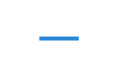

# ArkUI子系统Changelog

## cl.arkui.1 RichEditor（富文本）onDidChange接口变更

**访问级别**

公开接口

**变更原因**

在用户执行删除操作，但实际未删除内容时（例如在aboutToDelete接口中拦截了删除操作），也回调了OnDidChange接口，不符合接口行为定义。

**变更影响**

该变更为不兼容变更。

变更前：
在用户执行删除操作，但实际未删除内容时回调了OnDidChange接口。

变更后：
在用户执行删除操作，但实际未删除内容时不回调OnDidChange接口。

**起始API Level**

API 12

**变更发生版本**

从OpenHarmony SDK 5.0.0.52开始。

**变更的接口/组件**

RichEditor

**适配指导**

默认行为变更，无需适配，但应注意变更后的行为是否对整体应用逻辑产生影响。

## cl.arkui.2 RichEditor（富文本）删除完成后光标位置变更

**访问级别**

公开接口

**变更原因**

开发者在aboutToDelete回调中设置光标/选中区后，删除完成后，光标位置异常。

**变更影响**

该变更为不兼容变更。

变更前：

1、开发者在aboutToDelete回调中设置光标，删除完成后，光标位置为开发者设置的光标位置。

2、开发者在aboutToDelete回调中设置选中区，删除完成后，光标位置为开发者设置的选中区的右边界。

变更后：
开发者在aboutToDelete回调中设置光标/选中区，删除完成后，光标位置为被删除内容的起始索引位置。

**起始API Level**

API 12

**变更发生版本**

从OpenHarmony SDK 5.0.0.52开始。

**变更的接口/组件**

RichEditor

**适配指导**

默认行为变更，无需适配，但应注意变更后的行为是否对整体应用逻辑产生影响。


## cl.arkui.3 RichEditor（富文本）从组件外拖入内容onWillChange、onDidChange回调变更

**访问级别**

公开接口

**变更原因**

从组件外拖入内容时，onWillChange、onDidChange多回调了一次相同的内容，不符合实际文本变化情况。

**变更影响**

该变更为不兼容变更。

变更前：
从组件外拖入内容时，onWillChange、onDidChange回调了两次同样的内容。

变更后：
从组件外拖入时，onWillChange、onDidChange回调一次。

**起始API Level**

API 12

**变更发生版本**

从OpenHarmony SDK 5.0.0.52开始。

**变更的接口/组件**

RichEditor

**适配指导**

默认行为变更，无需适配，但应注意变更后的行为是否对整体应用逻辑产生影响。

## cl.arkui.4 RichEditor（富文本）onWillChange接口返回值变更

**访问级别**

公开接口

**变更原因**

在添加Symbol时onWillChange接口返回值中缺少了SymbolId。

**变更影响**

该变更为不兼容变更。

变更前：
在使用addSymbolSpan接口添加symbol时，onWillChange接口返回的RichEditorTextSpanResult中的value字段为空。

变更后：
在使用addSymbolSpan接口添加symbol时，onWillChange接口返回的RichEditorTextSpanResult中的value字段返回SymboId。

**起始API Level**

API 12

**变更发生版本**

从OpenHarmony SDK 5.0.0.52开始。

**变更的接口/组件**

RichEditor

**适配指导**

默认行为变更，无需适配，但应注意变更后的行为是否对整体应用逻辑产生影响。

## cl.arkui.5 RichEditor（富文本）TypingStyle默认字体大小变更

**访问级别**

公开接口

**变更原因**

开发者在设置TypingStyle但是没有设置其中的字体大小时，TypingStyle的默认字体大小为14px，显示效果异常。

**变更影响**

该变更为不兼容变更。

变更前：
开发者使用setTypingStyle接口设置TypingStyle但是没有设置其中的字体大小时，输入新的内容，新输入的文本字体大小为14px。

变更后：
开发者使用setTypingStyle接口设置TypingStyle但是没有设置其中的字体大小时，输入新的内容，新输入的文本字体大小为16fp。

**起始API Level**

API 12

**变更发生版本**

从OpenHarmony SDK 5.0.0.52开始。

**变更的接口/组件**

RichEditor

**适配指导**

默认行为变更，无需适配，但应注意变更后的行为是否对整体应用逻辑产生影响。

## cl.arkui.6 鼠标按键处理行为变更

**访问级别**

公开接口

**变更原因**

在开发者为组件配置鼠标事件后，若在组件区域内按下鼠标非左键并拖拽至组件区域外释放，此时将无法接收到按键释放事件，这可能导致事件配对失败，进而引发应用程序行为异常。此变更确保开发者能够接收到匹配的按键按下与释放事件。

**变更影响**

该变更为不兼容变更。

变更前：在开发者为组件配置了鼠标事件后，如果在组件区域内按下鼠标非左键，并将鼠标移动至组件区域外再释放按键，此时将无法接收到按键释放事件。

变更后：在开发者为组件配置了鼠标事件后，如果在组件区域内按下鼠标非左键，并将鼠标移动至组件区域外再释放按键，此时可以接收到按键释放事件。

**起始API Level**

API 8

**变更发生版本**

从OpenHarmony SDK 5.0.0.52开始。

**变更的接口/组件**

ArkTS的onMouse接口和Native的OH_NativeXComponent_GetMouseEvent接口。

**适配指导**

默认行为变更，无需适配，但应注意变更后的行为是否对整体应用逻辑产生影响。

## cl.arkui.7 动画接口在播放次数为无限循环时的行为变更

**访问级别**

公开接口

**变更原因**

非动画的闭包函数修改状态变量，存在被带入无限循环动画的风险，产生预期外的无限循环动画且无法停止。

**变更影响**

该变更为不兼容变更。

变更前：在调用无限循环动画接口（例如：无限循环的animateTo）时，首次布局过程中触发的同步回调里所做的修改，会被纳入无限循环动画中，从而产生多余的动画。

变更后：在调用无限循环动画接口（例如：无限循环的animateTo）时，首次布局过程中触发的同步回调里所做的修改，系统至多做2次额外刷新保护，避免动画前的同步回调被纳入无限循环动画中，对于2次额外刷新仍不能保护住的同步回调，和原行为一致也会产生无限循环动画。

**起始API Level**

API 7（animateTo）

API 12（animateToImmediately）

API 11（UIContext.keyframeAnimateTo）

API 11（UIContext.animateTo）

API 12（UIContext.animateToImmediately）

**变更发生版本**

从OpenHarmony SDK 5.0.0.52开始。

**变更的接口/组件**

1、animateTo；

2、animateToImmediately；

3、UIContext.keyframeAnimateTo；

4、UIContext.animateTo；

5、UIContext.animateToImmediately；

**适配指导**

为了创建无限循环的动画，必须明确地将修改操作置于动画接口（例如：无限循环的animateTo）的闭包函数内。

animateTo适配前：

```ts
@Entry
@Component
struct Example {
  @State rotateAngle: number = 0
  @State wid: number = 100
  @State color: Color = Color.Red

  build() {
    Column() {
      Column()
        .size({width: 100, height: 100})
        .backgroundColor(this.color)
      Button('animate')
        .margin(50)
        .width(this.wid)
        .rotate({ x: 0, y: 0, z: 1, angle: this.rotateAngle })
        .onSizeChange((oldValue: SizeOptions, newValue: SizeOptions)=>{
          // animateTo前修改wid时的布局同步的触发了onSizeChange事件，也会被带入无限循环动画中
          // 产生背景色的无限循环动画
          if (Number(newValue.width) >= 150) {
            this.color = Color.Blue;
          } else {
            this.color = Color.Red;
          }
        })
        .onClick(()=>{
          this.wid = 200;
          animateTo({
            iterations: -1, // 设置-1表示动画无限循环
            playMode: PlayMode.Alternate,
          }, () => {
            this.rotateAngle = 90
          })
        })
    }.width('100%').margin({ top: 5 })
  }
}
```

animateTo适配后：

```ts
@Entry
@Component
struct Example {
  @State rotateAngle: number = 0
  @State wid: number = 100
  @State color: Color = Color.Red

  build() {
    Column() {
      Column()
        .size({width: 100, height: 100})
        .backgroundColor(this.color)
      Button('animate')
        .margin(50)
        .width(this.wid)
        .rotate({ x: 0, y: 0, z: 1, angle: this.rotateAngle })
        .onSizeChange((oldValue: SizeOptions, newValue: SizeOptions)=>{
          // onSizeChange为同步回调，最好不在同步回调中直接修改状态变量。  
        })
        .onClick(()=>{
          this.wid = 200;
          // 如果不需要产生color的动画则在动画外直接修改color，this.color = Color.Blue，而不是在同步回调中
          animateTo({
            iterations: -1, // 设置-1表示动画无限循环
            playMode: PlayMode.Alternate,
          }, () => {
            this.rotateAngle = 90
            // 如果需要产生color的动画则在此处加上this.color = Color.Blue，将color的改变放在动画闭包中
          })
        })
    }.width('100%').margin({ top: 5 })
  }
}
```

## cl.arkui.8 CanvasRenderingContext2D和Path2D未指定起始点时由默认(0, 0)为绘制起点变更为前两位参数作为绘制起点

**访问级别**

公开接口

**变更原因**

CanvasRenderingContext2D绘制路径时，如果没有使用moveTo方法指定路径起始点，会默认从画布左上角(0,0)开始绘制路径，与W3C行为不一致。

**变更影响**

该变更为不兼容变更。

变更前：CanvasRenderingContext2D绘制路径时，如果没有使用moveTo方法指定路径起始点，会默认从画布左上角(0,0)开始绘制路径。

变更后：CanvasRenderingContext2D绘制路径时，如果没有使用moveTo方法指定路径起始点，会以第一个有效的路径绘制方法的前两位number参数作为路径起始点。

| 接口 | 变更前 | 变更后 |
|---------|---------|---------|
| lineTo |||
| arcTo |||
| bezierCurveTo |||
| quadraticCurveTo |||

**起始API Level**

API 9

**变更发生版本**

从OpenHarmony 5.0.0.52 版本开始。

**变更的接口/组件**

CanvasRenderingContext2D的lineTo, arcTo, bezierCurveTo, quadraticCurveTo接口

Path2D的lineTo, arcTo, bezierCurveTo, quadraticCurveTo接口

**适配指导**

使用moveTo方法传入有效的参数指定路径起始点。

```ts
// xxx.ets
@Entry
@Component
struct LineTo {
  private settings: RenderingContextSettings = new RenderingContextSettings(true)
  private context: CanvasRenderingContext2D = new CanvasRenderingContext2D(this.settings)

  build() {
    Flex({ direction: FlexDirection.Column, alignItems: ItemAlign.Center, justifyContent: FlexAlign.Center }) {
      Canvas(this.context)
        .width('100%')
        .height('100%')
        .backgroundColor('#ffff00')
        .onReady(() =>{
          this.context.beginPath()
          this.context.moveTo(10, 10)
          this.context.lineTo(280, 160)
          this.context.stroke()
        })
    }
    .width('100%')
    .height('100%')
  }
}
```


## cl.arkui.9 CanvasRenderingContext2D方法传NaN和Infinity值后执行的其他绘制方法由不绘制变更为正常绘制

**访问级别**

公开接口

**变更原因**

CanvasRenderingContext2D绘制路径时，若存在方法的number类型参数传入NaN或Infinity值，部分内容无法绘制或绘制异常，与Html5的行为不一致。

**变更影响**

该变更为不兼容变更。

变更前：绘制路径时，若存在路径方法的number类型参数传入NaN或Infinity值，整个路径无法绘制；对画布进行缩放、旋转、移动或使用变换矩阵进行图形变化时，number类型参数传入NaN或Infinity值，后面执行的方法无法绘制。

变更后：绘制路径时，传入NaN或Infinity值的方法不做处理，根据有效的路径参数进行绘制；对画布进行缩放、旋转、移动或使用变换矩阵进行图形变化时，number类型参数传入NaN或Infinity值，其他传入有效参数的方法正常绘制。

具体接口的差异如下：

| 方法 | 变更前 | 变更后 |
|---------|---------|---------|
|moveTo|任一路径绘制方法的number类型参数传入NaN或Infinity值时，整个路径无法绘制。|路径绘制方法的number类型参数传入NaN或Infinity值时，该方法不生效。其他传入有效参数的路径绘制方法正常绘制。|
|lineTo|任一路径绘制方法的number类型参数传入NaN或Infinity值时，整个路径无法绘制。|路径绘制方法的number类型参数传入NaN或Infinity值时，该方法不生效。其他传入有效参数的路径绘制方法正常绘制。|
|bezierCurveTo|任一路径绘制方法的number类型参数传入NaN或Infinity值时，整个路径无法绘制。|路径绘制方法的number类型参数传入NaN或Infinity值时，该方法不生效。其他传入有效参数的路径绘制方法正常绘制。|
|quadraticCurveTo|任一路径绘制方法的number类型参数传入NaN或Infinity值时，整个路径无法绘制。|路径绘制方法的number类型参数传入NaN或Infinity值时，该方法不生效。其他传入有效参数的路径绘制方法正常绘制。|
|arc|任一路径绘制方法的number类型参数传入NaN或Infinity值时，整个路径无法绘制。|路径绘制方法的number类型参数传入NaN或Infinity值时，该方法不生效。其他传入有效参数的路径绘制方法正常绘制。|
|ellipse|任一路径绘制方法的number类型参数传入NaN或Infinity值时，整个路径无法绘制。|路径绘制方法的number类型参数传入NaN或Infinity值时，该方法不生效。其他传入有效参数的路径绘制方法正常绘制。|
|rect|任一路径绘制方法的number类型参数传入NaN或Infinity值时，整个路径无法绘制。|路径绘制方法的number类型参数传入NaN或Infinity值时，该方法不生效。其他传入有效参数的路径绘制方法正常绘制。|
|arcTo|任一路径绘制方法的number类型参数传入NaN或Infinity值时，整个路径无法绘制。|路径绘制方法的number类型参数传入NaN或Infinity值时，该方法不生效。其他传入有效参数的路径绘制方法正常绘制。|
|globalAlpha|绘制方法的number类型参数传入NaN或Infinity值，在该方法后执行的绘制方法无法绘制。|number类型参数传入NaN或Infinity值参数时该方法不生效。其他传入有效参数的绘制方法正常绘制。|
|rotate|绘制方法的number类型参数传入NaN或Infinity值，在该方法后执行的绘制方法无法绘制。|number类型参数传入NaN或Infinity值参数时该方法不生效。其他传入有效参数的绘制方法正常绘制。|
|scale|绘制方法的number类型参数传入NaN或Infinity值，在该方法后执行的绘制方法无法绘制。|number类型参数传入NaN或Infinity值参数时该方法不生效。其他传入有效参数的绘制方法正常绘制。|
|transform|绘制方法的number类型参数传入NaN或Infinity值，在该方法后执行的绘制方法无法绘制。|number类型参数传入NaN或Infinity值参数时该方法不生效。其他传入有效参数的绘制方法正常绘制。|
|setTransform|绘制方法的number类型参数传入NaN或Infinity值，在该方法后执行的绘制方法无法绘制。|number类型参数传入NaN或Infinity值参数时该方法不生效。其他传入有效参数的绘制方法正常绘制。|
|translate|绘制方法的number类型参数传入NaN或Infinity值，在该方法后执行的绘制方法无法绘制。|number类型参数传入NaN或Infinity值参数时该方法不生效。其他传入有效参数的绘制方法正常绘制。|
|lineDashOffset|设置了虚线样式的线条绘制出来是实线。|设置了虚线样式的线条绘制出来是虚线。|

**起始API Level**

API 9

**变更发生版本**

从OpenHarmony 5.0.0.52 版本开始。

**变更的接口/组件**

CanvasRenderingContext2D

OffscreenCanvasRenderingContext2D

Path2D

**适配指导**

默认行为变更，无需适配，但应注意变更后的行为是否对整体应用逻辑产生影响。
