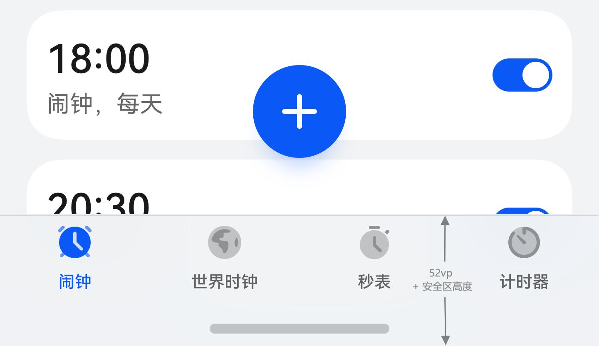
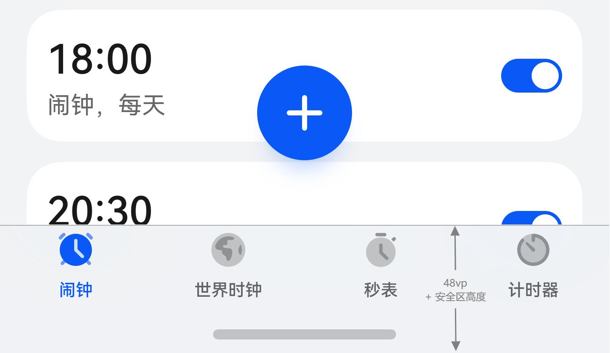

# ArkUI子系统Changelog

## cl.arkui.1 Tabs组件底部页签默认高度由52vp变更为48vp

**访问级别**

公开接口

**变更原因**

Tabs组件底部页签默认高度由52vp调整到48vp，优化用户体验。

**变更影响**

该变更为不兼容性变更。

变更前：设置BottomTabBarStyle样式且vertical属性为false时，barHeight的默认值为52vp。

变更后：设置BottomTabBarStyle样式且vertical属性为false时，barHeight的默认值为48vp。

|               变更前                |              变更后               |
| :---------------------------------: | :-------------------------------: |
|  |  |

**起始API Level**

11

**变更发生版本**

从OpenHarmony SDK 5.0.0.53开始

**变更的接口/组件**

barHeight

**适配指导**

若发现组件高度变化导致界面内容出现留白，可通过修改内容区高度或自适应内容区高度。

若组件高度发生变化，开发者期望保持原有高度样式。示例如下：

```
@Entry
@Component
struct barHeightTest {
  build() {
    Column() {
      Tabs() {
        TabContent() {
          Column().width('100%').width('100%').height('100%').backgroundColor(Color.Pink)
        }
        .tabBar(new BottomTabBarStyle($r('sys.media.ohos_app_icon'), "Pink"))

        TabContent() {
          Column().width('100%').width('100%').height('100%').backgroundColor(Color.Green)
        }
        .tabBar(new BottomTabBarStyle($r('sys.media.ohos_app_icon'), "Green"))
      }
      .barHeight(52)
    }
  }
}
```

## cl.arkui.2 轴事件正确分发到XComponent组件变更

**访问级别**

其他

**变更原因**

轴事件分发错误，开发者如果改了组件z序，显示，隐藏后不能正确分发到挂载轴事件的XComponent组件上。

**变更影响**

该变更为兼容性变更。

变更前：开发者改变组件z序，不能正确分发到挂载轴事件的XComponent组件上。

变更后：开发者改变组件z序，能正确分发到挂载轴事件的XComponent组件上。

**起始API Level**

11

**变更发生版本**

从OpenHarmony SDK 5.0.0.53开始

**变更的接口/组件**

不涉及

**适配指导**

默认行为变更，无需适配，但应注意变更后的行为是否对整体应用逻辑产生影响。