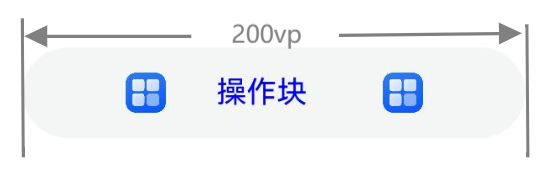
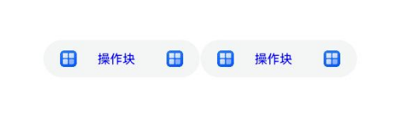

# ArkUI子系统Changelog

## cl.arkui.1 废弃gridSpan和gridOffset属性
**访问级别**

公开接口

**废弃原因**

gridSpan和gridOffset属性仅设置在gridContaier的子组件上有效，gridContainer组件已废弃。

**废弃影响**

该变更为接口废弃，开发者需使用替代接口。

**废弃发生版本**

从OpenHarmony SDK 5.0.0.56开始。

**废弃的接口/组件**

|           废弃接口            |                  替代接口                  |
| :---------------------------: | :----------------------------------------: |
|  gridSpan(value: number): T;  |  GridCol(option?: GridColOptions)中的span  |
| gridOffset(value: number): T; | GridCol(option?: GridColOptions)中的offset |

**适配指导**

废弃前使用gridSpan、gridOffset属性的栅格。

```ts
// xxx.ets
@Entry
@Component
struct GridContainerExample1 {
  build() {
    Column() {
      Text('gridSpan,gridOffset').fontSize(15).fontColor(0xCCCCCC).width('90%')
      GridContainer() {
        Row() {
          Row() {
            Text('Left').fontSize(25)
          }
          .gridSpan(1)
          .height("100%")
          .backgroundColor(0x66bbb2cb)

          Row() {
            Text('Center').fontSize(25)
          }
          .gridSpan(2)
          .gridOffset(1)
          .height("100%")
          .backgroundColor(0x66b6c5d1)

          Row() {
            Text('Right').fontSize(25)
          }
          .gridSpan(1)
          .gridOffset(3)
          .height("100%")
          .backgroundColor(0x66bbb2cb)
        }.height(200)
      }
    }
  }
}
```

使用GridRow容器，并且子组件为GridCol。GridCol构造中设置span（对应废弃的gridSpan）、offset（对应废弃的gridOffset）属性的栅格。
```ts
// xxx.ets
@Entry
@Component
struct GridRowExample {
  @State bgColors: Color[] = [Color.Red, Color.Orange, Color.Yellow, Color.Green, Color.Pink, Color.Grey, Color.Blue, Color.Brown]
  @State currentBp: string = 'unknown'

  build() {
    Column() {
      GridRow({
        columns: 5,
        gutter: { x: 5, y: 10 },
        breakpoints: { value: ["400vp", "600vp", "800vp"],
          reference: BreakpointsReference.WindowSize },
        direction: GridRowDirection.Row
      }) {
          GridCol({ span: { xs: 1, sm: 2, md: 3, lg: 4 }, offset: 0, order: 0 }) {
            Text('Left').fontSize(25)
          }.borderColor(color).borderWidth(2)
          GridCol({ span: { xs: 1, sm: 2, md: 3, lg: 4 }, offset: 1, order: 0 }) {
            TText('Center').fontSize(25)
          }.borderColor(color).borderWidth(2)
          GridCol({ span: { xs: 1, sm: 2, md: 3, lg: 4 }, offset: 2, order: 0 }) {
             Text('Right').fontSize(25)
          }.borderColor(color).borderWidth(2)
      }.width("100%").height("100%")
      .onBreakpointChange((breakpoint) => {
        this.currentBp = breakpoint
      })
    }.width('80%').margin({ left: 10, top: 5, bottom: 5 }).height(200)
    .border({ color: '#880606', width: 2 })
  }
}
```

## cl.arkui.2 Chip与ChipGroup组件布局重构

**访问级别**

公开接口

**变更原因**

原来的布局逻辑未考虑像素取整情况，导致部分界面显示异常。因此发起布局重构，重构后会因为像素取整导致组件的整体宽度可能偏差1像素单位。

**变更影响**

该变更为不兼容变更。

| 变更前                                                                     | 变更后                                                                 |
| -------------------------------------------------------------------------- | ---------------------------------------------------------------------- |
| 组件布局过程中不会进行像素取整 <br> | 组件布局过程中会进行像素取整<br> |

变更后可能影响自动化UI测试结果，产生像素级偏差。

**起始API Level**

API 12

**变更发生版本**

从OpenHarmony SDK 5.0.0.56开始。

**变更的接口/组件**

Chip与ChipGroup组件。

**适配指导**

默认效果变更，无需适配，但应注意变更后的默认效果是否符合开发者预期，如不符合则应自定义修改效果控制变量以达到预期。

## cl.arkui.3 router转场动画过程中，启用事件响应，并增加默认转场动画的拖尾效果

**访问级别**

公开接口

**变更原因**

router默认转场动效无拖尾效果，导致应用动画最后一帧出现跳变，影响用户体验。变更后，router支持转场动画打断和接续，在动画转场过程中可响应事件。

**变更影响**

该变更为不兼容变更。

运行以下示例：

```js
@Entry
@Component
struct TestPage {
  isAnimation: boolean = false;

  build() {
    Row() {
      Column() {
        TextInput().id('textInput')
      }
      .width('100%')
    }
    .height('100%')
    .onAppear(() => {
      if (this.isAnimation) {
        setTimeout(() => {
          focusControl.requestFocus('textInput');
        }, 5)
      } else {
        setTimeout(() => {
          focusControl.requestFocus('textInput')
        }, 500)
      }
    })
  }
}
```

变更前：

- router转场过程中请求焦点，必须要按照示例代码的形式启动定时器延迟到动画结束才能请求成功。router转场过程中无法点击、侧滑，必须在动画结束后才能操作对应页面。

- router转场时间为400ms。

变更后：

- 页面跳转后即可请求焦点，无需添加定时器延迟操作请求。这可能会导致开发者使用定时器请求焦点，用户点击输入组件后，出现焦点跳变。

- router转场时间变成600ms。

**起始API Level**

API Version 8

**发生变更版本**

从OpenHarmony SDK 5.0.0.56开始。

**变更的接口/组件**

router.pushUrl；router.back；router.pushNamedRoute

**适配指导**

1. 动画时长变更，无需适配。

2. 针对焦点请求，在目标跳转页面中直接请求对应的焦点即可，可参照如下示例代码：
```js
@Entry
@Component
struct TestPage {

  build() {
    Row() {
      Column() {
        TextInput().id('textInput')
      }
      .width('100%')
    }
    .height('100%')
    .onAppear(() => {
      focusControl.requestFocus('textInput');
    })
  }
}
```

## cl.arkui.4 RichEditor（富文本）在光标处于文本起始位置情况时向前删除空文本onWillChange回调变更

**访问级别**

公开接口

**变更原因**

RichEditorController构造的富文本：光标位于文本起始位置时向前删除，触发onWillChange回调范围是[-1, -1]，不符合接口定义。
RichEditorStyledStringController构造的富文本：光标位于文本起始位置时向前删除，触发onWillChange回调范围是[0, 1]，不符合接口定义。

**变更影响**

该变更为不兼容变更。

| 组件                                | 变更前                                  | 变更后                                               |
|------------------------------------ | ---------------------------------------|---------------------------------------|
|RichEditorController构造的富文本| 光标位于文本起始位置时向前删除，触发onWillChange回调范围是[-1, -1]。 | 光标位于文本起始位置时向前删除，触发onWillChange回调范围是[0, 0]。|
|RichEditorStyledStringController构造的富文本| 光标位于文本起始位置时向前删除，触发onWillChange回调范围是[0, 1]。| 光标位于文本起始位置时向前删除，触发onWillChange回调范围是[0, 0]。|

**起始API Level**

API 12。

**变更发生版本**

从OpenHarmony SDK 5.0.0.56开始。

**变更的接口/组件**

RichEditor

**适配指导**

默认行为变更，无需适配，但应注意变更后的行为是否对整体应用逻辑产生影响。