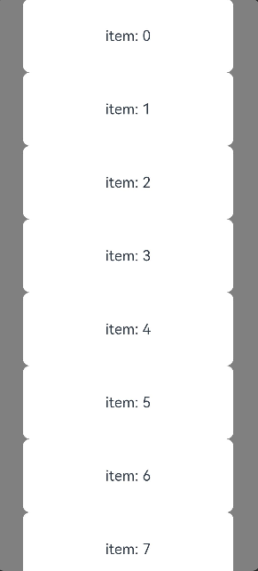
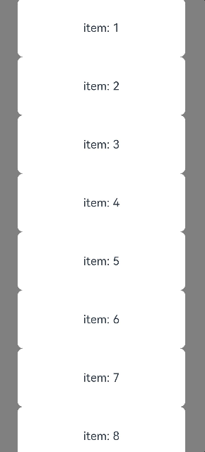
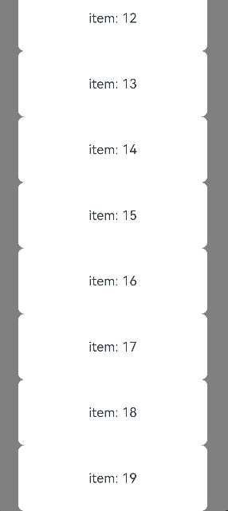

# ArkUI子系统Changelog

## cl.arkui.1 List组件首次创建布局时，Scroller控制器的跳转方法优先级变更为高于initialIndex的优先级

**访问级别**

公开接口

**变更原因**

initialIndex仅支持设定起始index，并默认将列表头部对齐，这使得开发者无法自定义对齐策略。scrollToIndex允许指定index与对齐方式，然而其效果会被 initialIndex覆盖。因此，需要提升scrollToIndex的优先级，使其高于initialIndex。这样一来，在组件初次布局时，如果开发者希望设定起始index并同时指定对齐方式，即可通过使用scrollToIndex来达成目标。

**变更影响**

该变更为不兼容变更。

场景1：List设置initialIndex为0 (默认也是0)，并在创建后，首次布局前（例如onAppear, onAttach回调时）调用scrollToIndex(1)。

| 变更前 | 变更后 |
|------ |--------|
|List首次布局将从index为0的ListItem开始布局。 |List首次布局将从index为1的ListItem开始布局。 |

场景2：List设置initialIndex为0 (默认也是0)，并在创建后，首次布局前（例如onAppear, onAttach回调时）调用scrollEdge(Edge.Bottom)。

| 变更前 | 变更后 |
|------ |--------|
|List首次布局将展示在顶部，即index为0的ListItem处于顶部。 |List首次布局将展示在底部，即index为最大值的ListItem处于底部。 |

**起始API Level**

API 7

**变更发生版本**

从OpenHarmony 5.0.0.57开始。

**变更的接口/组件**

List组件的initialIndex接口和Scroller控制器的跳转接口（scrollToIndex、scrollToItemInGroup和scrollEdge）。

**适配指导**

需要对使用List组件的页面进行排查，检查是否在onAppear或其他List组件首次布局之前的阶段，同时设置了initialIndex并调用了scrollToIndex,、scrollToItemInGroup或scrollEdge接口。在变更后，initialIndex的生效优先级将低于scrollToIndex、scrollToItemInGroup或scrollEdge的优先级。

## cl.arkui.2 Canvas使用toDataURL接口生成图片，对于带有透明度的图片，创建为“image/png”或“image/webp”格式时，其效果可能会发生变更

**访问级别**

公开接口

**变更原因**

变更前效果未达到预期。

**变更影响**

该变更为不兼容变更。

变更前：Canvas使用toDataURL接口生成图片，对于带有透明度的图片，创建为“image/png”或“image/webp”格式时，带透明度部分会与黑色背景混合，效果与原图有色差。

变更后：Canvas使用toDataURL接口生成图片，对于带有透明度的图片，创建为“image/png”或“image/webp”格式时，变更为与原图一致。

|                   变更前                   |                 变更后                  |
| :----------------------------------------: | :-------------------------------------: |
|  |  |

**起始API Level**

API 8

**变更发生版本**

从OpenHarmony 5.0.0.57开始。

**变更的接口/组件**

Canvas组件的toDataURL接口。

**适配指导**

默认效果变更，无需适配，但应注意变更后的效果是否符合预期。