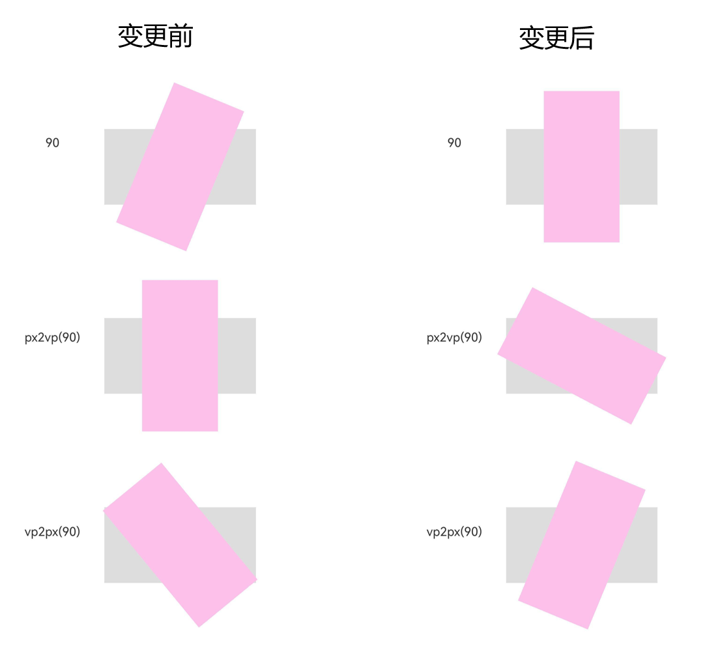

# ArkUI子系统Changelog

## cl.arkui.1 RenderNode的rotation接口角度单位从vp变为度

**访问级别**

公开接口

**变更原因**

用户使用RenderNode的rotation接口时，传入的默认角度单位是vp，这不是正常规格的角度单位，需要变更为度。

**变更影响**

该变更为不兼容变更。

变更前：角度单位为vp，需要经过px2vp单位转换才能转为角度。

变更后：角度单位为度，直接传入数值即可，无需单位转换。

不兼容场景：
当用户通过该接口设置RenderNode的旋转时，会出现不兼容情况; 例如：
```ts
import { FrameNode, NodeController, RenderNode, UIContext } from '@kit.ArkUI';

class MyNodeController extends NodeController {
  private rootNode: FrameNode | null = null;

  makeNode(uiContext: UIContext) {
    this.rootNode = new FrameNode(uiContext);

    // 直接传入90
    const renderNodeSrc = new RenderNode();
    renderNodeSrc.backgroundColor = 0xffdddddd;
    renderNodeSrc.frame = { x: 10, y: 110, width: 200, height: 100 };
    const renderNodeDst  = new RenderNode();
    renderNodeDst.backgroundColor = 0xfffcc0ea;
    renderNodeDst.frame = { x: 10, y: 110, width: 200, height: 100 };
    renderNodeDst.rotation = { x: 0, y: 0, z: 90 };

    // 传入px2vp(90)
    const renderNodeSrc1 = new RenderNode();
    renderNodeSrc1.backgroundColor = 0xffdddddd;
    renderNodeSrc1.frame = { x: 10, y: 360, width: 200, height: 100 };
    const renderNodeDst1  = new RenderNode();
    renderNodeDst1.backgroundColor = 0xfffcc0ea;
    renderNodeDst1.frame = { x: 10, y: 360, width: 200, height: 100 };
    renderNodeDst1.rotation = { x: 0, y: 0, z: px2vp(90) };

    // 传入vp2px(90)
    const renderNodeSrc2 = new RenderNode();
    renderNodeSrc2.backgroundColor = 0xffdddddd;
    renderNodeSrc2.frame = { x: 10, y: 610, width: 200, height: 100 };
    const renderNodeDst2  = new RenderNode();
    renderNodeDst2.backgroundColor = 0xfffcc0ea;
    renderNodeDst2.frame = { x: 10, y: 610, width: 200, height: 100 };
    renderNodeDst2.rotation = { x: 0, y: 0, z: vp2px(90) };

    const rootRenderNode = this.rootNode.getRenderNode();
    rootRenderNode?.appendChild(renderNodeSrc);
    rootRenderNode?.appendChild(renderNodeDst);
    rootRenderNode?.appendChild(renderNodeSrc1);
    rootRenderNode?.appendChild(renderNodeDst1);
    rootRenderNode?.appendChild(renderNodeSrc2);
    rootRenderNode?.appendChild(renderNodeDst2);

    return this.rootNode;
  }
}

@Entry
@Component
struct MyComponent {
  @State myNodeController: MyNodeController = new MyNodeController();

  build() {
    Row() {
      Column() {
        Text('90')
        Text('px2vp(90)')
        Text('vp2px(90)')
      }
      .justifyContent(FlexAlign.SpaceAround)
      .height('100%')
      .width('30%')
      NodeContainer(this.myNodeController)
        .height('100%')
        .width('70%')
    }
    .width('100%')
    .alignItems(VerticalAlign.Top)
  }
}
```



**起始API Level**

API 12

**变更发生版本**

从OpenHarmony SDK 5.0.0.57开始。

**变更的接口/组件**

RenderNode.d.ts文件rotation接口。

**适配指导**

```ts
// 变更前RenderNode的rotation接口的旋转角度单位为“vp”，变更后单位为“度”，若需保持变更前行为，使用vp2px进行单位转换即可。
renderNode.rotation = { x: 0, y: 0, z: 90 }; // 变更前
renderNode.rotation = { x: 0, y: 0, z: vp2px(90) }; // 变更后
```