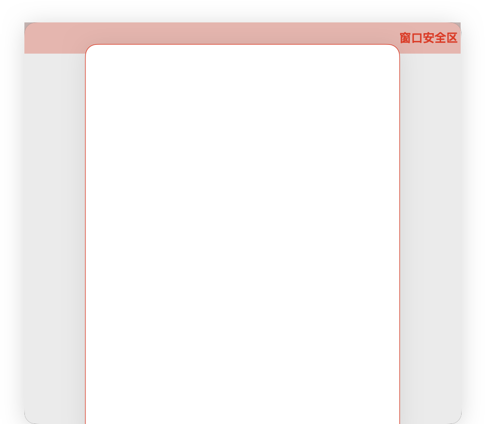

# ArkUI子系统Changelog

## cl.arkui.1  bindSheet在2in1设备中默认避让窗口安全区

**访问级别**

公开接口

**变更原因**

UX规格变更。

半模态内容需默认避让窗口安全区，否则会有重叠区域。

**变更影响**

该变更为不兼容变更。

当自由窗口标题栏类型为悬浮标题栏时，需要半模态面板默认避让标题安全区。

场景1：半模态居中弹窗样式

- 变更前：半模态居中弹窗样式的面板最大高度为窗口高度的90%。
- 变更后：API version 14及以后，该样式的最大高度为窗口高度 - (窗口安全区高度 + 安全间距) * 2。

| 变更前 | 变更后 |
|------ |--------|
|||

场景2：半模态底部弹窗样式

- 变更前：半模态底部弹窗样式的面板最大高度为窗口高度 - 8vp。
- 变更后：API version 14及以后，该样式的最大高度为窗口高度 - (窗口安全区高度 + 安全间距)。

| 变更前 | 变更后 |
|------ |--------|
|||

**起始API Level**

11

**变更发生版本**

从OpenHarmony SDK 5.0.0.58 版本开始。

**变更的接口/组件**

bindSheet的preferType属性

**适配指导**

若开发者自定义的builder面板内容是固定高度，建议使用100%布局，变更后自定义的内容也可以自动撑满半模态面板。

若按变更前的最大高度规格限制的builder内容，需要变更为新规格计算。
