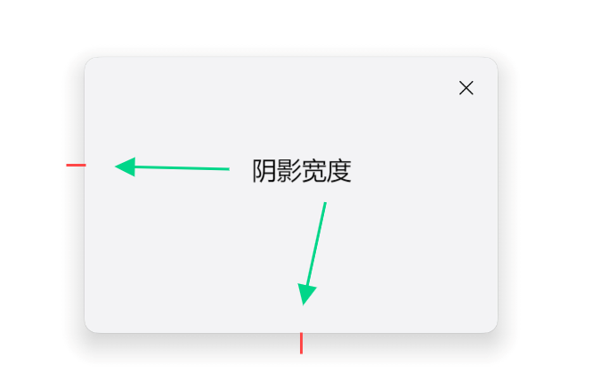
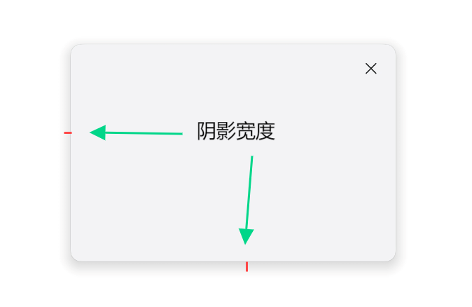

# ArkUI子系统Changelog

## cl.arkui.1 Navigation的toolbarConfiguration属性行为变更

**访问级别**

公开接口

**变更原因**

Navigation的toolbarConfiguration属性，不支持在ArkTS卡片中使用。

**变更影响**

该变更为不兼容变更。

变更前：toolbarConfiguration属性，支持在ArkTS卡片中使用。

变更后：toolbarConfiguration属性，不支持在ArkTS卡片中使用。

**起始API Level**

API 10

**变更发生版本**

从OpenHarmony SDK 5.0.0.60开始。

**变更的接口/组件**

navigation.d.ts文件的toolbarConfiguration属性。

**适配指导**

默认行为变更，无需适配，但应注意变更后的行为是否对整体应用逻辑产生影响。

## cl.arkui.2 uiObserver的NavDestinationState枚举行为变更

**访问级别**

公开接口

**变更原因**

uiObserver的NavDestinationState枚举，不支持在ArkTS卡片中使用。

**变更影响**

该变更为不兼容变更。

变更前：NavDestinationState枚举，支持在ArkTS卡片中使用。

变更后：NavDestinationState枚举，不支持在ArkTS卡片中使用。

**起始API Level**

API 10

**变更发生版本**

从OpenHarmony SDK 5.0.0.60开始。

**变更的接口/组件**

@ohos.arkui.observer.d.ts文件的NavDestinationState枚举。

**适配指导**

默认行为变更，无需适配，但应注意变更后的行为是否对整体应用逻辑产生影响。

## cl.ArkUI.3 FormMenu实现的功能变更为不支持穿戴设备

**访问级别**

公开接口

**变更原因**

穿戴设备上禁止使用FormMenu创建“添加至桌面”菜单。

**变更影响**

该变更为不兼容变更。

变更前：FormMenu组件在穿戴设备上允许使用。

变更后：FormMenu组件在穿戴设备上禁止使用。


**起始 API Level**

API 12

**变更发生版本**

从OpenHarmony SDK 5.0.0.60开始。

**变更的接口/组件**  

@ohos.arkui.advanced.FormMenu.d.ets文件的AddFormMenuItem接口

**适配指导**

默认行为变更，无需适配，但应注意变更后的行为是否对整体应用逻辑产生影响。

## cl.arkui.4 CanvasRenderingContext2D的miterLimit接口，当传入参数为0时，其异常值的处理方式发生变更

**访问级别**

公开接口

**变更原因**

CanvasRenderingContext2D的miterLimit接口，当传入参数为0时，未按照默认值设置参数，与文档所规定的处理异常值的方式不符。

**变更影响**

该变更为不兼容变更。

|               变更前                |              变更后               |
| :---------------------------------: | :-------------------------------: |
| 当传入参数0为时，未按照默认值进行参数设置。<br> | 当传入参数为0时，按照默认值进行参数设置。<br> |

**起始API Level**

9

**变更发生版本**

从OpenHarmony SDK 5.0.0.60 版本开始。

**变更的接口/组件**

CanvasRenderingContext2D的miterLimit接口

**适配指导**

API versiont 15及以后，使用miterLimit接口，当传入参数0为时，按照默认值进行参数设置，即miterLimit被设置为10。

**示例**

```ts
@Entry
@Component
struct MiterLimit {
  private settings: RenderingContextSettings = new RenderingContextSettings(true)
  private context: CanvasRenderingContext2D = new CanvasRenderingContext2D(this.settings)

  build() {
    Flex({ direction: FlexDirection.Column, alignItems: ItemAlign.Center, justifyContent: FlexAlign.Center }) {
      Canvas(this.context)
        .width('100%')
        .height('100%')
        .backgroundColor('rgb(213,213,213)')
        .onReady(() => {
          this.context.lineWidth = 10
          this.context.lineJoin = 'miter'
          this.context.miterLimit = 0
          this.context.moveTo(50, 30)
          this.context.lineTo(170, 90)
          this.context.lineTo(50, 150)
          this.context.stroke()
        })
    }
    .width('100%')
    .height('100%')
  }
}
```

## cl.arkui.5 半模态在2in1设备的阴影参数变更

**访问级别**

公开接口

**变更原因**

ux规格变更

**变更影响**

此变更不涉及应用适配。

| 变更前                                                                                                                     | 变更后                                                                                                                   |
| -------------------------------------------------------------------------------------------------------------------------- | ------------------------------------------------------------------------------------------------------------------------ |
| 半模态在2in1设备的获焦态阴影参数和失焦态阴影参数都为[OUTER_FLOATING_MD](../../../application-dev/reference//apis-arkui//arkui-ts/ts-universal-attributes-image-effect.md#shadowstyle10枚举说明)。<br>| 半模态在2in1设备的获焦态阴影参数为OUTER_FLOATING_MD，失焦态阴影参数为[OUTER_FLOATING_SM](../../../application-dev/reference//apis-arkui//arkui-ts/ts-universal-attributes-image-effect.md#shadowstyle10枚举说明)。<br> |

**起始API Level**

API 12

**变更发生版本**

从OpenHarmony SDK 5.0.0.60开始。

**变更的接口/组件**

bindSheet。

**适配指导**

默认效果变更，无需适配。