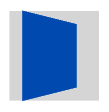
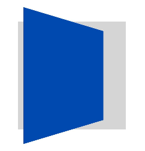

# ArkUI子系统Changelog

## cl.arkui.1 修复zIndex接口会影响组件在3D变换中的透视效果的错误行为

**访问级别**

公开接口

**变更原因**

zIndex接口在3D变换场景与translateZ耦合，导致zIndex值的改变会影响3D变换时的透视效果。

**变更影响**

该变更为不兼容变更。

变更前：开发者在3D变换中使用zIndex接口，zindex接口的数值会影响近大远小的透视效果。

变更后：开发者在3D变换中使用zIndex接口，zindex接口的数值不会影响近大远小的透视效果。

设置组件绕y轴旋转45度，同时设置zIndex值为200，变更前后效果如下：

| 变更前 | 变更后 |
| -------------------- | -------------------- |
|   |   |

**起始API Level**

API 14

**变更发生版本**

从OpenHarmony SDK 5.0.1.44开始。

**变更的接口/组件**

zIndex接口

**适配指导**

开发者可以使用translate接口并设置z向平移实现近大远小的透视效果。

适配场景示例：

```ts
@Entry
@Preview
@Component
struct zIndexTest {
  build() {
    Column() {
      Stack() {
        Column()
          .backgroundColor("rgb(213, 213, 213)")
          .width('600px')
          .height('600px')
        Column()
          .backgroundColor("rgb(0, 74, 175)")
          .width('600px')
          .height('600px')
          .rotate({
            y: 1,
            angle: 45
          })
          .translate({ x: 0, y: 0, z: 66 })    // 使用translate接口并设置Z向移动，实现3D变换中的近大远小透视效果
      }.margin({ top: 80 })
    }
    .width('100%')
    .height('100%')
  }
}
```

实现效果如下图所示：

  