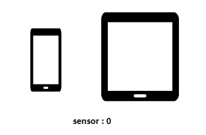
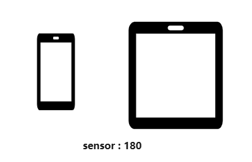
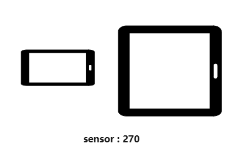

# 窗口子系统Changelog

## cl.display.1 屏幕Display对象rotation和orientation属性变更

**访问级别**

公开接口

**变更原因**

手机、平板等不同设备，电子器件贴片方向具有差异，传感器自然方向与屏幕的物理方向具有偏差，导致平板上屏幕Display对象中的rotation和orientation的变化方向和手机不统一，给用户带来困扰，需要针对设备类型做特殊处理，影响使用。

**变更影响**

该变更为不兼容变更。  
变更后平板上获取屏幕的横竖屏状态时，方向会与更改前不同，与手机保持一致。
变更前后对比效果，如下图所示：
| 设备旋转方向 | 平板变更前 | 平板变更后 |  手机 |
|---------|---------|---------|---------|
|  | rotation: 1   orientation: 0 | rotation: 0   orientation: 0  | rotation: 0   orientation: 0  |
|  | rotation: 2   orientation: 3 | rotation: 1   orientation: 1 |rotation: 1   orientation: 1 |
|  | rotation: 3   orientation:  2| rotation: 2   orientation: 2 | rotation: 2   orientation: 2 |
|  | rotation: 0   orientation: 1 | rotation: 3   orientation: 3 | rotation: 3   orientation: 3 |

**起始API Level**

API 7

**变更发生版本**

从OpenHarmony SDK 5.0.2.1 版本开始。

**变更的接口/组件**

@ohos.display.d.ts文件中屏幕Display对象的rotation和orientation属性。

**适配指导**

平板上监听横竖屏状态变更： 
业务方通过display.on('change')监听屏幕属性变化，从Display对象获取的rotation、orientation值。业务方如果在平板上判断rotation、orientation是否为某个横竖屏状态再处理相应业务，需要注意该值的变更。 
以充电口朝下方向（此时rotation为0）为准，顺时针旋转0、90、180、270度，平板设备上对应的rotation和orientation对照表如下所示：
|顺时针旋转角度|rotation变更前  | rotation变更后    | orientation变更前  | orientation变更后 |
|-------      |-------        | --------          | ---------------   |---------------   |
|0            |1              |  0                |  0                |0                 |
|90           |2              |  1                |  3                |1                 |
|180          |3              |  2                |  2                |2                 |
|270          |0              |  3                |  1                |3                 |