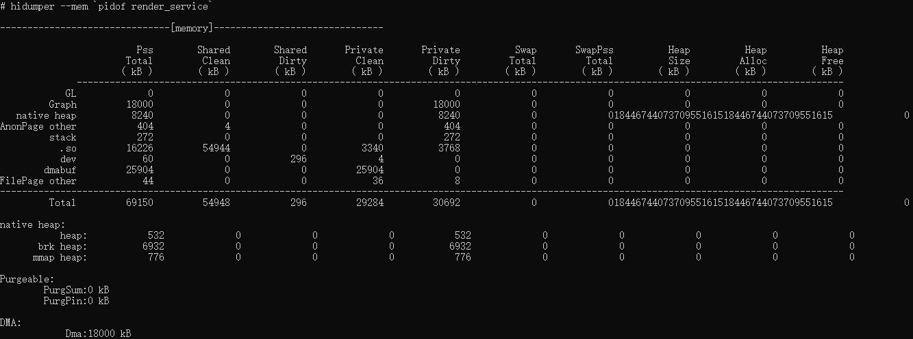
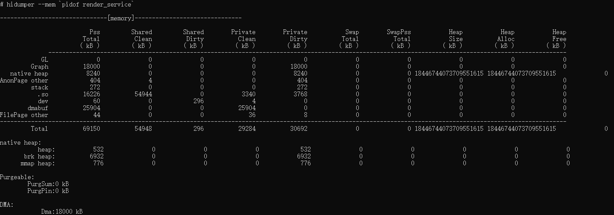

# DFX子系统变更说明

## cl.DFX.1 hidumper组件内存输出显示每列后新增一个空格

**访问级别**

其他

**变更原因**

解决生态调优测试的显示问题。

**变更影响**

该变更为不兼容变更。

变更前：内存较大时，相邻的两列数据中间无空格
   ```
   hidumper --mem `pidof render_service_`
   ```
   


变更后：每一列数据后新增一个空格
   ```
   hidumper --mem `pidof render_service_`
   ```
   


其中hidumper、hidumper --mem、hidumper -c [system]变更效果与hidumper --mem [pid]命令效果一致。

**变更发生版本**

从OpenHarmony SDK 5.0.2.57 开始

**变更的接口/组件**

hidumper组件


**适配指导**

根据格式变更后进行调整适配
