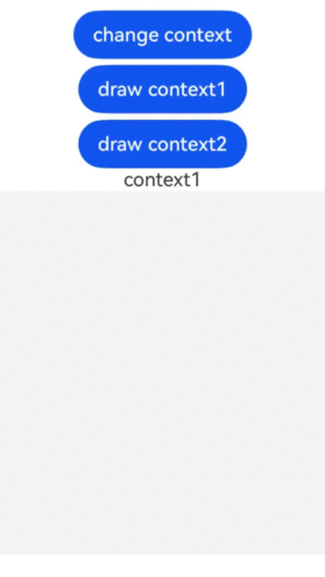

# ArkUI子系统Changelog

## cl.arkui.1 CanvasRenderingContext2D对象与关联的Canvas组件解绑后无法在该Canvas绘制

**访问级别**

公开接口

**变更原因**

CanvasRenderingContext2D与Canvas组件解绑后，仍能调用绘制方法进行绘制，有可能导致绘制指令错乱而达不到预期绘制效果。

**变更影响**

| 变更前                                   | 变更后                                   |
| ---------------------------------------- | ---------------------------------------- |
| CanvasRenderingContext2D对象与关联的Canvas组件解绑后，仍能在该Canvas上绘制。<br> | CanvasRenderingContext2D对象与关联的Canvas组件解绑后，无法在该Canvas上绘制。<br> |

**起始API Level**

API 8

**变更发生版本**

从OpenHarmony SDK 5.1.0.41开始。

**变更的接口/组件**

Canvas组件。

**适配指导**

默认行为变更，一个Canvas组件只能关联一个CanvasRenderingContext2D对象，无需适配，但应注意变更后的行为是否对整体应用逻辑产生影响。

**示例**

```ts
@Entry
@Component
struct Demo {
  private settings: RenderingContextSettings = new RenderingContextSettings(true)
  private context1: CanvasRenderingContext2D = new CanvasRenderingContext2D(this.settings)
  private context2: CanvasRenderingContext2D = new CanvasRenderingContext2D(this.settings)
  @State flag: Boolean = true

  build() {
    Flex({ direction: FlexDirection.Column, alignItems: ItemAlign.Center, justifyContent: FlexAlign.Center }) {
      /**
       * 点击Button,Canvas组件与上一个context解除关联，并关联一个新的context
       * 变更前：解除关联的context仍能在Canvas上绘制
       * 变更后：解除关联的context不能在Canvas上绘制
       */
      Button('change context')
        .onClick(() => {
          this.flag = !this.flag
        })
      Button('draw context1')
        .onClick(() => {
          this.context1.fillStyle = '#FF0000'
          this.context1.fillRect(50, 150, 50, 50)
        })
      Button('draw context2')
        .onClick(() => {
          this.context2.fillStyle = '#00ff00'
          this.context2.fillRect(150, 150, 50, 50)
        })
      Text(this.flag ? 'context1' : 'context2')
      Canvas(this.flag ? this.context1 : this.context2)
        .width(300)
        .height(300)
    }
    .width('100%')
    .height('100%')
  }
}
```