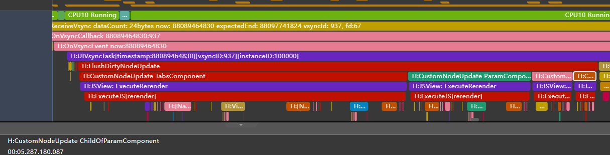
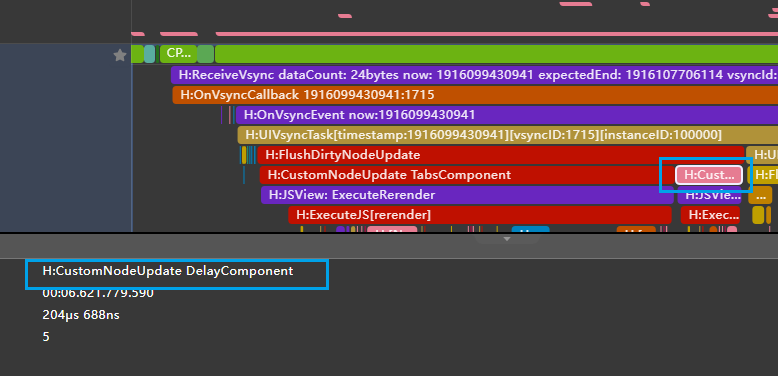

# ArkUI子系统Changelog

## cl.arkui.1 @Component、@ComponentV2自定义组件冻结变更

**访问级别**

公开接口

**变更原因**

@Component、@ComponentV2 开启组件冻结时，如果解冻组件，会从设置组件冻结标记的父组件开始解冻，然后解冻子组件，但解冻子组件时会解冻子组件的非屏上节点，

为了确保组件冻结对性能的提升，需要修改组件冻结的解冻范围，只解冻子组件的屏上节点。

**变更影响**

该变更为不兼容变更。

运行如下示例代码：

```ts
// index.ets
import router from '@ohos.router';

@Component
struct ChildOfParamComponent {
  @Prop @Watch('onChange') child_val: number;

  onChange() {
    console.log(`Appmonitor ChildOfParamComponent: child_val changed:${this.child_val}`);
  }

  build() {
    Column() {
      Text(`Child Param： ${this.child_val}`);
    }
  }
}

@Component
struct ParamComponent {
  @Prop @Watch('onChange')  paramVal: number;

  onChange() {
    console.log(`Appmonitor ParamComponent: paramVal changed:${this.paramVal}`);
  }

  build() {
    Column() {
      Text(`val： ${this.paramVal}`)
      ChildOfParamComponent({child_val: this.paramVal});
    }
  }
}

@Component
struct DelayComponent {
  @Prop @Watch('onChange') delayVal: number;

  onChange() {
    console.log(`Appmonitor ParamComponent: delayVal changed:${this.delayVal}`);
  }

  build() {
    Column() {
      Text(`Delay Param： ${this.delayVal}`);
    }
  }
}

@Entry
@Component ({freezeWhenInactive: true})
struct TabsComponent {
  private controller: TabsController = new TabsController();
  @State @Watch('onChange') tabState: number = 47;

  onChange() {
    console.log(`Appmonitor TabsComponent: tabState changed:${this.tabState}`);
  }

  build() {
    Column({space: 10}) {
      Button(`Incr state ${this.tabState}`)
        .fontSize(25)
        .onClick(() => {
          console.log('Button increment state value');
          this.tabState = this.tabState + 1;
        })

      Tabs({ barPosition: BarPosition.Start, index: 0, controller: this.controller}) {
        TabContent() {
          ParamComponent({paramVal: this.tabState});
        }.tabBar('Update')
        TabContent() {
          DelayComponent({delayVal: this.tabState});
        }.tabBar('DelayUpdate')
      }
      .vertical(false)
      .scrollable(true)
      .barMode(BarMode.Fixed)
      .barWidth(400).barHeight(150).animationDuration(400)
      .width('100%')
      .height(200)
      .backgroundColor(0xF5F5F5)

      Button('Next Page')
        .onClick(() => {
          router.pushUrl({
            url: 'pages/Page2'
          });
        })
    }
  }
}
```

```ts
// Page2.ets
import router from '@ohos.router';

@Entry
@Component
struct Second {
  build() {
    Column() {
      Button() {
        Text('Back')
          .fontSize(50)
          .fontWeight(FontWeight.Bold)
      }
      .margin({
        top: 40
      })
      .onClick(() => {
        router.back();
      })
    }
    .width('100%')
    .height('100%')
  }
}
```

父组件TabsComponent开启了组件冻结，点击DelayUpdate标签，之后点击Button：Next Page进入另一个页面，然后返回，标签落在DelayUpdate，点击Button：Incr state，查看log，搜索'Appmonitor'。

变更前：发现有4条打印，除了DelayUpdate标签的打印外，还有Update标签中节点的打印，查看trace，可以看到，Update标签未被选中，其子组件ParamComponent也不在屏上，但是ParamComponent组件进行了刷新，说明父组件解冻时会解冻其所有的子组件。



变更后：只有2条打印，不再有Update标签中节点的打印，查看trace，只有选中的DelayUpdate标签中的节点被刷新，只有子组件的屏上节点被解冻，非屏上节点不会再被解冻。



**起始API Level**

@Component ：API 11

@ComponentV2：API 12

**变更发生版本**

从OpenHarmony SDK 5.1.0.42开始。

**变更的接口/组件**

@Component的freezeWhenIactive接口

@ComponentV2的freezeWhenIncative接口

**适配指导**

默认行为变更，当开发者开启组件冻结功能之后，从其他界面返回到开启组件冻结功能的界面时，现在不会解锁子组件的屏外节点。

如果开发者希望非屏上的节点也能触发@Watch回调或者@Monitor的回调，那么需要去掉示例代码中的freezeWhenInactive: true，或者将冻结开关设置为freezeWhenInactive: false。