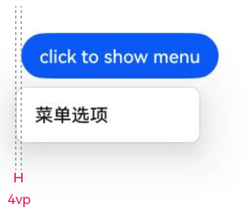
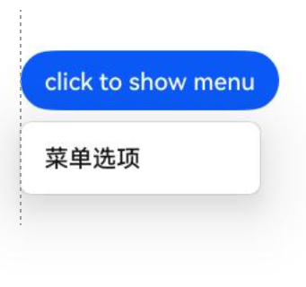
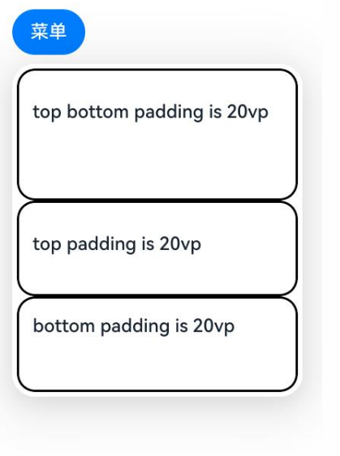
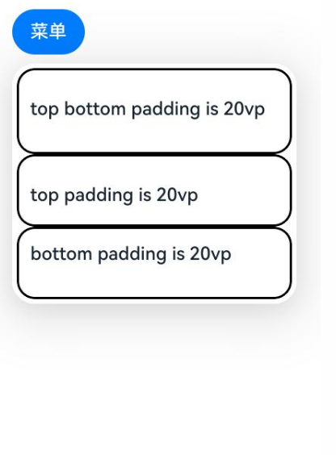
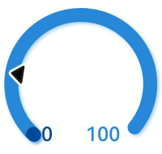
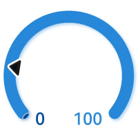
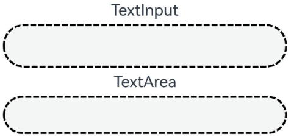
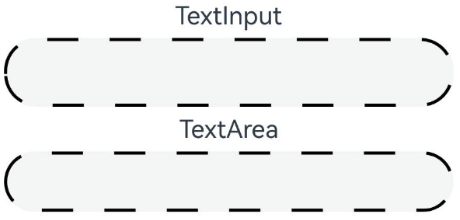

# ArkUI子系统Changelog

## cl.arkui.1 带标题栏窗口应用内菜单弹出位置变更

**访问级别**

公开接口

**变更原因**

对于带标题栏窗口使用非子窗的Menu组件场景，菜单默认弹出位置调整，UX体验更佳。


**变更影响**

此变更不涉及应用适配。

变更前：带标题栏窗口应用内弹出菜单位置偏移4vp，菜单没有和按钮对齐。

变更后：带标题栏窗口应用内弹出菜单位置正确，菜单和按钮对齐。

| 变更前 | 变更后 |
|---------|---------|
|         |         |

**起始API Level**

API 11

**变更发生版本**

从OpenHarmony SDK 5.1.0.45开始。

**变更的接口/组件**

Menu组件。

**适配指导**

Menu UX默认效果变更，无需适配，但应注意变更后的默认效果是否符合开发者预期，如不符合则应自定义修改效果控制变量以达到预期。

## cl.arkui.2 MenuItem设置padding属性时默认布局行为变更

**访问级别**

公开接口

**变更原因**

优化MenuItem添加padding时布局效果，变更后效果更佳。

**变更影响**

此变更不涉及应用适配。

变更前：MenuItem设置padding属性时，布局和预期不符合。

变更后：MenuItem设置padding属性时，布局符合预期。

```ts
@Entry
@Component
struct Index {
  @Builder
  MenuWithPadding() {
    Menu() {
      MenuItemGroup() {
        MenuItem({content:"top bottom padding is 20vp"})
          .padding({top:20, bottom: 20})
          .borderWidth(2)
          .borderColor(Color.Black)
        MenuItem({content:"top padding is 20vp"})
          .padding({top:20})
          .borderWidth(2)
          .borderColor(Color.Black)
        MenuItem({content:"bottom padding is 20vp"})
          .padding({bottom: 20})
          .borderWidth(2)
          .borderColor(Color.Black)
      }
    }
  }

  build() {
    Column() {
      Button("菜单")
        .bindMenu(this.MenuWithPadding)
    }
    .width('100%')
  }
}
```

| 变更前 | 变更后 |
|---------|---------|
|         |         |

**起始API Level**

API 7

**变更发生版本**

从OpenHarmony SDK 5.1.0.45 版本开始。

**变更的接口/组件**

MenuItem组件。

**适配指导**

MenuItem设置padding属性时默认布局效果变更，开发者无需适配。

## cl.arkui.3 DatePickerDialog和TimePickerDialog调用show()方法，参数缺省时的行为变更

**访问级别**

公开接口

**变更原因**

DatePickerDialog和TimePickerDialog调用show()方法，若参数缺省，无法弹出对话框。该参数为可选参数，会对开发者造成困惑。

**变更影响**

此变更不涉及应用适配。

举例说明，执行以下用例：

```ts
@Entry
@Component
struct PickerDialogExample {
  build() {
    Column() {
      Button("DatePickerDialog")
        .onClick(() => {
          DatePickerDialog.show()
        })

      Button("TimePickerDialog")
        .margin(20)
        .onClick(() => {
          TimePickerDialog.show()
        })
    }
  }
}
```

变更前:  
DatePickerDialog.show()和TimePickerDialog.show()无法弹出日期选择器对话框。 

变更后:  
DatePickerDialog.show()和TimePickerDialog.show()可以弹出日期选择器对话框。

**起始API Level**

API 8

**变更发生版本**

从OpenHarmony 5.1.0.45开始。

**变更的接口/组件**

TimePickerDialog和DatePickerDialog组件。

**适配指导**

DatePickerDialog和TimePickerDialog调用show()方法，参数缺省时，可弹出默认样式的对话框。

## cl.arkui.4 Gauge设置第一个颜色占比过小时绘制效果更改

**访问级别**

公开接口

**变更原因**

Gauge设置第一个颜色占比过小时绘制效果不符合UX效果。

**变更影响**

此变更无需应用适配。

| 变更前                                                                                                                     | 变更后                                                                                                                   |
| -------------------------------------------------------------------------------------------------------------------------- | ------------------------------------------------------------------------------------------------------------------------ |
| 设置第一个颜色占比过小时，第一个圆环未被正确裁切，出现逆时针向0的方向绘制的情况。<br>| 设置第一个颜色占比过小时，第一个圆环绘制正常，能被正常裁切。<br> |

**起始API Level**

11

**变更发生版本**

从OpenHarmony 5.1.0.45 版本开始。

**变更的接口/组件**

Gauge。

**适配指导**

展示效果变更，无需适配，但应注意变更后的效果是否符合开发者预期。

## cl.arkui.5 Repeat VirtualScroll 支持二级缓存冻结

**访问级别**

公开接口

**变更原因**

开发者使用Repeat VirtualScroll，进入二级缓存（复用池）中的组件是为了通过更新其各项属性后作为新组件使用，在更新成为新组件之前不应该被刷新。

**变更影响**

此变更不涉及应用适配。

变更前：启用组件冻结，状态变量改动会触发二级缓存中的组件刷新，并执行@Monitor对应方法。 

变更后：启用组件冻结，状态变量改动不会触发二级缓存中的组件刷新，不执行@Monitor对应方法。

举例说明，执行以下用例：

```ts
@Entry
@ComponentV2
struct RepeatVirtualScrollDemo {
  @Local simpleList: Array<string> = [];
  @Local bgColor: Color = Color.Pink;

  aboutToAppear(): void {
    for (let i = 0; i < 7; i++) {
      this.simpleList.push(`item${i}`);
    }
  }

  build() {
    Column() {
      Row() {
        Button(`Reduce length to 5`)
          .onClick(() => {
            this.simpleList = this.simpleList.slice(0, 5);
          })
        Button(`Change bgColor`)
          .onClick(() => {
            this.bgColor = this.bgColor == Color.Pink ? Color.Blue : Color.Pink;
          })
      }

      List() {
        Repeat(this.simpleList)
          .each((obj: RepeatItem<string>) => {
          })
          .key((item: string, index: number) => item)
          .virtualScroll({ totalCount: this.simpleList.length })
          .templateId(() => `a`)
          .template(`a`, (ri) => {
            ChildComponent({
              message: ri.item,
              bgColor: this.bgColor
            })
          }, { cachedCount: 2 })
      }
      .cachedCount(0)
      .height(500)
    }
    .height(`100%`)
  }
}

@ComponentV2({ freezeWhenInactive: true })
struct ChildComponent {
  @Param @Require message: string;
  @Param @Require bgColor: Color;
  // 支持后二级缓存中的组件不刷新，不会打印相应日志
  @Monitor(`bgColor`)
  onMessageChange(monitor: IMonitor) {
    monitor.dirty.forEach((path: string) => {
      console.log(`repeat---${path} change from ${monitor.value(path)?.before} to ${monitor.value(path)?.now}`)
    })
  }

  build() {
    Text(`[a]: ${this.message}`)
      .fontSize(50)
      .backgroundColor(this.bgColor)
  }
}
```

**起始API Level**

12

**变更发生版本**

从OpenHarmony 5.1.0.45 版本开始。

**变更的接口/组件**

Repeat freezeWhenInactive。

**适配指导**

展示效果不变，@Monitor监听属性变化执行方法次数会减少。如果需要刷新缓存中的数据，可以关闭组件冻结。

```ts
// 关闭组件冻结，freezeWhenInactive设置为false
@ComponentV2({ freezeWhenInactive: false })
struct ChildComponent {
  @Param @Require message: string;
  @Param @Require bgColor: Color;
  // 关闭冻结后，二级缓存中的组件会刷新，并打印相应日志
  @Monitor(`bgColor`)
  onMessageChange(monitor: IMonitor) {
    monitor.dirty.forEach((path: string) => {
      console.log(`repeat---${path} change from ${monitor.value(path)?.before} to ${monitor.value(path)?.now}`)
    })
  }

  build() {
    Text(`[a]: ${this.message}`)
      .fontSize(50)
      .backgroundColor(this.bgColor)
  }
}
```

## cl.arkui.6 Image组件的borderRadius接口支持百分比输入

**访问级别**

公开接口

**变更原因**

为了增强功能的灵活性，Image组件的borderRadius接口支持百分比输入，功能与通用属性的borderRadius对齐。

**变更影响**

此变更涉及应用适配。

| 变更前                                                                                                                     | 变更后                                                                                                                   |
| -------------------------------------------------------------------------------------------------------------------------- | ------------------------------------------------------------------------------------------------------------------------ |
| Image组件的borderRadius接口输入百分比不生效。<br>| Image组件的borderRadius接口输入百分比，百分比依据组件宽度生效。<br> |

**起始API Level**

7

**变更发生版本**

从OpenHarmony SDK 5.1.0.45 版本开始。

**变更的接口/组件**

Image组件的borderRadius接口。

**适配指导**

如果代码中依赖borderRadius传入百分比不生效的行为，建议传入0，或者不设置borderRadius，例如：borderRadius(0)。

```ts
@Entry
@Component
struct Index {
  build() {
    Column() {
      Image($r("app.media.startIcon"))
        .width(100)
        .height(100)
        .borderRadius("10%")
    }
    .height('100%')
    .width('100%')
  }
}
```

## cl.arkui.7 ImageSpan组件borderRadius边框圆角属性Modifier设置变更

**访问级别**

公开接口

**变更原因**

ImageSpan组件的borderRadius边框圆角属性通过Modifier设置不生效，边框实际不显示圆角效果。

**变更影响**

此变更不涉及应用适配。

| 变更前                                                                                           | 变更后                                                                                    |
| ----------------------------------------------------------------------------------------------- | ------------------------------------------------------------------------------------------ |
| ImageSpan组件borderRadius边框圆角属性通过Modifier设置不生效。<br>| ImageSpan组件borderRadius边框圆角属性通过Modifier设置生效。<br> |

**起始API Level**

ImageSpanModifier ： 12

**变更发生版本**

从OpenHarmony SDK 5.1.0.45开始。

**变更的接口/组件**

ImageSpanModifier接口的borderRadius属性

**适配指导**

无需应用适配，变更后ImageSpan组件的borderRadius边框圆角在Modifier接口设置生效，效果与开发者实际设置的圆角值显示一致。

## cl.arkui.8 Search组件回车键类型为EnterKeyType.NEW_LINE（换行）时onSubmit回调中执行keepEditableState()函数，参数缺省时的行为变更

**访问级别**

公开接口

**变更原因**

开发者通过Search组件的onSubmit接口设置自定义提交事件，并在keepEditableState()函数中配置是否收起键盘。当回车键类型设置为EnterKeyType.NEW_LINE（换行）时，无论是否设置keepEditableState()接口，用户点击输入法软键盘上的换行按钮或按下回车键，键盘均不会收起。

**变更影响**

此变更不涉及应用适配。

变更前：回车键类型为EnterKeyType.NEW_LINE（换行），不设置keepEditableState()接口，用户点击输入法软键盘上的换行按钮或按下回车键，Search组件保持编辑态。

变更后：回车键类型为EnterKeyType.NEW_LINE（换行），不设置keepEditableState()接口，用户点击输入法软键盘上的换行按钮或按下回车键，Search组件退出编辑态。

**起始API Level**

12

**变更发生版本**

从OpenHarmony 5.1.0.45 版本开始。

**变更的接口/组件**

onSubmit事件keepEditableState()接口

**适配指导**

使用Search组件onSubmit接口设置自定义提交事件。触发onSubmit时，如果回车键类型为EnterKeyType.NEW_LINE（换行）且未设置keepEditableState()接口，键盘退出编辑态。举例说明：

```ts
import { SymbolGlyphModifier } from '@kit.ArkUI'

@Entry
@Component
struct EnterKeyTypeIsNewLineDemo {
  mySearchController: SearchController = new SearchController()

  build() {
    Column() {
      Text('Search').fontSize(25).fontColor(Color.Blue)
      Search({ value: '', placeholder: 'Type to search ...', controller: this.mySearchController })
        .searchIcon(new SymbolGlyphModifier($r('sys.symbol.magnifyingglass')).fontColor([Color.Red]))
        .searchButton('SEARCH')
        // 回车键类型设置为EnterKeyType.NEW_LINE（换行）
        .enterKeyType(EnterKeyType.NEW_LINE)
        .onSubmit((value: string, event?: SubmitEvent) => {
          // 设置键盘保持编辑态，否则，默认情况键盘退出编辑态
          event?.keepEditableState()
        })
    }.width('100%').margin({ top: 100 })
  }
}
```

## cl.arkui.9 TextInput/TextArea组件border属性dashGap、dashWidth参数Modifier设置变更

**访问级别**

公开接口

**变更原因**

TextInput/TextArea组件的border属性中，虚线参数dashGap和dashWidth通过Modifier设置后未生效。当前TextInput/TextArea组件的实际虚线边框显示为默认效果，而非Modifier设置的值。

**变更影响**

此变更不涉及应用适配。

| 变更前                                                                                           | 变更后                                                                                      |
| ----------------------------------------------------------------------------------------------- | ------------------------------------------------------------------------------------------- |
| TextInput/TextArea组件的border属性中，虚线参数dashGap和dashWidth通过Modifier设置后未生效。| TextInput/TextArea组件的border属性中，虚线参数dashGap和dashWidth通过Modifier设置后生效。 |

**起始API Level**

TextInputModifier ：12

TextAreaModifier ：12

**变更发生版本**

从OpenHarmony SDK 5.1.0.45开始。

**变更的接口/组件**

TextInputModifier、TextAreaModifier接口的border属性dashGap、dashWidth参数

**适配指导**

无需应用适配，变更后TextInput/TextArea组件的border属性虚线参数dashGap、dashWidth通过Modifier设置生效，显示虚线边框间距和长度效果与开发者设置值一致。
