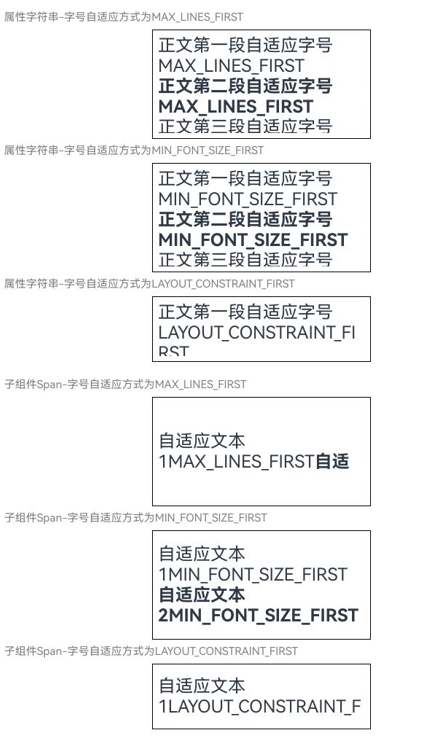
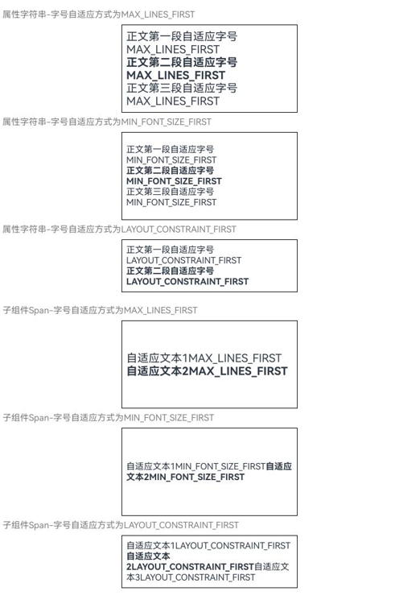

# ArkUI子系统Changelog

## cl.arkui.1 TextInput、TextArea、Search组件onChange事件参数内容变更

**访问级别**

公开接口

**变更原因**

在预上屏输入功能启用时，当先选中一段文本再进行输入，onChange回调中的value字段将仅反映实际显示的上屏文本，不再包含原先选中的文本内容，以此确保value字段与用户界面显示的文本一致。

**变更影响**

此变更不涉及应用适配。

运行如下示例代码：

```ts
// Index.ets
@Entry
@Component
struct TextInputExample {
  @State text: string = ''
  controller: TextInputController = new TextInputController()

  onPageShow(): void {
    setTimeout(() => {
      this.controller.setTextSelection(0,3);
    }, 10);
  }
  build() {
    Column() {
      TextInput({ text:"12345",  controller: this.controller })
        .width(380)
        .height(60)
        .defaultFocus(true)
        .onChange((value: string) => {
          console.log("value is" + value)
        })
    }
  }
}
```
变更前：
开启预上屏输入，输入过程中，onChange回调的值为“12345”

变更后：
开启预上屏输入，输入过程中，onChange回调的值为“45”

**起始API Level**

API 12

**变更发生版本**

从OpenHarmony SDK 5.1.0.46开始。

**变更的接口/组件**

TextInput组件onChange事件的EditableTextOnChangeCallback参数

TextArea组件onChange事件的EditableTextOnChangeCallback参数

Search组件onChange事件的EditableTextOnChangeCallback参数

**适配指导**

变更后value参数的内容将与实际显示内容保持一致，无需进行额外的适配。若开发者希望获取全部文本内容，可利用onEditChange等事件，在输入开始前进行获取并记录。

## cl.arkui.2 Text的minFontSize、maxFontSize在子组件span或属性字符串场景下，文本自适应字号设置生效

**访问级别**

公开接口

**变更原因**

能力增强，方便开发者对不同文字样式的文字做字号的适应。

**变更影响**

此变更涉及应用适配。

变更前，Text的minFontSize、maxFontSize在子组件Span或属性字符串场景下，文本自适应字号设置不生效。

变更后，Text的minFontSize、maxFontSize在子组件Span或属性字符串场景下，文本自适应字号设置生效。

如下是属性字符串和Span子组件场景变更前后效果对比：

|               变更前                |              变更后               |
| :---------------------------------: | :-------------------------------: |
|||

**起始API Level**

API 7

**变更发生版本**

从OpenHarmony SDK 5.1.0.46开始。

**变更的接口/组件**

Text组件的minFontSize、maxFontSize接口。

**适配指导**

如果在Text使用子组件或属性字符串场景下，设置了minFontSize、maxFontSize，变更后自适应字号生效，导致字号变化，如果需要保持之前的字号，可以删除minFontSize、maxFontSize属性设置。

## cl.arkui.3 当AttributeModifer的applyNormalAttribute方法中instance参数设置为资源类型数据时更新的行为发生变更

当开发者使用资源文件作为AttributeModifer的applyNormalAttribute方法中instance对象的入参时，无法通过配置资源文件更新参数，该行为与系统资源的规格不一致。

**变更影响**

此变更不涉及应用适配。

运行以下示例时:

```ts
class MyButtonModifier implements AttributeModifier<ButtonAttribute> {
  private color?: ResourceColor;
  private fontColor?: ResourceColor;

  constructor(color: ResourceColor, fontColor: ResourceColor) {
    this.color = color;
    this.fontColor = fontColor;
  }

  applyNormalAttribute(instance: ButtonAttribute): void {
    // instance为Button的属性对象，设置正常状态下属性值
    instance.backgroundColor(this.color)
      .fontColor(this.fontColor)
      .borderWidth(1)
  }
}

@Entry
@Component
struct attributeDemo {
  @State modifier: MyButtonModifier = new MyButtonModifier($r('app.color.backColor'), $r('app.color.fontColor'));

  build() {
    Row() {
      Column() {
        Button("Button")
          .attributeModifier(this.modifier)
      }.width("100%")
    }
    .height('100%')
    .backgroundColor(Color.White)
  }
}
```

```json
// src/main/resources/base/element/color.json
{
  "color": [
    {
      "name": "start_window_background",
      "value": "#FFFFFF"
    },
    {
      "name": "backColor",
      "value": "#000000"
    },
    {
      "name": "fontColor",
      "value": "#FFFFFF"
    }
  ]
}
```

```json
// src/main/resources/dark/element/color.json
{
  "color": [
    {
      "name": "start_window_background",
      "value": "#000000"
    },
    {
      "name": "backColor",
      "value": "#FFFFFF"
    },
    {
      "name": "fontColor",
      "value": "#000000"
    }
  ]
}
```

| 变更前                                                                               | 变更后                                                                             |
| ------------------------------------------------------------------------------------ | ---------------------------------------------------------------------------------- |
| 浅色模式拉起。<br>                             | 浅色模式拉起。<br>                           |
|                                                                                      |
| 切换深色时，无法使用资源文件触发UI的更新。<br> | 切换深色时，可以使用资源文件触发UI的更新。<br> |
|                                                                                      |

**起始API Level**

API 11

**变更发生版本**

从OpenHarmony SDK 5.0.1.46开始。

**变更的接口/组件**

common.d.ts文件attributeModifier接口。

**适配指导**

默认行为变更，无需适配。

如不期望资源随配置文件更新可以将资源取出后使用。

```ts
class MyButtonModifier implements AttributeModifier<ButtonAttribute> {
  public  color?: ResourceColor;
  public fontColor?: ResourceColor;

  constructor(color: ResourceColor, fontColor: ResourceColor) {
    this.color = color;
    this.fontColor = fontColor;
  }

  applyNormalAttribute(instance: ButtonAttribute): void {
    // instance为Button的属性对象，设置正常状态下属性值
    instance.backgroundColor(this.color)
      .fontColor(this.fontColor)
      .borderWidth(1)
  }
}

@Entry
@Component
struct attributeDemo {
  @State modifier: MyButtonModifier = new MyButtonModifier($r('app.color.backColor'), $r('app.color.fontColor'));

  aboutToAppear(): void {
    // 解析获取资源文件。
    this.modifier.color = getContext().resourceManager.getColorSync($r('app.color.backColor').id);
    this.modifier.fontColor = getContext().resourceManager.getColorSync($r('app.color.fontColor').id);
  }

  build() {
    Row() {
      Column() {
        Button("Button")
          .attributeModifier(this.modifier)
      }.width("100%")
    }
    .height('100%')
    .backgroundColor(Color.White)
  }
}
```

| 变更前                                                   | 变更后                                                 |
| -------------------------------------------------------- | ------------------------------------------------------ |
| 浅色模式拉起。<br> | 深色模式拉起。<br> |
| 切换深色。<br>     | 切换浅色。<br>     |
