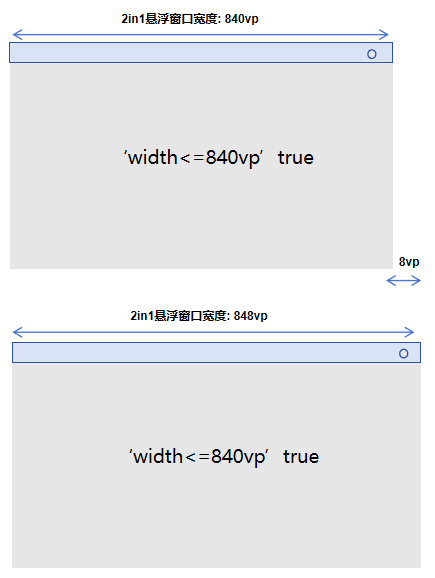

# ArkUI子系统Changelog

## cl.arkui.1 Video组件不再默认解析并自动播放拖拽信息中的视频资源

**访问级别**

公开接口

**变更原因**

Video组件默认允许拖入任意视频并自动播放的行为不符合终端用户预期，故需调整该默认规格。

**变更影响**

此变更涉及应用适配。

变更前：Video组件默认解析并自动播放拖拽信息中的视频资源。

变更后：Video组件不会默认解析并自动播放拖拽信息中的视频资源。

**起始API Level**

API 10

**变更发生版本**

从OpenHarmony SDK 5.1.0.47开始。

**变更的接口/组件**

Video组件。

**适配指导**

应用若需要使Video组件支持解析拖入的视频信息并自动播放，可通过如下代码实现：

```ts
import { unifiedDataChannel, uniformTypeDescriptor } from '@kit.ArkData';

@Entry
@Component
struct Index {
  @State videoSrc: Resource | string = $rawfile('video1.mp4');
  private controller: VideoController = new VideoController();

  build() {
    Column() {
      Video({
        src: this.videoSrc,
        controller: this.controller
      })
        .width('100%')
        .height(600)
        .onPrepared(() => {
          // 在onPrepared回调中执行controller的start方法，确保视频源更换后直接开始播放。
          this.controller.start();
        })
        .onDrop((e: DragEvent) => {
          // 外部视频拖入应用Video组件范围，松手后触发通过onDrop注册的回调。
          // 在DragEvent中会包含拖入的视频源信息，取出后赋值给状态变量videoSrc即可改变Video的视频源。
          let record = e.getData().getRecords()[0];
          if (record.getType() == uniformTypeDescriptor.UniformDataType.VIDEO) {
            let videoInfo = record as unifiedDataChannel.Video;
            this.videoSrc = videoInfo.videoUri;
          }
        })
    }
  }
}
```

## cl.arkui.2 使用媒体查询(@ohos.mediaquery)在2in1悬浮窗口监听页面宽度不再额外减去8vp

**访问级别**

公开接口

**变更原因**

2in1悬浮窗口经过UX变更，现已取消窗口两侧边缘的边框与边距。然而，媒体查询依然沿用早期的实现方式，减去了边框和边距数值总和8vp，导致页面宽度的监测不准确，不符合开发者的预期，故需进行相应调整。

**变更影响**

此变更不涉及应用适配。

变更前：2in1悬浮窗口下，使用mediaQuery监听页面宽度，页面宽度 = 窗口宽度 - 8vp。

变更后：2in1悬浮窗口下，使用mediaQuery监听页面宽度，页面宽度 = 窗口宽度。

相关场景变更前后效果对比：
|               变更前                |              变更后               |
| :---------------------------------: | :-------------------------------: |
|||

**起始API Level**

API 10

**变更发生版本**

从OpenHarmony SDK 5.1.0.47开始。

**变更的接口/组件**

@ohos.mediaquery.d.ts文件中matchMediaSync接口。

**适配指导**

默认行为变更，无需适配。