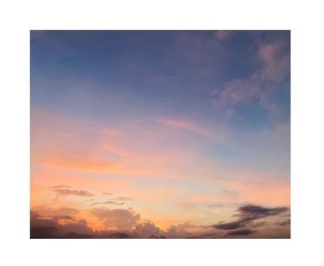

# ArkUI子系统Changelog

## cl.arkui.1  CanvasRenderingContext2D的drawImage接口默认单位变更

**访问级别**

公开接口

**变更原因**

当drawImage传入9个参数时，若首个参数（image）为PixelMap类型，则第2至第5个参数（sx、sy、sw和sh）以px为单位进行解析。与文档描述不一致，且绘制得到的图片大小存在问题。

**变更影响**

该变更涉及应用适配。

当drawImage传入9个参数时，且首个参数为PixelMap类型时：

- 变更前：第2至第5个参数都会以px为单位进行解析。
- 变更后：第2至第5个参数会以vp为单位进行解析。

||               变更前                |              变更后               |
| :-: | :---------------------------------: | :-------------------------------: |
| 第2至第5个参数以vp为单位传入 |  |  |
| 第2至第5个参数以px为单位传入 |  |  |

**起始API Level**

9

**变更发生版本**

从OpenHarmony SDK 5.1.0.48 版本开始。

**变更的接口/组件**

CanvasRenderingContext2D的drawImage接口

**适配指导**

变更后，使用drawImage接口时，若传入9个参数，且首个参数为PixelMap类型时，要注意第2至第5个参数会以vp为单位进行解析。

**示例**

```ts
import { image } from '@kit.ImageKit'

@Entry
@Component
struct Demo {
  private settings: RenderingContextSettings = new RenderingContextSettings(true)
  private context: CanvasRenderingContext2D = new CanvasRenderingContext2D(this.settings)

  build() {
    Flex({ direction: FlexDirection.Column, alignItems: ItemAlign.Center, justifyContent: FlexAlign.Center }) {
      Canvas(this.context)
        .width('100%')
        .height('100%')
        .onReady(() => {
          let context = getContext(this)
          let imageSourceApi = image.createImageSource(context.filesDir + "/view.jpg")
          let pixelmap = imageSourceApi.createPixelMapSync();
          let imageInfo = pixelmap.getImageInfoSync()
          let width = px2vp(imageInfo.size.width)
          let height = px2vp(imageInfo.size.height)
          this.context.drawImage(pixelmap, 0, 0, width, height, 50, 50, 250, 200)
          this.context.drawImage(pixelmap, 0, 0, imageInfo.size.width, imageInfo.size.height, 50, 300, 250, 200)
        })
    }
    .width('100%')
    .height('100%')
  }
}
```

## cl.arkui.2 Canvas路径绘制未指定起始点和绘制方法number类型参数传NaN和Infinity值的行为变更。

**访问级别**

公开接口

**变更原因**

使用Canvas绘制路径时，如果没有使用moveTo方法指定路径起始点，会默认从画布左上角(0,0)开始绘制路径；某些绘制方法的number类型参数传入NaN或Infinity值时，部分内容无法绘制。这些行为与W3C的行为不一致。

**变更影响**

此变更涉及应用适配。

变更前：使用Canvas绘制路径时，如果没有使用moveTo方法指定路径起始点，会默认从画布左上角(0,0)开始绘制路径；任一路径绘制方法的number类型参数传入NaN或Infinity值时，整个路径无法绘制。对画布进行缩放、旋转、移动或使用变换矩阵进行图形变化时，number类型参数传入NaN或Infinity值，后面执行的方法无法绘制。

变更后：使用Canvas绘制路径时，如果没有使用moveTo方法指定路径起始点，会以第一个有效的路径绘制方法的前两位number参数作为路径起始点；传入NaN或Infinity值的路径绘制方法不做处理，根据有效的路径参数进行绘制。对画布进行缩放、旋转、移动或使用变换矩阵进行图形变化时，number类型参数传入NaN或Infinity值，其他传入有效参数的方法正常绘制。

具体接口的差异如下：

| 方法 | 变更前 | 变更后 |
|---------|---------|---------|
|lineTo|如果没有使用moveTo方法指定路径起始点，会默认从画布左上角(0,0)开始绘制路径；<br>任一路径绘制方法的number类型参数传入NaN或Infinity值时，整个路径无法绘。|如果没有使用moveTo方法指定路径起始点，会以第一个有效的路径绘制方法的前两位number参数作为路径起始点；<br>路径绘制方法的number类型参数传入NaN或Infinity值时，该方法不生效。其他传入有效参数的路径绘制方法正常绘制。|
|arcTo|如果没有使用moveTo方法指定路径起始点，会默认从画布左上角(0,0)开始绘制路径；<br>任一路径绘制方法的number类型参数传入NaN或Infinity值时，整个路径无法绘制。|如果没有使用moveTo方法指定路径起始点，会以第一个有效的路径绘制方法的前两位number参数作为路径起始点；<br>路径绘制方法的number类型参数传入NaN或Infinity值时，该方法不生效。其他传入有效参数的路径绘制方法正常绘制。|
|bezierCurveTo|如果没有使用moveTo方法指定路径起始点，会默认从画布左上角(0,0)开始绘制路径；<br>任一路径绘制方法的number类型参数传入NaN或Infinity值时，整个路径无法绘制。|如果没有使用moveTo方法指定路径起始点，会以第一个有效的路径绘制方法的前两位number参数作为路径起始点；<br>路径绘制方法的number类型参数传入NaN或Infinity值时，该方法不生效。其他传入有效参数的路径绘制方法正常绘制。|
|quadraticCurveTo|如果没有使用moveTo方法指定路径起始点，会默认从画布左上角(0,0)开始绘制路径；<br>任一路径绘制方法的number类型参数传入NaN或Infinity值时，整个路径无法绘制。|如果没有使用moveTo方法指定路径起始点，会以第一个有效的路径绘制方法的前两位number参数作为路径起始点；<br>路径绘制方法的number类型参数传入NaN或Infinity值时，该方法不生效。其他传入有效参数的路径绘制方法正常绘制。|
|moveTo|任一路径绘制方法的number类型参数传入NaN或Infinity值时，整个路径无法绘制。|路径绘制方法的number类型参数传入NaN或Infinity值时，该方法不生效。其他传入有效参数的路径绘制方法正常绘制。|
|arc|任一路径绘制方法的number类型参数传入NaN或Infinity值时，整个路径无法绘制。|路径绘制方法的number类型参数传入NaN或Infinity值时，该方法不生效。其他传入有效参数的路径绘制方法正常绘制。|
|ellipse|任一路径绘制方法的number类型参数传入NaN或Infinity值时，整个路径无法绘制。|路径绘制方法的number类型参数传入NaN或Infinity值时，该方法不生效。其他传入有效参数的路径绘制方法正常绘制。|
|rect|任一路径绘制方法的number类型参数传入NaN或Infinity值时，整个路径无法绘制。|路径绘制方法的number类型参数传入NaN或Infinity值时，该方法不生效。其他传入有效参数的路径绘制方法正常绘制。|
|globalAlpha|绘制方法的number类型参数传入NaN或Infinity值，在该方法后执行的绘制方法无法绘制。|number类型参数传入NaN或Infinity值参数时该方法不生效。其他传入有效参数的绘制方法正常绘制。|
|rotate|绘制方法的number类型参数传入NaN或Infinity值，在该方法后执行的绘制方法无法绘制。|number类型参数传入NaN或Infinity值参数时该方法不生效。其他传入有效参数的绘制方法正常绘制。|
|scale|绘制方法的number类型参数传入NaN或Infinity值，在该方法后执行的绘制方法无法绘制。|number类型参数传入NaN或Infinity值参数时该方法不生效。其他传入有效参数的绘制方法正常绘制。|
|transform|绘制方法的number类型参数传入NaN或Infinity值，在该方法后执行的绘制方法无法绘制。|number类型参数传入NaN或Infinity值参数时该方法不生效。其他传入有效参数的绘制方法正常绘制。|
|setTransform|绘制方法的number类型参数传入NaN或Infinity值，在该方法后执行的绘制方法无法绘制。|number类型参数传入NaN或Infinity值参数时该方法不生效。其他传入有效参数的绘制方法正常绘制。|
|translate|绘制方法的number类型参数传入NaN或Infinity值，在该方法后执行的绘制方法无法绘制。|number类型参数传入NaN或Infinity值参数时该方法不生效。其他传入有效参数的绘制方法正常绘制。|
|lineDashOffset|设置了虚线样式的线条绘制出来是实线。|设置了虚线样式的线条绘制出来是虚线。|

| 说明 | 示例 | 变更前 | 变更后 |
|---------|---------|---------|---------|
| 路径绘制方法传NaN| context.moveTo(0, 0)<br>context.lineTo(NaN, 100)<br>context.lineTo(100, 100)<br>context.lineTo(200, 100) | 无绘制内容 |  |
| lineTo未指定起始点 | context.lineTo(100, 100)<br>context.lineTo(200, 100) |||
| arcTo未指定起始点 | context.arcTo(150, 20, 150, 70, 50) |||
| bezierCurveTo未指定起始点 | context.bezierCurveTo(20, 100, 200, 100, 200, 20)|||
| quadraticCurveTo未指定起始点 | context.quadraticCurveTo(100, 100, 200, 20)|||

**起始API Level**

API 9

**变更发生版本**

从OpenHarmony 5.1.0.48 版本开始。

**变更的接口/组件**

CanvasRenderingContext2D

OffscreenCanvasRenderingContext2D

Path2D

**适配指导**

number类型参数传入NaN和Infinity值时，属于异常值处理。变更后的行为可能影响整体应用逻辑，若出现不需要的绘制内容，请删除对应的绘制逻辑。若需路径起点从(0, 0)出发，可使用moveTo(0, 0)。

```ts
// xxx.ets
@Entry
@Component
struct LineTo {
  private settings: RenderingContextSettings = new RenderingContextSettings(true)
  private context: CanvasRenderingContext2D = new CanvasRenderingContext2D(this.settings)

  build() {
    Flex({ direction: FlexDirection.Column, alignItems: ItemAlign.Center, justifyContent: FlexAlign.Center }) {
      Canvas(this.context)
        .width('100%')
        .height('100%')
        .backgroundColor('#ffff00')
        .onReady(() =>{
          this.context.beginPath()
          this.context.moveTo(0, 0) // 指定绘制路径的起点为(0, 0)
          this.context.lineTo(280, 160)
          this.context.stroke()
        })
    }
    .width('100%')
    .height('100%')
  }
}
```