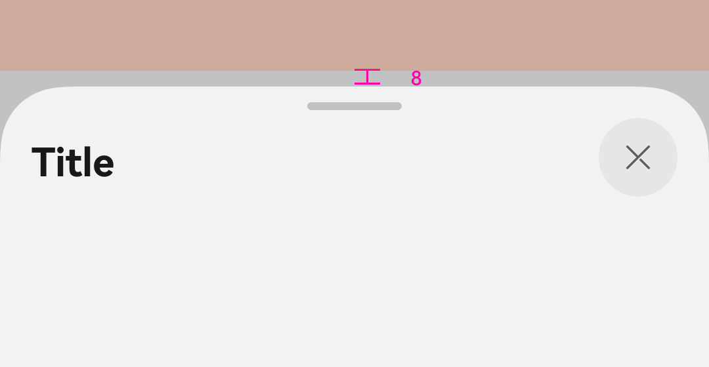

# ArkUI子系统Changelog

## cl.arkui.1  半模态底部样式最大高度默认避让状态栏安全区

**访问级别**

公开接口

**变更原因**

UX规格变更。

半模态底部样式最大高度默认避让状态栏安全区。

**变更影响**

此变更不涉及应用适配。

场景1：竖屏下，状态栏隐藏时，半模态底部样式最大高度也需要避让状态栏安全区。

- 变更前：状态栏隐藏时，半模态底部样式最大高度距离屏幕上边界8vp，未避让状态栏安全区。
- 变更后：API version 16及以后，状态栏隐藏时，半模态底部样式最大高度距离状态栏下边界8vp，避让状态栏安全区。该样式的最大高度为屏幕高度 - (窗口状态栏安全区高度 + 安全间距8vp)。

| 变更前 | 变更后 |
|------ |--------|
|||

场景2：横屏下，状态栏不隐藏时，半模态底部样式最大高度也需要避让状态栏安全区。

- 变更前：状态栏不隐藏时，半模态底部样式最大高度距离屏幕上边界8vp，未避让状态栏安全区，且与状态栏区域重合。
- 变更后：API version 16及以后，状态栏不隐藏时，半模态底部样式最大高度距离状态栏下边界8vp，避让状态栏安全区。该样式的最大高度为屏幕高度 - (窗口状态栏安全区高度 + 安全间距8vp)。

| 变更前 | 变更后 |
|------ |--------|
|||

**起始API Level**

11

**变更发生版本**

从OpenHarmony SDK 5.1.0.48 版本开始。

**变更的接口/组件**

bindSheet的LARGE属性

**适配指导**

若开发者自定义的builder面板内容是固定高度，建议使用100%布局，变更后自定义的内容也可以自动撑满半模态面板。

若按变更前的最大高度规格限制的builder内容，需要变更为新规格计算。