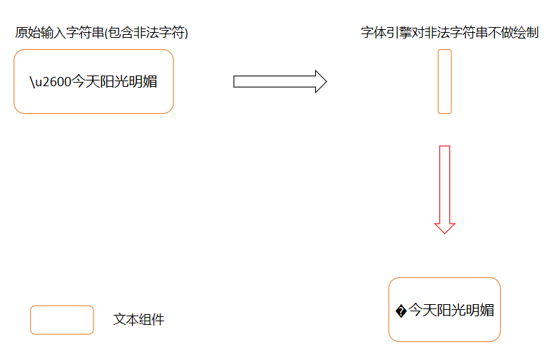

# ArkGraphics2D变更说明

## cl.arkgraphics2d 新增对非法 unicode 显示进行优化

**访问级别**

公开接口

**变更原因**

为了进一步提升文字显示效果, 新增对所有非法字符以 `/ufffd` 代替

**变更影响**

该变更为非兼容性变更, 所有出现在代理对码点区间的不完整代理码位或逆序码位(代理对高位低位位置调换)均由原来的整段不显示调整为非法字符由 `/ufffd` 代替, 其余字符正常显示

**起始 API Level**

16

**变更发生版本**

OpenHarmony SDK 5.0.1.49 版本开始。

**变更的接口/组件**

所有文本绘制相关组件及接口

**适配指导**

此次截断 unicode 显示优化仅针对非法 unicode 场景, 若无非法 unicode, 则不涉及适配; 若渲染文字中出现 � ,需要开发者根据实际场景自行决定是否修改原文本或保持字体引擎侧渲染后的效果