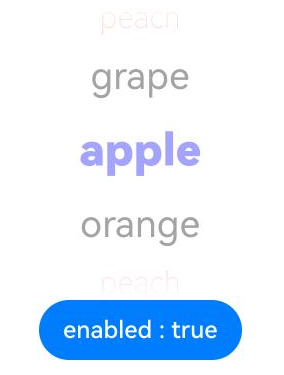
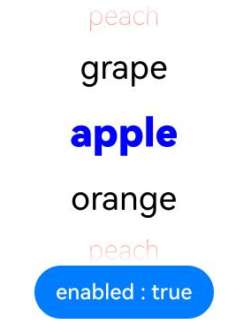

# ArkUI子系统Changelog

## cl.arkui.1 DatePicker、TextPicker和TimePicker的enabled、visibility参数动态改变后文本显示颜色变更

**访问级别**

公开接口

**变更原因**

DatePicker、TextPicker和TimePicker的enabled、visibility属性动态改变后，文本颜色呈现半透明。

**变更影响**

此变更无需应用适配。   
DatePicker、TextPicker和TimePicker的enabled参数由false变为true或者visibility参数由None/Hidden变为Visible后，文本颜色由之前的半透明变为初始颜色。

执行以下TextPicker示例时：

```ts
@Entry
@Component
struct TextPickerExample {
  private fruits: string[] = ['apple', 'orange', 'peach', 'grape'];
  @State isEnabled: boolean = true;

  build() {
    Column() {
      TextPicker({ range: this.fruits })
        .onChange(() => {
        })
        .disappearTextStyle({ color: Color.Red, font: { size: 20, weight: FontWeight.Lighter } })
        .textStyle({ color: Color.Black, font: { size: 25, weight: FontWeight.Normal } })
        .selectedTextStyle({ color: Color.Blue, font: { size: 30, weight: FontWeight.Bolder } })
        .divider(null)
        .enabled(this.isEnabled)

      Button("enabled : " + this.isEnabled).onClick(() => {
        this.isEnabled = !this.isEnabled // 点击button，动态切换组件的使能
      })
    }.width('100%').height('100%')
  }
}
```

| 变更前 | 变更后 |
|---------|---------|
|         |         |

**起始API Level**

API 8

**变更发生版本**

从OpenHarmony 5.1.0.49开始。

**变更的接口/组件**

DatePicker、TextPicker和TimePicker组件。

**适配指导**

DatePicker、TextPicker和TimePicker的enabled参数由"false"变为"true"或者visibility参数由"None/Hidden"变为"Visible"后，文本颜色恢复默认，开发者无需适配。