# ArkUI子系统Changelog

## cl.arkui.1 弹窗类组件适配系统窗口安全区

**访问级别**

公开接口

**变更原因**

系统类型窗口下，弹窗类组件未避让安全区，导致弹窗显示内容与状态栏、导航条发生重叠

**变更影响**

该变更不涉及应用适配

变更前：系统类型窗口下，弹窗类组件未避让安全区，显示内容与状态栏、导航条重叠

变更后：系统类型窗口下，弹窗类组件避让安全区，显示内容与状态栏、导航条不重叠

| 组件 | 变更前 | 变更后 |
| :---: | :---: | :---: |
| Menu (无预览图) | 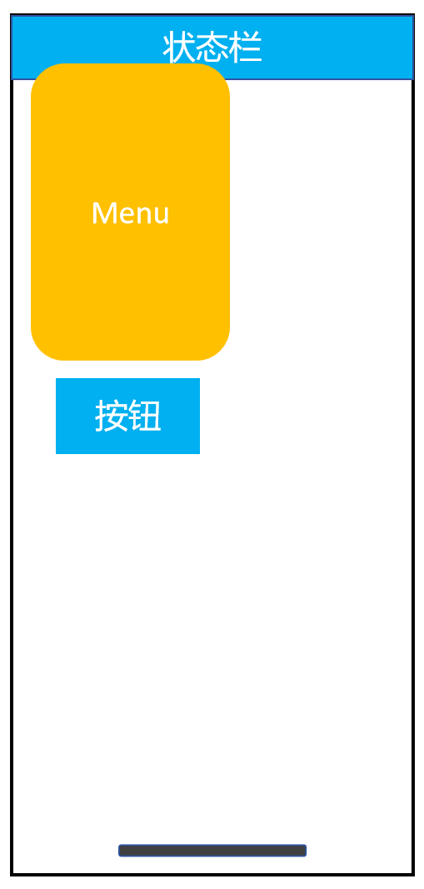   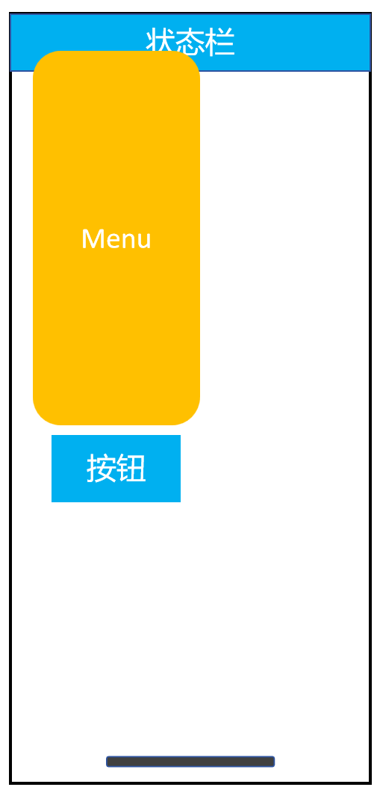 |    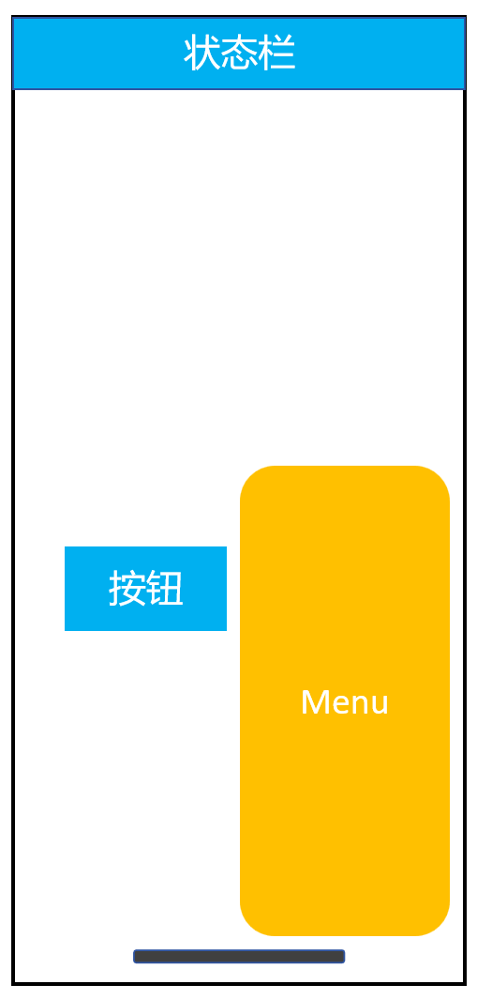 |
| Menu (有预览图) | 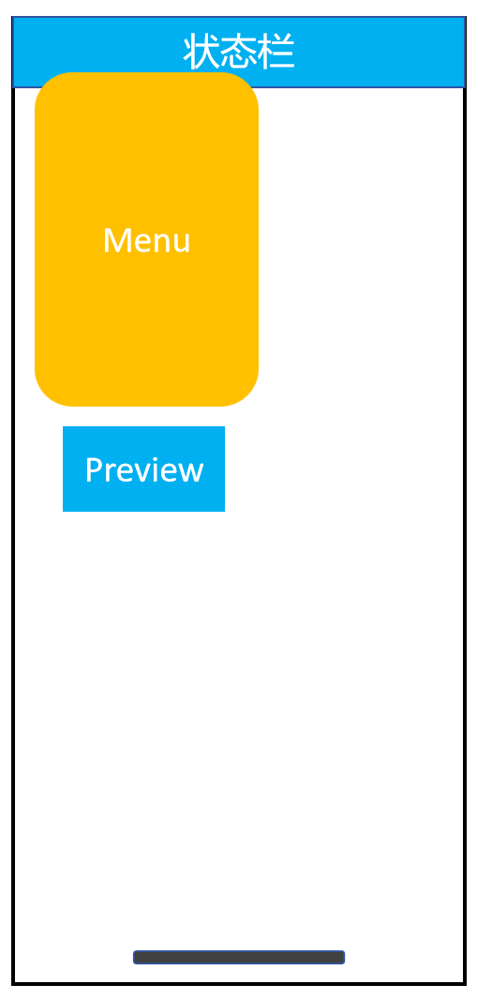   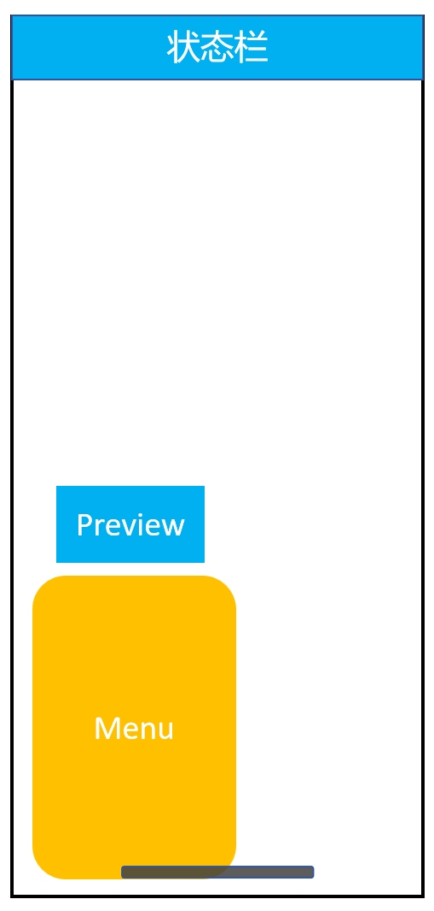 |    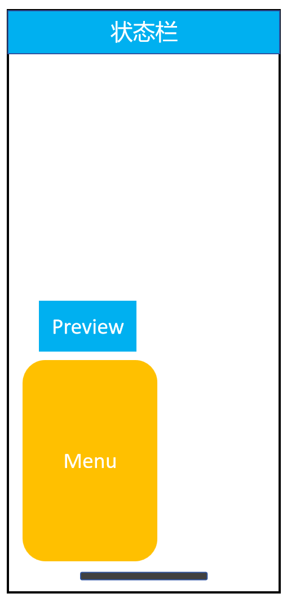 |
| Popup | 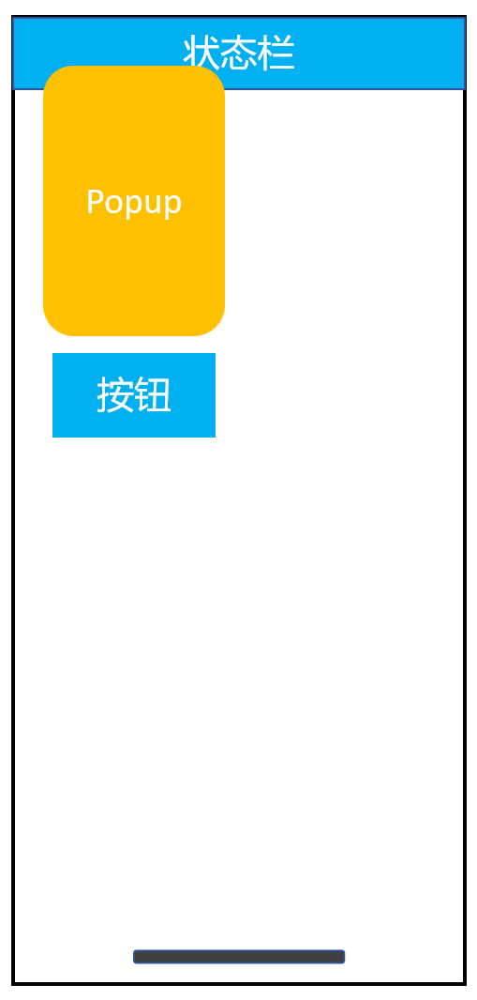   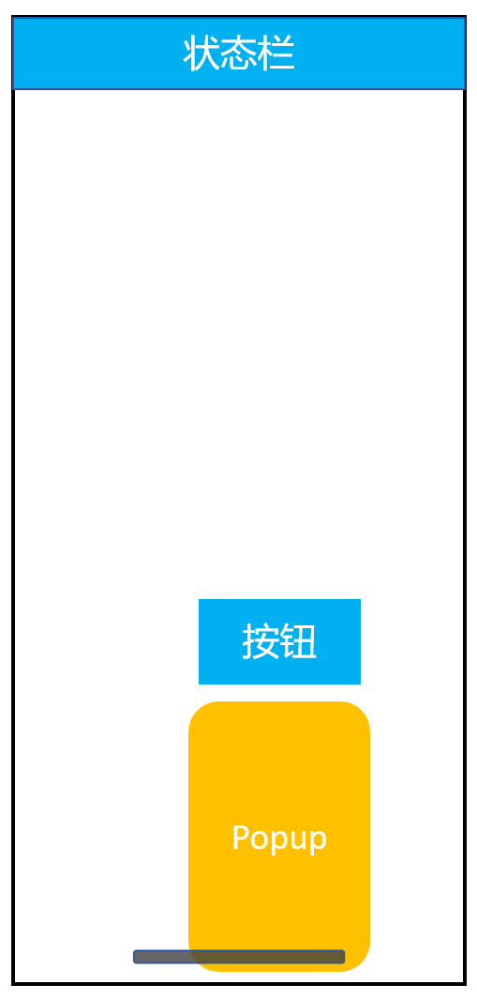 | 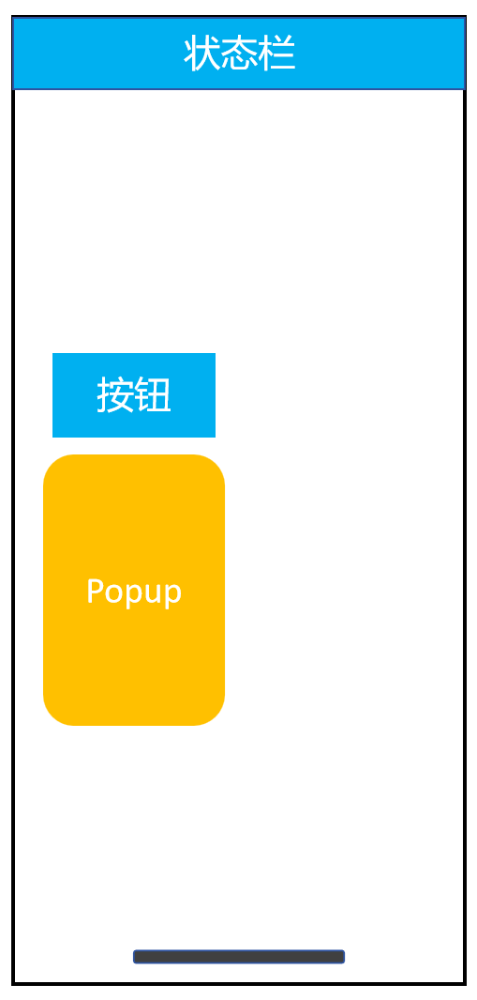   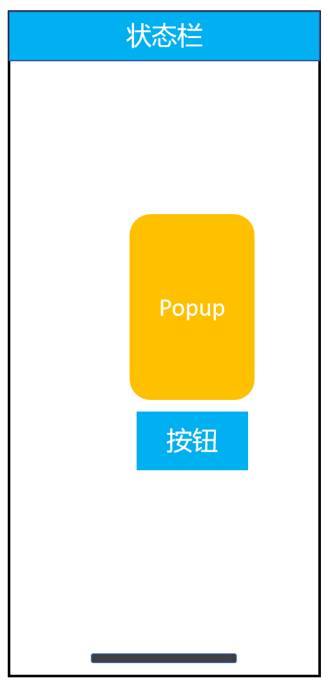 |
| Dialog | 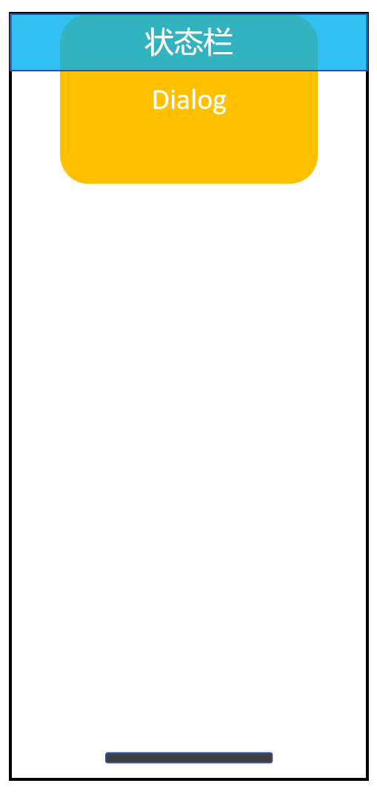   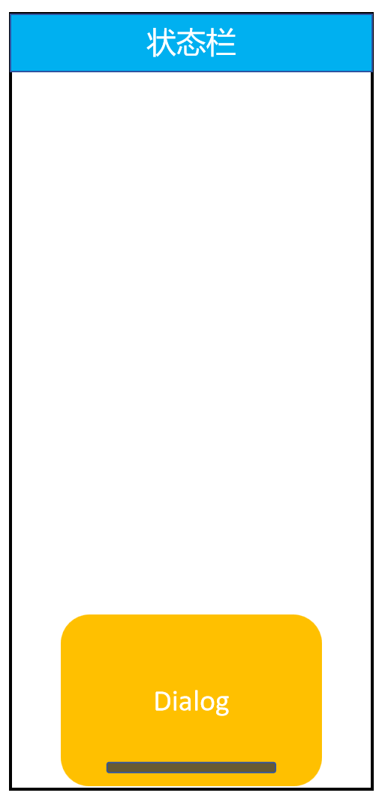 | 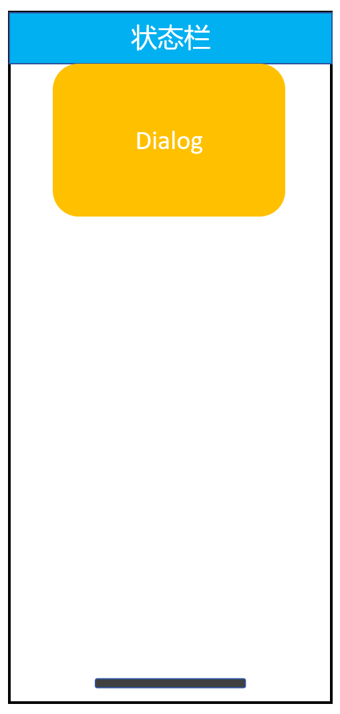   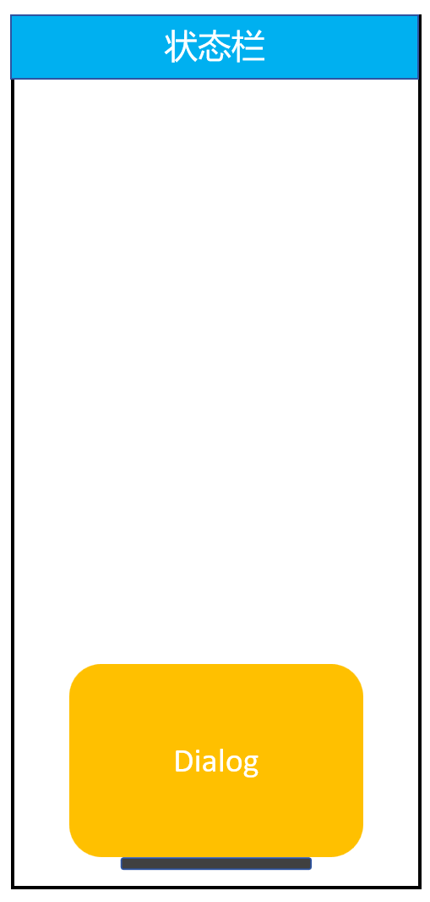 |
| Toast | 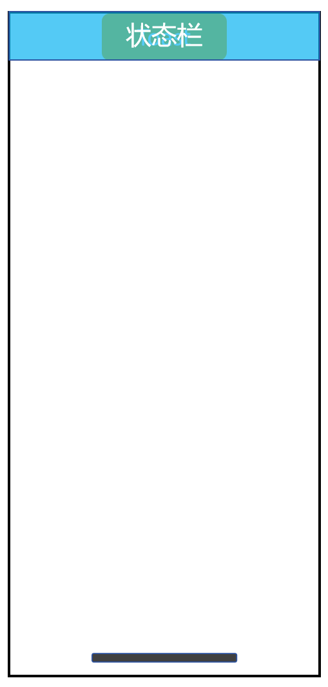   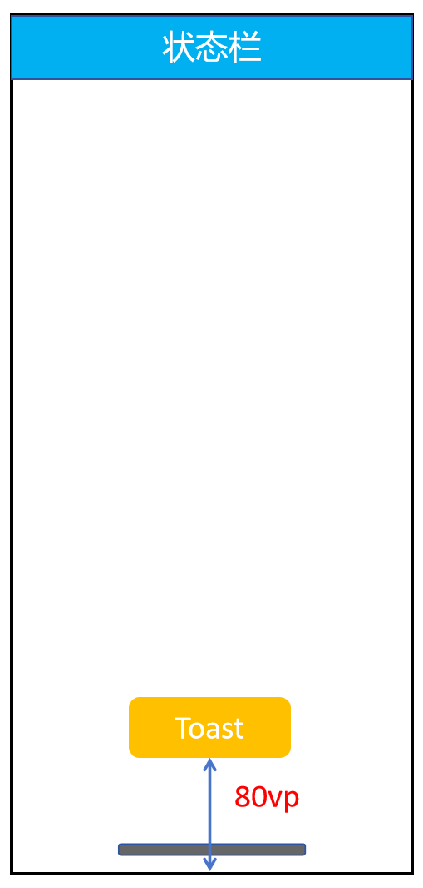 | 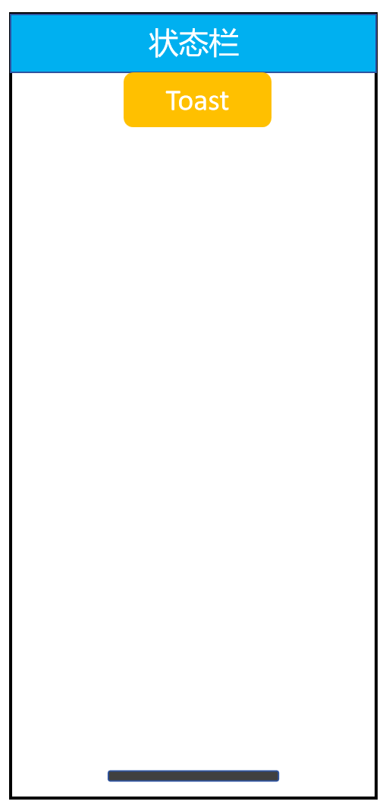   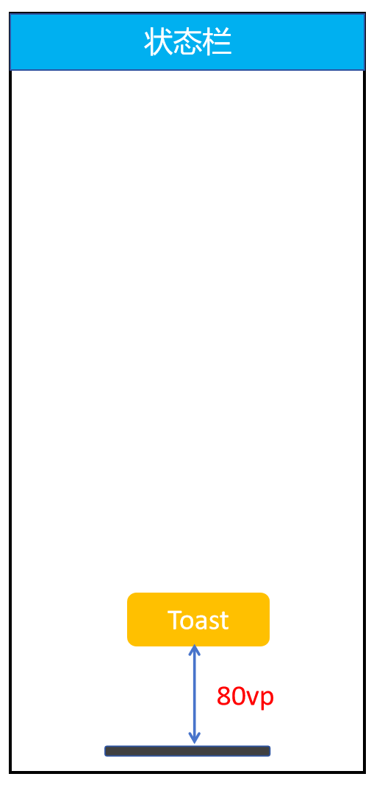 |

**起始API Level**

Menu: API 7

Popup: API 7

Dialog: API 7

Toast: API 9

**变更发生版本**

从OpenHarmony SDK 5.1.0.50开始。

**变更的接口/组件**

Menu组件、Dialog组件、Popup组件、Toast组件。

**适配指导**

默认避让行为变更，无需适配，但应注意变更后的默认效果是否符合开发者预期，如不符合则应自定义修改效果控制变量以达到预期。

## cl.arkui.2 Toast避让行为变更

**访问级别**

公开接口

**变更原因**

优化Toast的避让行为，增强用户体验。

**变更影响**

此变更不涉及应用适配。

变更点1：弹出键盘时的避让行为变更。

| 变更前 | 变更后 |
|---------|---------|
|无论Toast是否会被键盘遮挡，Toast总是上移一定的高度。   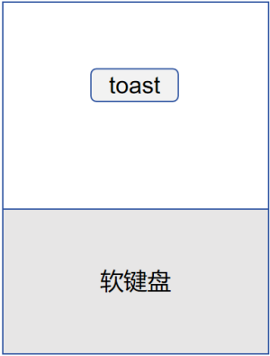       |如果Toast的位置高于键盘，其位置保持不变。否则，将其上移至键盘上方80vp的位置。   |

变更点2：保持Toast在屏幕内显示。

| 变更前 | 变更后 |
|---------|---------|
| 部分场景下Toast可能超出屏幕显示。         | 当屏幕可用空间不够时，缩小Toast底部避让的距离。         |

**起始API Level**

API 9

**变更发生版本**

从OpenHarmony SDK 5.1.0.50开始。

**变更的接口/组件**

promptAction.showToast

**适配指导**

默认行为变更，无需适配。

