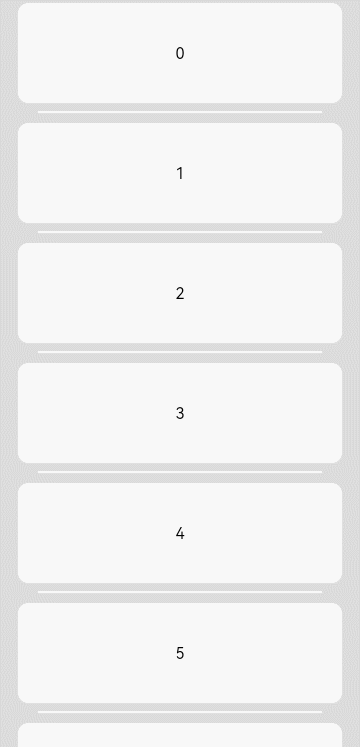
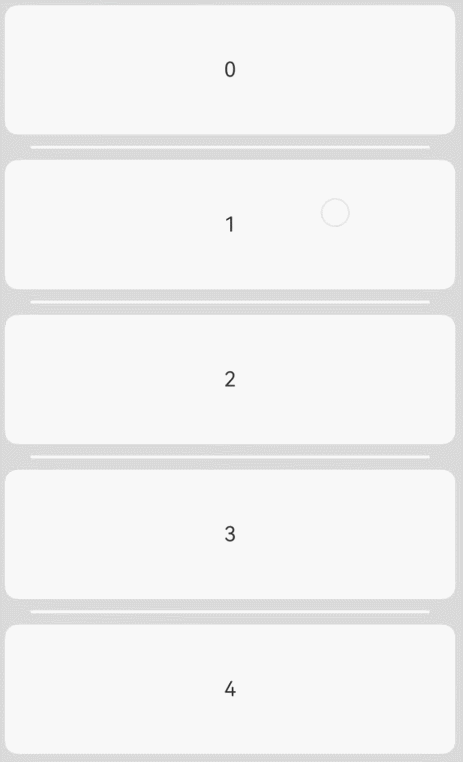

# ArkUI子系统Changelog

## cl.arkui.1 弹窗类组件适配系统窗口安全区

**访问级别**

公开接口

**变更原因**

系统类型窗口下，弹窗类组件未避让安全区，导致弹窗显示内容与状态栏、导航条发生重叠

**变更影响**

该变更不涉及应用适配

变更前：系统类型窗口下，弹窗类组件未避让安全区，显示内容与状态栏、导航条重叠

变更后：系统类型窗口下，弹窗类组件避让安全区，显示内容与状态栏、导航条不重叠


| 组件 | 变更前 | 变更后 |
| :---: | :---: | :---: |
| Menu (无预览图) |  <br>  |  <br>  |
| Menu (有预览图) |  <br>  |  <br>  |
| Popup |  <br>  |  <br>  |
| Dialog |  <br>  |  <br>  |
| Toast |  <br>  |  <br>  |

**起始API Level**

Menu: API 7

Popup: API 7

Dialog: API 7

Toast: API 9

**变更发生版本**

从OpenHarmony SDK 5.1.0.50开始。

**变更的接口/组件**

Menu组件、Dialog组件、Popup组件、Toast组件。

**适配指导**

默认避让行为变更，无需适配，但应注意变更后的默认效果是否符合开发者预期，如不符合则应自定义修改效果控制变量以达到预期。

## cl.arkui.2 Toast避让行为变更

**访问级别**

公开接口

**变更原因**

优化Toast的避让行为，增强用户体验。

**变更影响**

此变更不涉及应用适配。

变更点1：弹出键盘时的避让行为变更。

| 变更前 | 变更后 |
|---------|---------|
|无论Toast是否会被键盘遮挡，Toast总是上移一定的高度。<br>         |如果Toast的位置高于键盘，其位置保持不变。否则，将其上移至键盘上方80vp的位置。<br>  |

变更点2：保持Toast在屏幕内显示。

| 变更前 | 变更后 |
|---------|---------|
| 部分场景下Toast可能超出屏幕显示。<br>        | 当屏幕可用空间不够时，缩小Toast底部避让的距离。<br>        |

**起始API Level**

API 9

**变更发生版本**

从OpenHarmony SDK 5.1.0.50开始。

**变更的接口/组件**

promptAction.showToast

**适配指导**

默认行为变更，无需适配。

## cl.arkui.3  animation动画接口在播放次数为无限循环时的行为变更

**访问级别**

公开接口

**变更原因**

布局过程中触发的同步回调里所做的修改，可能会被纳入animation的无限循环动画中，产生预期外的无限循环动画且无法停止。

**变更影响**

此变更涉及应用适配。

变更前：在调用无限循环的animation动画接口时，若在布局过程中触发的同步回调里进行修改，这些修改可能会被纳入无限循环动画中，从而导致产生非预期的无限循环动画，且该动画将无法停止。

变更后：在调用无限循环的animation动画接口时，为避免布局过程中触发的同步回调里所做的修改被纳入animation无限循环动画中，动画闭包开启前将执行最多两次额外刷新作为保护措施。对于两次额外刷新仍无法有效保护的场景，其表现将与原有行为一致，同样可能产生无限循环动画。

**起始API Level**

API 7

**变更发生版本**

从OpenHarmony SDK 5.1.0.49开始。

**变更的接口/组件**

common.d.ts文件animation接口。

**适配指导**

为避免布局过程中触发的同步回调里所做的修改被纳入animation无限循环动画，应将修改置于恰当的逻辑，即相对独立时机的事件中，如onClick事件。如果不需要产生动画，直接在onClick事件中设置即可，如果需要产生动画，需要在onClick事件中显式的将操作写入animateTo动画。
适配后：

```ts
@Entry
@Component
struct AttrAnimationExample {
  @State rotateAngle: number = 0
  @State arr: number[] = [0, 1, 2, 3, 4, 5, 6, 7, 8, 9]
  scroller:Scroller = new Scroller();
  @State h: number|string = "70%";

  build() {
    Column() {
      List({space:10, scroller:this.scroller}) {
        ForEach(this.arr, (index: number, item: number)=>{
          ListItem() {
            Text(item.toString())
          }
          .height(200)
          .borderRadius(10)
          .backgroundColor(0xDCDCDC)
          .width("100%")
        })
      }
      .width("100%")
      .height(this.h)
      // 在当前页面存在触发动效逻辑的情况下，不建议将操作放在同步回调中执行，建议写法参考onClick事件中的注释
      // .onSizeChange((oldValue: SizeOptions, newValue: SizeOptions)=>{
      //   this.scroller.scrollEdge(Edge.Bottom) // 同步回调中触发的操作可能会被纳入animation无限动画，产生预期外的效果
      // })

      Button('click')
        .rotate({ angle: this.rotateAngle })
        .animation({
          duration: 1000,
          curve: Curve.Linear,
          iterations: -1, // 设置-1表示动画无限循环
        })
        .onClick(() => {
          this.h = "80%"
          this.rotateAngle = 360

          //   无需产生动画，在onClick中直接设置即可
          //   this.scroller.scrollEdge(Edge.Bottom)

          //   需要产生动画，在animateTo中设置
          //   animateTo({}, () => {
          //     this.scroller.scrollEdge(Edge.Bottom)
          //   })
        })
    }
    .width('100%')
  }
}
```

## cl.arkui.4 滚动类组件（List、Scroll、Grid、WaterFlow）和Refresh组件过界跟手系数变更

**访问级别**

公开接口

**变更原因**

滚动类组件（List、Scroll、Grid、WaterFlow）和Refresh组件最大下拉过界距离太大，需要调整过界跟手系数，优化体验。

**变更影响**

此变更不涉及应用适配。

| 变更前 | 变更后 |
|---------|---------|
| 滚动类组件和Refresh组件下拉过界时，相同手指滑动，下拉过界距离较大。<br>        | 滚动类组件和Refresh组件下拉过界时，相同手指滑动，下拉过界距离较小。 <br>        |

**起始API Level**

API 7

**变更发生版本**

从OpenHarmony SDK 5.1.0.52开始。

**变更的接口/组件**

ArkUI 滚动类组件（List、Scroll、Grid、WaterFlow）和Refresh组件。

**适配指导**

变更后下拉过界效果更优，无需适配。
