# ArkUI子系统Changelog

## cl.arkui.1 弹窗类组件适配系统窗口安全区

**访问级别**

公开接口

**变更原因**

系统类型窗口下，弹窗类组件未避让安全区，导致弹窗显示内容与状态栏、导航条发生重叠

**变更影响**

该变更不涉及应用适配

变更前：系统类型窗口下，弹窗类组件未避让安全区，显示内容与状态栏、导航条重叠

变更后：系统类型窗口下，弹窗类组件避让安全区，显示内容与状态栏、导航条不重叠


| 组件 | 变更前 | 变更后 |
| :---: | :---: | :---: |
| Menu (无预览图) |  <br>  |  <br>  |
| Menu (有预览图) |  <br>  |  <br>  |
| Popup |  <br>  |  <br>  |
| Dialog |  <br>  |  <br>  |
| Toast |  <br>  |  <br>  |

**起始API Level**

Menu: API 7

Popup: API 7

Dialog: API 7

Toast: API 9

**变更发生版本**

从OpenHarmony SDK 5.1.0.50开始。

**变更的接口/组件**

Menu组件、Dialog组件、Popup组件、Toast组件。

**适配指导**

默认避让行为变更，无需适配，但应注意变更后的默认效果是否符合开发者预期，如不符合则应自定义修改效果控制变量以达到预期。

## cl.arkui.2  animation动画接口在播放次数为无限循环时的行为变更

**访问级别**

公开接口

**变更原因**

布局过程中触发的同步回调里所做的修改，可能会被纳入animation的无限循环动画中，产生预期外的无限循环动画且无法停止。

**变更影响**

此变更涉及应用适配。

变更前：在调用无限循环的animation动画接口时，若在布局过程中触发的同步回调里进行修改，这些修改可能会被纳入无限循环动画中，从而导致产生非预期的无限循环动画，且该动画将无法停止。

变更后：在调用无限循环的animation动画接口时，为避免布局过程中触发的同步回调里所做的修改被纳入animation无限循环动画中，动画闭包开启前将执行最多两次额外刷新作为保护措施。对于两次额外刷新仍无法有效保护的场景，其表现将与原有行为一致，同样可能产生无限循环动画。

**起始API Level**

API 7

**变更发生版本**

从OpenHarmony SDK 5.1.0.49开始。

**变更的接口/组件**

common.d.ts文件animation接口。

**适配指导**

为避免布局过程中触发的同步回调里所做的修改被纳入animation无限循环动画，应将修改置于恰当的逻辑，即相对独立时机的事件中，如onClick事件。如果不需要产生动画，直接在onClick事件中设置即可，如果需要产生动画，需要在onClick事件中显式的将操作写入animateTo动画。
适配后：

```ts
@Entry
@Component
struct AttrAnimationExample {
  @State rotateAngle: number = 0
  @State arr: number[] = [0, 1, 2, 3, 4, 5, 6, 7, 8, 9]
  scroller:Scroller = new Scroller();
  @State h: number|string = "70%";

  build() {
    Column() {
      List({space:10, scroller:this.scroller}) {
        ForEach(this.arr, (index: number, item: number)=>{
          ListItem() {
            Text(item.toString())
          }
          .height(200)
          .borderRadius(10)
          .backgroundColor(0xDCDCDC)
          .width("100%")
        })
      }
      .width("100%")
      .height(this.h)
      // 在当前页面存在触发动效逻辑的情况下，不建议将操作放在同步回调中执行，建议写法参考onClick事件中的注释
      // .onSizeChange((oldValue: SizeOptions, newValue: SizeOptions)=>{
      //   this.scroller.scrollEdge(Edge.Bottom) // 同步回调中触发的操作可能会被纳入animation无限动画，产生预期外的效果
      // })

      Button('click')
        .rotate({ angle: this.rotateAngle })
        .animation({
          duration: 1000,
          curve: Curve.Linear,
          iterations: -1, // 设置-1表示动画无限循环
        })
        .onClick(() => {
          this.h = "80%"
          this.rotateAngle = 360

          //   无需产生动画，在onClick中直接设置即可
          //   this.scroller.scrollEdge(Edge.Bottom)

          //   需要产生动画，在animateTo中设置
          //   animateTo({}, () => {
          //     this.scroller.scrollEdge(Edge.Bottom)
          //   })
        })
    }
    .width('100%')
  }
}
```

## cl.arkui.3 滚动类组件（List、Scroll、Grid、WaterFlow）和Refresh组件过界跟手系数变更

**访问级别**

公开接口

**变更原因**

滚动类组件（List、Scroll、Grid、WaterFlow）和Refresh组件最大下拉过界距离太大，需要调整过界跟手系数，优化体验。

**变更影响**

此变更不涉及应用适配。

| 变更前 | 变更后 |
|---------|---------|
| 滚动类组件和Refresh组件下拉过界时，相同手指滑动，下拉过界距离较大。<br> 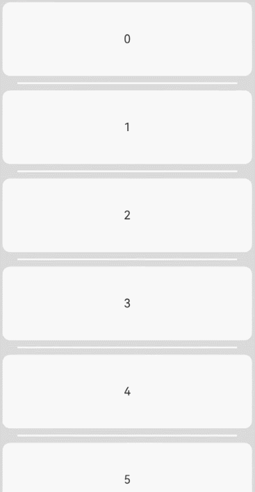       | 滚动类组件和Refresh组件下拉过界时，相同手指滑动，下拉过界距离较小。 <br>        |
| <br> 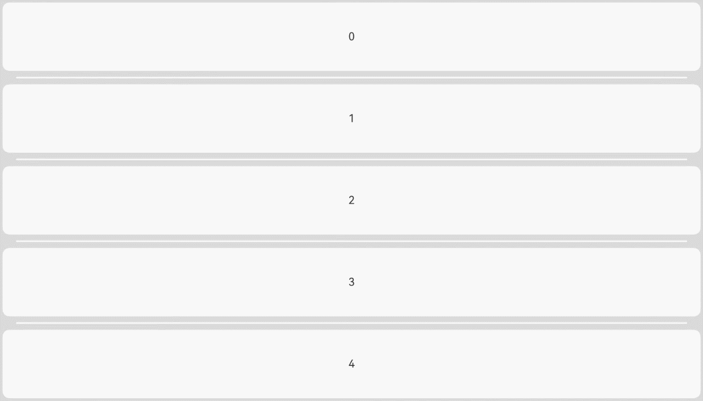       |  <br> 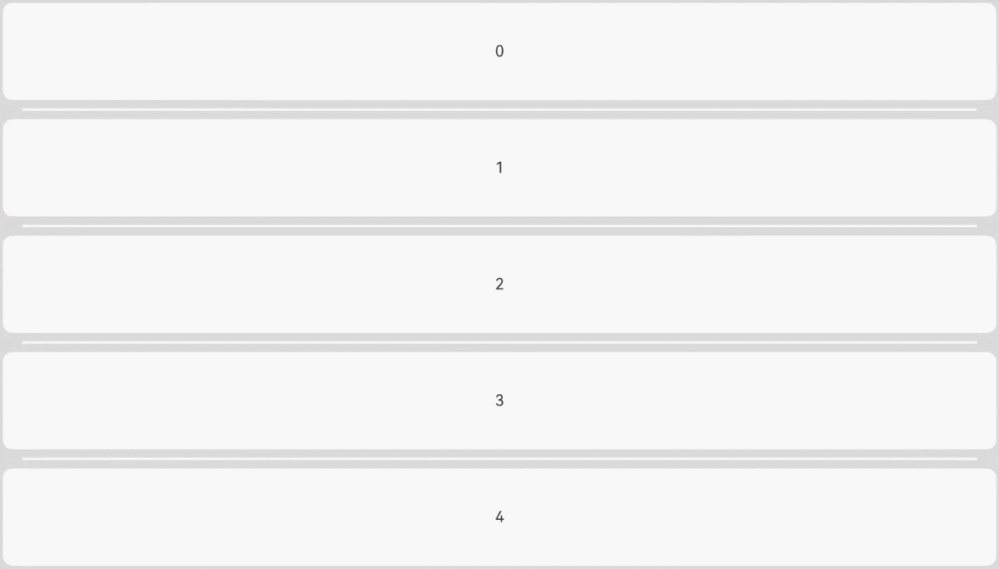       |

**起始API Level**

API 7

**变更发生版本**

从OpenHarmony SDK 5.1.0.52开始。

**变更的接口/组件**

ArkUI 滚动类组件（List、Scroll、Grid、WaterFlow）和Refresh组件。

**适配指导**

变更后下拉过界效果更优，无需适配。

## cl.arkui.4 轴事件支持BEGIN、END及CANCEL类型回调触发

**访问级别**

公开接口

**变更原因**

开发者无法监听到轴事件的BEGIN、END、CANCEL类型的事件回调。

**变更影响**

此变更不涉及应用适配。

变更前：开发者通过OH_NativeXComponent_RegisterUIInputEventCallback接口监听轴事件回调，无法收到BEGIN、END、CANCEL类型的事件回调。

变更后：开发者通过OH_NativeXComponent_RegisterUIInputEventCallback接口监听轴事件回调，可以收到BEGIN、END、CANCEL类型的事件回调。

**起始API Level**

API 12

**变更发生版本**

从OpenHarmony SDK 5.1.0.50开始。

**变更的接口/组件**

OH_NativeXComponent_RegisterUIInputEventCallback接口。

**适配指导**

默认行为变更，无需适配。

## cl.arkui.6  CanvasRenderingContext2D的drawImage接口联合阴影绘制由阴影无法正确绘制变更为阴影正确绘制

**访问级别**

公开接口

**变更原因**

drawImage同名接口根据传入参数的不同，视为不同方法。当drawImage传入image、dx和dy三个参数，且与阴影颜色（shadowColor）、阴影偏置距离（shadowOffsetX和shadowOffsetY）联合绘制时，阴影无法正确绘制。变更后，阴影可以正确绘制。

**变更影响**

该变更涉及应用适配。

- 变更前：当drawImage接口传入image、dx和dy三个参数，且与阴影进行联合绘制时，阴影无法正确绘制。
- 变更后：当drawImage接口传入image、dx和dy三个参数，且与阴影进行联合绘制时，阴影可以正确绘制。

|               变更前                |              变更后               |
| :---------------------------------: | :-------------------------------: |
| 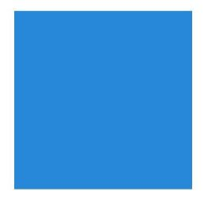 |  |

**起始API Level**

9

**变更发生版本**

从OpenHarmony SDK 5.1.0.50 版本开始。

**变更的接口/组件**

CanvasRenderingContext2D的drawImage接口

**适配指导**

变更后，使用drawImage接口与阴影进行联合绘制时，阴影能够被正确绘制。

**示例**

```ts
@Entry
@Component
struct Page1 {
  private settings: RenderingContextSettings = new RenderingContextSettings(true)
  private context: CanvasRenderingContext2D = new CanvasRenderingContext2D(this.settings)
  private img: ImageBitmap = new ImageBitmap("common/images/example.png")

  build() {
    Flex({ direction: FlexDirection.Column, alignItems: ItemAlign.Center, justifyContent: FlexAlign.Center }) {
      Canvas(this.context)
        .width('100%')
        .height('100%')
        .onReady(() => {
          this.context.shadowColor = "rgb(213,213,213)"
          this.context.shadowOffsetX = 40
          this.context.shadowOffsetY = 40
          this.context.drawImage(this.img, 20, 20)
        })
    }
    .width('100%')
    .height('100%')
  }
}
```

## cl.arkui.7  CanvasRenderingContext2D的measureText接口测算文本的结果变更

**访问级别**

公开接口

**变更原因**

在运用measureText接口进行文本尺寸测量时，在下述场景1与场景2中，所测得的文本宽度呈现异常值：
- 场景1：当Context与某一Canvas解除绑定后，再与另一Canvas重新绑定时，若未重新设定font属性，或在重新设定font属性时遗漏了font-size的指定，那么在绘制文本时将采用重置后的font-size（即默认值）。然而，在进行文本尺寸测量时，系统会错误地沿用前一Canvas中设定的font-size，从而导致文本宽度测量结果出现偏差。
- 场景2：在font属性的设定过程中，若首次已明确指定font-style，而第二次设定了不同的font-style，虽然在绘制文本时会采用新设定的font-style，但在进行文本尺寸测量时，系统却依旧沿用上一次设定的font-style，同样造成文本宽度测量结果的不准确。

**变更影响**

该变更不涉及应用适配。

使用measureText接口进行文本测算时：

- 变更前：在场景1和场景2中，文本测算得到的文本宽度均为错误值。
- 变更后：在场景1和场景2中，文本测算得到的文本宽度均为正确值。

运行场景1的示例：

```ts
@Entry
@Component
struct example1 {
  private settings: RenderingContextSettings = new RenderingContextSettings(true)
  private context: CanvasRenderingContext2D = new CanvasRenderingContext2D(this.settings)
  @State flag: boolean = false

  build() {
    Column() {
      Button('transfer')
        .position({x:200, y:0})
        .width(100)
        .height(40)
        .onClick(() => {
          this.flag = !this.flag
        })
      Canvas(this.context)
        .position({x:100, y:45})
        .width('300')
        .height('100')
        .backgroundColor('rgb(39,135,237)')
        .onReady(() => {
          this.context.textAlign = 'center'
          this.context.font = '20vp'
          this.context.fillText('width:' + this.context.measureText('Hello World').width, this.context.width/2, 30)
        })
      if (this.flag) {
        Canvas(this.context)
          .position({x:100, y:145})
          .width('300')
          .height('100')
          .backgroundColor('rgb(213,213,213)')
          .onReady(() => {
            this.context.textAlign = 'center'
            this.context.fillText('width:' + this.context.measureText('Hello World').width, this.context.width/2, 30)
          })
      }
    }
    .width('100%')
    .height('100%')
  }
}
```

|                   变更前                   |                 变更后                  |
| :----------------------------------------: | :-------------------------------------: |
| 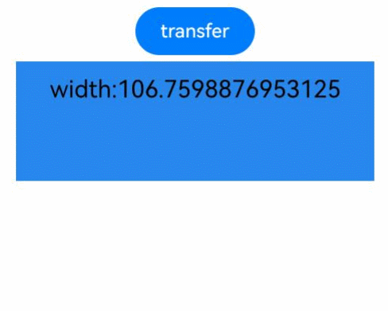 | 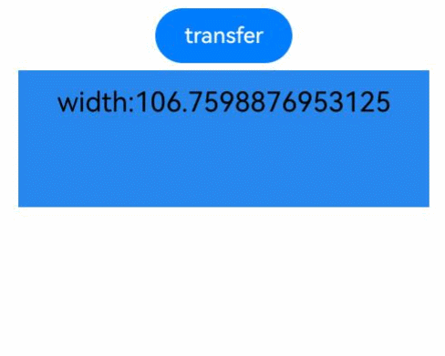 |

运行场景2的示例：

```ts
@Entry
@Component
struct example2 {
  private settings: RenderingContextSettings = new RenderingContextSettings(true)
  private context: CanvasRenderingContext2D = new CanvasRenderingContext2D(this.settings)

  build() {
    Flex({ direction: FlexDirection.Column, alignItems: ItemAlign.Center, justifyContent: FlexAlign.Center }) {
      Canvas(this.context)
        .width('100%')
        .height('100%')
        .backgroundColor('rgb(255,192,0)')
        .onReady(() => {
          this.context.font = 'italic 25vp'
          this.context.fillText('width:' + this.context.measureText('Hello World').width, 10, 50)
          this.context.font = 'normal'
          this.context.fillText('width:' + this.context.measureText('Hello World').width, 10, 100)
        })
    }
    .width('100%')
    .height('100%')
  }
}
```

|                   变更前                   |                 变更后                  |
| :----------------------------------------: | :-------------------------------------: |
| 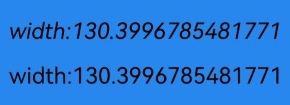 | 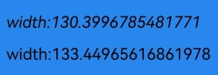 |

**起始API Level**

9

**变更发生版本**

从OpenHarmony SDK 5.1.0.50 版本开始。

**变更的接口/组件**

CanvasRenderingContext2D的measureText接口

**适配指导**

无需适配，但应注意变更后的行为是否对整体应用逻辑产生影响。

## cl.arkui.8 CanvasRenderingContext2D的miterLimit接口，当传入参数为0时，其异常值的处理方式发生变更

**访问级别**

公开接口

**变更原因**

CanvasRenderingContext2D的miterLimit接口，当传入参数为0时，未按照默认值设置参数，与文档所规定的处理异常值的方式不符。

**变更影响**

该变更涉及应用适配。

|               变更前                |              变更后               |
| :---------------------------------: | :-------------------------------: |
| 当传入参数0为时，未按照默认值进行参数设置。<br>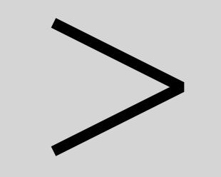 | 当传入参数为0时，按照默认值进行参数设置。<br>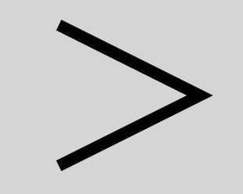 |

**起始API Level**

9

**变更发生版本**

从OpenHarmony SDK 5.1.0.50 版本开始。

**变更的接口/组件**

CanvasRenderingContext2D的miterLimit接口

**适配指导**

变更后，使用miterLimit接口，当传入参数0为时，按照默认值进行参数设置，即miterLimit被设置为10。

**示例**

```ts
@Entry
@Component
struct MiterLimit {
  private settings: RenderingContextSettings = new RenderingContextSettings(true)
  private context: CanvasRenderingContext2D = new CanvasRenderingContext2D(this.settings)

  build() {
    Flex({ direction: FlexDirection.Column, alignItems: ItemAlign.Center, justifyContent: FlexAlign.Center }) {
      Canvas(this.context)
        .width('100%')
        .height('100%')
        .backgroundColor('rgb(213,213,213)')
        .onReady(() => {
          this.context.lineWidth = 10
          this.context.lineJoin = 'miter'
          this.context.miterLimit = 0
          this.context.moveTo(50, 30)
          this.context.lineTo(170, 90)
          this.context.lineTo(50, 150)
          this.context.stroke()
        })
    }
    .width('100%')
    .height('100%')
  }
}
```

## cl.arkui.9 弹出框标题换行优先策略及内容区默认对齐方式变更

**访问级别**

公开接口

**变更原因**

弹窗标题及内容风格优化，增强用户体验。

**变更影响**

此变更不涉及应用适配。

变更点1：弹窗标题超长换行优先规则变更。

| 变更前                                                                                 | 变更后                                                                            |
|-------------------------------------------------------------------------------------|--------------------------------------------------------------------------------|
| 弹窗标题超长时，优先缩小字号，最小至9vp，然后再换行展示。<br>  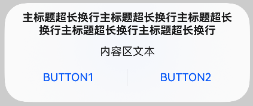 | 弹窗标题超长时，优先换行，再缩小字号展示，最小至9vp。<br>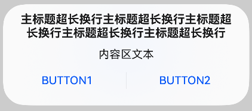 |

变更点2：弹窗内容超过一行时默认对齐行为变更。

| 变更前                                                                  | 变更后                                                              |
|----------------------------------------------------------------------|------------------------------------------------------------------|
| 弹窗内容多行文本时居左对齐。<br> 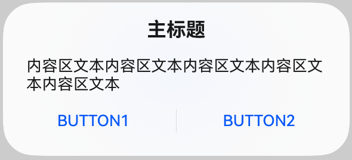 | 弹窗内容文本居中对齐。<br> 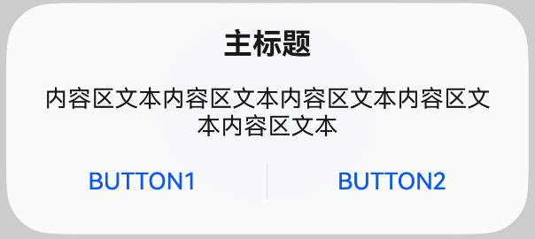 |

**起始API Level**

API 10

**变更发生版本**

从OpenHarmony SDK 5.1.0.50开始。

**变更的接口/组件**

advancedDialog

**适配指导**

默认行为变更，无需适配。系统弹窗默认规格优化演进，若开发者有其他布局、样式诉求，建议使用CustomDialog自定义实现。