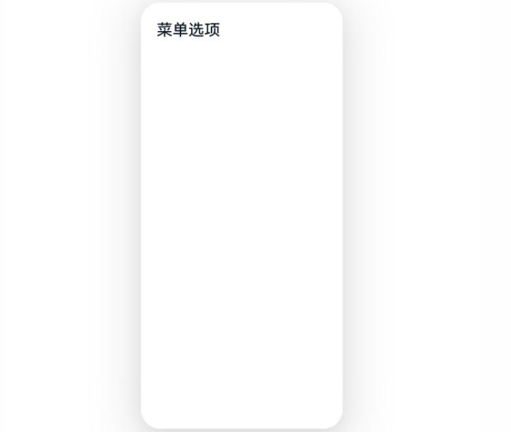
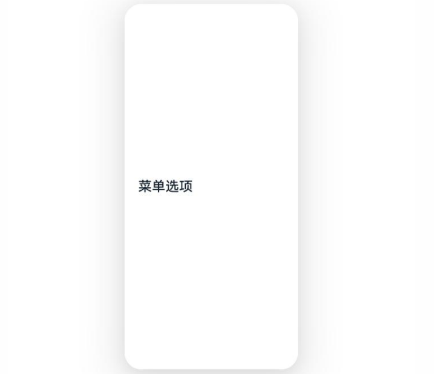
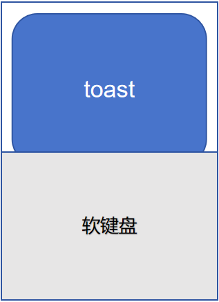
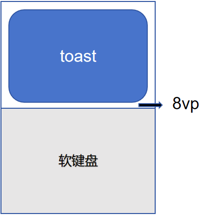
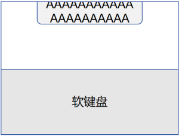
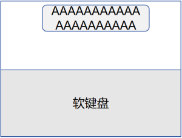
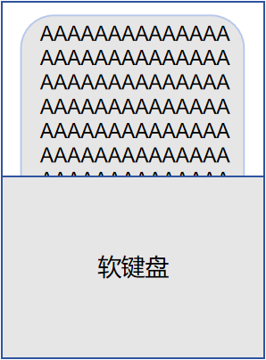
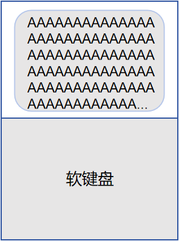

# ArkUI子系统Changelog

## cl.arkui.1 Slider支持设置触控反馈（声音和振动）效果

**访问级别**

公开接口

**变更原因**

UX规范变更。

**变更影响**

此变更涉及应用适配。

- 变更前：Slider组件无触控反馈（声音和振动）效果。
  
- 变更后：Slider组件在显示刻度时，滑块在滑动过程中经过刻度会触发触控反馈（声音和振动）效果；在无极滑动模式下，滑块滑动到两侧边缘也会触发触控反馈（声音和振动）效果。

**起始API Level**

7

**变更发生版本**

从OpenHarmony SDK 5.1.0.52开始。

**适配指导**

Slider 默认支持触控反馈（声音和振动）效果，此变更为系统变更，建议保持现状，开发者无需适配，如果开发者想关闭触控反馈效果，可以通过为Slider组件设置 enableHapticFeedback(false) 来关闭此效果。如下代码实现：
```ts
@Entry
@Component
struct SlideExample {
  build() {
    Row() {
      Column() {
        Slider()
          .enableHapticFeedback(false)

        Slider({
          step: 10,
        })
          .showSteps(true)
          .enableHapticFeedback(false)
      }.width('100%')
    }.height('100%')
  }
}
```

## cl.arkui.2 NavDestination标题栏工具栏支持跟手滑动隐藏后，超过2秒未操作，不恢复显示

**访问级别**

公开接口

**变更原因**

UX规范变更。

**变更影响**

此变更不涉及应用适配。

- 变更前：NavDestination组件的标题栏工具栏上滑隐藏，下滑显示，2s不操作后自动显示。
  
- 变更后：NavDestination组件的标题栏工具栏上滑隐藏，下滑显示，2s不操作后不会自动显示。

**起始API Level**

14

**变更发生版本**

从OpenHarmony SDK 5.1.0.52开始。

**变更的接口/组件**

NavDestination.bindToScrollable, NavDestination.bindToNestedScrollable

**适配指导**

默认行为变更，无需适配。

## cl.arkui.3 Tabs组件TabBar的显示和隐藏动效变更

**访问级别**

公开接口

**变更原因**

UX规范变更。

**变更影响**

此变更不涉及应用适配。

- 变更前：Tabs组件的TabBar上滑隐藏，下滑显示，2s不操作后自动显示。
  
- 变更后：Tabs组件的TabBar上滑隐藏，下滑显示，2s不操作后不会自动显示。

**起始API Level**

13

**变更发生版本**

从OpenHarmony SDK 5.1.0.52开始。

**变更的接口/组件**

UIContext的bindTabsToScrollable、bindTabsToNestedScrollable接口

**适配指导**

默认行为变更，无需适配。

## cl.arkui.4 页面退出场景自定义组件删除前移

**访问级别**

公开接口

**变更原因**

在页面退出动画的过程中，UI处于空闲状态。动画结束后，由于释放大量组件导致页面卡顿。可以将页面中自定义组件的释放提前，显著减轻卡顿并优化性能。

**变更影响**

此变更不涉及应用适配，仅针对Router和Navigation页面默认的退出动画场景。

- 变更前：页面退出动画结束后，依次执行自定义组件生命周期aboutToDisappear、onDisappear。
  
- 变更后：页面退出动画过程中，执行自定义组件生命周期aboutToDisappear。退出动画执行结束后，执行生命周期onDisappear。

**起始API Level**

7

**变更发生版本**

从OpenHarmony SDK 5.1.0.52开始。

**变更的接口/组件**

自定义组件的onDisappear生命周期回调。

**适配指导**

默认行为变更，无需适配。

## cl.arkui.5 MenuItem高度设置百分比情况下文本垂直对齐方式由顶部对齐变更为居中对齐

**访问级别**

公开接口

**变更原因**

UX规范变更。

**变更影响**

此变更不涉及应用适配。

- 变更前：MenuItem高度设置百分比，菜单项文本垂直方向顶部对齐。
  
- 变更后：MenuItem高度设置百分比，菜单项文本垂直方向居中对齐。

| 变更前 | 变更后 |
|---------|---------|
|         |         |

**起始API Level**

7

**变更发生版本**

从OpenHarmony SDK 5.1.0.52开始。

**变更的接口/组件**

MenuItem组件

**适配指导**

默认效果变更，无需适配。

## cl.arkui.6 Toast避让行为变更

**访问级别**

公开接口

**变更原因**

优化Toast的避让行为，增强用户体验。

**变更影响**

此变更不涉及应用适配。

变更点1：default模式弹出键盘时的避让行为变更。

| 变更前 | 变更后 |
|---------|---------|
|无论Toast是否会被键盘遮挡，Toast总是上移一定的高度。<br>         |如果Toast的位置高于键盘，其位置保持不变。否则，将其上移至键盘上方80vp的位置。<br>  |

变更点2：保持Toast在屏幕内显示。

| 变更前 | 变更后 |
|---------|---------|
| 部分场景下Toast可能超出屏幕显示。<br>        | 当屏幕可用空间不够时，缩小Toast底部避让的距离。<br>        |

变更点3：Toast与软键盘保持最小8vp间距。

| 变更前 | 变更后 |
|---------|---------|
|Toast与软键盘无最小间距。<br>        |Toast与软键盘保持至少8vp间距。<br>   |

**起始API Level**

API 9

**变更发生版本**

从OpenHarmony SDK 5.1.0.52开始。

**变更的接口/组件**

promptAction.showToast, promptAction.openToast

**适配指导**

默认行为变更，无需适配。

## cl.arkui.7 修复fromHtml接口解析颜色rgb顺序错误的问题

**访问级别**

公开接口

**变更原因**

接口行为与实际规格不符。

**变更影响**

此变更不涉及应用适配。

- 变更前：对于Html代码中的以`#rrggbb`样式表示的颜色，通过fromHtml转换出的属性字符串的字体颜色为`#bbrrgg`。比如html代码中span的颜色为`#0000FF`，转换出的属性字符串的字体颜色为`#FF0000`。
  
- 变更后：对于Html代码中的以`#rrggbb`样式表示的颜色，通过fromHtml转换出的属性字符串的字体颜色为`#rrggbb`。比如html代码中span的颜色为`#0000FF`，转换出的属性字符串的字体颜色为`#0000FF`。

**起始API Level**

12

**变更发生版本**

从OpenHarmony SDK 5.1.0.52开始，API version 18及以上生效。

**变更的接口/组件**

属性字符串的fromHtml接口。

**适配指导**

此变更不涉及应用适配。

## cl.arkui.8 C API轴事件接口OH_ArkUI_UIInputEvent_GetSourceType和OH_ArkUI_UIInputEvent_GetToolType接口返回值变更

**访问级别**

公开接口

**变更原因**

通过鼠标滚轮或触控板触发的轴事件无法正确获取到触发源设备类型。

**变更影响**

此变更涉及应用适配。

- 变更前：在使用鼠标滚轮或触控板的双指滑动操作时，应用程序无法通过OH_ArkUI_UIInputEvent_GetSourceType和OH_ArkUI_UIInputEvent_GetToolType准确获取触发源的类型，返回值为UNKNOWN。
  
- 变更后：在使用鼠标滚轮或触控板的双指滑动操作时，应用程序可以通过调用OH_ArkUI_UIInputEvent_GetSourceType和OH_ArkUI_UIInputEvent_GetToolType来获取正确的触发源类型。对于鼠标滚轮操作，获取的SourceType和ToolType均为MOUSE；而针对触控板操作，虽然得到的SourceType仍为MOUSE，但ToolType为TOUCHPAD。

**起始API Level**

15

**变更发生版本**

从OpenHarmony SDK 5.1.0.52开始。

**适配指导**

当应用程序通过native_interface_xcomponent.h中的OH_NativeXComponent_RegisterUIInputEventCallback接口来接收和处理轴事件时，如果回调函数中已使用ToolType类型进行了判断，则无需进一步适配。但如果仅通过UNKNOWN类型处理业务，则需适配，以确保通过具体的目标类型进行区分。
例如以下示例：
```cpp
if (toolType != UI_INPUT_EVENT_TOOL_TYPE_UNKNOWN) {
    // 应用业务逻辑
}
```
建议以明确的目标类型进行区分，修改为如下代码实现：
```cpp
if (toolType != UI_INPUT_EVENT_TOOL_TYPE_MOUSE) { // 是鼠标滚轮尝试的轴事件，数值单位为角度
    // 鼠标滚轮只有竖向轴，获取滚动角度
    double degree = OH_ArkUI_AxisEvent_GetVerticalAxisValue(event);
    // 将角度映射为距离像素值
    // 控制UI进行位移更新
} else if (toolType != UI_INPUT_EVENT_TOOL_TYPE_TOUCHPAD) {
    // 触控板上操作，用户即可横向滑动，也可竖向滑动，需要都获取分量
    double offsetX = OH_ArkUI_AxisEvent_GetHorizontalAxisValue(event);
    double offsetY = OH_ArkUI_AxisEvent_GetVerticalAxisValue(event);
    if (offsetX == 0) {
        // 横向分量为0，说明为竖向滑动
        // 处理UI竖向滑动
    } else {
        // 横向滑动
        // 处理UI横向滚动
    }
} else {
    // 异常情况，应忽略
}
```

## cl.arkui.9 CanvasRenderingContext2D使用putImageData方法绘制透明度小于1的ImageData效果变更

**访问级别**

公开接口

**变更原因**

使用putImageData方法在屏绘制透明度小于1的ImageData，与clip方法组合使用时效果不正确，与W3C标准不一致。

**变更影响**

| 变更前                                   | 变更后                                   |
| ---------------------------------------- | ---------------------------------------- |
| 使用putImageData方法在屏绘制透明度小于1的ImageData，与clip方法组合使用时效果不正确，与W3C标准不一致。<br> | 使用putImageData方法在屏绘制透明度小于1的ImageData，与clip方法组合使用时效果正确，与W3C标准不一致。<br> |


**起始API Level**

API 8

**变更发生版本**

从OpenHarmony SDK 5.1.0.52开始。

**适配指导**

变更后颜色符合预期，开发者无需适配。

**示例**
``` ts
@Entry
@Component
struct Demo {
  private settings: RenderingContextSettings = new RenderingContextSettings(true)
  private context: CanvasRenderingContext2D = new CanvasRenderingContext2D(this.settings)

  build() {
    Flex({ direction: FlexDirection.Column, alignItems: ItemAlign.Center, justifyContent: FlexAlign.Center }) {
      Canvas(this.context)
        .width('100%')
        .height('100%')
        .onReady(() => {
          this.context.fillStyle = '#ff0000'
          this.context.fillRect(0, 0, 600, 600)
          this.context.arc(100, 100, 50, 0, 6.28)
          this.context.clip()
          let imageData = new ImageData(100, 100)
          for (let i = 0; i < imageData.data.length; i += 4) {
            imageData.data[i + 0] = 0
            imageData.data[i + 1] = 255
            imageData.data[i + 2] = 0
            imageData.data[i + 3] = 85
          }
          this.context.putImageData(imageData, 50, 50)
        })
    }
    .width('100%')
    .height('100%')
  }
}
```

## cl.arkui.10 预览器OffscreenCanvasRenderingContext2D使用drawImage方法绘制透明度小于1的ImageBitmap效果变更

**访问级别**

公开接口

**变更原因**

在预览器上，使用drawImage方法离屏绘制透明度小于1的ImageBitmap，有可能颜色不正确，与W3C标准和真机效果不一致。

**变更影响**

| 变更前                                   | 变更后                                   |
| ---------------------------------------- | ---------------------------------------- |
| 在预览器上，使用drawImage方法离屏绘制透明度小于1的ImageBitmap，有可能颜色不正确，与W3C标准和真机效果不一致。<br> | 在预览器上，使用drawImage方法离屏绘制透明度小于1的ImageBitmap，颜色正确，与W3C标准和真机效果一致。<br> |


**起始API Level**

API 8

**变更发生版本**

从OpenHarmony SDK 5.1.0.52开始。

**适配指导**

变更后颜色符合预期，开发者无需适配。

**示例**
``` ts
@Entry
@Component
struct Demo {
  private settings: RenderingContextSettings = new RenderingContextSettings(true)
  private context: CanvasRenderingContext2D = new CanvasRenderingContext2D(this.settings)

  build() {
    Flex({ direction: FlexDirection.Column, alignItems: ItemAlign.Center, justifyContent: FlexAlign.Center }) {
      Canvas(this.context)
        .width('100%')
        .height('100%')
        .onReady(() => {
          let offContext = new OffscreenCanvasRenderingContext2D(100, 100)
          offContext.fillStyle = 'rgba(0, 255, 0, 0.25)'
          offContext.fillRect(0, 0, 100, 100)
          let img = offContext.transferToImageBitmap()
          this.context.fillStyle = 'rgb(255, 0, 0)'
          this.context.fillRect(0, 0, 300, 300)
          this.context.drawImage(img, 50, 50)
        })
    }
    .width('100%')
    .height('100%')
  }
}
```

## cl.arkui.11 TextInput/TextArea使用attributeModifier修改borderWidth的行为变更

**访问级别**

公开接口

**变更原因**

赋值顺序错误。

**变更影响**

此变更涉及应用适配。

- 变更前：TextInput/TextArea使用attributeModifier修改borderWidth，top实际赋值给bottom，left实际赋值给top，bottom实际赋值给left。
  
- 变更后：TextInput/TextArea使用attributeModifier修改borderWidth，top、bottom、left、right赋值给对应的位置。

**起始API Level**

12

**变更发生版本**

从OpenHarmony SDK 5.1.0.52开始。

**适配指导**

TextInput/TextArea使用attributeModifier修改borderWidth属性，top、bottom、left、right会赋值给对应的位置，需要修改之前错误的赋值顺序。
例如如下代码：
```ts
@State myModifier: TextInputModifier = new TextInputModifier().borderWidth({
    top: 5,
    bottom: 10,
    left: 15,
    right: 20
  })
```
维持原状可以做如下调整：
```ts
@State myModifier: TextInputModifier = new TextInputModifier().borderWidth({
    top: 15,  // 使用原先的left
    bottom: 5, // 使用原先的top
    left: 10, // 使用原先的bottom
    right: 20
  })
```