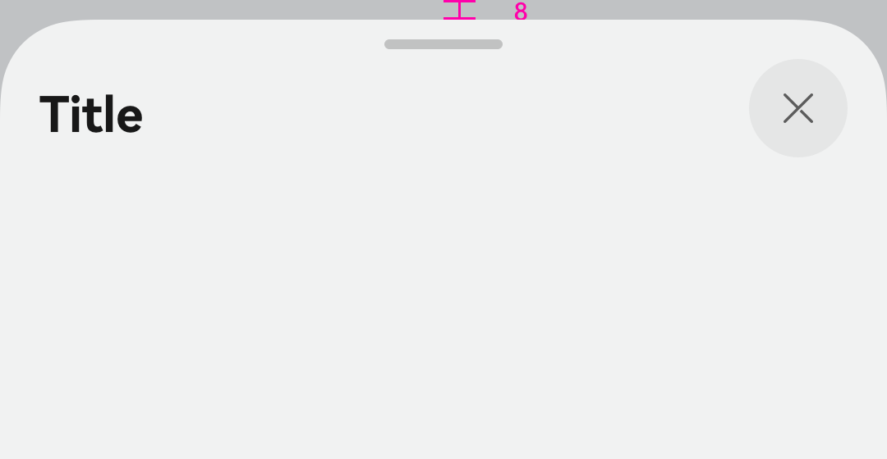
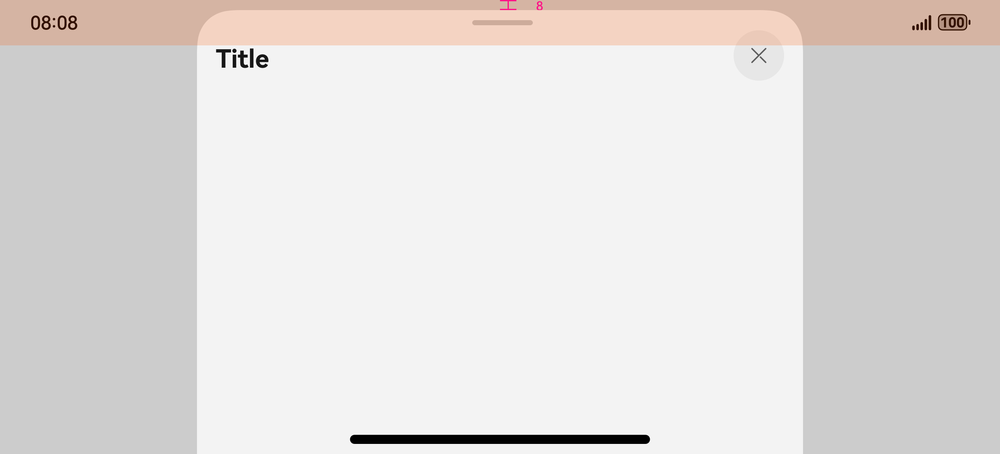
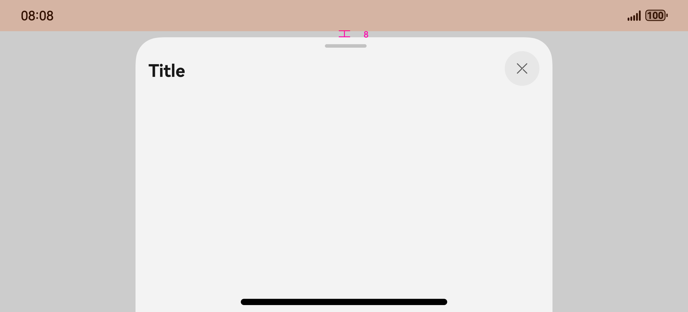
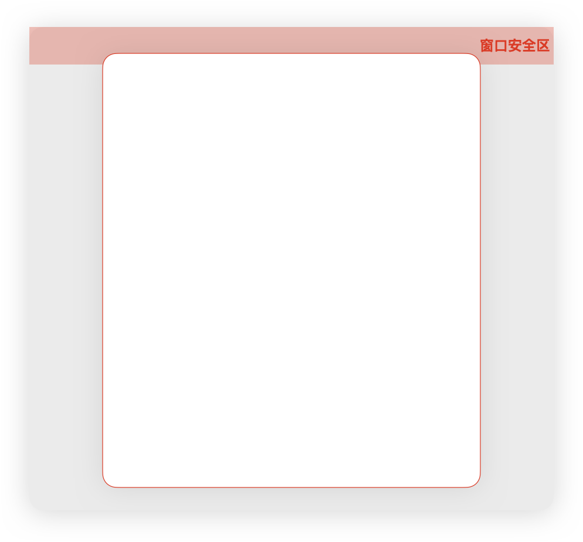
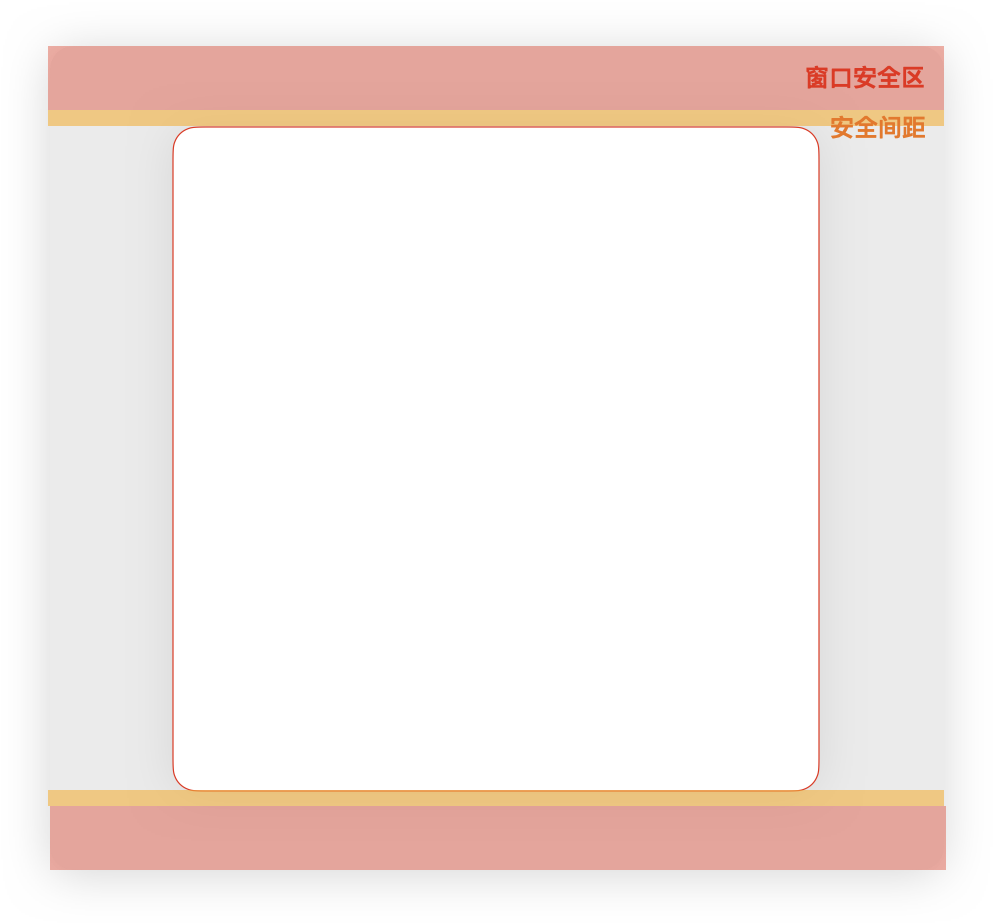
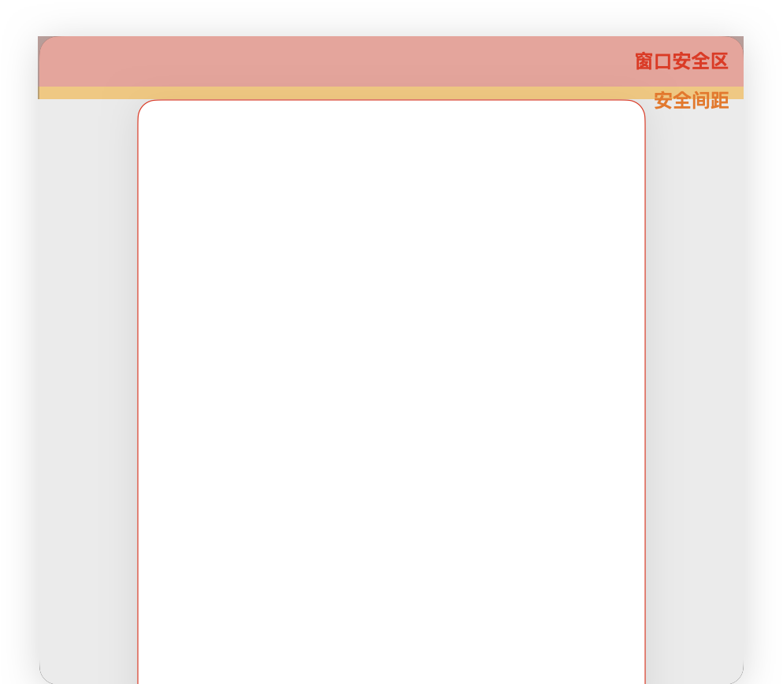

# ArkUI子系统Changelog


## cl.arkui.1 通用属性backgroundEffect在modifier中radius参数单位修改

**访问级别**

公开接口

**变更原因**

 直接使用backgroundEffect时对应的模糊参数radius单位为vp。通过modifier或者CAPI使用时，单位为px。现将单位同一为vp。

**变更影响**

此变更涉及应用适配。

变更前：backgroundEffect通过modifier使用时单位为px。<br/>


变更后：backgroundEffect通过modifier使用时单位为vp。<br/>


**起始API Level**

API 12

**变更发生版本**

从OpenHarmony 5.1.0.45 版本开始。

**变更的接口/组件**

backgroundEffect

**适配指导**

默认无需适配。如需要保持之前模糊效果，在modifier中使用px2vp方法把radius参数转换为vp。

```ts

import { CommonModifier } from '@kit.ArkUI';

class ColumnModifier extends CommonModifier {
  public radius: number = 0;
  applyNormalAttribute(instance: CommonAttribute): void {
    instance.backgroundEffect({ radius: this.radius })
  }
}

@Entry
@Component
struct Index {
  @State testSize: number = 200;
  @State modifier:ColumnModifier = new ColumnModifier();
  onPageShow(): void {
    // 变更前
    // this.modifier.radius = 10;
    // 变更后适配
    this.modifier.radius = px2vp(10);
  }
  build() {
    Column() {
      Stack() {
        Image($r('app.media.test')).width(this.testSize).height(this.testSize)
        Column().width(this.testSize).height(this.testSize).attributeModifier(this.modifier)
      }.width('100%')
    }
  }
}
```

## cl.arkui.2 DrawModifier的invalidate接口行为变更

**变更原因**

实现bug，之前实现中未在节点标脏后请求下一帧vsync信号，导致部分场景下invalidate无法刷新绘制内容。

**变更影响**

此变更不涉及应用适配。

变更前：invalidate接口仅对节点标脏，不请求下一帧。导致节点标脏但不会刷新重绘。等到其他操作，例如点击触发下一帧信号的时候才会重绘。

变更后：nvalidate接口对节点标脏后主动请求下一帧，使节点及时刷新重绘。

使用如下示例代码对影响补充说明。

```ts
import { drawing } from '@kit.ArkGraphics2D';

class MyFrontDrawModifier extends DrawModifier {
  public scaleX: number = 1;
  public scaleY: number = 1;

  drawFront(context: DrawContext): void {
    const brush = new drawing.Brush();
    brush.setColor({
      alpha: 255,
      red: 0,
      green: 0,
      blue: 255
    });
    context.canvas.attachBrush(brush);
    const halfWidth = context.size.width / 2;
    const halfHeight = context.size.width / 2;
    const radiusScale = (this.scaleX + this.scaleY) / 2;
    context.canvas.drawCircle(vp2px(halfWidth), vp2px(halfHeight), vp2px(20 * radiusScale));
  }
}

@Entry
@Component
struct DrawModifierExample {
  @State modifier: MyFrontDrawModifier = new MyFrontDrawModifier();
  @State changeScale: boolean = false;

  build() {
    Column() {
      Row() {
        Text()
          .width(100)
          .height(100)
          .margin(10)
          .backgroundColor(Color.Gray)
          .drawModifier(this.modifier)
      }

      Button('invalidate immediately')
        .onClick(() => {
          this.changeScale = !this.changeScale
          // 变更前后不影响，节点在invalidate的下一帧刷新
          this.changeScale ? this.modifier.scaleX = 2 : this.modifier.scaleX = 1
          this.changeScale ? this.modifier.scaleY = 2 : this.modifier.scaleY = 1
          this.modifier.invalidate()
        }
        )
      Button('invalidate in setTimeout ')
        .onClick(() => {
          setTimeout(() => {
            // 变更前：invalidate对节点标脏，但不请求下一帧，等到其他事件触发下一帧，进行刷新绘制
            // 变更后：节点在invalidate的下一帧刷新
            this.changeScale = !this.changeScale
            this.changeScale ? this.modifier.scaleX = 2 : this.modifier.scaleX = 1
            this.changeScale ? this.modifier.scaleY = 2 : this.modifier.scaleY = 1
            this.modifier.invalidate()
          }, 1000)
        }
        )
    }
  }
}
```

**起始API Level**

API 12

**变更发生版本**

从OpenHarmony SDK 5.1.0.54开始。

**变更的接口/组件**

common.d.ts#DrawModifier.invalidate

**适配指导**

默认行为变更，无需适配。但需要注意invalidate调用后没有其他操作产生请求下一帧的场景下的影响。

## cl.arkui.3 节点默认生命周期回调策略变更

**访问级别**

公开接口

**变更原因**

节点复用情况下，造成冗余的性能损耗。

**变更影响**

此变更不涉及应用适配。

变更前：节点复用情况下,如果存在父布局约束。节点通过addChild重新上树默认触发测量，布局以及绘制。

变更后：节点复用情况下节点通过addChild重新上树，只有布局约束发生变化才会触发测量布局以及绘制。

示例代码如下，完整实例可参考使用ndk接口构建接入UI中的接入ArkTS页面。

```ts

static std::vector<ArkUI_NodeHandle> childList;

void registerCustomEvent(ArkUI_NodeHandle node) {
    nodeApi->registerNodeCustomEvent(node, ARKUI_NODE_CUSTOM_EVENT_ON_MEASURE, 0, nullptr);
    nodeApi->registerNodeCustomEvent(node, ARKUI_NODE_CUSTOM_EVENT_ON_LAYOUT, 0, nullptr);
    nodeApi->registerNodeCustomEvent(node, ARKUI_NODE_CUSTOM_EVENT_ON_DRAW, 0, nullptr);
}

void customEventReceiver(ArkUI_NodeCustomEvent *event) {
   auto eventType = OH_ArkUI_NodeEvent_GetEventType(event);
  // 变更前会触发自定义测量，布局，绘制事件
  // 变更后不会触发自定义测量，布局，绘制事件
} 

void init() {

auto rootNode = nodeApi->CreateNode(ARKUI_NODE_CUSTOM);
auto child1 = nodeApi->CreateNode(ARKUI_NODE_CUSTOM);
auto child2 = nodeApi->CreateNode(ARKUI_NODE_CUSTOM);
nodeApi->addChild(rootNode, child1);
nodeApi->addChild(rootNode, child2);
childList.push_back(child1);
childList.push_back(child2);
ArkUI_NumberValue value[] = {{.f32 = 100}};
ArkUI_AttributeItem item = {value, 1};
nodeApi->setAttribute(rootNode, NODE_WIDTH, item);
nodeApi->setAttribute(child1, NODE_WIDTH, item);
nodeApi->setAttribute(child2, NODE_WIDTH, item);
nodeApi->setAttribute(rootNode, NODE_HEIGHT, item);
nodeApi->setAttribute(child1, NODE_HEIGHT, item);
nodeApi->setAttribute(child2, NODE_HEIGHT, item);

// 注册订阅自定义事件
registerCustomEvent(rootNode);
registerCustomEvent(child1);
registerCustomEvent(child2);
nodeApi->registerNodeCustomEventReceiver(customEventReceiver);
}

void rebuildTree(ArkUI_NodeHandle root) {
  // 触发组件上下树
  auto front = childList.front();
  nodeApi->removeChild(root, front);
  childList.erase(childList.begin());
  nodeApi->addChild(root, front);
  childList.push_back(front);
} 

```

**起始API Level**

API 12

**变更发生版本**

从OpenHarmony SDK 5.1.0.54开始。

**变更的接口/组件**

frameNode 生命周期。

**适配指导**

默认行为变更无需适配。

## cl.arkui.4 禁用键盘Ctrl按键和触控板轴事件触发缩放手势变更

**访问级别**

公开接口

**变更原因**

UX规格变化。

**变更影响**

此变更不涉及应用适配。

变更前：键盘Ctrl按键和触控板双指水平滑动或者垂直滑动时，可以触发缩放手势。

变更前：键盘Ctrl按键和触控板双指水平滑动或者垂直滑动时，不可以触发缩放手势。

**起始API Level**

接口起始版本为API version 7。

**变更发生版本**

从OpenHarmony SDK 5.1.0.54开始。

**变更的接口/组件**

ArkTS：PinchGestureInterface、PinchGestureHandler

C API：createPinchGesture

**适配指导**

默认UX变更无需适配。

## cl.arkui.5 FrameNode的isAttached接口返回值含义发生变更

**访问级别**

公开接口

**变更原因**

用户使用FrameNode的isAttached接口时，实际返回当前节点是否可见，即通用属性中的Visibility是否为Visible，而非当前节点是否被挂载到主节点树上。

**变更影响**

此变更涉及应用适配。

变更前：返回当前节点是否可见。

变更后：返回当前节点是否被挂载到主节点树上。

当用户通过该接口获取目标节点是否被挂载到主节点树上，而目标节点为节点树上的不可见节点或未上树的可见节点时，返回值会发生变更，例如：
```ts
import { FrameNode, NodeController } from '@ohos.arkui.node';
import { UIContext } from '@ohos.arkui.UIContext';

class MyNodeController extends NodeController {
  private rootNode: FrameNode | null = null;
  private notAttachedNode: FrameNode | null = null;
  private notVisibleNode: FrameNode | null = null;

  makeNode(uiContext: UIContext) {
    this.rootNode = new FrameNode(uiContext);
    this.notAttachedNode = new FrameNode(uiContext);
    this.notVisibleNode = new FrameNode(uiContext);
    this.notVisibleNode.commonAttribute.visibility(Visibility.Hidden);
    this.rootNode.appendChild(this.notVisibleNode);
    return this.rootNode;
  }

  printInfo(): void {
    if (this.notVisibleNode) {
      // 主节点树上的不可见节点，变更前为false，变更后为true
      console.log('notVisibleNode:', this.notVisibleNode.isAttached());
    }
    if (this.notAttachedNode) {
      // 未上树的可见节点，变更前为true，变更后为false
      console.log('notAttachedNode:', this.notAttachedNode.isAttached());
    }
  }
}

@Entry
@Component
struct MyComponent {
  @State myNodeController: MyNodeController = new MyNodeController();

  build() {
    Column() {
      NodeContainer(this.myNodeController)
      Button('click').onClick(() => {
        this.myNodeController.printInfo();
      })
    }
    .width('100%')
    .alignItems(HorizontalAlign.Center)
  }
}
```

**起始API Level**

API 12

**变更发生版本**

从OpenHarmony SDK 5.1.0.54开始。

**变更的接口/组件**

FrameNode.d.ts文件isAttached接口。

**适配指导**

```ts
// 变更前FrameNode的isAttached接口行为和isVisible接口一致，若需保持变更前行为，使用isVisible接口替换即可。
node.isAttached(); // 变更前
node.isVisible(); // 变更后
```

## cl.arkui.6 RenderNode的rotation接口角度单位从vp变为度

**访问级别**

公开接口

**变更原因**

用户使用RenderNode的rotation接口时，传入的默认角度单位是vp，这不是正常规格的角度单位，需要变更为度。

**变更影响**

此变更涉及应用适配。

变更前：角度单位为vp，需要经过px2vp单位转换才能转为角度。

变更后：角度单位为度，直接传入数值即可，无需单位转换。

当用户通过该接口设置RenderNode的旋转时，会发生变更; 例如：
```ts
import { FrameNode, NodeController, RenderNode, UIContext } from '@kit.ArkUI';

class MyNodeController extends NodeController {
  private rootNode: FrameNode | null = null;

  makeNode(uiContext: UIContext) {
    this.rootNode = new FrameNode(uiContext);

    // 直接传入90
    const renderNodeSrc = new RenderNode();
    renderNodeSrc.backgroundColor = 0xffdddddd;
    renderNodeSrc.frame = { x: 10, y: 110, width: 200, height: 100 };
    const renderNodeDst  = new RenderNode();
    renderNodeDst.backgroundColor = 0xfffcc0ea;
    renderNodeDst.frame = { x: 10, y: 110, width: 200, height: 100 };
    renderNodeDst.rotation = { x: 0, y: 0, z: 90 };

    // 传入px2vp(90)
    const renderNodeSrc1 = new RenderNode();
    renderNodeSrc1.backgroundColor = 0xffdddddd;
    renderNodeSrc1.frame = { x: 10, y: 360, width: 200, height: 100 };
    const renderNodeDst1  = new RenderNode();
    renderNodeDst1.backgroundColor = 0xfffcc0ea;
    renderNodeDst1.frame = { x: 10, y: 360, width: 200, height: 100 };
    renderNodeDst1.rotation = { x: 0, y: 0, z: px2vp(90) };

    // 传入vp2px(90)
    const renderNodeSrc2 = new RenderNode();
    renderNodeSrc2.backgroundColor = 0xffdddddd;
    renderNodeSrc2.frame = { x: 10, y: 610, width: 200, height: 100 };
    const renderNodeDst2  = new RenderNode();
    renderNodeDst2.backgroundColor = 0xfffcc0ea;
    renderNodeDst2.frame = { x: 10, y: 610, width: 200, height: 100 };
    renderNodeDst2.rotation = { x: 0, y: 0, z: vp2px(90) };

    const rootRenderNode = this.rootNode.getRenderNode();
    rootRenderNode?.appendChild(renderNodeSrc);
    rootRenderNode?.appendChild(renderNodeDst);
    rootRenderNode?.appendChild(renderNodeSrc1);
    rootRenderNode?.appendChild(renderNodeDst1);
    rootRenderNode?.appendChild(renderNodeSrc2);
    rootRenderNode?.appendChild(renderNodeDst2);

    return this.rootNode;
  }
}

@Entry
@Component
struct MyComponent {
  @State myNodeController: MyNodeController = new MyNodeController();

  build() {
    Row() {
      Column() {
        Text('90')
        Text('px2vp(90)')
        Text('vp2px(90)')
      }
      .justifyContent(FlexAlign.SpaceAround)
      .height('100%')
      .width('30%')
      NodeContainer(this.myNodeController)
        .height('100%')
        .width('70%')
    }
    .width('100%')
    .alignItems(VerticalAlign.Top)
  }
}
```


**起始API Level**

API 12

**变更发生版本**

从OpenHarmony SDK 5.1.0.54开始。

**变更的接口/组件**

RenderNode.d.ts文件rotation接口。

**适配指导**

```ts
// 变更前RenderNode的rotation接口的旋转角度单位为“vp”，变更后单位为“度”，若需保持变更前行为，使用vp2px进行单位转换即可。
renderNode.rotation = { x: 0, y: 0, z: 90 }; // 变更前
renderNode.rotation = { x: 0, y: 0, z: vp2px(90) }; // 变更后
```

## cl.arkui.7 当AttributeModifier的applyNormalAttribute方法中instance参数设置为资源类型数据时更新的行为发生变更

当开发者使用资源文件作为AttributeModifier的applyNormalAttribute方法中instance对象的入参时，无法通过配置资源文件更新参数，该行为与系统资源的规格不一致。

**变更影响**

此变更不涉及应用适配。

运行以下示例时:

```ts
class MyButtonModifier implements AttributeModifier<ButtonAttribute> {
  private color?: ResourceColor;
  private fontColor?: ResourceColor;

  constructor(color: ResourceColor, fontColor: ResourceColor) {
    this.color = color;
    this.fontColor = fontColor;
  }

  applyNormalAttribute(instance: ButtonAttribute): void {
    // instance为Button的属性对象，设置正常状态下属性值
    instance.backgroundColor(this.color)
      .fontColor(this.fontColor)
      .borderWidth(1)
  }
}

@Entry
@Component
struct attributeDemo {
  @State modifier: MyButtonModifier = new MyButtonModifier($r('app.color.backColor'), $r('app.color.fontColor'));

  build() {
    Row() {
      Column() {
        Button("Button")
          .attributeModifier(this.modifier)
      }.width("100%")
    }
    .height('100%')
    .backgroundColor(Color.White)
  }
}
```

```json
// src/main/resources/base/element/color.json
{
  "color": [
    {
      "name": "start_window_background",
      "value": "#FFFFFF"
    },
    {
      "name": "backColor",
      "value": "#000000"
    },
    {
      "name": "fontColor",
      "value": "#FFFFFF"
    }
  ]
}
```

```json
// src/main/resources/dark/element/color.json
{
  "color": [
    {
      "name": "start_window_background",
      "value": "#000000"
    },
    {
      "name": "backColor",
      "value": "#FFFFFF"
    },
    {
      "name": "fontColor",
      "value": "#000000"
    }
  ]
}
```

| 变更前                                                                               | 变更后                                                                             |
| ------------------------------------------------------------------------------------ | ---------------------------------------------------------------------------------- |
| 浅色模式拉起。<br>                             | 浅色模式拉起。<br>                           |
|                                                                                      |
| 切换深色时，无法使用资源文件触发UI的更新。<br> | 切换深色时，可以使用资源文件触发UI的更新。<br> |
|                                                                                      |

**起始API Level**

API 11

**变更发生版本**

从OpenHarmony SDK 5.0.1.54开始。

**变更的接口/组件**

common.d.ts文件attributeModifier接口。

**适配指导**

默认行为变更，无需适配。

如不期望资源随配置文件更新可以将资源取出后使用。

```ts
class MyButtonModifier implements AttributeModifier<ButtonAttribute> {
  public  color?: ResourceColor;
  public fontColor?: ResourceColor;

  constructor(color: ResourceColor, fontColor: ResourceColor) {
    this.color = color;
    this.fontColor = fontColor;
  }

  applyNormalAttribute(instance: ButtonAttribute): void {
    // instance为Button的属性对象，设置正常状态下属性值
    instance.backgroundColor(this.color)
      .fontColor(this.fontColor)
      .borderWidth(1)
  }
}

@Entry
@Component
struct attributeDemo {
  @State modifier: MyButtonModifier = new MyButtonModifier($r('app.color.backColor'), $r('app.color.fontColor'));

  aboutToAppear(): void {
    // 解析获取资源文件。
    this.modifier.color = getContext().resourceManager.getColorSync($r('app.color.backColor').id);
    this.modifier.fontColor = getContext().resourceManager.getColorSync($r('app.color.fontColor').id);
  }

  build() {
    Row() {
      Column() {
        Button("Button")
          .attributeModifier(this.modifier)
      }.width("100%")
    }
    .height('100%')
    .backgroundColor(Color.White)
  }
}
```

| 变更前                                                   | 变更后                                                 |
| -------------------------------------------------------- | ------------------------------------------------------ |
| 浅色模式拉起。<br> | 深色模式拉起。<br> |
| 切换深色。<br>     | 切换浅色。<br>     |

## cl.arkui.8 命令式节点跨页面复用行为变更

**访问级别**

公开接口

**变更原因**

当使用router.replace、router.back或router.clear接口进行页面跳转时，原页面将被销毁，页面上的所有节点将被标记为InDestroying，无法在后续的流程中进行布局和绘制。由于命令式节点无法清除InDestroying标志位，因此在新页面上复用这些节点时，无法显示更新后的内容。

**变更影响**

此变更涉及应用适配。

以下生命周期接口的行为将会受到影响。如果开发者在这些生命周期接口中实现了业务代码，由于变更前后的不同，通过BuilderNode进行跨页面复用时，生命周期接口的触发情况存在差异。若想保持原有的业务行为，则需要进行相应的适配。

| 模块            | 变更前                                                                                                                                                                                                                                                                                                                                                                          | 变更后                                                                                                                                                                                                                                                                                                                                                                        |
| --------------- | ------------------------------------------------------------------------------------------------------------------------------------------------------------------------------------------------------------------------------------------------------------------------------------------------------------------------------------------------------------------------------- | ----------------------------------------------------------------------------------------------------------------------------------------------------------------------------------------------------------------------------------------------------------------------------------------------------------------------------------------------------------------------------- |
| FrameNode       | 使用router.replace、router.back或router.clear发生页面跳转后，被复用的FrameNode无法在新页面中进行布局和绘制，onMeasure、onLayout和onDraw生命周期函数不触发                                                                                                                                                                                                                       | 使用router.replace、router.back或router.clear发生页面跳转后，被复用的FrameNode能够在新页面中进行布局和绘制，onMeasure、onLayout和onDraw生命周期函数将会触发。                                                                                                                                                                                                                 |
| RenderNode      | 使用router.replace、router.back或router.clear发生页面跳转后，被复用的RenderNode无法在新页面中进行绘制，draw回调接口不触发。                                                                                                                                                                                                                                                     | 使用router.replace、router.back或router.clear发生页面跳转后，被复用的RenderNode能够在新页面中进行绘制，draw回调接口将会触发。                                                                                                                                                                                                                                                 |
| CustomSpan      | 使用router.replace、router.back或router.clear发生页面跳转后，被复用的CustomSpan无法在新页面中进行布局和绘制，onMeasure和onDraw生命周期函数不触发。                                                                                                                                                                                                                              | 使用router.replace、router.back或router.clear发生页面跳转后，被复用的CustomSpan能够在新页面中进行布局和绘制，onMeasure和onDraw生命周期函数将会触发。                                                                                                                                                                                                                          |
| CustomComponent | 使用router.replace、router.back或router.clear发生页面跳转后，当自定义组件CustomComponent用于BuilderNode进行复用时，自定义组件无法在新页面中进行布局，onMeasureSize生命周期函数不触发。                                                                                                                                                                                          | 使用router.replace、router.back或router.clear发生页面跳转后，当自定义组件CustomComponent用于BuilderNode进行复用时，自定义组件能够在新页面中进行布局，onMeasureSize生命周期函数将会触发。                                                                                                                                                                                      |
| LazyForEach     | 使用router.replace、router.back或router.clear发生页面跳转后，当LazyForEach用于BuilderNode进行复用时，BuilderNode无法在新页面中进行布局，getData不触发。                                                                                                                                                                                                                         | 使用router.replace、router.back或router.clear发生页面跳转后，当LazyForEach用于BuilderNode进行复用时，BuilderNode能够在新页面中进行布局，getData将会触发。                                                                                                                                                                                                                     |
| DrawModifier    | 使用router.replace、router.back或router.clear发生页面跳转后，在BuilderNode中使用的DrawModifier，由于BuilderNode及其子节点无法在新页面中进行布局和绘制，drawFront、drawContent和drawBehind生命周期函数不触发。                                                                                                                                                                   | 使用router.replace、router.back或router.clear发生页面跳转后，在BuilderNode中使用的DrawModifier，BuilderNode及其子节点能够在新页面中进行布局和绘制，drawFront、drawContent和drawBehind生命周期函数将会触发。                                                                                                                                                                   |
| C API           | 使用router.replace、router.back或router.clear发生页面跳转后，当C API自定义组件用于BuilderNode进行复用时，由于BuilderNode及其子节点无法在新页面中进行布局和绘制，ARKUI_NODE_CUSTOM_EVENT_ON_MEASURE、ARKUI_NODE_CUSTOM_EVENT_ON_LAYOUT、ARKUI_NODE_CUSTOM_EVENT_ON_DRAW、ARKUI_NODE_CUSTOM_EVENT_ON_FOREGROUND_DRAW、ARKUI_NODE_CUSTOM_EVENT_ON_OVERLAY_DRAW生命周期函数不触发。 | 使用router.replace、router.back或router.clear发生页面跳转后，当C API自定义组件用于BuilderNode进行复用时，BuilderNode及其子节点能够在新页面中进行布局和绘制，ARKUI_NODE_CUSTOM_EVENT_ON_MEASURE、ARKUI_NODE_CUSTOM_EVENT_ON_LAYOUT、ARKUI_NODE_CUSTOM_EVENT_ON_DRAW、ARKUI_NODE_CUSTOM_EVENT_ON_FOREGROUND_DRAW、ARKUI_NODE_CUSTOM_EVENT_ON_OVERLAY_DRAW生命周期函数将会触发。 |

**变更发生版本**

从OpenHarmony SDK 5.1.0.53 版本开始。

**变更的接口/组件**

| 文件               | 接口                                       |
| ------------------ | ------------------------------------------ |
| FrameNode.d.ts     | FrameNode的onMeasure                       |
| FrameNode.d.ts     | FrameNode的onLayout                        |
| FrameNode.d.ts     | FrameNode的onDraw                          |
| styled_string.d.ts | CustomSpan的onMeasure                      |
| styled_string.d.ts | CustomSpan的onDraw                         |
| common.d.ts        | CustomComponent的onMeasureSize             |
| common.d.ts        | DrawModifier的drawBehind                   |
| common.d.ts        | DrawModifier的drawContent                  |
| common.d.ts        | DrawModifier的drawFront                    |
| lazy_for_each.d.ts | IDataSource的getData                       |
| RenderNode.d.ts    | RenderNode的draw                           |
| native_node.h      | ARKUI_NODE_CUSTOM_EVENT_ON_MEASURE         |
| native_node.h      | ARKUI_NODE_CUSTOM_EVENT_ON_LAYOUT          |
| native_node.h      | ARKUI_NODE_CUSTOM_EVENT_ON_DRAW            |
| native_node.h      | ARKUI_NODE_CUSTOM_EVENT_ON_FOREGROUND_DRAW |
| native_node.h      | ARKUI_NODE_CUSTOM_EVENT_ON_OVERLAY_DRAW    |

**适配指导**

可通过在页面跳转时，将BuilderNode从缓存池中移除来保持节点的行为不变，示例代码如下：

1. 按照[接入ArkTS页面](../../../application-dev/ui/ndk-access-the-arkts-page.md)创建前置工程以及添加相关封装对象。

2. 替换cpp/NativeEntry.cpp为如下内容。
    ```cpp
    // NativeEntry.cpp
    #include <arkui/native_node_napi.h>
    #include <hilog/log.h>
    #include <js_native_api.h>
    #include <native_drawing/drawing_canvas.h>
    #include <native_drawing/drawing_color.h>
    #include <native_drawing/drawing_path.h>
    #include <native_drawing/drawing_pen.h>

    #include "NativeEntry.h"
    #include "ArkUINode.h"

    namespace NativeModule {

    void DrawRect(ArkUI_NodeCustomEvent *event, int32_t width, int32_t height, uint32_t penColor) {
        auto *drawContext = OH_ArkUI_NodeCustomEvent_GetDrawContextInDraw(event);
        auto *canvas = OH_ArkUI_DrawContext_GetCanvas(drawContext);
        OH_ArkUI_QueryModuleInterfaceByName(ARKUI_NATIVE_NODE, "ArkUI_NativeNodeAPI_1");
        OH_ArkUI_DrawContext_GetSize(drawContext);

        auto *drawingCanvas = reinterpret_cast<OH_Drawing_Canvas *>(canvas);

        auto *path = OH_Drawing_PathCreate();
        OH_Drawing_PathMoveTo(path, width / 4, height / 4);
        OH_Drawing_PathLineTo(path, width * 3 / 4, height / 4);
        OH_Drawing_PathLineTo(path, width * 3 / 4, height * 3 / 4);
        OH_Drawing_PathLineTo(path, width / 4, height * 3 / 4);
        OH_Drawing_PathLineTo(path, width / 4, height / 4);

        auto *pen = OH_Drawing_PenCreate();
        OH_Drawing_PenSetWidth(pen, 10);
        OH_Drawing_PenSetColor(pen, penColor);
        OH_Drawing_CanvasAttachPen(drawingCanvas, pen);
        OH_Drawing_CanvasDrawPath(drawingCanvas, path);

        OH_Drawing_PathDestroy(path);
        OH_Drawing_PenDestroy(pen);
    }

    ArkUI_NodeHandle testCustomNode(ArkUI_NativeNodeAPI_1 *nodeAPI) {
        auto column = nodeAPI->createNode(ARKUI_NODE_COLUMN);
        auto customNode = nodeAPI->createNode(ARKUI_NODE_CUSTOM);

        static ArkUI_NativeNodeAPI_1 *nodeAPISelf = nodeAPI;
        static ArkUI_NodeHandle customNodeSelf = customNode;

        ArkUI_NumberValue columnValue[] = {400};
        ArkUI_AttributeItem columnItem = {columnValue, 1};
        nodeAPI->setAttribute(column, NODE_WIDTH, &columnItem);
        nodeAPI->setAttribute(column, NODE_HEIGHT, &columnItem);

        ArkUI_NumberValue customValue[] = {400};
        ArkUI_AttributeItem customItem = {customValue, 1};
        nodeAPI->setAttribute(customNode, NODE_WIDTH, &customItem);
        nodeAPI->setAttribute(customNode, NODE_HEIGHT, &customItem);
        ArkUI_NumberValue nodeBackgroundColorValue[] = {{.u32 = 0xffffff00}};
        ArkUI_AttributeItem nodeBackgroundColorItem = {nodeBackgroundColorValue};
        nodeAPI->setAttribute(customNode, NODE_BACKGROUND_COLOR, &nodeBackgroundColorItem);

        nodeAPI->registerNodeCustomEvent(customNode, ARKUI_NODE_CUSTOM_EVENT_ON_MEASURE, 1, nullptr);
        nodeAPI->registerNodeCustomEvent(customNode, ARKUI_NODE_CUSTOM_EVENT_ON_LAYOUT, 2, nullptr);
        nodeAPI->registerNodeCustomEvent(customNode, ARKUI_NODE_CUSTOM_EVENT_ON_FOREGROUND_DRAW, 3, nullptr);
        nodeAPI->registerNodeCustomEvent(customNode, ARKUI_NODE_CUSTOM_EVENT_ON_DRAW, 4, nullptr);
        nodeAPI->registerNodeCustomEvent(customNode, ARKUI_NODE_CUSTOM_EVENT_ON_OVERLAY_DRAW, 5, nullptr);

        nodeAPI->registerNodeCustomEventReceiver([](ArkUI_NodeCustomEvent *event) {
            auto type = OH_ArkUI_NodeCustomEvent_GetEventType(event);
            if (type == ARKUI_NODE_CUSTOM_EVENT_ON_MEASURE) {
                // 变更前ARKUI_NODE_CUSTOM_EVENT_ON_MEASURE在页面返回后不会触发，变更后将会触发
                OH_LOG_Print(LOG_APP, LOG_ERROR, LOG_PRINT_DOMAIN, "Manager", "CustomNode OnMeasure");
                nodeAPISelf->setMeasuredSize(customNodeSelf, 100, 100);
            } else if (type == ARKUI_NODE_CUSTOM_EVENT_ON_LAYOUT) {
                // 变更前ARKUI_NODE_CUSTOM_EVENT_ON_LAYOUT在页面返回后不会触发，变更后将会触发
                OH_LOG_Print(LOG_APP, LOG_ERROR, LOG_PRINT_DOMAIN, "Manager", "CustomNode OnLayout");
                nodeAPISelf->setLayoutPosition(customNodeSelf, 48, 0);
            } else if (type == ARKUI_NODE_CUSTOM_EVENT_ON_FOREGROUND_DRAW) {
                // 变更前ARKUI_NODE_CUSTOM_EVENT_ON_FOREGROUND_DRAW在页面返回后不会触发，变更后将会触发
                OH_LOG_Print(LOG_APP, LOG_ERROR, LOG_PRINT_DOMAIN, "Manager", "CustomNode OnForegroundDraw");
                DrawRect(event, 200, 200, OH_Drawing_ColorSetArgb(0xff, 0xff, 0x00, 0x00));
            } else if (type == ARKUI_NODE_CUSTOM_EVENT_ON_DRAW) {
                // 变更前ARKUI_NODE_CUSTOM_EVENT_ON_DRAW在页面返回后不会触发，变更后将会触发
                OH_LOG_Print(LOG_APP, LOG_ERROR, LOG_PRINT_DOMAIN, "Manager", "CustomNode OnDraw");
                DrawRect(event, 300, 300, OH_Drawing_ColorSetArgb(0xff, 0x00, 0xff, 0x00));
            } else if (type == ARKUI_NODE_CUSTOM_EVENT_ON_OVERLAY_DRAW) {
                // 变更前ARKUI_NODE_CUSTOM_EVENT_ON_OVERLAY_DRAW在页面返回后不会触发，变更后将会触发
                OH_LOG_Print(LOG_APP, LOG_ERROR, LOG_PRINT_DOMAIN, "Manager", "CustomNode OnDraw");
                DrawRect(event, 400, 400, OH_Drawing_ColorSetArgb(0xff, 0x00, 0x00, 0xff));
            }
        });
        nodeAPI->addChild(column, customNode);
        return column;
    }

    napi_value CreateNativeRoot(napi_env env, napi_callback_info info) {
        size_t argc = 1;
        napi_value args[1] = {nullptr};

        napi_get_cb_info(env, info, &argc, args, nullptr, nullptr);

        // 获取NodeContent
        ArkUI_NodeContentHandle contentHandle;
        OH_ArkUI_GetNodeContentFromNapiValue(env, args[0], &contentHandle);
        NativeEntry::GetInstance()->SetContentHandle(contentHandle);

        // 创建CustomNode
        auto *nodeAPI = reinterpret_cast<ArkUI_NativeNodeAPI_1 *>(
            OH_ArkUI_QueryModuleInterfaceByName(ARKUI_NATIVE_NODE, "ArkUI_NativeNodeAPI_1"));
        auto column = testCustomNode(nodeAPI);
        auto root = std::make_shared<ArkUINode>(column);

        // 保持Native侧对象到管理类中，维护生命周期。
        NativeEntry::GetInstance()->SetRootNode(root);
        return nullptr;
    }

    napi_value DestroyNativeRoot(napi_env env, napi_callback_info info) {
        // 从管理类中释放Native侧对象。
        NativeEntry::GetInstance()->DisposeRootNode();
        return nullptr;
    }

    } // namespace NativeModule
    ```

3. pages目录下添加如下文件。

    ```ts
    // pages/CustomComponentExample.ets
    @Component
    struct MyComponentWithOnMeasure {
      @StorageLink("isShowText") isShowText: boolean = true;

      build() {
        if (this.isShowText) {
          Column({ space: 16 }) {
            Text("This is CustomComponent")
              .fontWeight(FontWeight.Bold)
              .fontSize(24)
          }
          .alignItems(HorizontalAlign.Center)
          .width('100%')
          .padding(16)
        }
      }

      onMeasureSize(selfLayoutInfo: GeometryInfo, children: Measurable[], constraint: ConstraintSizeOptions): SizeResult {
        // 变更前onMeasureSize在页面返回后不会触发，变更后将会触发
        console.info(`FZY ${JSON.stringify(constraint)}`);
        let height = 0;
        let width = 0;
        children.forEach((child) => {
          let result: MeasureResult = child.measure({
            minHeight: 0,
            minWidth: 0,
            maxWidth: constraint.maxWidth,
            maxHeight: constraint.maxHeight
          })
          height += result.height;
          width = Math.max(width, result.width);
          ;
        })
        return { width, height };
      }
    }

    export { MyComponentWithOnMeasure };

    ```

    ```ts
    // pages/CustomSpanExample.ets
    import drawing from '@ohos.graphics.drawing';

    const TEST_TAG = 'TEST'

    class MyCustomSpan extends CustomSpan {
      constructor(word: string, width: number, height: number) {
        super();
        this.word = word;
        this.width = width;
        this.height = height;
      }

      onMeasure(measureInfo: CustomSpanMeasureInfo): CustomSpanMetrics {
        // 变更前onMeasure在页面返回后不会触发，变更后将会触发
        console.info(`${TEST_TAG} CustomSpan onMeasure`);
        return { width: this.width, height: this.height };
      }

      onDraw(context: DrawContext, options: CustomSpanDrawInfo) {
        // 变更前onDraw在页面返回后不会触发，变更后将会触发
        let canvas = context.canvas;

        const brush = new drawing.Brush();
        brush.setColor({
          alpha: 255,
          red: 0,
          green: 74,
          blue: 175
        });
        const font = new drawing.Font();
        font.setSize(25);
        const textBlob = drawing.TextBlob.makeFromString(this.word, font, drawing.TextEncoding.TEXT_ENCODING_UTF8);
        canvas.attachBrush(brush);
        canvas.drawRect({
          left: options.x + 10,
          right: options.x + vp2px(this.width) - 10,
          top: options.lineTop + 10,
          bottom: options.lineBottom - 10
        });

        brush.setColor({
          alpha: 255,
          red: 23,
          green: 169,
          blue: 141
        });
        canvas.attachBrush(brush);
        canvas.drawTextBlob(textBlob, options.x + 20, options.lineBottom - 15);
        canvas.detachBrush();
      }

      setWord(word: string) {
        this.word = word;
      }

      width: number = 160;
      word: string = "drawing";
      height: number = 10;
    }

    export { MyCustomSpan };
    ```

    ```ts
    // pages/DataSource.ets
    // 点击Add Data->Router pageTwo->Add Data
    // 最后一次Add Data点击后，measure和draw不触发，List无内容显示

    const TEST_TAG = 'TEST'

    class BasicDataSource implements IDataSource {
      private listeners: DataChangeListener[] = [];
      private originDataArray: string[] = [];

      public totalCount(): number {
        return 0;
      }

      public getData(index: number): string {
        return this.originDataArray[index];
      }

      registerDataChangeListener(listener: DataChangeListener): void {
        if (this.listeners.indexOf(listener) < 0) {
          console.info('add listener');
          this.listeners.push(listener);
        }
      }

      unregisterDataChangeListener(listener: DataChangeListener): void {
        const pos = this.listeners.indexOf(listener);
        if (pos >= 0) {
          console.info('remove listener');
          this.listeners.splice(pos, 1);
        }
      }

      notifyDataReload(): void {
        this.listeners.forEach(listener => {
          listener.onDataReloaded();
        })
      }

      notifyDataAdd(index: number): void {
        this.listeners.forEach(listener => {
          listener.onDataAdd(index);
        })
      }

      notifyDataChange(index: number): void {
        this.listeners.forEach(listener => {
          listener.onDataChange(index);
        })
      }

      notifyDataDelete(index: number): void {
        this.listeners.forEach(listener => {
          listener.onDataDelete(index);
        })
      }

      notifyDataMove(from: number, to: number): void {
        this.listeners.forEach(listener => {
          listener.onDataMove(from, to);
        })
      }

      notifyDatasetChange(operations: DataOperation[]): void {
        this.listeners.forEach(listener => {
          listener.onDatasetChange(operations);
        })
      }
    }

    class MyDataSource extends BasicDataSource {
      private dataArray: string[] = [];
      private getDataCount: number = 0;

      public totalCount(): number {
        return this.dataArray.length;
      }

      public getData(index: number): string {
        // 变更前getData在页面返回后不会触发，变更后将会触发
        console.info(`${TEST_TAG} LazyForeach getData`);
        this.getDataCount++;
        return this.dataArray[index];
      }

      public pushData(data: string): void {
        this.dataArray.push(data);
        this.notifyDataAdd(this.dataArray.length - 1);
      }
    }

    export { MyDataSource };
    ```

    ```ts
    // pages/FrameNodeExample.ets
    import { FrameNode, Position, LayoutConstraint } from "@kit.ArkUI"

    const TEST_TAG = "TEST"

    class MyFrameNode extends FrameNode {
      private nodeId: number;

      constructor(uiContext: UIContext, nodeId: number) {
        super(uiContext);
        this.nodeId = nodeId;
      }

      onMeasure(constraint: LayoutConstraint): void {
        // 变更前onMeasure在页面返回后不会触发，变更后将会触发
        console.info(`${TEST_TAG} FrameNode onMeasure ${this.nodeId}`);
        this.setMeasuredSize(constraint.maxSize);
      }

      onLayout(position: Position): void {
        // 变更前onLayout在页面返回后不会触发，变更后将会触发
        console.info(`${TEST_TAG} FrameNode onLayout ${this.nodeId}`);
        this.setLayoutPosition(position);
      }

      onDraw(context: DrawContext): void {
        // 变更前onDraw在页面返回后不会触发，变更后将会触发
        console.info(`${TEST_TAG} FrameNode onDraw ${this.nodeId}`);

        const canvas = context.canvas;
        const width = context.sizeInPixel.width;
        const height = context.sizeInPixel.height;

        canvas.drawCircle(width / 2, height / 2, Math.min(width, height) / 2);
      }
    }

    export { MyFrameNode };
    ```

    ```ts
    // pages/Index.ets
    import { NodeController, BuilderNode, FrameNode, UIContext, NodeContent } from "@kit.ArkUI";
    import { MyFrameNode } from './FrameNodeExample';
    import { MyRenderNode } from './RenderNodeExample';
    import { MyCustomSpan } from './CustomSpanExample';
    import { MyComponentWithOnMeasure } from './CustomComponentExample';
    import { MyDataSource } from './DataSource';
    import { MyFullDrawModifier } from './ModifierExample';
    import nativeNode from "libentry.so"
    import "ets/pages/PageTwo"

    const TEST_TAG = "TEST"

    class MyController extends NodeController {
      private rootNode: FrameNode | null = null;
      private frameNode: FrameNode | null = null;
      private nodeId: number;

      constructor(nodeId: number) {
        super();
        this.nodeId = nodeId;
      }

      makeNode(uiContext: UIContext): FrameNode {
        this.rootNode = new FrameNode(uiContext);

        this.frameNode = new MyFrameNode(uiContext, this.nodeId);
        this.frameNode.commonAttribute.width(50);
        this.frameNode.commonAttribute.height(50);
        this.frameNode.commonAttribute.backgroundColor(Color.Gray);
        this.rootNode.appendChild(this.frameNode);

        const renderNode = new MyRenderNode();
        renderNode.size = { width: 50, height: 50 };
        renderNode.position = { x: 100, y: 0 }
        this.rootNode.getRenderNode()?.appendChild(renderNode);

        return this.rootNode;
      }
    }


    @Builder
    function buildText() {
      MyComponent()
    }

    @Component
    struct MyComponent {
      @StorageLink("isShowText") isShowText: boolean = true;
      @StorageLink("controllers") controllers: Array<MyController> = [];
      private scroller: Scroller = new Scroller();
      private customSpan: MyCustomSpan = new MyCustomSpan("TextSpan Example", 80, 10);
      private style: MutableStyledString = new MutableStyledString(this.customSpan);
      private textController: TextController = new TextController();
      @State data: MyDataSource = new MyDataSource();
      private rootSlot = new NodeContent();
      private nodeCnt: number = 0;

      build() {
        if (this.isShowText) {
          Scroll(this.scroller) {
            Column({ space: 16 }) {
              Column() {
                Text("NDK：")
                  .fontSize(24)
                  .fontWeight(FontWeight.Bold)
                ContentSlot(this.rootSlot)
              }
              .alignItems(HorizontalAlign.Center)
              .width('100%')
              .height(150)
              .backgroundColor(Color.Yellow)
              .onAppear(() => {
                nativeNode.createNativeRoot(this.rootSlot);
              })
              .onDisAppear(() => {
                nativeNode.destroyNativeRoot();
              })
              Column({ space: 16 }) {
                Text('FrameNode & RenderNode & CustomSpan & CustomComponent & DrawModifier & LazyForeach：')
                  .fontSize(24)
                  .fontWeight(FontWeight.Bold)
                  .alignSelf(ItemAlign.Start)
                Button("Add FrameNode")
                  .onClick(() => {
                    this.data.pushData((this.nodeCnt + 1).toString());
                    console.info(`controllers cnt ${this.controllers.length}`)
                  })
                Button("Set CustomSpan")
                  .onClick(() => {
                    this.textController.setStyledString(this.style)
                  })
                List() {
                  LazyForEach(this.data, (item: string) => {
                    ListItem() {
                      Column({ space: 16 }) {
                        NodeContainer(new MyController(++this.nodeCnt))
                          .width('100%')
                          .backgroundColor(Color.Pink)
                        Text(undefined, { controller: this.textController })
                          .copyOption(CopyOptions.InApp)
                          .fontSize(36)
                        MyComponentWithOnMeasure()
                        Text('DrawModifier Example')
                          .fontWeight(FontWeight.Bold)
                          .fontSize(24)
                          .width('100%')
                          .height(200)
                          .drawModifier(new MyFullDrawModifier())
                      }
                    }
                  })
                }
                .width('100%')
                .layoutWeight(1)
              }
              .width('100%')
              .height('90%')
              .borderWidth(1)

            }
            .width('100%')
            .height('100%')
            .padding(16)
          }
          .width('100%')
          .layoutWeight(1)
        }
      }
    }

    class TextNodeController extends NodeController {
      private rootNode: FrameNode | null = null;
      private textNode: BuilderNode<[]> | null = null;

      makeNode(context: UIContext): FrameNode | null {
        if (AppStorage.has("textNode")) {
          // Reuse the BuilderNode in AppStorage
          this.textNode = AppStorage.get<BuilderNode<[]>>("textNode") as BuilderNode<[]>;
          const parent = this.textNode.getFrameNode()?.getParent();
          if (parent) {
            parent.removeChild(this.textNode.getFrameNode());
          }
        } else {
          this.textNode = new BuilderNode(context);
          this.textNode.build(wrapBuilder<[]>(buildText));
          // Add BuilderNode to AppStorage
          AppStorage.setOrCreate<BuilderNode<[]>>("textNode", this.textNode);
        }

        return this.textNode.getFrameNode();
      }
    }

    @Entry({ routeName: "myIndex" })
    @Component
    struct Index {
      aboutToAppear(): void {
        AppStorage.setOrCreate<boolean>("isShowText", true);
      }

      build() {
        Row() {
          Column({ space: 16 }) {
            Button('Router pageTwo')
              .onClick(() => {
                // Change the conditions to trigger Text rebuild
                AppStorage.setOrCreate<boolean>("isShowText", false);
                // Remove BuilderNode from AppStorage
                AppStorage.delete("textNode");

                this.getUIContext().getRouter().replaceNamedRoute({ name: "pageTwo" });
              })
            NodeContainer(new TextNodeController())
              .width('100%')
              .backgroundColor('#FFF0F0F0')
          }
          .width('100%')
          .height('100%')
          .padding({ bottom: 16 })
        }
        .height('100%')
      }
    }
    ```

    ```ts
    // pages/ModifierExample.ets
    import { DrawContext } from "@kit.ArkUI";
    import drawing from '@ohos.graphics.drawing';

    const TEST_TAG = "DrawModifier"

    class MyFullDrawModifier extends DrawModifier {
      drawBehind(context: DrawContext): void {
        // 变更前drawBehind在页面返回后不会触发，变更后将会触发
        console.info(TEST_TAG + " drawBehind");
        const brush = new drawing.Brush();
        brush.setColor(255, 255, 0, 0);
        context.canvas.attachBrush(brush);
        const halfWidth = context.size.width / 2;
        const halfHeight = context.size.width / 2;
        context.canvas.drawRect({
          left: 0,
          top: 0,
          right: vp2px(halfWidth / 2),
          bottom: vp2px(halfHeight / 2)
        });
      }

      drawContent(context: DrawContext): void {
        // 变更前drawContent在页面返回后不会触发，变更后将会触发
        console.info(TEST_TAG + " drawContent");
        const brush = new drawing.Brush();
        brush.setColor(255, 0, 255, 0);
        context.canvas.attachBrush(brush);
        const halfWidth = context.size.width / 2;
        const halfHeight = context.size.width / 2;
        context.canvas.drawRect({
          left: 30,
          top: 30,
          right: vp2px(halfWidth / 2) - 30,
          bottom: vp2px(halfHeight / 2) - 30
        });
      }

      drawFront(context: DrawContext): void {
        // 变更前drawFront在页面返回后不会触发，变更后将会触发
        console.info(TEST_TAG + " drawFront");
        const brush = new drawing.Brush();
        brush.setColor(255, 0, 0, 255);
        context.canvas.attachBrush(brush);
        const halfWidth = context.size.width / 2;
        const halfHeight = context.size.width / 2;
        const radius = Math.min(halfWidth, halfHeight) / 2;
        context.canvas.drawCircle(vp2px(halfWidth / 2), vp2px(halfHeight / 2), vp2px(radius / 2));
      }
    }

    export { MyFullDrawModifier };
    ```

    ```ts
    // pages/RenderNodeExample.ets
    import { RenderNode } from '@kit.ArkUI'
    import drawing from '@ohos.graphics.drawing';

    const TEST_TAG = "TEST"

    class MyRenderNode extends RenderNode {
      draw(context: DrawContext): void {
        // 变更前draw在页面返回后不会触发，变更后将会触发
        console.info(`${TEST_TAG} RenderNode draw`);
        const canvas = context.canvas;
        const width = context.sizeInPixel.width;
        const height = context.sizeInPixel.height;

        const brush = new drawing.Brush();
        brush.setColor(0xff, 0xff, 0x00, 0x00);
        canvas.attachBrush(brush);
        canvas.drawCircle(width / 2, height / 2, Math.min(width, height) / 2);
        canvas.detachBrush();
      }
    }

    export { MyRenderNode };
    ```

    ```ts
    // pages/PageTwo.ets
    // 该页面中存在一个按钮，可跳转回主页面，回到主页面后，原有的文字消失
    import "ets/pages/Index"

    @Entry({ routeName: "pageTwo" })
    @Component
    struct PageTwo {
      build() {
        Column() {
          Button('Router replace to index')
            .onClick(() => {
              this.getUIContext().getRouter().replaceNamedRoute({ name: "myIndex" });
            })
        }
        .height('100%')
        .width('100%')
        .alignItems(HorizontalAlign.Center)
        .padding(16)
      }
    }
    ```

## cl.arkui.5 使用RichEditorStyledStringController构造方式的富文本组件支持预上屏功能
**访问级别**

公开接口

**变更原因**

使用RichEditorStyledStringController构造方式的富文本（属性字符串富文本）组件需要支持预上屏功能。

**变更影响**

此变更涉及应用适配。

变更前：组件的enablePreviewText接口无法对使用RichEditorStyledStringController构造方式的富文本（属性字符串富文本）生效，属性字符串富文本不支持预上屏。在输入法插入拼音时，组件内不显示拼音内容，onWillChange回调中previewText字段为空。

变更后：组件的enablePreviewText接口可以对使用RichEditorStyledStringController构造方式的富文本（属性字符串富文本）生效，属性字符串富文本支持预上屏。在输入法插入拼音时，组件内显示拼音内容，onWillChange回调中previewText字段为实际显示在组件中的拼音内容。

| 变更前 | 变更后 |
| -------------------- | -------------------- |
| |   |

**起始API Level**x

API 12

**变更发生版本**

从OpenHarmony SDK 5.1.0.54开始。

**变更的接口/组件**

富文本组件RichEditor

**适配指导**

开发者需要根据onWillChange回调中previewText字段是否为空判断此次输入是预上屏输入或正式内容输入，原先在onWillChange回调中做的逻辑变更后需要在判断后再执行。
```ts
@Entry
@Component
struct Index {
  controller: RichEditorStyledStringController = new RichEditorStyledStringController()
  build() {
    Column() {
      RichEditor({ controller: this.controller })
        .onReady(() => {
          this.controller.onContentChanged({
            onWillChange: (value: StyledStringChangeValue) => {
              if (typeof value.previewText != 'undefined' && value.previewText.getString() != "") {
                // todo 逻辑A
              } else {
                // todo 逻辑B
              }
              return true
            }
          });
        })
    }
  }
}
```

## cl.arkui.6 RichEditor（富文本）组件鼠标右击文本触发onSelectionChange回调变更
**访问级别**

公开接口

**变更原因**

富文本组件右击文本时会触发一次短暂的选中然后清除选中区，过程中触发两次onSelectionChange，与实际效果不符。

**变更影响**

此变更不涉及应用适配。

变更前：富文本组件右击文本时会触发一次短暂的选中然后清除选中区，触发选中时回调onSelectionChange范围时选中的内容范围，清除选中时回调onSelectionChange为光标索引。

变更后：富文本组件右击文本时不会触发短暂的选中，onSelectionChange只回调一次右击位置的光标索引。

**起始API Level**

API 12

**变更发生版本**

从OpenHarmony SDK 5.1.0.54开始。

**变更的接口/组件**

富文本组件RichEditor

**适配指导**

不涉及应用适配。

## cl.arkui.7 RichEditor（富文本）预上屏候选词替换已上屏内容行为变更

**访问级别**

公开接口

**变更原因**

通过输入法点击候选词来替换富文本中已显示的单词，这种替换被视为正式内容的一部分，且能够被富文本的输入相关回调aboutToIMEInput所拦截。

**变更影响**

此变更涉及应用适配。

变更前：
当aboutToIMEInput回调返回false时，点击输入法候选词替换已上屏内容，候选词能够正常上屏，不会被拦截。


变更后：
当aboutToIMEInput回调返回false时，点击输入法候选词替换已上屏内容，候选词不可以上屏，会被拦截。

**起始API Level**

API 12

**变更发生版本**

从OpenHarmony SDK 5.1.0.54开始。

**变更的接口/组件**

RichEditor

**适配指导**

应用可以根据aboutToIMEInput回调入参中RichEditorInsertValue#previewText是否有值，判断此次插入是否是预上屏内容插入，进而执行对应逻辑。
```ts
@Entry
@Component
struct Index {
  controller: RichEditorStyledStringController = new RichEditorStyledStringController()
  build() {
    Column() {
      TextArea()
        .height("50%")
      RichEditor({ controller: this.controller })
        .aboutToIMEInput((value: RichEditorInsertValue) => {
          if (value.previewText == "") {
            // todo 逻辑A
            return true
          } else {
            // todo 逻辑B
            return false
          }
        })
    }
  }
}
```

## cl.arkui.8 RichEditor（富文本）设置提示文本时鼠标拖动光标回调变更。

**访问级别**

公开接口

**变更原因**

当组件设置了提示文本且无内容时，按住鼠标左键拖动会触发onSelect和onSelectionChange异常回调。

**变更影响**

此变更不涉及应用适配。

变更前：
当组件设置了提示文本且无内容时，若按住鼠标左键进行拖动操作，将触发onSelect和onSelectionChange异常回调，回调的范围界定为鼠标拖动时所覆盖的提示文本区域。

变更后：
当组件设置了提示文本且无内容时，若按住鼠标左键进行拖动操作，不触发onSelect和onSelectionChange回调。

**起始API Level**

API 12

**变更发生版本**

从OpenHarmony SDK 5.1.0.54开始。

**变更的接口/组件**

RichEditor

**适配指导**

默认行为变更，无需适配。

## cl.arkui.9 RichEditor（富文本）onDeleteComplete回调变更。

**访问级别**

公开接口

**变更原因**

在组件填充内容时，从内容的起始位置向前删除将触发onDeleteComplete回调，而从内容的末尾向后删除则不会触发onDeleteComplete回调，两者的表现不一致。

**变更影响**

此变更不涉及应用适配。

变更前：
在组件填充内容时，从内容的末尾向后删除不触发onDeleteComplete回调。

变更后：
在组件填充内容时，从内容的末尾向后删除触发onDeleteComplete回调。

**起始API Level**

API 12

**变更发生版本**

从OpenHarmony SDK 5.1.0.54开始。

**变更的接口/组件**

RichEditor

**适配指导**

默认行为变更，无需适配。

## cl.arkui.10 RichEditor（富文本）RichEditorTextSpanResult接口返回值变更

**访问级别**

公开接口

**变更原因**

在应用添加文本或更新文本样式时，若未指定fontFamily，通过getSpans接口获取的文本信息中，fontFamily将显示默认值"HarmonyOS Sans"。然而，此默认值可能与系统实际应用的字体不一致，从而可能导致应用判断出现偏差。

**变更影响**

此变更不涉及应用适配。

变更前：
在应用中添加文本或更新文本样式时，若未指定fontFamily，通过getSpans接口获取的文本信息中，fontFamily将采用默认值"HarmonyOS Sans"。 

变更后：
在应用中添加文本或更新文本样式时，若未指定fontFamily，通过getSpans接口获取的文本信息中，fontFamily为""。

**起始API Level**

API 12

**变更发生版本**

从OpenHarmony SDK 5.1.0.54开始。

**变更的接口/组件**

RichEditor

**适配指导**

默认行为变更，无需适配。

## cl.arkui.11  半模态底部样式最大高度默认避让状态栏安全区

**访问级别**

公开接口

**变更原因**

UX规格变更。

半模态底部样式最大高度默认避让状态栏安全区。

**变更影响**

此变更不涉及应用适配。
 
场景1：竖屏下，状态栏隐藏时，半模态底部样式最大高度也需要避让状态栏安全区。

- 变更前：状态栏隐藏时，半模态底部样式最大高度距离屏幕上边界8vp，未避让状态栏安全区。
- 变更后：API version 18及以后，状态栏隐藏时，半模态底部样式最大高度距离状态栏下边界8vp，避让状态栏安全区。该样式的最大高度为屏幕高度 - (窗口状态栏安全区高度 + 安全间距8vp)。

| 变更前 | 变更后 |
|------ |--------|
|||
 
场景2：横屏下，状态栏不隐藏时，半模态底部样式最大高度也需要避让状态栏安全区。

- 变更前：状态栏不隐藏时，半模态底部样式最大高度距离屏幕上边界8vp，未避让状态栏安全区，且与状态栏区域重合。
- 变更后：API version 18及以后，状态栏不隐藏时，半模态底部样式最大高度距离状态栏下边界8vp，避让状态栏安全区。该样式的最大高度为屏幕高度 - (窗口状态栏安全区高度 + 安全间距8vp)。

| 变更前 | 变更后 |
|------ |--------|
|||

**起始API Level**

11

**变更发生版本**

从OpenHarmony SDK 5.1.0.54 版本开始。

**变更的接口/组件**

bindSheet的LARGE属性

**适配指导**

若开发者自定义的builder面板内容是固定高度，建议使用100%布局，变更后自定义的内容也可以自动撑满半模态面板。

若按变更前的最大高度规格限制的builder内容，需要变更为新规格计算。

## cl.arkui.12 sharedTransition在id入参为undefined或空字符串时的行为变更

**访问级别**

公开接口

**变更原因**

sharedTransition的id从非空字符串变为空字符串或undefined时，无法实现清空共享元素转场id的效果。

**变更影响**

此变更涉及应用适配，API18之前不变，API18及以后，发生变更。

变更前：sharedTransition的id从非空字符串变为空字符串或undefined时，会维持之前的有效id值。

变更后：sharedTransition的id从非空字符串变为空字符串或undefined时，会将共享元素转场id置为空字符串，达到取消sharedTransition匹配的效果。

**起始API Level**

API 7

**变更发生版本**

从OpenHarmony SDK 5.1.0.54版本开始。

**变更的接口/组件**

common.d.ts文件的sharedTransition接口

**适配指导**

开发者如果希望同一组件的sharedTransition的id维持有效值不变，且开发者已经主动设置id为空字符串或undefined时，需要适配。适配方式为不更改sharedTransition的id，维持之前的有效值不变。其余情况无需适配。

## cl.arkui.13 半模态弹簧曲线时长设置默认值

**访问级别**

公开接口

**变更原因**

开发者拉起用SheetSize.FIT_CONTENT声明的半模态的同时，立刻变更了半模态面板高度，造成半模态连续做了两个弹簧曲线动效。

半模态高度动效是没有设置时长的弹簧曲线，如果对高度值连续做两次动效，那么后一个动效会停止前面所有动效，只执行第二个动效，效果上为跳变现象，体验不佳。

**变更影响**

此变更不涉及应用适配，API18之前不变，API18及以后，发生变更。

变更前：在拉起半模态的过程中同时更改半模态高度，半模态会做两次弹簧曲线动效，第一次动效直接到达终点，第二次动效从起点执行到终点，半模态onAppear和高度回调立即执行。

变更后：在拉起半模态的过程中同时更改半模态高度，半模态会做两次弹簧曲线动效，第一次动效和第二次动效都从起点执行到终点，半模态onAppear和高度回调在第一次动效结束后执行。

**起始API Level**

API 11

**变更发生版本**

从OpenHarmony SDK 5.1.0.54版本开始。

**变更的接口/组件**

bindSheet的SheetSize.FIT_CONTENT属性。

**适配指导**

UX效果调优，应用无需适配。

## cl.arkui.14 bindSheet在2in1设备中默认避让窗口安全区

**访问级别**

公开接口

**变更原因**

UX规格变更。

半模态内容需默认避让窗口安全区，否则会有重叠区域。

**变更影响**

此变更涉及应用适配，API18之前不变，API18及以后，发生变更。

当自由窗口标题栏类型为悬浮标题栏时，需要半模态面板默认避让标题安全区。

场景1：半模态居中弹窗样式

- 变更前：半模态居中弹窗样式的面板最大高度为窗口高度的90%。
- 变更后：API version 18及以后，该样式的最大高度为窗口高度 - (窗口安全区高度 + 安全间距8vp) * 2。

| 变更前 | 变更后 |
|------ |--------|
|||

场景2：半模态底部弹窗样式

- 变更前：半模态底部弹窗样式的面板最大高度为窗口高度 - 8vp。
- 变更后：API version 18及以后，该样式的最大高度为窗口高度 - (窗口安全区高度 + 安全间距8vp)。

| 变更前 | 变更后 |
|------ |--------|
|||

**起始API Level**

11

**变更发生版本**

从OpenHarmony SDK 5.1.0.54版本开始。

**变更的接口/组件**

bindSheet的preferType属性

**适配指导**

若开发者自定义的builder面板内容是固定高度，建议使用100%布局，变更后自定义的内容也可以自动撑满半模态面板。

若按变更前的最大高度规格限制的builder内容，需要变更为新规格计算。
