# ArkUI子系统Changelog

## cl.arkui.1 Repeat virtualScroll模式下，key不变&item改变的数据不刷新

**访问级别**

公开接口

**变更原因**

Repeat组件缓存复用能力优化。

**变更影响**

此变更涉及应用适配。

- 变更前：key不变，item改变，界面立即触发刷新，数据改变。

- 变更后：key不变，item改变，认为节点没有发生变化，界面不会立即触发刷新。

eg. 运行下面的Demo示例，进入页面后，点击“click”按钮改变数组项的值。

```ts
@ObservedV2
class RepeatData {
  @Trace id: string;
  @Trace msg: string;

  constructor(id: string, msg: string) {
    this.id = id;
    this.msg = msg;
  }
}

@Entry
@ComponentV2
struct RepeatRerender {
  @Local dataArr: Array<RepeatData> = [];

  aboutToAppear(): void {
    for (let i = 0; i < 10; i++) {
      this.dataArr.push(new RepeatData(`key${i}`, `data${i}`));
    }
  }

  build() {
    Column({ space: 20 }) {
      List() {
        Repeat<RepeatData>(this.dataArr)
          .each((ri: RepeatItem<RepeatData>) => {
            ListItem() {
              Text(ri.item.msg).fontSize(30)
            }
          })
          .key((item: RepeatData, index: number) => item.id)
          .virtualScroll()
      }
      .cachedCount(2)
      .width('100%')
      .height('40%')
      .border({ width: 1 })
      .backgroundColor(0xFAEEE0)

      Button('click').onClick(() => {
        this.dataArr[0].msg = 'new msg'; // 改变第一项数据对象的msg属性的值
      })
    }
  }
}
```

变更前：点击按钮后，节点数据发生变化，如下图所示。


变更后：点击按钮后，节点数据没有变化。

**起始API Level**

12

**变更发生版本**

从OpenHarmony SDK 5.1.0.55开始。

**适配指导**

应用是否需要适配需要根据具体场景决定。如果开发者希望页面中的列表数据随着键值key的变化而变化（key不改变时页面不刷新），则无需更改`.key()`。

如果希望数据发生变化就触发页面刷新，第一种方法（建议）：去掉Repeat的`.key()`函数；第二种方法：`.key()`的值的变化和数据变化保持一致。以上面的Demo为例，两种修改方案分别如下。

第一种方案，去掉Repeat的`.key()`函数：

```ts
@ObservedV2
class RepeatData {
  @Trace id: string;
  @Trace msg: string;

  constructor(id: string, msg: string) {
    this.id = id;
    this.msg = msg;
  }
}

@Entry
@ComponentV2
struct RepeatRerender {
  @Local dataArr: Array<RepeatData> = [];

  aboutToAppear(): void {
    for (let i = 0; i < 10; i++) {
      this.dataArr.push(new RepeatData(`key${i}`, `data${i}`));
    }
  }

  build() {
    Column({ space: 20 }) {
      List() {
        Repeat<RepeatData>(this.dataArr)
          .each((ri: RepeatItem<RepeatData>) => {
            ListItem() {
              Text(ri.item.msg).fontSize(30)
            }
          })
          .virtualScroll() // 删除.key()函数
      }
      .cachedCount(2)
      .width('100%')
      .height('40%')
      .border({ width: 1 })
      .backgroundColor(0xFAEEE0)

      Button('click').onClick(() => {
        this.dataArr[0].msg = 'new msg'; // 改变第一项数据对象的msg属性的值
      })
    }
  }
}
```

第二种方案，修改`.key()`，使得`.key()`的值的变化和数据变化保持一致：

```ts
@ObservedV2
class RepeatData {
  @Trace id: string;
  @Trace msg: string;

  constructor(id: string, msg: string) {
    this.id = id;
    this.msg = msg;
  }
}

@Entry
@ComponentV2
struct RepeatRerender {
  @Local dataArr: Array<RepeatData> = [];

  aboutToAppear(): void {
    for (let i = 0; i < 10; i++) {
      this.dataArr.push(new RepeatData(`key${i}`, `data${i}`));
    }
  }

  build() {
    Column({ space: 20 }) {
      List() {
        Repeat<RepeatData>(this.dataArr)
          .each((ri: RepeatItem<RepeatData>) => {
            ListItem() {
              Text(ri.item.msg).fontSize(30)
            }
          })
          .key((item: RepeatData, index: number) => item.msg) // .key()的值的变化和数据变化保持一致，数据改变时key也会改变
          .virtualScroll()
      }
      .cachedCount(2)
      .width('100%')
      .height('40%')
      .border({ width: 1 })
      .backgroundColor(0xFAEEE0)

      Button('click').onClick(() => {
        this.dataArr[0].msg = 'new msg'; // 改变第一项数据对象的msg属性的值
      })
    }
  }
}
```

## cl.arkui.2 selectDialog未选中radio样式变更

**访问级别**

公开接口

**变更原因**

弹窗内容风格优化，增强用户体验。

**变更影响**

此变更不涉及应用适配。

变更点1：selectDialog未选中radio样式变更。

| 变更前                                                                                       | 变更后                                                                        |
|-------------------------------------------------------------------------------------------|----------------------------------------------------------------------------|
| selectDialog未选中时的radio为显示非高亮状态。<br>   | selectDialog未选中时的radio不显示。<br> |


**起始API Level**

API 11

**变更发生版本**

从OpenHarmony SDK 5.1.0.55开始。

**变更的接口/组件**

advancedDialog.selectDialog

**适配指导**

默认行为变更，无需适配。系统弹窗默认规格优化演进，若开发者有其他布局、样式诉求，建议使用CustomDialog自定义实现。

## cl.arkui.3 Navigation工具栏文本样式变更

**访问级别**

公开接口

**变更原因**

UX规范变更。

**变更影响**

此变更不涉及应用适配。

- 变更前：Navigation工具栏文本最多显示两行，文本高度12_vp。

- 变更后：Navigation工具栏文本最多显示一行，文本高度10_vp。

|              | 变更前 | 变更后 |
| ------------ | ------ | ------ |
| 文本样式     | 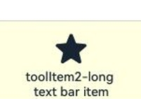 | 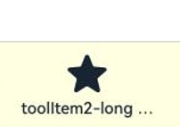 |

**起始API Level**

Navigation组件toolbarConfiguration接口：起始支持版本为 API 10。

NavDestination组件toolbarConfiguration接口：起始支持版本为 API 13。

**变更发生版本**

从OpenHarmony SDK 5.1.0.55开始。

**变更的接口/组件**

涉及组件： Navigation, NavDestination组件。

涉及接口： 

Navigation组件：

toolbarConfiguration(value: Array&lt;ToolbarItem&gt; | CustomBuilder, options?: NavigationToolbarOptions)

NavDestination组件：

toolbarConfiguration(toolbarParam: Array&lt;ToolbarItem&gt; | CustomBuilder, options?: NavigationToolbarOptions)

**适配指导**

默认效果变更，无需适配。

## cl.arkui.4 Navigation工具栏高度变更

**访问级别**

公开接口

**变更原因**

UX规范变更。

**变更影响**

此变更不涉及应用适配。

- 变更前：Navigation工具栏高度为56_vp。

- 变更后：Navigation工具栏高度为48_vp。

| | 变更前 | 变更后 |
|---------|---------|---------|
|工具栏高度| 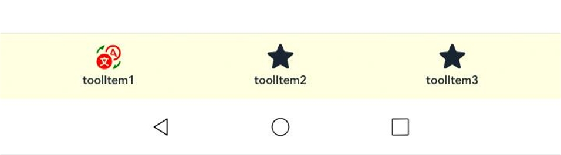 | 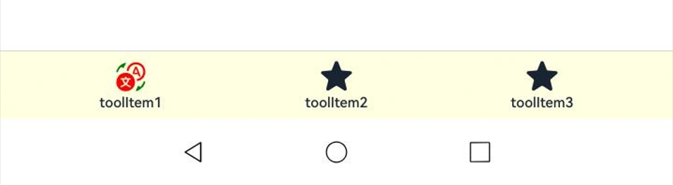 |

**起始API Level**

Navigation组件toolbarConfiguration接口：起始支持版本为 API 10。

NavDestination组件toolbarConfiguration接口：起始支持版本为 API 13。

**变更发生版本**

从OpenHarmony SDK 5.1.0.55开始。

**变更的接口/组件**

涉及组件： Navigation, NavDestination组件。

涉及接口： 

Navigation组件：

toolbarConfiguration(value: Array&lt;ToolbarItem&gt; | CustomBuilder, options?: NavigationToolbarOptions)

NavDestination组件：

toolbarConfiguration(toolbarParam: Array&lt;ToolbarItem&gt; | CustomBuilder, options?: NavigationToolbarOptions)

**适配指导**

默认效果变更，无需适配。

## cl.arkui.5 Navigation工具栏聚焦、Hover态样式变更

**访问级别**

公开接口

**变更原因**

UX规范变更。

**变更影响**

此变更不涉及应用适配。

- 变更前：Navigation工具栏聚焦/Hover态高度56.0_vp，长度随item数目自适应，Hover态圆角大小为8.0_vp。

- 变更后：Navigation工具栏聚焦/Hover态高度44.0_vp，长度比原来减少4vp（比原来上下左右各增加2vp的padding），Hover态圆角大小为12.0_vp。

| | 变更前 | 变更后 |
|---------|---------|---------|
|聚焦态| 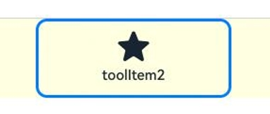 | 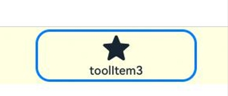 |
|Hover态| 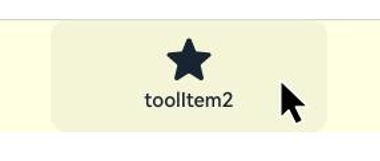 | 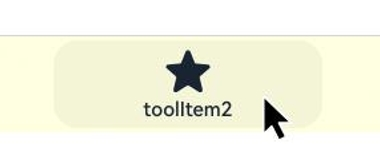 |

**起始API Level**

Navigation组件toolbarConfiguration接口：起始支持版本为 API 10。

NavDestination组件toolbarConfiguration接口：起始支持版本为 API 13。

**变更发生版本**

从OpenHarmony SDK 5.1.0.55开始。

**变更的接口/组件**

涉及组件： Navigation, NavDestination组件。

涉及接口： 

Navigation组件：

toolbarConfiguration(value: Array&lt;ToolbarItem&gt; | CustomBuilder, options?: NavigationToolbarOptions)

NavDestination组件：

toolbarConfiguration(toolbarParam: Array&lt;ToolbarItem&gt; | CustomBuilder, options?: NavigationToolbarOptions)

**适配指导**

默认效果变更，无需适配。

## cl.arkui.6 Navigation工具栏单个item上下边距变更

**访问级别**

公开接口

**变更原因**

UX规范变更。

**变更影响**

此变更不涉及应用适配。

- 变更前：上边距8vp下边距10vp。

- 变更后：上下边距都是6vp。

| | 变更前 | 变更后 |
|---------|---------|---------|
|单个item上下边距| 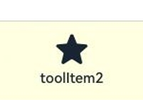 | 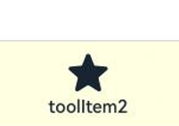 |

**起始API Level**

Navigation组件toolbarConfiguration接口：起始支持版本为 API 10。

NavDestination组件toolbarConfiguration接口：起始支持版本为 API 13。

**变更发生版本**

从OpenHarmony SDK 5.1.0.55开始。

**变更的接口/组件**

涉及组件： Navigation, NavDestination组件。

涉及接口： 

Navigation组件：

toolbarConfiguration(value: Array&lt;ToolbarItem&gt; | CustomBuilder, options?: NavigationToolbarOptions)

NavDestination组件：

toolbarConfiguration(toolbarParam: Array&lt;ToolbarItem&gt; | CustomBuilder, options?: NavigationToolbarOptions)

**适配指导**

默认效果变更，无需适配。

## cl.arkui.7 Navigation工具栏选项取消按压态

**访问级别**

公开接口

**变更原因**

UX规范变更。

**变更影响**

此变更不涉及应用适配。

- 变更前：工具栏选项具有按压态。

- 变更后：工具栏选项取消按压态。

| | 变更前 | 变更后 |
|---------|---------|---------|
|选项按压态| 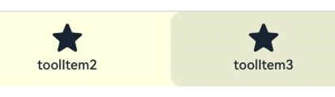 |  |

**起始API Level**

Navigation组件toolbarConfiguration接口：起始支持版本为 API 10。

NavDestination组件toolbarConfiguration接口：起始支持版本为 API 13。

**变更发生版本**

从OpenHarmony SDK 5.1.0.55开始。

**变更的接口/组件**

涉及组件： Navigation, NavDestination组件。

涉及接口： 

Navigation组件：

toolbarConfiguration(value: Array&lt;ToolbarItem&gt; | CustomBuilder, options?: NavigationToolbarOptions)

NavDestination组件：

toolbarConfiguration(toolbarParam: Array&lt;ToolbarItem&gt; | CustomBuilder, options?: NavigationToolbarOptions)

**适配指导**

默认效果变更，无需适配。