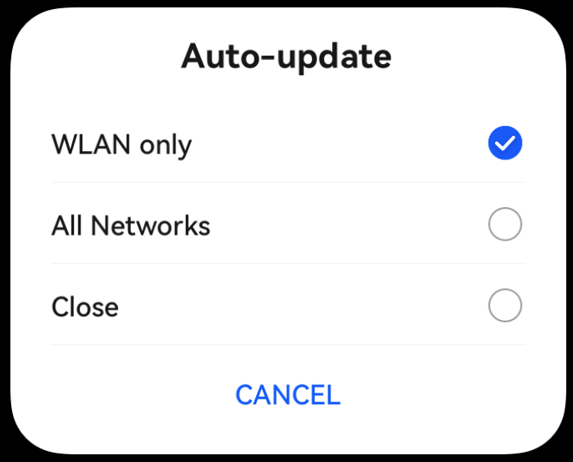
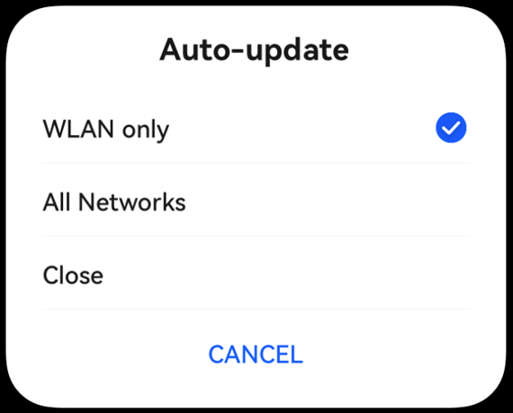

# ArkUI子系统Changelog

## cl.arkui.1 Repeat virtualScroll模式下，key不变&item改变的数据不刷新

**访问级别**

公开接口

**变更原因**

Repeat组件缓存复用能力优化。

**变更影响**

此变更涉及应用适配。

- 变更前：key不变，item改变，界面立即触发刷新，数据改变。

- 变更后：key不变，item改变，认为节点没有发生变化，界面不会立即触发刷新。

eg. 运行下面的Demo示例，进入页面后，点击“click”按钮改变数组项的值。

```ts
@ObservedV2
class RepeatData {
  @Trace id: string;
  @Trace msg: string;

  constructor(id: string, msg: string) {
    this.id = id;
    this.msg = msg;
  }
}

@Entry
@ComponentV2
struct RepeatRerender {
  @Local dataArr: Array<RepeatData> = [];

  aboutToAppear(): void {
    for (let i = 0; i < 10; i++) {
      this.dataArr.push(new RepeatData(`key${i}`, `data${i}`));
    }
  }

  build() {
    Column({ space: 20 }) {
      List() {
        Repeat<RepeatData>(this.dataArr)
          .each((ri: RepeatItem<RepeatData>) => {
            ListItem() {
              Text(ri.item.msg).fontSize(30)
            }
          })
          .key((item: RepeatData, index: number) => item.id)
          .virtualScroll()
      }
      .cachedCount(2)
      .width('100%')
      .height('40%')
      .border({ width: 1 })
      .backgroundColor(0xFAEEE0)

      Button('click').onClick(() => {
        this.dataArr.splice(0, 1, new RepeatData('key0', 'new msg')); // 改变列表第一项的数据，保持key不变
      })
    }
  }
}
```

变更前：点击按钮后，节点数据发生变化，如下图所示。


变更后：点击按钮后，节点数据没有变化。

**起始API Level**

12

**变更发生版本**

从OpenHarmony SDK 5.1.0.55开始。

**适配指导**

应用是否需要适配需要根据具体场景决定。如果开发者希望页面中的列表数据随着键值key的变化而变化（key不改变时页面不刷新），则无需更改`.key()`。

如果希望数据发生变化就触发页面刷新，第一种方法（建议）：去掉Repeat的`.key()`函数；第二种方法：`.key()`的值的变化和数据变化保持一致。以上面的Demo为例，两种修改方案分别如下。

第一种方案，去掉Repeat的`.key()`函数：

```ts
@ObservedV2
class RepeatData {
  @Trace id: string;
  @Trace msg: string;

  constructor(id: string, msg: string) {
    this.id = id;
    this.msg = msg;
  }
}

@Entry
@ComponentV2
struct RepeatRerender {
  @Local dataArr: Array<RepeatData> = [];

  aboutToAppear(): void {
    for (let i = 0; i < 10; i++) {
      this.dataArr.push(new RepeatData(`key${i}`, `data${i}`));
    }
  }

  build() {
    Column({ space: 20 }) {
      List() {
        Repeat<RepeatData>(this.dataArr)
          .each((ri: RepeatItem<RepeatData>) => {
            ListItem() {
              Text(ri.item.msg).fontSize(30)
            }
          })
          .virtualScroll() // 删除.key()函数
      }
      .cachedCount(2)
      .width('100%')
      .height('40%')
      .border({ width: 1 })
      .backgroundColor(0xFAEEE0)

      Button('click').onClick(() => {
        this.dataArr.splice(0, 1, new RepeatData('key0', 'new msg')); // 改变列表第一项的数据，保持key不变
      })
    }
  }
}
```

第二种方案，修改`.key()`，使得`.key()`的值的变化和数据变化保持一致：

```ts
@ObservedV2
class RepeatData {
  @Trace id: string;
  @Trace msg: string;

  constructor(id: string, msg: string) {
    this.id = id;
    this.msg = msg;
  }
}

@Entry
@ComponentV2
struct RepeatRerender {
  @Local dataArr: Array<RepeatData> = [];

  aboutToAppear(): void {
    for (let i = 0; i < 10; i++) {
      this.dataArr.push(new RepeatData(`key${i}`, `data${i}`));
    }
  }

  build() {
    Column({ space: 20 }) {
      List() {
        Repeat<RepeatData>(this.dataArr)
          .each((ri: RepeatItem<RepeatData>) => {
            ListItem() {
              Text(ri.item.msg).fontSize(30)
            }
          })
          .key((item: RepeatData, index: number) => item.msg) // .key()的值的变化和数据变化保持一致，数据改变时key也会改变
          .virtualScroll()
      }
      .cachedCount(2)
      .width('100%')
      .height('40%')
      .border({ width: 1 })
      .backgroundColor(0xFAEEE0)

      Button('click').onClick(() => {
        this.dataArr.splice(0, 1, new RepeatData('key0', 'new msg')); // 改变列表第一项的数据，保持key不变
      })
    }
  }
}
```

## cl.arkui.2 selectDialog未选中radio样式变更

**访问级别**

公开接口

**变更原因**

弹窗内容风格优化，增强用户体验。

**变更影响**

此变更不涉及应用适配。

变更点1：selectDialog未选中radio样式变更。

| 变更前                                                                                       | 变更后                                                                        |
|-------------------------------------------------------------------------------------------|----------------------------------------------------------------------------|
| selectDialog未选中时的radio为显示非高亮状态。<br>   | selectDialog未选中时的radio不显示。<br> |


**起始API Level**

API 11

**变更发生版本**

从OpenHarmony SDK 5.1.0.55开始。

**变更的接口/组件**

advancedDialog.selectDialog

**适配指导**

默认行为变更，无需适配。系统弹窗默认规格优化演进，若开发者有其他布局、样式诉求，建议使用CustomDialog自定义实现。

## cl.arkui.3 修复blendMode接口离屏模式会影响组件设置的不透明度的问题

**访问级别**

公开接口

**变更原因**

blendMode离屏模式与不透明度属性（opacity）同时使用时，组件的不透明度并不等于设置的不透明度，效果异常。

**变更影响**

此变更涉及应用适配，仅针对组件设置了blendMode离屏模式且具有不透明度的场景。

变更前：组件设置了blendMode离屏模式，同时设置了opacity不透明度 A，则组件实际不透明度为 A * A

变更后：组件设置了blendMode离屏模式，同时设置了opacity不透明度 A，则组件实际不透明度为 A

变更前后效果如下:

|变更前|变更后|
|--|--|
|||


**起始API Level**

API 11


**变更发生版本**

从 OpenHarmony SDK 5.1.0.55 开始。

**变更的接口/组件**

blendMode 接口

**适配指导**

如果开发者希望在同时使用blendMode离屏模式和opacity接口时保持组件的不透明度不变，则需要手动调整原本设定的不透明度。例如，在下方示例代码中，在 Stack()上额外设置.opacity(0.5)，以确保实际的不透明度为 0.5 * 0.5。

```ts
@Entry
@Component
struct Index {
  build() {
    Column() {
       Stack() {
       }
       .height('50%')
       .width('50%')
       .backgroundColor(0x0A59F7)
       .blendMode(BlendMode.SRC_OVER, BlendApplyType.OFFSCREEN)
       .opacity(0.5)  // 变更后需要额外设置0.5的不透明度保证实际不透明度为 0.5*0.5
    }
    .height('100%')
    .width('100%')
    .backgroundColor(0xFFFFFF)
    .opacity(0.5)
  }
}
```

## cl.arkui.4 窗口getWindowProperties接口返回的windowType修改

**访问级别**

公开接口

**变更原因**
主窗调用getWindowProperties接口，返回的windowType为TYPE_SYSTEM_ALERT

**变更影响**
此变更涉及应用适配。

| 变更前                           |           变更后 |
|---------------------------------|------------------|
|主窗调用getWindowProperties接口，返回的windowType为TYPE_SYSTEM_ALERT。| 主窗调用getWindowProperties接口，返回的windowType为TYPE_MAIN。|


**起始API Level**

API 9

**变更发生版本**

从OpenHarmony SDK 5.1.0.55开始。

**变更的接口/组件**

@ohos.window.d.ts#getWindowProperties

**适配指导**

应用在主窗调用getWindowProperties获取windowtype时，要适配返回值的变化。
