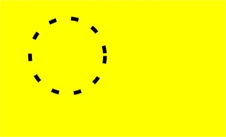

# ArkUI变更说明

## cl.arkui.1 状态变量支持undefined和null

**变更影响**

API version 9：状态变量不支持undefined和null，当开发者给状态变量设置undefined或者null时，设置失败，即状态变量还是上一次的值。

API version 10：状态变量支持undefined和null，当开发者给状态变量设置undefined和null时，ArkUI框架会接受该值，即下一次读状态变量的是undefined和null，开发者要注意做判空保护。

**适配指导**

API version 9，当开发者给状态变量设置undefined时，设置无效，会导致开发者忽略对undefined的校验。
```ts
@Entry
@Component
struct Page3 {
  @State messages: string[] = ['Hello World']

  aboutToAppear() {
    // AppStorage里没有对应的key，返回undefined
    // API version 9：赋值不生效，ArkUI框架会拒绝undefined，this.messages还为其初始值['Hello World']
    // API version 10: 赋值生效，ArkUI框架会接受undefined，this.messages为undefined
    this.messages = AppStorage.Get("aProp")
  }

  build() {
    Row() {
      Column() {
        // API version 9: 应用没有crash，length为1 
        // API version 10：应用crash, Error message: Cannot read property length of undefined
        Text(`the messages length: ${this.messages.length}`)
          .fontSize(50)
          .fontWeight(FontWeight.Bold)
      }
      .width('100%')
    }
    .height('100%')
  }
}
```

对于上述情况，当每一次给状态变量赋值undefined和null时，需要对状态变量是否为undefined做校验。

```ts
Text(`the messages length: ${this.messages?.length}`)
```

API version 10，ArkUI框架增强对状态变量类型和初始化的校验，ArkUI框架会抛出运行时报错。具体有以下两种情况：
1. @Link必须被父组件初始化。

对于以下示例，当前会抛出运行时报错，提示开发者需要初始化@Link。
```ts
@Entry
@Component
struct Page3 {
  @State aProp: boolean = true

  build() {
    Row() {
      Column() {
        // crash: SynchedPropertyObjectTwoWayPU[9, 'linkProp']: constructor @Link/@Consume source variable in
        // parent/ancestor @Component must be defined. Application error!
        LinkChild()
        // 错误的用常规变量初始化linkProp，ArkUI框架无认为没有初始化，和上述一样的报错
        LinkChild({ aProp: false })
        // 正确，用状态变量this.aProp初始化@Link
        LinkChild({ aProp: this.aProp })
      }
      .width('100%')
    }
    .height('100%')
  }
}

@Component
struct LinkChild {
  @Link aProp: boolean

  build() {
    Text(`linkProp: ${this.aProp}`)
      .fontSize(50)
      .fontWeight(FontWeight.Bold)
  }
}
```

2. 校验状态变量不支持的类型。

状态变量对于不支持的类型，比如function，抛出运行时报错来提示开发者。
```ts
@Entry
@Component
struct Page3 {
  // API version 10：运行时报错：@Component 'Page3': Illegal variable value error with decorated variable @State/@Provide 'functionProp': failed
  // validation: 'undefined, null, number, boolean, string, or Object but not function, attempt to assign value type: 'function', 
  @State functionProp: () => void = () => {
    console.info("123")
  }

  aboutToAppear() {
    this.functionProp()
  }

  build() {
    Row() {
      Column() {
        Text("hello")
      }
      .width('100%')
    }
    .height('100%')
  }
}
```

## cl.arkui.2 更新4.0.10.x sdk后，出现组件功能异常的适配指导
更新4.0.10.x sdk之后，如果设备未使用配套的镜像版本，应用代码中调用UI组件时，会无法正常显示。

**示例：**

```
@Entry
@Component
struct Index { // 自定义组件
  build() {
    Text('Hello, world') // 基础组件
  }
}
```

**变更影响**

更新4.0.10.x sdk之后，如果设备未使用配套的镜像版本，应用代码中调用UI组件时，
运行到设备上会出现`this.observeComponentCreation2 is not callable`的报错。

**关键的接口/组件变更**

不涉及。

**适配指导**

更新SDK配套的设备镜像。

## cl.arkui.3 List组件滚动条状态设置undefined或非法值处理变更

**变更影响**

OpenHarmony_4.0.10.1之前，开发者设置scrollBar(undefined), scrollBar('aaa'), scrollBar(-1)会处理成BarState.Off状态。</br>
OpenHarmony_4.0.10.2及之后，开发者设置scrollBar(undefined), scrollBar('aaa'), scrollBar(-1)会处理成默认值BarState.Auto状态。

**关键的接口变更**

List组件scrollBar接口设置undefined或非法值的处理方式由BarState.Off变更为BarState.Auto。

## cl.arkui.4 Grid组件滚动条状态设置undefined或非法值处理变更

**变更影响**

OpenHarmony_4.0.10.1之前，开发者设置scrollBar(undefined), scrollBar('aaa'), scrollBar(-1)会处理成BarState.Off状态。</br>
OpenHarmony_4.0.10.2及之后，开发者设置scrollBar(undefined), scrollBar('aaa'), scrollBar(-1)会处理成默认值BarState.Auto状态。

**关键的接口变更**

Grid组件scrollBar接口设置undefined或非法值的处理方式由BarState.Off变更为BarState.Auto。


## cl.arkui.5 NavPathStack类中的方法名称变更

**关键接口/组件变更**

[NavPathStack](../../../application-dev/reference/arkui-ts/ts-basic-components-navigation.md#navpathstack10)  
|  变更前   | 变更后  |
|  ----  | ----  |
| push  | pushPath |
| pushName  | pushNameByPath |
| popTo| PopToName |

**变更影响**

更新4.0.10.x SDK之后，如果代码未变更方法名称，将出现编译报错。   
Property 'push' does not exist on type 'NavPathStack'.   
Property 'pushName' does not exist on type 'NavPathStack'.   
Property 'pop' does not exist on type 'NavPathStack'.   

**适配指导**   

需更新应用代码

```ts
navPathStack = new NavPathStack();
this.navPathStack.push(...)
this.navPathStack.pushPath(...)

this.navPathStack.pushName('navidesnation_add',this.value)
this.navPathStack.pushPathByName('navidesnation_add',this.value) 

this.navPathStack.pop('navidesnation_add')
this.navPathStack.popToName('navidesnation_add')
```

## cl.arkui.6 setLineDash接口实现变更

**说明**
setLineDash接口参数number的单位由px变成vp。

**示例：**
```ts
@Entry
@Component
struct SetLineDash {
  private settings: RenderingContextSettings = new RenderingContextSettings(true)
  private context: CanvasRenderingContext2D = new CanvasRenderingContext2D(this.settings)

  build() {
    Flex({ direction: FlexDirection.Column, alignItems: ItemAlign.Center, justifyContent: FlexAlign.Center }) {
      Canvas(this.context)
        .width('100%')
        .height('100%')
        .backgroundColor('#ffff00')
        .onReady(() =>{
          let ctx = this.context
          ctx.lineWidth = 5
          ctx.arc(100, 75, 50, 0, 6.28)
          ctx.setLineDash([10,20])
          ctx.stroke();
        })
      Image('image/SetLineDash.png')
        .objectFit(ImageFit.Contain)
    }
    .width('100%')
    .height('100%')
  }
}
```
API version 9：setLineDash接口参数number的单位为px。


API version 10及以后：setLineDash接口参数number的单位为vp。



**变更影响**

setLineDash接口参数number的单位由px变为vp，setLineDash接口在API version 9及以前与API version 10及以后的绘制效果不一样。

## cl.arkui.7 Navigation标题自定义位置变更

1. NavigationTitleMode设置为Full、Free或者Mini不带返回键场景。

   API Version 9：保持左边距 24vp。

   API Version 10: 左边距发生更改，由24vp更改为0。上边距由居中显示更改为上边距0。

2. NavigationTitleMode设置为Mini并且显示返回键。

   API Version 9: 自定义标题与返回键间距为16vp。

   API Version 10: 自定义标题栏与返回键间距变更：16vp变更为12vp。

3. 自定义Menu场景。

   API Version 9：右边距为24vp。

   API Version 10: 右边距由24vp变更为0。

**变更原因**

从API Version 9开始，会对Navigation的自定义标题以及自定义Menu添加边距，影响开发者对自定义组件的使用。从4.0.10.6版本对该问题进行优化，针对API Version 10的应用去掉自定义标题标题和自定义Menu的偏移。

**变更影响**

该变更会导致API Version 10中使用Navigation自定义标题位置发生变化，显示会偏左和偏上。针对API Version 9及以下应用无影响。

**适配方法**

1. 针对NavigationTitleMode.Full、Free模式以及NavigationTitleMode.Mini,添加左间距偏移：$r('sys.float.ohos_id_max_padding_start')。
实现自定标题的居中效果: .height('100%').alignItems(VerticalAlign.Center)

2. 针对NavigationTitleMode设置为Mini模式，并且显示返回键场景: 添加左偏移：.margin({left: 4}),居中效果同上。

3. 针对自定义Menu适配：添加右边距配置: .margin({right: $r('sys.float.ohos_id_max_padding_end')})


**示例：**
```ts
@Entry
@Component
struct Index {
  @State titleMode: NavigationTitleMode = NavigationTitleMode.Free
  @State backButton: boolean = false;
  @Builder CustomMenu() {
    Column() {
      Image($r('app.media.icon')).width(24).height(24)
    }
  }

  @Builder CustomTitle() {
    Column() {
      Text('Custom title').fontSize(20)
    }
  }

  build() {
    Column() {
      Navigation() {
        Column() {
          Text(`Change current title mode: ${this.titleMode}`)
            .onClick(()=>{
              if (this.titleMode == NavigationTitleMode.Free) {
                this.titleMode = NavigationTitleMode.Full;
              } else if (this.titleMode == NavigationTitleMode.Full) {
                this.titleMode = NavigationTitleMode.Mini;
              } else {
                this.titleMode = NavigationTitleMode.Free;
              }
            })

          Text(`Change back button: ${this.backButton}`).onClick(()=>{
            this.backButton = !this.backButton;
          }).margin({top: 10})
        }.margin({top: 40})
      }.title(this.CustomTitle)
      .titleMode(this.titleMode)
      .menus(this.CustomMenu)
      .hideBackButton(this.backButton)
    }
  }
}
```
API Version 9：NavigationTitleMode.Full自定义标题栏以及自定义Menu显示


API Version 10: NavigationTitleMode.Full自定义标题栏以及自定义Menu显示


API Version 9: NavigationTitleMode.Mini带返回键自定义标题栏显示


API Version 10: NavigationTitleMode.Mini带返回键自定义标题栏显示


API Version 9: NavigationTitleMode.Mini不带返回键标题栏显示


API Version 10: NavigationTitleMode.Mini不带返回键标题栏显示


## cl.arkui.8 NavDestination标题栏变更

针对自定义标题：

1. 带返回键场景。

   API Version 9：返回键与标题栏间距为16vp，标题栏居中。

   API Version 10：标题栏与返回键间距变更由16vp变更为12vp，标题栏上偏移该为0。

2. 不带返回键场景。

   API Version 9: 标题栏左间距为24vp，标题栏居中。

   API Version 10：标题栏左间距变更24vp变更为0,标题栏上偏移该为0。

**变更原因**

从API Version 9开始，会对Navigation的自定义标题添加边距，影响开发者对自定义组件的使用。从4.0.10.6版本对该问题进行优化，针对API Version 10的应用去掉自定义标题标题的偏移。

**变更影响**
NavDestination自定义标题栏会移到左上

**适配方法**

应用如果要保持之前的显示效果，可以采用如下方案适配：

1. 针对不带返回键的场景，添加左偏移： margin({left: $r('sys.float.ohos_id_max_padding_start')}),
添加居中效果 .height('100%').alignItems(VerticalAlign.Center)

2. 针对带返回键场景，添加做偏移：margin（{left: 4})，居中实现效果同上。

**示例：**
```ts
@Entry
@Component
struct Index {
  @Builder NavigationTile() {
    Column() {
      Text('title').fontColor('#182431').fontSize(30).lineHeight(41)
      Text('subTitle').fontColor('#182431').fontSize(14).lineHeight(19).margin(top:2, bottom: 20)
    }
  }

  build() {
    Column() {
      Navigation() {
        Text('Navigation')
      }.title(this.NavigationTitle)
       .titleMode(NavigationTitleMode.Free)
       .menus([
        {icon: 'common/image/icon.png', value: 'menu1'}
       ])
    }
  }
}
```

API Version 9：带返回键自定义标题页面


API Version 10: 带返回键自定义标题页面


API9: 不带返回键自定义标题页面


API10: 不带返回键自定义标题页面


## cl.arkui.9 NavRouter回调OnStateChange变更

OnStateChange调用次数修复：

针对目标显示NavDestination的OnStateChange回调由调用2次，修复为调用1次，调用顺序不受影响。

**变更影响**

利用OnStateChange调用时序处理的应用会受到影响。

   更改之前调用时序：目标显示NavRouter触发OnStateChange(true) -> 退出NavRouter触发OnStateChange(false) -> 目标显示Navrouter触发OnStateChange(true)

   更改之后调用时序：目标显示NavRouter触发OnStateChange(true) -> 退出NavRouter触发OnStateChange(false)

## cl.arkui.10 PanelHeight枚举的WRAP_CONTENT值从0变更为'wrapContent'

**变更影响**

变更前，开发者设置customHeight(0)和customHeight(PanelHeight.WRAP_CONTENT)都会自适应内容高度。</br>
变更后，开发者设置customHeight(0)将内容高度设置为0，customHeight(PanelHeight.WRAP_CONTENT)自适应内容高度。

**关键的接口变更**

PanelHeight枚举的WRAP_CONTENT值从0变为'wrapContent'，接口行为变更对开发者无影响。

## cl.arkui.11 aspectRatio设置非法值和undefined时，默认值从1.0变为null。

**变更影响**

变更前，开发者设置负数和undefined，aspectRatio = 1.0

变更后，开发者设置负数和undefined，aspectRatio为null。例如，Row只设置宽度且没有子组件，aspectRatio不设置值或者设置成负数时，此时Row高度为0。

## cl.arkui.12 defaultFocus设置为true由不生效变更为生效。

**变更影响**
4.0.9.1版本之前，开发者defaultFocus设置为true不生效

4.0.9.1版本及之后，开发者defaultFocus设置为true生效

## cl.arkui.13 焦点tabIndex走焦方式由非循环走焦更改为循环走焦。

**变更影响**
4.0.10.2版本之前，焦点tabIndex走焦方式为非循环走焦

4.0.10.2版本及之后，焦点tabIndex走焦方式为循环走焦

## cl.arkui.14 TextInput设置margin属性时，TextInput的Constraint不再减去Margin的值。

**变更影响**

4.0.10.2版本之前，TextInput设置margin时，TextInput的Constraint会减去所设置margin的值。

4.0.10.2版本及之后，TextInput设置margin时，TextInput的Constraint不会减去所设置margin的值。


## cl.arkui.15 button组件对fontSize设置为负数（即异常值）时的处理规则进行细化，保证取值合理性。

**变更影响**

变更前，开发者设置负数时，fontSize为开发者设置的负数值，即最终效果与fontSize=0的效果一致，文字内容不显示<br>
变更后，开发者设置负数时，fontSize为默认值16fp。<br>
说明：fontSize=0的效果未变更，都是文字不显示的效果，以上变更仅涉及开发者设置fontSize<0的异常场景

## cl.arkui.16 Search组件动态改变属性时，输入框内容变化情况变更，保证输入框内容的正确性。

**变更影响**

变更前，开发者在Search组件接口中只设置placeholder不设置value时，动态改变Search的属性，Search中的内容会被清空。<br>
变更后，开发者在Search组件接口中只设置placeholder不设置value时，动态改变Search的属性，Search中的内容会保持不变。
说明：变更后为正常使用search的期望行为。

## cl.arkui.17 Menu组件宽度规格变更

[Menu](../../../application-dev/reference/arkui-ts/ts-basic-components-menu.md)宽度规格变更，未设置宽度时，按默认2栅格显示；设置宽度时，Menu内容根据设置的宽度进行自适应布局。Menu组件自带默认64vp的最小宽度。

**变更影响**

1. Menu宽度默认2栅格显示，若菜单项[MenuItem](../../../application-dev/reference/arkui-ts/ts-basic-components-menuitem.md)内容区比2栅格宽，则会自适应撑开。
2. 最小宽度64vp。开发者可通过[constraintSize](../../../application-dev/reference/arkui-ts/ts-universal-attributes-size.md)属性修改最小宽度限制。

**关键接口/组件变更**

- [Menu组件](../../../application-dev/reference/arkui-ts/ts-basic-components-menu.md)

**适配指导**

若开发者期望菜单显示宽度小于64vp或无最小宽度限制，修改constraintSize覆盖默认的最小宽度。

**示例：**
```ts
@Entry
@Component
struct Index {
  @Builder
  MyMenu(){
    Menu() {
      MenuItem({ startIcon: $r("app.media.icon"), content: "菜单选项" })
    }
    .width(30)
    .constraintSize({minWidth: 0})  // 覆盖系统默认的64vp最小宽度
  }

  build() {
    Row() {
      Column() {
        Text('click to show menu')
      }
      .bindMenu(this.MyMenu)
      .width('100%')
    }
    .height('100%')
  }
}
```

## cl.arkui.18 springCurve速度方向规格变更

**变更影响**

在API version 9，[springCurve](../../../application-dev/reference/apis/js-apis-curve.md#curvesspringcurve9)的[interpolate](../../../application-dev/reference/apis/js-apis-curve.md#interpolate9)方法在计算时，springCurve的初速度>0为逆着终点方向，初速度<0为顺着终点方向。<br/>
从API version 10起，springCurve的interpolate方法在计算时，springCurve的初速度>0为顺着终点方向，初速度<0为逆着终点方向。会导致初速度不为0时springCurve的interpolate方法和API version 10之前的计算结果不一致。

## cl.arkui.5 springCurve实际曲线时间估算阈值规格变更

**变更影响**

在API version 9，[springCurve](../../../application-dev/reference/apis/js-apis-curve.md#curvesspringcurve9)的[interpolate](../../../application-dev/reference/apis/js-apis-curve.md#interpolate9)方法对springCurve实际曲线时长的最长估算时间为1秒，当物理曲线时长超过1秒时，按1秒估算，导致超过1秒的springCurve的动画时间归一化不正确，插值结果在t=1时会跳变。<br/>
从API version 10起，springCurve的interpolate方法对springCurve的最长估算时间为1000秒，对于绝大多数正常springCurve曲线均能正确估算动画时长。会导致物理曲线本身时长超过1秒的springCurve的interpolate方法和API version 10之前的计算结果不一致。

## cl.arkui.19 用户界面外观服务接口行为变更。

4.0.10.3版本开始，系统接口setDarkMode和getDarkMode返回信息的方式和内容发生变更，需要根据适配指导进行适配。

**变更影响**

基于此前版本开发的系统应用，对返回值的处理需适配新的方式，否则会影响原有业务逻辑。

**关键的接口/组件变更**

涉及接口如下：
- setDarkMode接口在Callback调用方式下，异常情况的处理由只抛出错误码ID变更为抛出错误码ID和错误码信息；
- setDarkMode接口在Promise调用方式下，异常情况的处理由只抛出错误信息变更为抛出错误码ID和错误码信息；
- setDarkMode接口在Callback调用方式下，正常情况的第一个参数由返回0变更为返回null；
- getDarkMode接口在异常情况下由直接返回2变更为抛出异常，需要通过错误码ID和错误码信息判断报错类型。

**说明**：异常情况指参数错误、未配置权限及内部执行出错等未预期的行为，正常情况指未产生错误的预期行为。

**适配指导**

请参考[ @ohos.uiAppearance(用户界面外观)](../../../application-dev/reference/apis/js-apis-uiappearance.md)接口的API参考。
