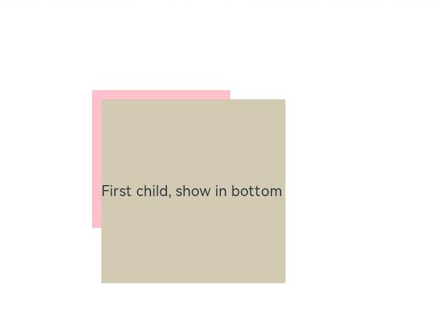

# arkui子系统ChangeLog


## cl.arkui.1 List组件和Gird组件滚动条默认状态变更

List组件和Gird组件滚动条默认状态从BarState.Off变更为BarState.Auto。

**变更影响**

List组件和Gird组件，如果没有设置滚动条状态，变更前不会显示滚动条，变更以后滚动时会显示滚动条，滚动停止两秒后滚动条隐藏。

**关键接口/组件变更**

List组件和Gird组件滚动条API接口文档：
- [List组件属性](../../../application-dev/reference/arkui-ts/ts-container-list.md#属性)
- [Grid组件属性](../../../application-dev/reference/arkui-ts/ts-container-grid.md#属性)

**适配指导**

对于不需要滚动条的场景，需要将List组件或Grid组件的scrollBar属性设置为BarState.Off。

参考代码如下：
```ts
// xxx.ets
@Entry
@Component
struct ListItemExample {
  private arr: number[] = [0, 1, 2, 3, 4, 5, 6, 7, 8, 9]

  build() {
    Column() {
      List({ space: 20, initialIndex: 0 }) {
        ForEach(this.arr, (item) => {
          ListItem() {
            Text('' + item)
              .width('100%').height(100).fontSize(16)
              .textAlign(TextAlign.Center).borderRadius(10).backgroundColor(0xFFFFFF)
          }
        }, item => item)
      }
      .width('90%')
      .scrollBar(BarState.Off)
    }.width('100%').height('100%').backgroundColor(0xDCDCDC).padding({ top: 5 })
  }
}
```

## cl.arkui.2 修复Stack布局问题

修复问题：[Stack](../../../application-dev/reference/arkui-ts/ts-container-stack.md)设置alignContent，在子组件超出父组件的场景中，子组件未按照alignContent布局
示例：
```ts
@Entry
@Component
struct StackExample {
  build() {
    Stack({alignContent:Alignment.TopEnd}){
      Text('First child, show in bottom')
        .width(200).height(200).backgroundColor(0xd2cab3).margin(10)
    }.width(150).height(150).backgroundColor(Color.Pink).margin(100)
  }
}
```
修复前：子组件未能按照alignContent:Alignment.TopEnd布局


修复后：子组件可以按照alignContent:Alignment.TopEnd布局


**变更影响**

1. 如果应用中有子组件大小大于父组件Stack的场景，需要应用进行适配。
2. 应用之前可能采用的规避方案：给子组件设置Offset或者translate

**适配指导**

  去掉之前给子组件设置的Offset或者translate，使用alignContent实际布局方式进行布局。

##  cl.arkui.3 Button组件hover状态效果变更

Button组件的hover状态由100-105%放大效果变更为0-5%不透明度的叠加效果，hover状态切换到press状态的效果变更为5-10%不透明度的叠加效果。

**变更影响**

影响Button的hover状态的视觉效果以及hover状态切换到press状态的视觉效果。