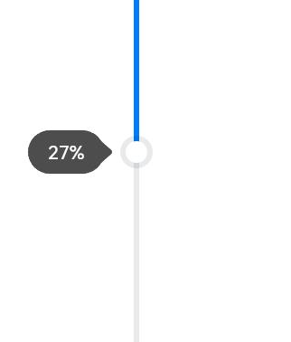
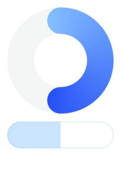
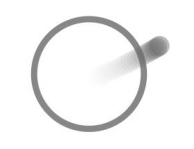
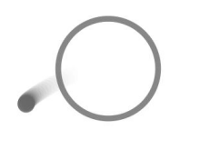
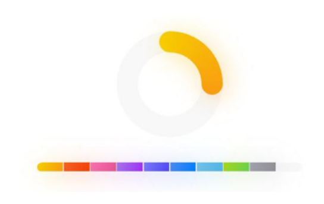
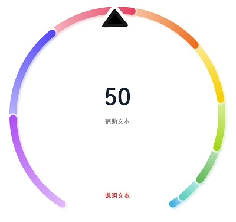

# ArkUI变更说明

## cl.arkui.1 Slider设置showTips方法显示效果变更

**访问级别**

公开接口

**变更原因**

该变更为兼容性变更，约束了Silder气泡的使用，优化了slider气泡的样式。

**变更影响**

Slider通过设置showTips方法，显示气泡。该方法有两个参数，参数1:boolean类型，表示是否显示气泡；参数2:ResourceStr类型，表示气泡中的文本内容。
具体受影响的场景见下文：

a) showTips 第一个参数设置为true显示气泡，气泡样式变化

变更前气泡样式：


变更后气泡样式：



b) showTips 第二个参数设置文本内容时，文本内容可能产生变化

变更前：根据栅格化宽度，可多行显示文本，全量显示文本。

变更后：单行显示文本，文本最大宽度36vp，即最大显示2个中文字符或4个数字。

**API Level**

7

**变更发生版本**

从OpenHarmony SDK 4.1.5.5开始。

**变更的接口/组件**

滑动条（Slider）

**适配指导**

默认行为变更，不涉及适配。

## cl.Arkui.2 Progress组件的默认颜色变更

**访问级别**

公开接口

**变更原因**

当前Progress组件的默认进度条前景色、默认进度条底色和默认内描边颜色不符合UX规范，因此依照UX规范对相关默认颜色做出变更。

**变更影响**

该变更为兼容性变更，改变了组件默认情况下的显示颜色，提升了组件的默认显示效果。

**API Level**

8

**变更发生版本**

从OpenHarmony SDK 4.1.5.5开始。

**变更的接口/组件**

API 11前，胶囊样式进度条默认前景色是系统资源中的`ohos_id_color_emphasize_contrary`，默认内描边颜色是系统资源中的`ohos_id_color_emphasize_contrary`，环形样式进度条默认进度条底色是系统资源中的`ohos_id_color_component_normal`。


API 11及以后，胶囊样式进度条默认前景色是系统资源中的`ohos_id_color_emphasize`，前景色不透明度为系统资源中的`ohos_id_alpha_highlight_bg`，默认内描边颜色是系统资源中的`ohos_id_color_emphasize`，内描边颜色不透明度为系统资源中的`ohos_id_alpha_highlight_bg`，环形样式进度条默认进度条底是系统资源中的`ohos_id_color_button_normal`。



**适配指导**

默认颜色变更，不涉及适配。

## cl.Arkui.3 LoadingProgress组件的默认颜色变更

**访问级别**

公开接口

**变更原因**

当前LoadingProgress组件的默认前景色不符合UX规范，因此依照UX规范对相关默认前景色做出变更。

**变更影响**

该变更为兼容性变更，改变了组件默认情况下的显示颜色，提升了组件的默认显示效果。

**API Level**

8

**变更发生版本**

从OpenHarmony SDK 4.1.5.5开始。

**变更的接口/组件**

API 11前，默认前景色不透明度为0.6，默认前景色是“#99666666”。



API 11及以后，默认前景色不透明度为1.0，默认前景色是“#ff666666”。



**适配指导**

默认颜色变更，不涉及适配。

## cl.arkui.4 Image组件colorFilter属性默认行为变更

**访问级别**

公开接口

**变更原因**

用户对于Image组件colorFilter属性设置异常值时，使用默认值

**变更影响**

该变更为非兼容性变更。

变更前，当开发者对Image组件的colorFilter属性设置为异常值时，采用不操作处理。

变更后，当开发者对Image组件的colorFilter属性设置为异常值时，采用对角线为 $1$ 其余值为 $0$ 的 $4 \times 5$ 的矩阵来处理。

**API Level**

11

**变更发生版本**

从OpenHarmony SDK 4.1.5.5 开始。

**变更的接口/组件**

受影响的组件有：Image。

**适配指导**

默认行为变更，不涉及适配。

## cl.arkui.5 Image组件fillColor属性默认行为变更

**访问级别**

公开接口

**变更原因**

用户对于Image组件fillColor属性设置异常值时，使用默认值

**变更影响**

该变更为非兼容性变更。

变更前，当开发者对Image组件的fillColor属性设置为异常值时，采用不操作处理。

变更后，当开发者对Image组件的fillColor属性设置为异常值时，采用系统默认颜色来处理。

**API Level**

11

**变更发生版本**

从OpenHarmony SDK 4.1.5.5 开始。

**变更的接口/组件**

受影响的组件有：Image。

**适配指导**

默认行为变更，不涉及适配。


## cl.Arkui.6 Datapanel组件的默认阴影模糊半径变更

**访问级别**

公开接口

**变更原因**

当前Datapanel组件的默认阴影模糊半径为5vp、UX检视时发现模糊半径过小，因此依照UX规范增加阴影模糊半径到20vp。

**变更影响**

该变更为兼容性变更，改变了组件默认情况下的阴影模糊半径，提升了组件的默认显示效果。

**API Level**

10

**变更发生版本**

从OpenHarmony SDK 4.1.5.5开始。

**变更的接口/组件**

API 11前，Datapanel组件的默认阴影模糊半径为5vp。



API 11及以后，Datapanel组件的默认阴影模糊半径为20vp。


**适配指导**

默认阴影效果变更，不涉及适配。

## cl.Arkui.7 Dialog组件内容的默认对齐方式变更

**访问级别**

公开接口

**变更原因**

当前Dialog组件内容的默认对齐方式不符合UX规范，因此依照UX规范对对齐方式做出变更。

**变更影响**

该变更为兼容性变更，改变了Dialog无标题且内容多行情况下的对齐方式，提升了组件的默认显示效果。

**API Level**

7

**变更发生版本**

从OpenHarmony SDK 4.1.5.5开始。

**变更的接口/组件**

API 11前，默认Dialog的内容区对齐方式在无标题情况下为居中对齐。

API 11及以后，默认Dialog的内容区对齐方式在无标题且内容只有一行的情况下为居中对齐，默认Dialog的内容区对齐方式在无标题且内容有多行的情况下为左对齐。

**适配指导**

默认对齐方式变更，不涉及适配。

## cl.Arkui.8 弹窗类组件背板的默认视觉效果变更为模糊材质

**访问级别**

公开接口

**变更原因**

增强视觉效果。

**变更影响**

该变更为兼容性变更。在统一渲染模式下，弹窗类组件背板的默认视觉效果变更为模糊材质。

如果开发者需要更换模糊材质及背景色，可以通过添加backgroundColor及backgroundBlurStyle参数修改。

**API Level**

11

**变更发生版本**

从OpenHarmony SDK 4.1.5.5开始。

**变更的接口/组件**

涉及到警告弹窗（AlertDialog）、列表选择弹窗（ActionSheet）、日历选择器弹窗（CalendarPickerDialog）、日期滑动选择器弹窗（DatePickerDialog）、时间滑动选择器弹窗（TimePickerDialog）、文本滑动选择器弹窗（TextPickerDialog）、promptAction中showDialog方法

API 11前，弹窗类组件背板显示为主题色。

API 11及以后，弹窗类组件背板显示为模糊材质。

**适配指导**

去除模糊材质示例代码：
```ts
@Entry
@Component
struct AlertDialogExample {
  build() {
    Column({ space: 5 }) {
      Button('one button dialog')
        .onClick(() => {
          AlertDialog.show({
            message:"alertDialog",
          })
        }).backgroundColor(0x317aff)
    }.width('100%').margin({ top: 5 })
  }
}
```
将
```ts
AlertDialog.show({
  message:"alertDialog",
})
```
替换为
```ts
AlertDialog.show({
  message:"alertDialog",
  backgroundColor:Color.White,
  backgroundBlurStyle:BlurStyle.NONE
})
```
即手动设置背景色与背景模糊材质枚举值。

## cl.Arkui.9 Dialog组件内容区Text默认分词方式变更

**访问级别**

公开接口

**变更原因**

当前Dialog组件内容的默认分词方式不符合UX规范，因此依照UX规范对分词方式做出变更。

**变更影响**

该变更为兼容性变更，改变了Dialog内容区Text默认分词方式，提升了组件的默认显示效果。

**API Level**

7

**变更发生版本**

从OpenHarmony SDK 4.1.5.5开始。

**变更的接口/组件**

API 11前，默认Dialog的内容区分词方式为BREAK_WORD。

API 11及以后，默认Dialog的内容区分词方式为BREAK_ALL。

关于BREAK_WORD和BREAK_ALL的区别，详见[WordBreak](../../../application-dev/reference/arkui-ts/ts-appendix-enums.md#wordbreak11)

**适配指导**

默认分词方式变更，不涉及适配。

## cl.arkui.10  opacity属性非法值设置变更

**访问级别**

公开接口

**变更原因**

opacity属性设置小于0的非法值需要按照完全透明来处理。

**变更影响**

该变更为非兼容性变更。

变更前，opacity属性设置小于0的非法值时效果完全不透明。

变更后，opacity属性设置小于0的非法值时效果完全透明。

**API Level**

7

**变更发生版本**

从OpenHarmony SDK 4.1.5.5 开始。

**变更的接口/组件**

受影响的属性：opacity。

**适配指导**

默认行为变更，不涉及适配。

## cl.Arkui.11 ListItem、GridItem的selectable属性异常值处理逻辑变更

**访问级别**

公开接口

**变更原因**

用户对于ListItem和GridItem组件selectable属性设置异常值时，使用默认值。

**变更影响**

该变更为非兼容性变更。

变更前，当开发者对ListItem和GridItem组件selectable属性设置异常值时，采用false值处理。

变更后，当开发者对ListItem和GridItem组件selectable属性设置异常值时，采用默认值true处理。

**API Level**

8

**变更发生版本**

从OpenHarmony SDK 4.1.5.5开始。

**变更的接口/组件**

涉及到ListItem和GridItem组件的selectable属性。

API 11前，当开发者对ListItem和GridItem组件selectable属性设置异常值时，采用false值处理。

API 11及以后，当开发者对ListItem和GridItem组件selectable属性设置异常值时，采用默认值true处理。

**适配指导**

默认行为变更，不涉及适配。

## cl.arkui.12  Text组件fontSize属性非法值设置变更

**访问级别**

公开接口

**变更原因**

"5abc"这类数字拼接字符串被定义为非法值，不可以解析使用数字部分处理为5fp字号。

**变更影响**

该变更为非兼容性变更。

变更前，fontSize属性设置"5abc"非法值时显示字号为5fp。

变更后，fontSize属性设置"5abc"非法值时显示默认字号16fp。

**API Level**

11

**变更发生版本**

从OpenHarmony SDK 4.1.5.5 开始。

**变更的接口/组件**

受影响的组件和接口：Text组件fontSize属性。

**适配指导**

默认行为变更，不涉及适配。

## cl.arkui.13  点击事件规格变更

**访问级别**

公开接口

**变更原因**

点击手势需响应在手指落下时，组件热区范围内的所有点击事件。去掉之前点击过程中手指移动不能超过20px的临时规格。

**变更影响**

该变更为非兼容性变更。

变更前，点击过程中手指移动不能超过20px，若手指移动超过20px，则点击手势识别失败。

变更后，点击手势识别器在手指落下时收集响应热区并缓存，若手指移动/抬起过程中超出缓存热区，则点击手势识别失败。

**API Level**

7

**变更发生版本**

从OpenHarmony SDK 4.1.5.5 开始。

**变更的接口/组件**

点击手势：TapGesture

**适配指导**

该变更会导致若点击手势和拖动手势放入同一个并行手势组，会出现拖动手势和点击手势同时响应的情况

适配措施：
1.应用业务审视是否必须将点击手势和拖动手势放入同一个并行手势组内（大部分之前没有冲突的情况，是因为点击事件的20px的移动限制，自动消减了冲突），如果不是必须则可以不挂到同一个手势组
修改前：
```ts
  .parallelGesture(GestureGroup(GestureMode.Parallel,
    TapGesture({count: 1})
      .onAction((event?: GestureEvent)=> {
        if (event) {
          console.info("Tapgesture")
        }
      }),
    PanGesture({fingers: 1})
      .onActionStart((event?: GestureEvent)=>{
        console.info("Pan start")
      })
      .onActionUpdate((event?: GestureEvent)=>{
        console.info("Pan update")
      })
      .onActionEnd((event?: GestureEvent)=>{
        console.info("Pan end")
      })
  ))
```
修改后：
```ts
  .parallelGesture(GestureGroup(GestureMode.Parallel,
    PanGesture({fingers: 1})
      .onActionStart((event?: GestureEvent)=>{
        console.info("Pan start")
      })
      .onActionUpdate((event?: GestureEvent)=>{
        console.info("Pan update")
      })
      .onActionEnd((event?: GestureEvent)=>{
        console.info("Pan end")
      })
  ))
  .gesture(
    TapGesture({count: 1})
      .onAction((event?: GestureEvent)=> {
        if (event) {
          console.info("Tapgesture")
        }
    })
  )
```
2.若点击必须与滑动放到同一个平行手势组下，则可以通过手势自定义判定能力，通过自行设置的手指移动距离判定点击手势失败：
示例代码：
```ts
  .gesture(
    TapGesture({count: 1})
      .onAction((event?: GestureEvent)=> {
        if (event) {
          console.log("Tapgesture")
        }
      })
  )
  .onTouch((event?: TouchEvent)=> {
    if (event) {
      if (event.type === TouchType.Down) {
        this.downX = event.touches[0].windowX
        this.downY = event.touches[0].windowY
      }
    }
  })
  .onGestureJudgeBegin((gestureInfo: GestureInfo, event: BaseGestureEvent)=> {
    if (gestureInfo.type == GestureControl.GestureType.TAP_GESTURE) {
      let xGap = event.fingerList[0].globalX - this.downX
      if (xGap > 5) {
        return GestureJudgeResult.REJECT
      }
      let yGap = event.fingerList[0].globalY - this.downY
      if (yGap > 5) {
        return GestureJudgeResult.REJECT
      }
      return GestureJudgeResult.CONTINUE
    } else {
      return GestureJudgeResult.CONTINUE
    }
  })
```
3.若点击必须与滑动放到同一个平行手势组下，则可以通过手势自定义判定能力，通过设置组件flag进行手势互斥判断：
```ts
@Entry
@Component
struct Index {
  @State message: string = '';
  private hasPanActive = false;
  build() {
    Column() {
      Row({ space: 20 }) {
        Text(this.message).width(100).height(40).backgroundColor(Color.Pink)
      }.margin(20)
    }
    .width('100%')
    .height(200)
    .borderWidth(2)
    .parallelGesture(GestureGroup(GestureMode.Parallel,
      TapGesture({count: 1})
        .onAction((event?: GestureEvent)=> {
          if (event) {
            console.info("Tapgesture")
          }
        }).tag("Single-Finger-Click"),
      PanGesture({fingers: 1})
        .onActionStart((event?: GestureEvent)=>{
          console.info("Pan start")
        })
        .onActionUpdate((event?: GestureEvent)=>{
          console.info("Pan update")
        })
        .onActionEnd((event?: GestureEvent)=>{
          console.info("Pan end")
        }).tag("Single-Finger-Pan")
    ))
    .onGestureJudgeBegin((gestureInfo: GestureInfo, event: BaseGestureEvent) => {
      // 若滑动手势被触发，则将flag置为true
      if (gestureInfo.tag === "Single-Finger-Pan") {
        this.hasPanActive = true
      }
      // 若点击手势被触发，且flag为true，则说明再此之前滑动手势已被触发，组件重置flag并拒绝点击手势。
      if (gestureInfo.tag === "Single-Finger-Click" && this.hasPanActive) {
        this.hasPanActive = false;
        return GestureJudgeResult.REJECT
      }
      return GestureJudgeResult.CONTINUE
    })
  }
}
```
## cl.arkui.14  menuItem默认高度规格变更

**访问级别**

其他

**变更原因**

UX默认规格变更

**变更影响**

该变更为兼容性变更。

变更前，menuItem只传入图标高度为24vp，menuItem传入为空时高度为0。

变更后，menuItem只传入图标高度为48vp，menuItem传入为空时高度也为48vp。

**API Level**

11

**变更发生版本**

从OpenHarmony SDK 4.1.5.5 开始。

**变更的接口/组件**

受影响的组件：MenuItem、Menu、MenuItemGroup。

**适配指导**

默认高度规格变更，如果与应用UX高度规格不符，可以自定义设置menuItem的height。

## cl.arkui.15  Swiper组件的Indicator属性参数设置逻辑变更

**访问级别**

其他

**变更原因**

Indicator属性的left、top、right、bottom等参数设置为0时不生效，设置成异常值时未按默认值0vp处理。

**变更影响**

该变更为非兼容性变更。

变更前，Indicator属性的left、top、right、bottom等参数设置为0或异常值时，导航点位于Swiper组件底部居中。

变更后，Indicator属性的left、top、right、bottom等参数设置为0或异常值时，导航点位于Swiper组件对应边界的位置，即按默认值0vp处理。

**API Level**

10

**变更发生版本**

从OpenHarmony SDK 4.1.5.5 开始。

**变更的接口/组件**

受影响的组件：Tabs。

**适配指导**

变更后，Indicator属性的left、top、right、bottom等参数设置为正常值（包含0）时按设置的值处理，设置成异常值按默认值0vp处理，不涉及适配。

## cl.arkui.16  Navigation、NavDestination组件默认扩展到非安全区

满足安全区可拓展的条件下，Navigation、NavDestination组件默认扩展到非安全区。

**访问级别**

公开接口

**变更影响**

变更前：Navigation、NavDestination组件的expandSafeArea属性默认为[SafeAreaExpandType.NONE, SafeAreaExpandEdges.NONE]。


变更后：Navigation、NavDestination组件的expandSafeArea属性默认为[SafeAreaExpandType.SYSTEM, SafeAreaExpandEdges.BOTTOM, SafeAreaEdge.TOP]，背景色延伸到顶部状态栏和底部导航栏。


**API Level**

11

**变更发生版本**

OpenHarmony SDK 4.1.6.1

**变更的接口/组件**

受影响组件有：Navigation与NavDestination

**适配指导**

默认行为变更，如果应用原先使用margin设置了Navigation或NavDestination的外边距，使其无法与顶部状态栏或底部导航栏贴边，会导致组件无法扩展到非安全区。若应用仍想生效沉浸式效果，则需要将margin改成padding，使导航组件与顶部状态栏或底部导航栏贴边，代码示例如下：

适配前：

```ts
@Entry
@Component
struct NavigationExample {
  build() {
    NavDestination() {
        ...
    }.margin({...})
  }
}
```

适配后：

```ts
@Entry
@Component
struct NavigationExample {
  build() {
    NavDestination() {
        ...
    }.padding({...})
  }
}
```

## cl.arkui.17  Tabs组件默认扩展到底部非安全区

满足安全区可拓展的条件下，Tabs组件默认扩展到底部非安全区。

**访问级别**

公开接口

**变更影响**

变更前：Tabs组件的expandSafeArea属性默认为[SafeAreaExpandType.NONE, SafeAreaExpandEdges.NONE]。

变更后：Tabs组件的expandSafeArea属性默认为[SafeAreaExpandType.SYSTEM, SafeAreaExpandEdges.BOTTOM]，背景色会延伸到底部导航栏。

**API Level**

11

**变更发生版本**

OpenHarmony SDK 4.1.6.1

**变更的接口/组件**

受影响组件有：Tabs

**适配指导**

默认满足沉浸式效果，不需要适配。

## cl.arkui.18 Image组件autoResize interpolation属性默认行为变更

**访问级别**

公开接口

**变更原因**

应用侧需要设置autoResize为false、 interpolation设置为LOW来解决图片锯齿问题

**变更影响**

该变更为非兼容性变更。

变更前，Image组件的autoResize默认值为true， interpolation为None。

变更后，Image组件的autoResize默认值为false， interpolation为LOW，该修改会提升图片显示效果，但是image组件在大图显示成小组件时，默认内存会上涨，需要应用根据实际情况进行内存优化。
说明：该修改不影响大桌面效果。

**API Level**

11

**变更发生版本**

从OpenHarmony SDK 4.1.6.1 开始。

**变更的接口/组件**

受影响的组件有：Image。

**适配指导**

默认行为变更，不涉及适配。如果开发者需要保留原来Image组件显示的效果，可以将autoResize的值设置为true， interpolation的值设置为None。

## cl.arkui.19 Swiper组件单页场景新增边缘滑动效果

**访问级别**

公开接口

**变更原因**

Swiper组件在多页非循环场景下有边缘滑动效果，但在单页场景下无边缘滑动效果，行为未保持一致。

**变更影响**

该变更为非兼容性变更。

变更前，Swiper组件在单页场景下无边缘滑动效果。

变更后，Swiper组件在单页场景下有边缘滑动效果，默认为EdgeEffect.Spring。

**API Level**

8

**变更发生版本**

从OpenHarmony SDK 4.1.6.1 开始。

**变更的接口/组件**

受影响的组件有：Swiper。

**适配指导**

默认效果变更，无需适配。若希望Swiper组件在多页非循环和单页场景下无边缘滑动效果，可设置effectMode属性为EdgeEffect.None。

## cl.arkui.20 AlertDialog、ActionSheet设置主标题、副标题超长文本显示效果变更

**访问级别**

公开接口

**变更原因**

规格优化。

**变更影响**

该变更为兼容性变更。

AlertDialog、ActionSheet支持通过设置title、subtitle参数显示主标题、副标题：

a) 设置title为超长文本显示

变更前：文本最多显示一行，超长时'...'截断

变更后：文本先逐级缩小字号到16fp，继续超长，换行处理，支持换一行，仍然超长'...'截断。

b) 设置subtitle为超长文本显示

变更前：文本最多显示一行，超长时'...'截断

变更后：文本先逐级缩小字号到12fp，继续超长，换行处理，支持换一行，仍然超长'...'截断。

**API Level** 

AlertDialog的title从API Version 7开始支持，subtitle从API Version 10开始支持。

ActionSheet的title从API Version 8开始支持，subtitle从API Version 10开始支持。

**变更发生版本**

从OpenHarmony SDK 4.1.6.2开始。

**变更的接口/组件**

警告弹窗（AlertDialog）、列表选择弹窗（ActionSheet）

**适配指导**

默认行为变更，不涉及适配。

## cl.arkui.21 promptAction.showDialog设置主标题超长文本显示效果变更

**访问级别**

公开接口

**变更原因** 

规格优化。

**变更影响**

该变更为兼容性变更。

promptAction.showDialog支持通过设置title参数显示主标题：

设置title为超长文本显示

变更前：文本最多显示一行，超长时'...'截断

变更后：文本先逐级缩小字号到16fp，继续超长，换行处理，支持换一行，仍然超长'...'截断。

**API Level** 

9

**变更发生版本**

从OpenHarmony SDK 4.1.6.2开始。

**变更的接口/组件**

对话框弹窗（promptAction.showDialog）

**适配指导**

默认行为变更，不涉及适配。

## cl.arkui.22  Tabs组件的animationDuration属性异常值行为变更

**访问级别**

其他

**变更原因**

animationDuration属性设置为null时未按默认值处理。

**变更影响**

该变更为非兼容性变更。

API version 10及以前，animationDuration属性设置为null时，点击TabBar页签切换TabContent无动画。

API version 11及以后，animationDuration属性设置为null时，按默认值处理。即TabBar为BottomTabBarStyle样式时点击TabBar页签切换TabContent无动画，TabBar为其他样式时有动画，动画时长为默认值300ms。

**API Level**

11

**变更发生版本**

从OpenHarmony SDK 4.1.6.3 开始。

**变更的接口/组件**

受影响的组件：Tabs。

**适配指导**

变更前，若希望点击TabBar页签切换TabContent无动画，设置了animationDuration属性值为null。那么在变更后，API version 11及以后版本，需设置animationDuration属性值为0，API version 10及以前维持变更前规则，不会产生影响。

## cl.arkui.23 TextClock组件构造参数timeZoneOffset支持设置特定浮点数

**访问级别**

公开接口

**变更原因**

某些国家和地区时区偏移量为浮点数，因此需要支持设置浮点数。

**变更影响**

该变更为兼容性变更，变更后timeZoneOffset支持设置特定浮点数。

**API Level**

8 

**变更发生版本**

从OpenHarmony SDK 4.1.6.5 版本开始。

**变更的接口/组件**

API 11之前，TextClock组件构造参数timeZoneOffset设置浮点数会取对应的整数值。

API 11及之后，TextClock组件构造参数timeZoneOffset设置{ 9.5, 3.5, -3.5, -4.5, -5.5, -5.75, -6.5, -9.5, -10.5, -12.75 }里的值会取对应的浮点数。

**适配指导**

请查阅[TextClock组件](../../../application-dev/reference/apis-arkui/arkui-ts/ts-basic-components-textclock.md)文档进行适配。

## cl.arkui.24 Gauge组件的默认阴影模糊半径变更

**访问级别**

公开接口

**变更原因**

当前Gauge组件的默认阴影模糊半径为5vp、UX检视时发现模糊半径过小，因此依照UX规范增加阴影模糊半径到20vp。

**变更影响**

该变更为兼容性变更，改变了组件默认情况下的阴影模糊半径，提升了组件的默认显示效果。

**API Level**

11

**变更发生版本**

从OpenHarmony SDK 4.1.6.5开始。

**变更的接口/组件**

OpenHarmony SDK 4.1.6.5前，Gauge组件的默认阴影模糊半径为5vp。



OpenHarmony SDK 4.1.6.5及以后，Gauge组件的默认阴影模糊半径为20vp。


**适配指导**

默认效果变更，无需适配，但应注意变更后的默认效果是否符合开发者预期，如不符合则应自定义修改效果控制变量以达到预期。

## cl.arkui.25 getItemRect, getItemRectInGroup接口返回值单位变更

**访问级别**

公开接口

**变更原因**

返回值类型为RectResult，位置和宽高以px为单位不合理，故变更返回值单位为vp。

**变更影响**

该变更为非兼容性变更。滚动组件getItemRect接口和List组件getItemRectInGroup接口的返回值单位从px变更为vp。具体受影响的场景如下：

a) 滚动组件通过getItemRect接口获取子组件大小位置

API version 11变更前：大小位置返回值都以px为单位。

API version 11变更后：大小位置返回值都以vp为单位。

b) List组件通过getItemRectInGroup接口获取子组件ListItemGroup内子组件ListItem的大小位置

API version 11变更前：大小位置返回值都以px为单位。

API version 11变更后：大小位置返回值都以vp为单位。

**API Level**

11

**变更发生版本**

从OpenHarmony SDK 4.1.6.5开始。

**变更的接口/组件**

滚动组件（List、Grid、WaterFlow、Scroll）getItemRect接口、List组件getItemRectInGroup接口

**适配指导**

滚动组件（List、Grid、WaterFlow、Scroll）getItemRect接口、List组件getItemRectInGroup接口的返回值单位由原来的px变更为vp。如果需要使用px单位类型，可用vp2px接口做单位转换。
## cl.arkui.26  自定义组件构造传参赋值中装饰器变量@Link/@ObjectLink校验日志级别变更 

**访问级别**

公开接口

**变更原因**

装饰器@Link/@ObjectLink父组件校验由WARN 变成ERROR。

**变更影响**

该变更为非兼容性变更，变更后@Link/@ObjectLink父组件校验报错。

**API Level**

11

**变更发生版本**

从OpenHarmony SDK 4.1.6.5 版本开始。

**示例：**

```
let NextID: number = 1;

@Observed
class ClassA {
  public id: number;
  public c: number;

  constructor(c: number) {
    this.id = NextID++;
    this.c = c;
  }
}

@Entry
@Component
struct Parent {
  @State message: string = 'Hello';

  build() {
    Column() {
      // ERROR: Property 'message' in the custom component 'Child' is missing (mandatory to specify).
      // ERROR: Property 'message1' in the custom component 'Child' is missing (mandatory to specify).
      Child();
    }
  }
}

@Component
struct Child {
  @Link message: string;
  @ObjectLink message1: ClassA;

  build() {
    Row() {
    }
  }
}
```

**变更的接口/组件**

不涉及

**适配指导**

子组件使用了装饰器@Link/@ObjectLink，父组件使用带有装饰器@Link/@ObjectLink的自定义组件时，父组件必须给@Link/@ObjectLink修饰的变量传值。
## cl.arkui.27  bindmenu使用isShow时点击事件变更 

**访问级别**

公开接口

**变更原因**

在bindMenu使用isShow时，只允许isShow控制menu的开启。

**变更影响**

该变更为非兼容性变更，变更后在bindMenu使用isShow的情况下，点击父组件不会弹出menu。

**API Level**

11

**变更发生版本**

从OpenHarmony SDK 4.1.6.5 版本开始。
**示例：**

```
@Entry
@Component
struct MenuExample {
  @State listData: number[] = [0, 0, 0]
  @State isShow: boolean = false

  @Builder MenuBuilder() {
    Flex({ direction: FlexDirection.Column, justifyContent: FlexAlign.Center, alignItems: ItemAlign.Center }) {
      ForEach(this.listData, (item:number, index) => {
        Column() {
          Row() {
            Image($r("app.media.icon")).width(20).height(20).margin({ right: 5 })
            Text(`Menu${index as number + 1}`).fontSize(20)
          }
          .width('100%')
          .height(30)
          .justifyContent(FlexAlign.Center)
          .align(Alignment.Center)
          .onClick(() => {
            console.info(`Menu${index as number + 1} Clicked!`)
          })

          if (index != this.listData.length - 1) {
            Divider().height(10).width('80%').color('#ccc')
          }
        }.padding(5).height(40)
      })
    }.width(100)
  }

  build() {
    Column() {
      Text('click for menu')
        .fontSize(20)
        .margin({ top: 20 })
        .onClick(()=>{
          this.isShow = true
        })
        .bindMenu(this.isShow, this.MenuBuilder,
          {
            onDisappear: ()=>{
              this.isShow = false
            }
          }
        )
    }
    .height('100%')
    .width('100%')
    .backgroundColor('#f0f0f0')
  }
}
```

**变更的接口/组件**

bindMenu

**适配指导**

使用isShow后，需要在其他事件中将isShow从false改成true，menu才会弹出，例如点击事件、手势事件以及hover等，如果出现修改isShow的值后，菜单无法弹出，可以在isShow修改前后加上日志打印该值，判断isShow是否有变化, 如果没有变化，需要检查是不是在menu消失的时候没有在onDisappear里更新isShow的值为false，或者初始情况下将isShow设置为了true。

## cl.arkui.28 OffscreenCanvas类声明式继承错误删除

**访问级别**

公开接口

**变更原因**

OffscreenCanvas类声明时父类关系继承错误会导致DevEco Studio错误联想出非OffscreenCanvas本身的方法和属性。

**变更影响**

该变更为兼容性变更，变更后OffscreenCanvas类的方法和属性在DevEco studio中可正确联想，先前因OffscreenCanvas类声明时父类继承错误导致的非OffscreenCanvas本身的方法和属性不再被联想出来。

**API Level**

11

**变更发生版本**

从OpenHarmony SDK 4.1.6.5 版本开始。

**变更的接口/组件**

OffscreenCanvas

**适配指导**

DevEco Studio中OffscreenCanvas代码编辑联想功能，不涉及适配。

## cl.arkui.29 layoutWeight支持float类型变更

**访问级别**

公开接口

**变更原因**

layoutWeight需要更精细的设置。

**变更影响**

该变更为兼容性变更，变更后layoutWeight参数支持float类型。

**API Level**

9

**变更发生版本**

从OpenHarmony SDK 4.1.6.5开始。

**变更的接口/组件**

涉及到layoutWeight接口

API 12前，参数为float类型，小数点后不生效。

API 12及以后，参数为float类型，小数点后生效。

**适配指导**

接口参数类型变更，不涉及适配。

## cl.arkui.30 GridRow组件高度自适应变更

**访问级别**

公开接口

**变更原因**

原规格遗留问题，变更前用户设置了GridRow组件的height属性，而实际上GridRow组件的高度并不会按设置的height进行绘制，而是会自适应子组件高度。
现将规格确定为：若用户设置了GridRow组件的height属性，则GridRow组件的高度按设置的height进行绘制，若用户没有设置GridRow组件的height属性，则自适应子组件高度。

**变更影响**

该变更为非兼容性变更。改变了GridRow组件的高度设置，可按照用户设置的高度进行绘制。

**API Level**

9

**变更发生版本**

从OpenHarmony SDK 4.1.6.5开始。

**变更的接口/组件**

涉及到GridRow组件

API 11前，GridRow组件无论是否设置height属性，其高度都会自适应子组件高度。

API 11及以后，GridRow组件设置了height属性后不再自适应子组件高度，而是按用户设置高度进行绘制；如果没有设置height属性，则仍会自适应子组件高度。

**适配指导**

组件高度自适应变更，不涉及适配。

## cl.arkui.31  surface类型XComponent组件backgroundColor属性行为变更

**访问级别**

公开接口

**变更原因**

surface类型的XComponent组件需支持设置背景色。

**变更影响**

该变更为非兼容性变更，场景为给surface类型的XComponent组件设置backgroundColor属性，具体行为如下：

API version 11变更前：无论设置何种属性，背景色均为默认黑色背景色。

API version 11变更后：组件背景色会生效所设置的颜色。

**API Level**

9

**变更发生版本**

从OpenHarmony SDK 4.1.6.5 版本开始。

**示例：**

```
@Entry
@Component
struct XComponentBKColor {
  private surfaceId: string = ''
  private xComponentContext: Record<string, () => void> = {}
  xComponentController: XComponentController = new XComponentController()

  build() {
    Row() {
      XComponent({
        id: 'xcomponentid',
        type: XComponentType.SURFACE,
        controller: this.xComponentController
      })
        .onLoad(() => {
          this.xComponentController.setXComponentSurfaceSize({ surfaceWidth: 1920, surfaceHeight: 1080 })
          this.surfaceId = this.xComponentController.getXComponentSurfaceId()
          this.xComponentContext = this.xComponentController.getXComponentContext() as Record<string, () => void>
        })
        .width('640px')
        .height('480px')
        .backgroundColor(Color.White)
    }
  }
}
```

**变更的接口/组件**

XComponent

**适配指导**

给surface类型的XComponent组件设置backgroundColor属性后，确认是应用的场景所需要的背景色。

## cl.arkui.32 TextInput/TextArea组件光标超出圆角部分截断显示效果变更

**访问级别**

公开接口

**变更原因**

该变更为非兼容性变更，当设置TextInput组件padding为0时，光标会显示在输入框默认圆角外，不符合应用诉求。

**变更影响**

API version 11变更前：输入框使用默认圆角， 设置padding为0，光标超出输入框组件圆角的部分未被截断。


API version 11变更后：输入框使用默认圆角， 设置padding为0，光标超出输入框组件圆角的部分会被截断。


**API Level**

9

**变更发生版本**

从OpenHarmony SDK 4.1.6.5开始。 

**变更的接口/组件**

TextInput/TextArea

**适配指导**

默认行为变更，不涉及适配。

## cl.arkui.33 全局接口作用的UI实例跟踪匹配规则变更

**访问级别**

公开接口

**变更原因**

规范全局接口UI实例匹配行为，避免因实例不明确造成的非预期行为。

**变更影响**

多实例场景下，在未绑定UI实例的上下文中调用全局接口（如在异步回调中使用路由接口），接口的作用实例可能发生变化。

全局接口需要明确的UI实例上下文以确定作用的UI实例，建议通过绑定实例的接口进行调用。

**API Level**

8

**变更发生版本**

从OpenHarmony SDK 4.1.6.5开始。 

**变更的接口/组件**

不推荐开发者在多实例场景下使用如下接口，建议开发者使用适配指导中的替代接口。

|                  API                  |            说明            |
| :-----------------------------------: | :------------------------: |
|            @ohos.animator             |      自定义动画控制器      |
|     @ohos.arkui.componentSnapshot     |          组件截图          |
|      @ohos.arkui.componentUtils       |         组件工具类         |
|      @ohos.arkui.dragController       |         拖拽控制器         |
|         @ohos.arkui.inspector         |        组件布局回调        |
|         @ohos.arkui.observer          |          无感监听          |
|              @ohos.font               |         自定义字体         |
|             @ohos.measure             |          文本计算          |
|           @ohos.mediaquery            |          媒体查询          |
|          @ohos.promptAction           |            弹窗            |
|             @ohos.router              |          页面路由          |
|              AlertDialog              |          警告弹窗          |
|              ActionSheet              |        列表选择弹窗        |
|         CalendarPickerDialog          |       日历选择器弹窗       |
|           DatePickerDialog            |      日期滑动选择弹窗      |
|           TimePickerDialog            |     时间滑动选择器弹窗     |
|           TextPickerDialog            |     文本滑动选择器弹窗     |
|              ContextMenu              |          菜单控制          |
| vp2px/px2vp/fp2px/px2fp/lpx2px/px2lpx |        像素单位转换        |
|             focusControl              |          焦点控制          |
|             cursorControl             |          光标控制          |
|              getContext               | 获取当前的Ability的Context |
|        LocalStorage.getShared         |  获取Ability传递的Storage  |
|               animateTo               |          显式动画          |
|         animateToImmediately          |        显式立即动画        |

**适配指导**

使用组件内置方法[`getUIContext`](https://gitee.com/openharmony/docs/blob/master/zh-cn/application-dev/reference/apis-arkui/arkui-ts/ts-custom-component-api.md#getuicontext)，可直接获取当前组件所在的UIContext，并使用如下[UIContext](https://gitee.com/openharmony/docs/blob/master/zh-cn/application-dev/reference/apis-arkui/js-apis-arkui-UIContext.md#uicontext)中的API获取与实例绑定的对象。

| UIContext接口                    | 说明               |
| -------------------------------- | ------------------ |
| getRouter                        | 页面路由           |
| getComponentUtils                | 组件工具类         |
| getUIInspector                   | 组件布局回调       |
| getUIObserver                    | 无感监听           |
| getMediaQuery                    | 媒体查询           |
| getFont                          | 字体               |
| getPrompAction                   | 弹窗               |
| animateTo                        | 显示动画           |
| showAlerDialog                   | 警告弹窗           |
| showActionSheet                  | 列表选择弹窗       |
| showDatePickerDialog             | 日期滑动选择弹窗   |
| showTimePickerDialog             | 时间滑动选择器弹窗 |
| showTextPcikerDialog             | 文本滑动选择器弹窗 |
| createAnimator                   | 自定义动画控制器   |
| KeyboardAvoidMode                | 键盘避让           |
| getAtomicServiceBar              | 云服务             |
| getDragController/getDragPreview | 拖拽               |
| runScopedTask                    | 执行绑定实例的闭包 |

对于以下UIContext中尚不具备的API，可使用runScopedTask进行适配：

| 接口                                  | 说明                       |
| ------------------------------------- | -------------------------- |
| measure                               | 文本计算                   |
| getContext                            | 获取当前的Ability的Context |
| LocalStorage.getShared                | 获取Ability传递的Storage   |
| animateToImmediately                  | 显式立即动画               |
| ContextMenu                           | 菜单控制                   |
| vp2px/px2vp/fp2px/px2fp/lpx2px/px2lpx | 像素单位转换               |
| focusControl                          | 焦点控制                   |
| cursorControl                         | 光标控制                   |
| @ohos.arkui.componentSnapshot         | 组件截图                   |

示例1

```ets
// 使用绑定实例的路由对象进行页面路由
@Entry
@Component
struct Index {
  build() {
    Row() {
      Button()
        .onClick(() => {
          let uiContext = this.getUIContext();
          let uiRouter = uiContext.getRouter();
          uiRouter.pushUrl({
            url: 'pages/Page'
          })
        })
    }
  }
}
```

示例2

```ets
// 执行绑定实例的闭包
@Entry
@Component
struct Index {
  build() {
    Row() {
      Button()
        .onClick(() => {
          let uiContext = this.getUIContext();
          uiContext.runScopedTask(() => {
            let context = getContext();
            console.log('Get context: ' + JSON.stringify(context))
          })
        })
    }
  }
}
```

