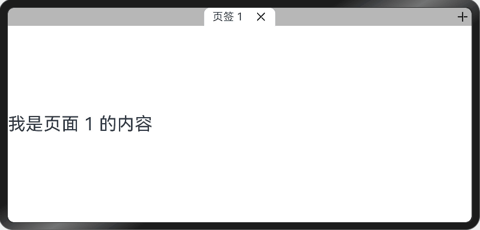

# Tab组件如何实现增删Tab标签

## 场景介绍

部分应用在使用过程中需要自定义添加或删除标签的场景，比如在浏览器中的顶部标签栏中需要新打开或关闭网页页签，而这种场景与Tabs组件效果类似，但Tabs组件不提供增加或删除页签的功能，不能自由的增加删除页签，需要开发者自己实现Tabs中增删页签功能。本文以浏览器中增加或删除页签为例，实现Tabs中页签的增删功能。

## 效果呈现
如下动图所示：




## 环境要求
本例基于以下环境开发，开发者也可以基于其他适配的版本进行开发：
- IDE: DevEco Studio 4.0 Release
- SDK: Ohos_sdk_public 4.0.10.13 (API Version 10 Release)

## 实现原理

本例涉及的关键特性以及实现方案如下：

- 通过@Builder自定义封装一个导航页签栏，并通过ForEach完成对Tabs组件的内容页和导航页签栏的动态渲染。
- 通过TabsController的changeIndex可实现页面的跳转，传入的index是数组中对应的索引值。
- 页签的增加通过数组的push方法，增加数组元素。
- 删除页签通过删除页面对应数组的索引值处的数据完成，删除后页面跳转位置根据业务逻辑要求确定跳转页面对应的索引值。

## 开发步骤

1. 整体布局分为两部分：页面内容和页签部分。页面视图部分使用Tabs，其中页签对应显示的内容需要放入TabContent组件中。页签部分通过@Builder自定义封装一个tabBar组件，放入Tabs中的tabBar属性中。

   页面视图代码块：

   ```ts
   Tabs({ barPosition: BarPosition.Start, controller: this.controller }) {
     ForEach(this.tabArray, (item: number) => {
       TabContent() {
         Text('我是页面 ' + item + " 的内容")
           .height('100%')
           .width('100%')
           .fontSize(30)
           .backgroundColor("#ffffffff")
       }.tabBar(this.Tab(item))
     }, (item: number) => item.toString() + util.generateRandomUUID())
   }
   .barMode(BarMode.Scrollable, { margin: 30 })
   .onChange((index) => {
     this.focusIndex = index
   })
   .barHeight(30)
   ```

   自定义tabBar代码块：

   ```ts
   //控制页签渲染的数组
   @State tabArray: Array<number> = [0]
   //Tabs组件当前显示的页签
   @State focusIndex: number = 0
   //创建页签时的页签index
   @State pre: number = -1
   //Tabs组件控制器，根据组件下标控制tab跳转
   private controller: TabsController = new TabsController()
   
   //自定义导航页签栏
   @Builder
   Tab(tabNumber: number) {
     Row({ space: 20 }) {
       Text("页签 " + tabNumber).fontSize(18)
       Image($r('app.media.ic_public_cancel_filled')).width(20).height(20)
     }
     .justifyContent(FlexAlign.Center)
     .constraintSize({ minWidth: 35 })
     .width(120)
     .height(30)
     .borderRadius({ topLeft: 10, topRight: 10 })
     .backgroundColor(this.tabArray.indexOf(tabNumber) === this.focusIndex ? "#ffffffff" : "#ffb7b7b7")
   }
   ```

2. 实现页签和页面视图的联动：这里主要通过TabsController的changeIndex来实现对应的试图跳转，但需要注意由于之后会增删数组元素的操作，所以此处传入的index值是选择页面的tabNumber在数组中的索引值。

   ```ts
   this.focusIndex = this.tabArray.indexOf(tabNumber)
   ```

3. 增添数组元素实现增加页签的效果：增添数组元素使用数组的push方法在tabArray添加数据即可，但由于此demo原始定义的数组是连续的自然数，后续增删数组会打乱原有顺序，所以此处处理为先判断最后一个元素的值再加1，由于TabBar的渲染是通过ForEach被@State修饰的数组，因此当tabArray中添加数据后系统会通知ForEach便利数组重新渲染页面。

   ```ts
   this.tabArray.push(this.tabArray[this.tabArray.length - 1] + 1)
   ```

4. 通常在添加新页面后，浏览器会将页面跳转到新添加的页面，因此在向tabArray中完成数据推送后，需要将页签通过TabsController中的changeIndex方法跳转到最后一个。

   ```ts
   this.focusIndex = this.tabArray.length - 1
   this.controller.changeIndex(this.focusIndex)
   ```

5. 当用户选择另一个页签时，可通过自定义页签中通用事件onClick进行控制，当用户点击待选择的页签后，获取当前页签对应的下标，然后通过TabsController中的changeIndex方法进行跳转,此外可以通过更改页签背景颜色标识被选中页签的。

   ```ts
   .backgroundColor(this.tabArray.indexOf(tabNumber) === this.focusIndex ? "#ffffffff" : "#ffb7b7b7")
   .onClick(() => {
     this.focusIndex = this.tabArray.indexOf(tabNumber)
     this.controller.changeIndex(this.focusIndex)
   })
   ```

6. 删除页面有三种情况（删除不同位置的页面）。

   - 第一种情况是被关闭页面为最后一个页面，且当前选中的页面为最后一个页面，如果当前被选中页面是刚刚被其他页面创建的情况，因此页面需要跳回到创建被删除页签的页签（逻辑参考chrome浏览器）

     ```ts
     if (this.pre >= 0) {
       this.focusIndex = this.pre
     } 
     this.tabArray.splice(this.tabArray.indexOf(tabNumber), 1)
     ```

     如果不是的话直接将当前显示页签下下标设置为前一个页签下标，tabArray数组通过splice方法删除页签，并通过TabsController完成跳转，此外页面只要有关闭操作，页面就不可以跳回打开该页面的页面，即将 pre设置为-1。

     ```ts
     this.focusIndex = this.focusIndex - 1
     this.tabArray.splice(this.tabArray.indexOf(tabNumber), 1)
     this.pre = -1
     this.controller.changeIndex(this.focusIndex)
     ```

   - 第二种情况，当用户当前选择的不是最后一个标签，然后直接删除其他页签时，可以直接删除，但是需要重新计算当前选中页签在tabArray中的实时位置，到新注意需要排除用户在最后一个页签删除当前页签的情况。

     ```ts
     //当前选择页面的对应数组中的数据值
     let focusNumber = this.tabArray[this.focusIndex]
     //用于判断是否是用户在最后一个页签删除当前页签的情况
     if (this.tabArray.indexOf(focusNumber) >= 0) {
       this.focusIndex = this.tabArray.indexOf(focusNumber)
     }
     this.controller.changeIndex(this.focusIndex)
     ```

   - 第三种情况，当用户当前选择的不是最后一个标签，且删除被选中页面，直接删除，然后通过TabsController完成跳转，不需要额外操作。

   ==**注意！！！**==

   - 由于Tabs组件中的导航页签栏会占满屏幕，导致添加按钮无法直接添加到与页签直接平齐的位置，因此通过层叠布局（Stack）的方式，将添加页签按钮覆盖到Tabs组件上，通过Stack中的对齐方式将添加按钮调整到合适位置。

   - 用于Tabs添加或删除子节点时，ForEach需要重新将所有页签进行重新渲染，如果在添加或删除完页签后直接调用TabsController中的changeIndex进行跳转，页面无法调到指定页签。这是由于ForEach还未将组件渲染完成，将子组件挂载到Tabs中，因此建议通过setTimeOut延迟一段时间再进行跳转，经过验证大概50ms后即可，开发者可再自行验证。

     ```ts
     setTimeout(() => {
       this.controller.changeIndex(this.focusIndex)
     }, 50)
     ```

## 完整实例

完整示例代码如下：

```ts
import util from '@ohos.util'

@Entry
@Component
struct Drag {
  //控制页签渲染的数组
  @State tabArray: Array<number> = [0]
  //Tabs组件当前显示的页签下标
  @State focusIndex: number = 0
  //创建页签时的页签index
  @State pre: number = -1
  //Tabs组件控制器，根据组件下标控制tab跳转
  private controller: TabsController = new TabsController()

  // 单独的页签
  @Builder
  Tab(tabNumber: number) {
    Row({ space: 20 }) {
      Text("页签 " + tabNumber).fontSize(18)
      Image($r('app.media.ic_public_cancel_filled')).width(20).height(20).onClick(() => {
        //获取Tabs组件当前显示的页签中显示的数字
        let focusNumber = this.tabArray[this.focusIndex]
        //被删除的页签是否是当前选中的页签，且是最后一个页签
        if (this.focusIndex === this.tabArray.indexOf(tabNumber) && this.focusIndex == this.tabArray.length - 1) {
          //判断是否需要跳回到创建该页签时的页签，如果不需要直接跳转到前一个页签
          if (this.pre >= 0) {
            this.focusIndex = this.pre
          } else {
            this.focusIndex = this.focusIndex - 1
          }
        }
        this.tabArray.splice(this.tabArray.indexOf(tabNumber), 1)
        this.pre = -1
        //对应删除页面中的第二种情况
        if (this.tabArray.indexOf(focusNumber) >= 0) {
          this.focusIndex = this.tabArray.indexOf(focusNumber)
        }
        //设置50ms 延迟跳转
        setTimeout(() => {
          this.controller.changeIndex(this.focusIndex)
        }, 50)
      })
    }
    .justifyContent(FlexAlign.Center)
    .constraintSize({ minWidth: 35 })
    .width(120)
    .height(30)
    .borderRadius({ topLeft: 10, topRight: 10 })
    .backgroundColor(this.tabArray.indexOf(tabNumber) === this.focusIndex ? "#ffffffff" : "#ffb7b7b7")
    .onClick(() => {
      this.focusIndex = this.tabArray.indexOf(tabNumber)
      setTimeout(() => {
        this.controller.changeIndex(this.focusIndex)
      }, 50)
    })
  }

  build() {
    Column() {
      Column() {
        // 页签
        // Row() {
        Stack() {
          Row({ space: 7 }) {
            //tabs
            Tabs({ barPosition: BarPosition.Start, controller: this.controller }) {
              ForEach(this.tabArray, (item: number) => {
                TabContent() {
                  Text('我是页面 ' + item + " 的内容")
                    .height('100%')
                    .width('100%')
                    .fontSize(30)
                    .backgroundColor("#ffffffff")
                }.tabBar(this.Tab(item))
              }, (item: number) => item.toString() + util.generateRandomUUID())
            }
            .barMode(BarMode.Scrollable, { margin: 30 })
            .onChange((index) => {
              this.focusIndex = index
            })
            .barHeight(30)
          }.width("100%")

          Row() {
            Image($r('app.media.ic_public_add_filled')).onClick(() => {
              if (this.tabArray.length === 0) {
                this.tabArray.push(0)
                this.focusIndex = this.tabArray.length - 1
              } else {
                this.pre = this.focusIndex
                this.tabArray.push(this.tabArray[this.tabArray.length - 1] + 1)
                this.focusIndex = this.tabArray.length - 1
              }
              setTimeout(() => {
                this.controller.changeIndex(this.focusIndex)
              }, 50)
            }).width(20).height(20)
          }.height(30).width(30).backgroundColor("#ffb7b7b7")
          .justifyContent(FlexAlign.Center)
        }
        .alignContent(Alignment.TopEnd)
        .width('100%')
        .backgroundColor("#ffb7b7b7")
      }
      .alignItems(HorizontalAlign.Start)
      .width('100%')
    }
    .height('100%')
  }
}
```

## 参考

[Tabs](../application-dev/ui/arkts-navigation-tabs.md)

[@State装饰器：组件内状态](../application-dev/ui/state-management/arkts-state.md)

[ForEach：循环渲染](../application-dev/ui/state-management/arkts-rendering-control-foreach.md)

[层叠布局（Stack）](../application-dev/ui/arkts-layout-development-stack-layout.md)


