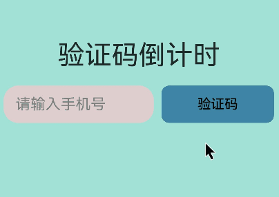

# 如何自定义鼠标悬停/点击组件的背景色
## 场景介绍
在日常的鼠标操作中，当鼠标悬浮或点击某个元素时，该元素的背景色一般都会加深或者背景色发生变化，因此开发者可以根据自己的喜好进行开发设置。本文即为大家介绍这种操作的开发。

## 效果呈现
本例效果图如下：

效果说明：鼠标悬浮于输入框上方，输入框的背景色不发生变化。鼠标悬浮于按钮上方，按钮的背景色会发生变化。在输入正确的手机号后点击按钮TextError不显示，否则输入框下方会出现提示语。




## 运行环境
本例基于以下环境开发，开发者也可以基于其他适配的版本进行开发：
- IDE: DevEco Studio 4.0 Release
- SDK: Ohos_sdk_public 4.0.10.13(API Version 10 Release)

## 实现思路
本例包含的关键操作及其实现方案如下：

- 悬浮于TextInput组件和Button组件上方，组件背景色发生变化：通过onHover()事件去判断是否悬浮于组件上方去实现。
- 按钮出现倒计时：通过自定义函数materOnClick()调用setInterval()直到时间为0s。
- 输入框的状态：通过判断输入手机号与预留的手机号是否相同去发生不同状态。

## 开发步骤
本例详细开发步骤如下，开发步骤中仅展示相关步骤代码，全量代码请参考完整代码章节的内容。
1. 构建UI。
    通过TextInput、Button、Text组件将UI框架搭建起来。
    ```ts
    build(){
      Column(){
        Text('验证码倒计时')
          .fontSize(36).margin(20)
        Row({space:10}){
          TextInput({placeholder:"请输入手机号",text:this.Text})
            .type(InputType.Normal)
            .placeholderColor(Color.Gray)
            .placeholderFont({
                size:20,
                weight:FontWeight.Normal,
                style:FontStyle.Normal
            })
            .enterKeyType(EnterKeyType.Next)
            .caretColor(Color.Blue)
            .maxLength(11)
            // 设置错误状态下提示的错误文本或者不显示错误状态
            .showError(this.TextError)
            .enableKeyboardOnFocus(false)
            .width(200)
            .height(50)
            .backgroundColor(this.color1)
            .onChange((value:string)=>{
            this.Text = value;
          })
        
          Button(this.flag ? `${this.sec}`+ "s" :"验证码",{type: ButtonType.Normal})
            .width(150)
            .height(50)
            .backgroundColor(this.color)
            .fontSize(18)
            .fontColor(Color.White)
            .borderRadius(15)
        }.height(60)
      }.width('100%')
      .height('100%')
      .justifyContent(FlexAlign.Center)
      .alignItems(HorizontalAlign.Center)
      .backgroundColor('#A1E1D6')
    }
    ```
2. 鼠标悬浮于组件上背景颜色发生变化。
    通过onHover()事件去判断isHover的boolean去设置组件的背景色。
    ```ts
    // 输入框的背景色变化
    .onHover((isHover?:boolean,event?:HoverEvent):void=>{
      if (isHover){
        this.color1 = '#DECECE'
      }else {
        this.color1 = '#DECECE'
      }
    })
    // 按钮的背景色变化
    .onHover((isHover?:boolean,event?:HoverEvent):void=>{
      if(isHover){
        this.color = '#46CDD0'
      }else {
        this.color ='#3E84A6'
      }
    })
    ```
3. 输入错误手机号时输入框的状态以及输入正确手机号时按钮的变化。 
    通过判断输入的手机号是否与预设手机号相同。如果相同，通过函数materOnClick()，按钮出现60s倒计时；如果不同，输入框下方出现错误状态提示文本并且点击按钮不发生变化。
    ```ts
    // 自定义倒计时函数
    private materOnClick(){
      let T = setInterval(()=>{
        if (this.sec <= 0){
          clearTimeout(T)
        }else{
          this.sec--
        }
      },1000)
    }
    ...
    // 输入正确和错误手机号的TextInput的状态
    .onClick(()=>{
      if (this.Text == this.PhoneNumber){
        this.flag = true;
        this.TextError = undefined;
        this.materOnClick()
      }else {
        this.TextError = '请输入正确的手机号';
        this.Text = '';
      }
    })
    ```

## 完整示例代码
完整示例代码如下：
```ts  
@Entry
@Component
struct Index{
  @State Text: string = ''
  @State sec: number = 60
  @State flag: boolean = false
  @State color: string = '#46CDD0'
  @State color1:string = '#DECECE'
  @State TextError :string | undefined = undefined
  @State PhoneNumber: string = '13888888888'
    private materOnClick(){
    let T = setInterval(()=>{
      if (this.sec <= 0){
        clearTimeout(T)
      }else{
        this.sec--
      }
    },1000)
  }

  build(){
    Column(){
      Text('验证码倒计时')
        .fontSize(36).margin(20)
      Row({space:10}){
        TextInput({placeholder:"请输入手机号",text:this.Text})
          .type(InputType.Normal)
          .placeholderColor(Color.Gray)
          .placeholderFont({
            size:20,
            weight:FontWeight.Normal,
            style:FontStyle.Normal
          })
          .enterKeyType(EnterKeyType.Next)
          .caretColor(Color.Blue)
          .maxLength(11)
          .showError(this.TextError)
          .enableKeyboardOnFocus(false)
          .onChange((value:string)=>{
            this.Text = value;
          })
          .width(200)
          .height(50)
          .backgroundColor(this.color1)
          .onHover((isHover?:boolean,event?:HoverEvent):void=>{
            if (isHover){
              this.color1 = '#DECECE'
            }else {
              this.color1 = '#DECECE'
            }
          })
        Button(this.flag ? `${this.sec}`+ "s" :"验证码",{type: ButtonType.Normal})
          .width(150)
          .height(50)
          .backgroundColor(this.color)
          .fontSize(18)
          .fontColor(Color.White)
          .borderRadius(15)
          .onHover((isHover?:boolean,event?:HoverEvent):void=>{
            if(isHover){
              this.color = '#46CDD0'
            }else {
              this.color ='#3E84A6'
            }
          })
          .onClick(()=>{
            if (this.Text == this.PhoneNumber){
              this.flag = true;
              this.TextError = undefined;
              this.materOnClick()
            }else {
              this.TextError = '请输入正确的手机号';
              this.Text = '';
            }
          })
      }.height(60)
    }.width('100%')
    .height('100%')
    .justifyContent(FlexAlign.Center)
    .alignItems(HorizontalAlign.Center)
    .backgroundColor('#A1E1D6')
  }
}

```

## 参考

[TextInput](../application-dev/reference/apis-arkui/arkui-ts/ts-basic-components-textinput.md)

[鼠标事件](../application-dev/reference/apis-arkui/arkui-ts/ts-universal-mouse-key.md)

[定时器](../application-dev/reference/common/js-apis-timer.md)