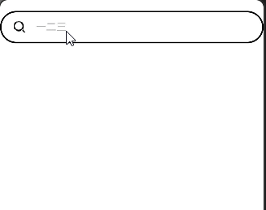

# 搜索框与文字轮播的巧用
## 背景介绍
一般情况下，许多应用的搜索框在无输入时的提示文本为“请输入文字”、“请输入”等等，现在为了进行引流以及流量推送，将热搜词条通过轮播的方式在“假搜索框”进行循环播放。本例即为大家这类场景的开发。

## 效果呈现


## 运行环境
本例基于以下环境开发，开发者也可以基于其他适配的版本进行开发：
- IDE: DevEco Studio 4.0 Release
- SDK: Ohos_sdk_public 4.0.10.13 (API Version 10 Release)

## 实现思路
本例包含的关键操作及其实现方案：
- 构建假搜索框与文字轮播列表：假搜索框是由一个搜索图标和文字列表轮播构成放置于Row组件中。
- 点击假搜索框进入真正的搜索框，并将当时点击时所显示的文字作为真正搜索框的提示文本进行搜索。

## 开发步骤
1. 建立假的搜索框：通过搜索图标与纵向文字轮播组成。具体代码块如下：
    ```ts
    ...
    Row(){
      Image($r('app.media.ic_public_search_filled'))
        .objectFit(ImageFit.Contain)
        .width(20)
        .aspectRatio(1)
        .margin({left:15})
      Swiper(){
        ForEach(arr,(item:SearchTextModel)=>{
          Column(){
            Text(item.searchText)
              .opacity(0.6)
              .fontSize(14)
              .fontColor(Color.Gray)
          }.width('100%').alignItems(HorizontalAlign.Start)
        },(item:SearchTextModel)=>item.id.toString())
      }
      ...
      .loop(true).autoPlay(true).vertical(true).interval(3000).margin(12).indicator(false)
    }.zIndex(2).width('100%').justifyContent(FlexAlign.Start).margin({left:12,right:12})
      ...
    ```
2. 点击假搜索框时所展示的文字传递到真正的搜索框并将其作为真正搜索框的提示文本：由于onChange()只有在轮播切换时才会触发回调并获取轮播文字，因此通过点击事件将获取文字传递进入真正的搜索框页面。具体代码块如下：
    ```ts
    .onChange((index:number)=>{
      this.ind = arr[index].searchText
      console.info('foo change'+JSON.stringify(this.ind))
    })
    ...
    .onClick(()=>{
      router.pushUrl({url:'pages/Next',params:{data:this.ind}})
    })
    ```
3. 进入到真正的搜索框界面：通过router.getParams()获取发起跳转的页面往当前页面传入的数据。具体代码块如下:
    ```ts
    aboutToAppear(){
      let params:Params_Type = router.getParams() as Params_Type;
      this.par=params.data
      console.log('foo'+ JSON.stringify(router.getParams()));
    }
    ... 
    Search({placeholder:this.par ,controller:this.controller})
      .searchButton("搜索")
      .placeholderColor(this.color)
      .width("85%")
      .height(40)
      .onSubmit((value:string)=>{
        this.submitValue=value
      })
    ```

## 完整代码
完整示例代码如下：
```ts
// Content.ets
export class SearchTextModel{
  id:number
  searchText:Resource

  constructor(id:number,searchText:Resource) {
    this.id = id
    this.searchText =searchText
  }
}
export class Topic_DATA{
  id:number= 0
  searchText:Resource|undefined =undefined
}
export const arr :Topic_DATA[]=[
  {id:0,searchText:$r('app.string.topic1')},
  {id:1,searchText:$r('app.string.topic2')},
  {id:2,searchText:$r('app.string.topic3')}
]
export class Params_Type{
  data:Resource|undefined =undefined
}

...

// Index.ets
import router from '@ohos.router';
import {SearchTextModel,arr} from '../common/constants/Constants'

@Entry
@Component
struct SearchComponent {
  @State isStop:boolean =true 
  @State ind:Resource|undefined=undefined

  build() {
    Column() {
      Row(){
        Image($r('app.media.ic_public_search_filled'))
          .objectFit(ImageFit.Contain)
          .width(20)
          .aspectRatio(1)
          .margin({left:15})
        Swiper(){
          ForEach(arr,(item:SearchTextModel)=>{
            Column(){
              Text(item.searchText)
                .opacity(0.6)
                .fontSize(14)
                .fontColor(Color.Gray)
            }.width('100%').alignItems(HorizontalAlign.Start)
          },(item:SearchTextModel)=>item.id.toString())
        }
        .onChange((index:number)=>{
          this.ind = arr[index].searchText
          console.info('foo change'+JSON.stringify(this.ind))
        })
        .loop(true).autoPlay(true).vertical(true).interval(3000).margin(12).indicator(false)

      }.zIndex(2).width('100%').justifyContent(FlexAlign.Start).margin({left:12,right:12})
      .onClick(()=>{
        router.pushUrl({url:'pages/Next',params:{data:this.ind}})
      })
    }.backgroundColor(Color.White).border({width:2,color:Color.Black,radius:40}).margin({top:15})
  }
}

...

// Next.ets
import router from '@ohos.router';
import {Params_Type} from '../common/constants/Constants';

@Entry
@Component
struct SearchExample {
  controller:SearchController = new SearchController()
  @State submitValue:string="";
  @State par :Resource|undefined = undefined
  private color = Color.Gray

  aboutToAppear(){
    let params:Params_Type = router.getParams() as Params_Type;
    this.par=params.data
    console.log('foo'+ JSON.stringify(router.getParams()));
  }
  build() {
    Column(){
      Row(){
        Image($r('app.media.ic_public_back'))
          .width('10%')
          .height(35).margin({left:10})
          .onClick(()=>{
            router.back()
          })

        Search({placeholder:this.par ,controller:this.controller})
          .searchButton("搜索")
          .placeholderColor(this.color)
          .width("85%")
          .height(40)
          .onSubmit((value:string)=>{
            this.submitValue=value
          })
      }
    }.margin({top:15})
  }
}
```


## 参考
[Search](../application-dev/reference/apis-arkui/arkui-ts/ts-basic-components-search.md)

[Swiper](../application-dev/reference/apis-arkui/arkui-ts/ts-container-swiper.md)
