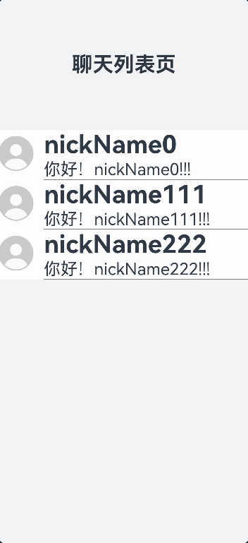

# 使用Badge组件完成聊天未读消息数量显示功能

## 场景介绍
开发者在业务开发过程中，需要通过角标的形式对用户的通知信息进行提示，并展示具体数量，如聊天页面中，用户可以看到与其他聊天对象的未读消息数量。本文就从聊天页面未读消息数量展示场景出发，介绍OpenHarmony中如何使用Badge组件实现该场景。

## 效果呈现

如下动图所示：



## 环境要求
本例基于以下环境开发，开发者也可以基于其他适配的版本进行开发：
- IDE: DevEco Studio 4.0 Release
- SDK: Ohos_sdk_public 4.0.10.13 (API Version 10 Release)

## 实现原理

本例涉及的关键特性以及实现方案如下：

- 完成聊天列表子组件创建，其中头像部分放入容器组件Badge中。
- 封装聊天列表子组件类，并引用@Observed装饰器，保证类中未读聊天信息数量数据状态可被观察。
- 最后，通过ForEach组件完成聊天聊表的内容渲染。

## 开发步骤

1. 聊天列表组件，包含三部分：聊天对象的头像，聊天对象昵称，用户聊天记录最后一条详情。其中未读聊天信息数量显示在头像的右上角。因此头像部分需要放入容器组件Badge中。Badge中需要设置消息数量，提示显示位置，最大消息数量，显示样式。
    聊天列表组件代码如下：
    ```ts
    @Component
    struct MyComposeTitleBar {
      @ObjectLink simplifyChatInfo: SimplifyChatInfo;
    
      build() {
        Row() {
          Badge({
            count: this.simplifyChatInfo.notReadCount,
            maxCount: 99,
            position:BadgePosition.RightTop,
            style: { badgeSize: 15, badgeColor: '#FA2A2D' }
          }) {
            Image($r('app.media.ic_user_portrait')).width(50).height(50)
          }
          .width(50)
          .height(50)
      .margin({ bottom: 4 })
    
          Row() {
            Column() {
              Text(this.simplifyChatInfo.chaterNickName)
                .fontSize(36)
                .fontWeight(FontWeight.Bold)
                .width("70%")
                .textOverflow({ overflow: TextOverflow.Clip })
                .maxLines(1)
              Text(this.simplifyChatInfo.details)
                .fontSize(24)
                .fontWeight(FontWeight.Normal)
                .width("90%")
                .textOverflow({ overflow: TextOverflow.Ellipsis })
                .maxLines(1)
              Divider().color(Color.Gray).strokeWidth(1).lineCap(LineCapStyle.Round)
            }.alignItems(HorizontalAlign.Start)
          }.margin({left:15})
      }.backgroundColor('#d7ffffff')
    }
    }
    ```

    
3. 创建用于表征聊天列表数据的类，该类需要被@Observed修饰，是的类中数据可以被Badge组件观察。

   聊天列表数据类代码块：

   ```ts
   @Observed
   class SimplifyChatInfo {
     public chaterNickName: string;
     public details: string;
     //未读消息数量
     public notReadCount: number;
   
     constructor(chaterNickName: string, details: string, notReadCount: number) {
       this.chaterNickName = chaterNickName
       this.details = details
       this.notReadCount = notReadCount
     }
   }
   ```

3. 最后通过ForEach完成数据渲染。

   ```ts
   List() {
     ForEach(this.chatArr, (item: SimplifyChatInfo) => {
       ListItem() {
         MyComposeTitleBar({ simplifyChatInfo: item })
       }
     })
   }
   ```


## 完整实例

完整实例代码如下：

```ts
@Entry
@Component
export default struct HarmonyChat {
  @State chatArr: Array<SimplifyChatInfo> = []
  scroller: Scroller = new Scroller()

  build() {
    Row() {
      Column() {
        Text('聊天列表页').fontSize(30).fontWeight(FontWeight.Bold).height("20%")
          .margin({
            top: 16,
            bottom: 16
          })

        Scroll(this.scroller) {
          Column() {
            List() {
              ForEach(this.chatArr, (item: SimplifyChatInfo) => {
                ListItem() {
                  MyComposeTitleBar({ simplifyChatInfo: item })
                }
              })
            }
          }.height("80%")
        }

      }.width('100%')
    }.alignItems(VerticalAlign.Center)
    .backgroundColor("#f1f3f5")
    .height('100%')
  }

  aboutToAppear() {
    //模拟数据
    for (let i = 0; i < 3; i++) {
      let sci: SimplifyChatInfo = new SimplifyChatInfo(
        "nickName" + 111 * i,
        `你好！` + "nickName" + 111 * i + "!!!",
        0
      )
      this.chatArr.push(sci)
    }
    setInterval(() => {
      let date = new Date()
      let second = date.getSeconds()
      this.chatArr[second%3].notReadCount = this.chatArr[second%3].notReadCount + 1
    }, 1000)
  }
}

@Component
struct MyComposeTitleBar {
  @ObjectLink simplifyChatInfo: SimplifyChatInfo;

  build() {
    Row() {
      Badge({
        count: this.simplifyChatInfo.notReadCount,
        maxCount: 99,
        position:BadgePosition.RightTop,
        style: { badgeSize: 20, badgeColor: '#FA2A2D',fontSize:15 }
      }) {
        Image($r('app.media.ic_user_portrait')).width(50).height(50)
      }
      .width(50)
      .height(50)
      .margin({ bottom: 4 })

      Row() {
        Column() {
          Text(this.simplifyChatInfo.chaterNickName)
            .fontSize(36)
            .fontWeight(FontWeight.Bold)
            .width("70%")
            .textOverflow({ overflow: TextOverflow.Clip })
            .maxLines(1)
          Text(this.simplifyChatInfo.details)
            .fontSize(24)
            .fontWeight(FontWeight.Normal)
            .width("90%")
            .textOverflow({ overflow: TextOverflow.Ellipsis })
            .maxLines(1)
          Divider().color(Color.Gray).strokeWidth(1).lineCap(LineCapStyle.Round)
        }.alignItems(HorizontalAlign.Start)
      }.margin({left:15})
    }.backgroundColor('#d7ffffff')
  }
}


@Observed
class SimplifyChatInfo {
  public chaterNickName: string;
  public details: string;
  //未读消息数量
  public notReadCount: number;

  constructor(chaterNickName: string, details: string, notReadCount: number) {
    this.chaterNickName = chaterNickName
    this.details = details
    this.notReadCount = notReadCount
  }
}
```

## 参考

[Badge](../application-dev/reference/apis-arkui/arkui-ts/ts-container-badge.md)

[@Observed装饰器和@ObjectLink装饰器：嵌套类对象属性变化](../application-dev/quick-start/arkts-observed-and-objectlink.md)

[ForEach：循环渲染](../application-dev/quick-start/arkts-rendering-control-foreach.md)


