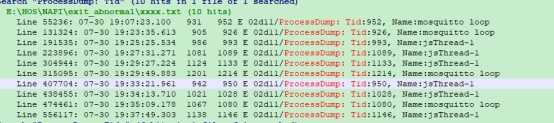
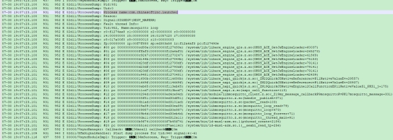
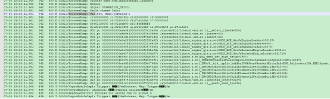
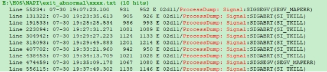
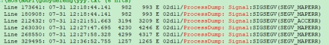
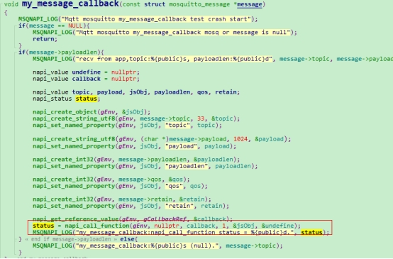
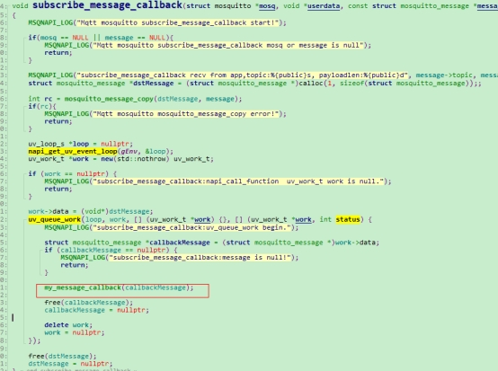
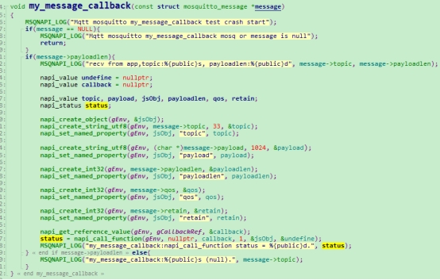

# 应用质量提升案例-应用Crash闪退问题案例分析

## 问题描述

OpenHarmony某应用点击多次或者页面切换时，会出现应用闪退现象。

## 问题现象

1.打印提示Crash，每次Crash的进程一致，均是Process name:com.chinasoftinc.launcher， 线程却不确定，mosquitto loop、jsThread-1随机出现；

2.Crash的时机不确定，页面点击次数累计一定程度出现，native不回调JS function时不会出现Crash，JS function代码量多时，则Crash概率大，代码量小时，Crash概率小。

 mosquitto loop、jsThread-1 二者crash随机出现

 

mosquitto loop crash：

 

jsThread-1 crash：

 

 Crash报错的其中两次堆栈信息如下，可以看到两次堆栈信息并不一致：

 

 

## 问题分析

虽然每次crash的线程不一样，但范围是确定的，jsThread-1 或者 mosquitto loop，可以确定是两个线程交互的问题。

jsThread-1为UI线程，即应用页面对应的线程；

mosquitto loop是用来监听mosquitto服务器是否有消息上来，有则触发JS Function回调函数；

JS为单线程，没有锁，严格意义上不支持多线程，线程间的调度需要使用ArkUI统一的调度函数uv_queue_work来处理多线程调度问题。

如果不使用统一调度函数，会发生下面两种异常情况：

1. jsThread-1线程运行时，mosquitto loop消息上来直接触发回调，会导致jsThread-1异常退出；

2. mosquitto loop处理回调时，jsThread-1可能直接抢占处理，导致mosquitto loop异常退出。

 

## 问题冲突

Napi 提供了创建新线程的方法：napi_get_uv_event_loop，但只能在JS主线程中使用，uv_queue_work只能处理napi_get_uv_event_loop创建的线程，不支持mosquitto loop方式；

若要监听消息，只能用mosquitto loop起新线程监听。

## 解决方案

问题本质原因是调用回调函数时出的问题：

 

监听消息的线程可以正常处理，与JS线程无冲突。

修改方案为：保留mosquitto loop获取消息，触发C处理消息上来事件，将原有消息事件处理中 直接调用napi_call_function 的方式改为 napi_get_uv_event_loop方式创建新的线程，uv_queue_work队列方式管理新线程调度，在新线程中调用napi_call_function。

消息事件处理函数：

 

 新线程中处理JS Function回调：

 

至此，crash问题得到解决。

希望本文能够为应用开发者处理类似crash问题提供帮助。