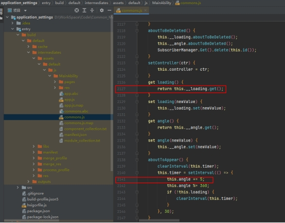
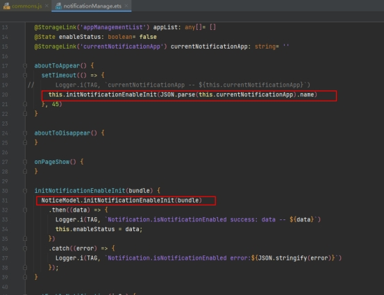
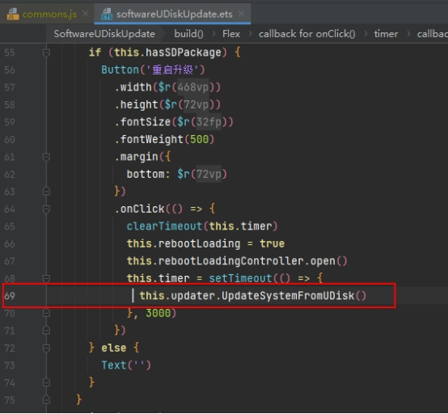
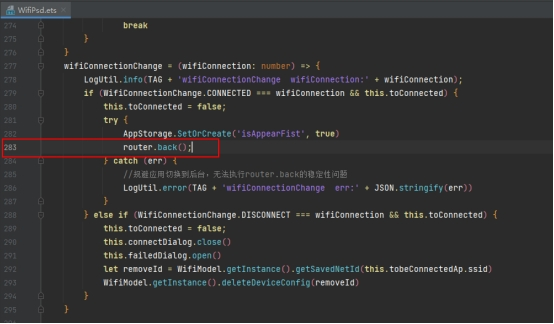

# 应用质量提升案例-稳定性测试常见JS_ERROR问题分析与定位

## 问题描述

本文案例分析OpenHarmony开发的应用进行稳定性测试遇到的JS_ERROR，对其产生的原因进行分析与定位，并给出解决方案。

几种常见的错误信息如下：

1）Obj is not a valid object ：访问对象无效或不存在；

2）is not callable ：调用方法不存在；

3）Internal error. UI execution context not found：未找到UI执行的上下文。

 

## 案例分析

### softwareUpdate.js出现JS_ERROR

问题描述：

系统稳定性测试10000分钟，com.ohos.settings 出现 17次JS_ERROR(softwareUpdate.js)。

堆栈异常信息：

```
Module name:com.ohos.settings
Pid:28150
Uid:20010012
Lifetime: 0.000000s
Js-Engine: ark
page: pages/softwareUpdate.js
Error message: Obj is not a valid object
Stacktrace:
    at get (\\MainAbility\\pages\\softwareUpdate.ets:512:25)
    at loading (./pages/softwareUpdate.js:2127:16)
    at anonymous (./pages/softwareUpdate.js:2141:13)
```

问题定位：

该问题提示错误类型：Obj is not a valid object。

发生在调用 loading时get 操作，相关代码行数在commons.js中2141、2127、512等行数。

 

问题原因：

经过代码比对、流程分析、hilog校对等方式，确认该问题是由于偶发退出页面时未销毁setInterval定时器，导致后台程序仍访问前台page页面中的全局变量this.angle。

通过模拟该场景可必现相同jserror日志。

解决措施：

对业务代码流程进行梳理，确保开启/关闭定时器操作成对出现，避免再次发生后台程序访问前台page页面中的全局变量。

 

### notificationManage.js出现JS_ERROR

问题描述：

应用稳定性测试48小时，com.ohos.settings出现14次JS_ERROR(notificationManage.js)。

堆栈异常信息：

```
Module name:com.ohos.settings
Pid:17337
Uid:20010012
Lifetime: 0.000000s
Js-Engine: ark
page: pages/noticeApp/notificationManage.js
Error message: Obj is not a valid object
Stacktrace:
    at initNotificationEnableInit (/pages/noticeApp/notificationManage.js:8479:16)
    at initNotificationEnableInit (\pages\noticeApp\notificationManage.ets:31:5)
    at anonymous (\pages\noticeApp\notificationManage.ets:20:7)
```

 问题定位：

该问题提示错误类型：Obj is not a valid object。

发生在调用initNotificationEnableInit 时，相关代码行数在notificationManage.ets中20、31行，commons.js中8479行。

 

问题原因：

经过代码比对、流程分析、hilog校对确认问题根因是notificationManage中调用initNotificationEnableInit 方法时参数非法，导致最终调用接口Notification.isNotificationEnabled时产生jserror。

解决措施：

对非法参数进行异常处理。


### softwareUDiskUpdate.js出现JS_ERROR

问题描述：

系统稳定性测试10000分钟，com.ohos.settings 出现 1次JS_ERROR(softwareUDiskUpdate.js)。

堆栈信息：

```
Module name:com.ohos.settings
Pid:22221
Uid:20010012
Lifetime: 0.000000s
Js-Engine: ark
page: pages/softwareUDiskUpdate.js
Error message: is not callable
Stacktrace:
    at anonymous (\\MainAbility\\pages\\softwareUDiskUpdate.ets:69:15)
```

 问题定位：该问题提示错误类型：is not callable。

发生softwareUDiskUpdate.ets中，相关代码行数69行。

 

问题原因：

经过代码比对、流程分析、hilog校对确认问题根因是调用系统不存在的接口：UpdateSystemFromUDisk()。	

解决措施：

此部分代码为冗余未删除代码，需要进行代码清理。


### wifiPsd.js出现JS_ERROR

问题描述：

系统稳定性测试72小时，com.ohos.settings出现1次JS_ERROR:ohos_router_1.back。

堆栈信息：

```
Module name:com.ohos.settings
Version:2.0.0.002
Pid:3995
Uid:20010028
Reason:Error
Error message:Internal error. UI execution context not found.
SourceCode:
                _ohos_router_1.back({
                ^
Stacktrace:
    at anonymous (D:/WorkSpace/Code/Common_Master_3.2/product_min_system/kh_applications_system/applications_settings/product/phone/build/default/intermediates/loader_out/default/ets/pages/wlan/wifiPsd_.js:1197:17)
    at anonymous (D:/WorkSpace/Code/Common_Master_3.2/product_min_system/kh_applications_system/applications_settings/product/phone/build/default/intermediates/loader_out/default/ets/MainAbility/MainAbility_.js:2009:17)
    at anonymous (D:/WorkSpace/Code/Common_Master_3.2/product_min_system/kh_applications_system/applications_settings/product/phone/build/default/intermediates/loader_out/default/ets/MainAbility/MainAbility_.js:2008:13)
```

 问题定位：

该问题错误提示：UI execution context not found。

发生在wifiPsd.js中，调用router.back()函数时出现异常。

 

问题原因：

当在异步回调中执行router.back()时，会产生已经不在当前页面的现象，导致router操作失败，例如：

1）在A页面设置定时器setTimeOut 5秒后router到B页面；

2）在5S内手动点击切换到其他非A页面上，等待A页面设置的定时器setTimeOut执行时，必现jserror。

解决措施：

对调用router.back()处代码添加try-catch保护。


## 总结

随着OpenHarmony生态的推广，对应的应用开发IDE、测试工具等也会不断完善，应用层面的错误信息也会披露的越来越清晰。大家在应用开发的过程中如果遇到JS_ERROR，可以通过阅读给出的堆栈或者log信息，结合代码来定位问题。

希望本文能够为应用开发者在此方面提供一些参考。