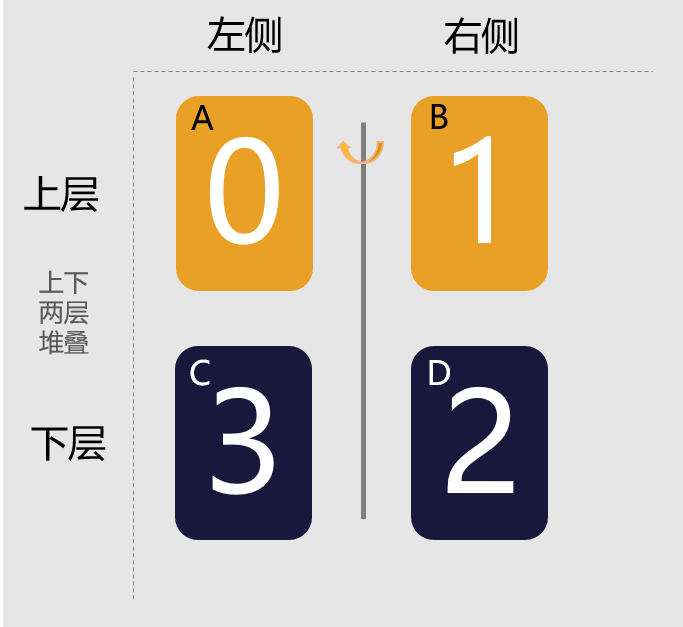

# 如何通过显示动画实现书籍翻页动效

## 场景介绍

翻页动效是应用开发中常见的动效场景，常见的如书籍翻页、日历翻页等。本文就为大家举例讲解如何通过ArkUI提供的显示动画接口[animateTo](../application-dev/reference/apis-arkui/arkui-ts/ts-explicit-animation.md)实现书籍翻页的效果。

## 效果呈现

本例最终实现效果如下：


## 环境要求

- IDE：DevEco Studio 3.1 Beta1
- SDK：Ohos_sdk_public 3.2.11.9 (API Version 9 Release)

## 实现思路

如图，分上下两层、左右两侧建立4个文本组件（下文用A、B、C、D代称），左右两侧分别代表打开书籍的左右两面，上下两层堆叠放置。
当B沿旋转轴旋转180度覆盖在A上时，就体现为翻页效果。一个翻页动作的完成包括以下几步：

1. B沿旋转轴旋转180度。
2. B旋转时，D会在右侧显示出来，作为书籍的下一页，此时D承载的内容要变为下一页的内容。
3. B旋转到左侧后，A承载的内容变为B的内容。
4. 由于A和B互为镜像，所以A显示为B的内容后，需要以A的中间为轴旋转180度。
5. B重新旋转到右边，其承载的内容变为下一页的内容。

***说明：C用来占位，不需要做动作。***
连续重复上述动作即可实现连续翻页动效。



## 开发步骤

1. 创建文本组件。

    动效中用到了4个文本组件，因此可以先定义一个文本组件，然后对其进行重复调用。同时为文本组件添加[rotate](../application-dev/reference/apis-arkui/arkui-ts/ts-universal-attributes-transformation.md)属性，用来控制组件的旋转。
    由于各组件旋转的角度和旋转中心不同，需要父组件在调用时传入对应的参数，所以需要为对应变量添加[@Prop](../application-dev/ui/state-management/arkts-prop.md)装饰器，用来控制变量传递。具体代码如下：
    ```ts
    @Component
    struct BookCard{
      // 为变量添加@Prop装饰器，用于接收父组件的动态传参
      @Prop num:number
      @Prop y_position:string
      @Prop x_position:string
      @Prop rotate_angle:number
      build(){
        Text(`${this.num}`)
          .fontWeight(FontWeight.Bold)
          .backgroundColor('#18183C')
          .fontColor('white')
          .fontSize(80)
          .width('25%')
          .height('30%')
          .fontFamily('Monospace')
          .textAlign(TextAlign.Center)
          .borderRadius(20)
          // 使用rotate属性控制旋转
          .rotate({
            x: 0,
            y: 1,
            z: 0,
            angle: this.rotate_angle,
            centerY: this.y_position,
            centerX: this.x_position
          })
      }
    }
    ```
2. 创建父组件框架。

    由于文本组件分为上下两层，所以在父组件中采用[Stack](../application-dev/reference/apis-arkui/arkui-ts/ts-container-stack.md)组件进行层叠布局。同时使用[Divider](../application-dev/reference/apis-arkui/arkui-ts/ts-basic-components-divider.md)组件作为书籍两个页面间的分隔线。具体代码如下：
    ```ts
    @Entry
    @Component
    struct BookAnimation {

      build(){
        Stack(){
          Row(){
            // 组件C
            BookCard()
            // 组件D
            BookCard()
          }
          Row(){
            // 组件A
            BookCard()
            // 组件B
            BookCard()
          }
          // 添加两个页面间的分隔线
          Divider()
          .strokeWidth(5)
          .color('white')
          .height('26%')
          .vertical(true)
        }
        .width('100%')
        .height('100%')
        .backgroundColor('#A4AE77')
      }
    }
    ```

3. 添加翻页动效。

    最后通过以下几点来为静态的组件添加动效：
    - 根据**实现思路**章节的分析，在父组件中定义对应的变量，并在调用子组件时分别传入子组件。
    - 自定义book_animate函数，在其中使用animateTo方法添加动画效果，同时控制动画的时长，以及动画过程中各元素状态的改变。
    - 在[aboutToAppear](../application-dev/reference/apis-arkui/arkui-ts/ts-custom-component-lifecycle.md#abouttoappear)方法中，使用[setInterval](../application-dev/reference/common/js-apis-timer.md)方法重复调用book_animate函数，以实现连续翻页动效。
    具体代码如下：
    ```ts
    @Entry
    @Component
    struct BookAnimation {
      // 父组件变量设置，注意使用@State做状态管理
      @State rotate_angle1:number = 0
      @State rotate_angle2:number = 0
      @State rotate_angle3:number = 0
      @State num_before: number = 0;
      @State num: number = 1;
      @State num_next: number = 0;
      @State y_center1:string = '50%'
      @State x_center1:string = '50%'
      @State y_center2:string = '0%'
      @State x_center2:string = '0%'

      // 在UI显示前，传入各项变量的具体值
      aboutToAppear() {
        // 通过setInterval函数每秒调用一次动画效果，实现连续翻页
        setInterval(() => {
          this.book_animate()
        }, 1000)//函数调用周期要大于每次动画持续的时长
      }

      private book_animate(){
        // 通过animateTo方法为组件添加动效，动效时长要小于setInterval函数调用周期
        animateTo({ duration:700,onFinish:()=>{
          // 动画结束时，A显示的数字跟B显示的数字相等
          this.num_before = this.num
          // 动画结束时，A以中心线为轴旋转180度
          this.rotate_angle3 = 180
          // 动画结束时，B返回至初始状态
          this.rotate_angle1 = 0
          // 动画结束时，B显示的数字加1
          this.num = (this.num + 1) % 10
        }
        },()=>{
          // 动画开始，B的旋转角度变为180度
          this.rotate_angle1 = 180
          // 动画开始，D的数字加1
          this.num_next = this.num+1
        })
      }


      build() {
        Stack(){
          Row(){
            // C组件的引用配置
            BookCard({num:0,rotate_angle:this.rotate_angle2,
            y_position:this.y_center2,x_position:this.x_center2})
            // D组件的引用配置
            BookCard({num:this.num_next,rotate_angle:this.rotate_angle2,
            y_position:this.y_center2,x_position:this.x_center2})
          }
          Row(){
            // A组件的引用配置
            BookCard({num:this.num_before,rotate_angle:this.rotate_angle3,
            y_position:this.y_center1,x_position:this.x_center1})
            // B组件的引用配置
            BookCard({num:this.num,rotate_angle:this.rotate_angle1,
            y_position:this.y_center2,x_position:this.x_center2})
          }
          Divider().strokeWidth(5).color('white').height('26%').vertical(true)
        }.width('100%').height('50%').backgroundColor('#A4AE77')
      }
    }
    ```
    通过以上步骤就可以实现翻页动效了。

## 完整代码
示例完整代码如下：
```ts
@Component
struct BookCard{
  @Prop num:number
  @Prop y_position:string
  @Prop x_position:string
  @Prop rotate_angle:number
  build(){
    Text(`${this.num}`)
      .fontWeight(FontWeight.Bold)
      .backgroundColor('#18183C')
      .fontColor('white')
      .fontSize(80)
      .width('25%')
      .height('30%')
      .fontFamily('Monospace')
      .textAlign(TextAlign.Center)
      .borderRadius(20)
      .rotate({
        x: 0,
        y: 1,
        z: 0,
        angle: this.rotate_angle,
        centerY: this.y_position,
        centerX: this.x_position
      })
  }
}


@Entry
@Component
struct BookAnimation {
  @State rotate_angle1:number = 0
  @State rotate_angle2:number = 0
  @State rotate_angle3:number = 0
  @State num_before: number = 0;
  @State num: number = 1;
  @State num_next: number = 0;
  @State y_center1:string = '50%'
  @State x_center1:string = '50%'
  @State y_center2:string = '0%'
  @State x_center2:string = '0%'


  aboutToAppear() {
    setInterval(() => {
      this.book_animate()
    }, 1000)
  }

  private book_animate(){
    animateTo({ duration:700,onFinish:()=>{
      this.num_before = this.num
      this.rotate_angle3 = 180
      this.rotate_angle1 = 0
      this.num = (this.num + 1) % 10
    }
    },()=>{
      this.rotate_angle1 = 180
      this.num_next = this.num+1
    })
  }


  build() {
    Stack(){
      Row(){
        BookCard({num:0,rotate_angle:this.rotate_angle2,y_position:this.y_center2,
        x_position:this.x_center2})
        BookCard({num:this.num_next,rotate_angle:this.rotate_angle2,y_position:this.y_center2,
        x_position:this.x_center2})
      }
      Row(){
        BookCard({num:this.num_before,rotate_angle:this.rotate_angle3,y_position:this.y_center1,
        x_position:this.x_center1})
        BookCard({num:this.num,rotate_angle:this.rotate_angle1,y_position:this.y_center2,
        x_position:this.x_center2})
      }
      Divider().strokeWidth(5).color('white').height('26%').vertical(true)
    }.width('100%').height('50%').backgroundColor('#A4AE77')
  }
}
```
